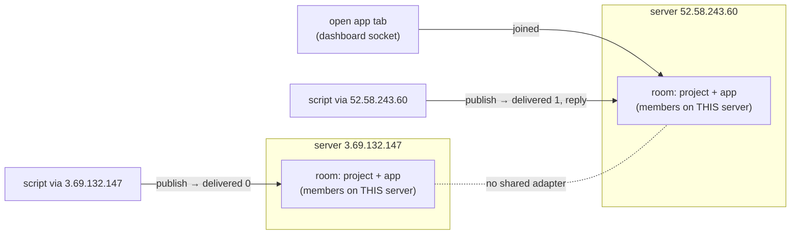

# Reports and questions for That Open (drafts — the founder sends them)

## 1. The app channel's two servers do not share rooms (measured 2026-09-29, twice) — FIXED by That Open, re-tested 2026-10-01

### The message to send (plain words)

> Hi That Open team! I found a bug in the app channel (`client.channel.external()`).
>
> **In short:** platform.thatopen.com runs on two servers, and they don't pass channel messages to each other. My open
> app connects to one of them. A script that sends my app a command also connects to one of them — and when it's the
> other one, the command is lost and the platform answers `delivered: 0`, as if the app were closed.
>
> **What I measured today:** with my app open, I sent the same command through each server, three times each. Only the
> server my app was connected to delivered it (3 of 3); the other delivered 0 of 3. When I reloaded the app and it
> connected to the other server, the result flipped. Following your quickstart exactly (no tricks), 8 commands in a row
> said "not delivered" while the app was open and working.
>
> Logs and a small script to reproduce it:
> https://github.com/Yazan-hub/sentinel-project/blob/master/docs/THATOPEN_REPORTS.md
>
> Happy to show it on a call.

### If they ask for more

**How it works, in one picture.** Each server keeps its own list of who is in a channel room. Nothing copies the lists
across, so a command reaches the app only when both sides picked the same server.

**The measurements** (full log: [thatopen-evidence/2026-09-29-channel-rooms.log](thatopen-evidence/2026-09-29-channel-rooms.log);
times UTC, 2026-09-29 evening; the app tab is the published Sentinel app in Chrome; each ask is one `channelPublish`).

| Run | Situation | via 52.58.243.60 | via 3.69.132.147 |
|---|---|---|---|
| A 17:55 | no app tab open (baseline) | 0 of 2 | 0 of 2 |
| B 17:55 | tab opened, landed on 3.69.132.147 | 0 of 3 | **3 of 3**, app replied |
| C 17:56 | tab reloaded, stayed on 3.69.132.147 | 0 of 2 (+1 ask got no subscribe/ack at all) | **3 of 3**, app replied |
| D 17:56 | tab reloaded, landed on 52.58.243.60 — **the result flips** | **3 of 3**, app replied | 0 of 3 |
| E 17:57 | the quickstart's recipe as written (no pinning), app open | 0 of 8 (this PC's DNS kept choosing the other server) | |
| F 17:57 | the tab's channel reconnected by itself (no reload) and moved to 3.69.132.147 | delivered 1 but **no reply** for about a minute (stale member) | 3 of 3, app replied |
| G 17:58–18:00 | a minute later | 0 of 3 | 3 of 3, app replied |

The morning measurement (2026-09-29, before our workaround) showed the same thing the other way round: the tab's socket
on 52.58.243.60, asks via 52.58.243.60 → `delivered 1` three times, via 3.69.132.147 → `delivered 0` three times.

**Two more things we saw.**
1. *A stale member (run F).* When the dashboard's channel socket reconnects to the other server, the old server keeps
   counting the old socket for about a minute: `delivered: 1`, but the message reaches nothing. An external tool
   cannot tell that from a real delivery.
2. *A missing ack (run C).* One ask via 52.58.243.60 got neither `channel:subscribed` nor an ack within 10 s.

**Reproduce it yourself** (no Sentinel code needed beyond an open app):
[WebApp/scripts/thatopen-channel-repro.mjs](../WebApp/scripts/thatopen-channel-repro.mjs).
1. Open any app that joins `client.channel.external()` (SDK 0.16.1) in its platform project.
2. `npm i socket.io-client`, then
   `THATOPEN_TOKEN=<API token> THATOPEN_PROJECT_ID=<id> THATOPEN_APP_ID=<id> node thatopen-channel-repro.mjs 3`.
   It resolves platform.thatopen.com and asks through each address in turn, pinned with an `https.Agent({ lookup })`
   (TLS still checks the platform's name). Add `unpinned` as an address to ask the quickstart's way.
3. Reload the app tab and run it again; the address that delivers follows the tab.

A script cannot stand in for the app tab: a listener counts only when it connects with a signed-in session and
`&accountToken=true`, which an API token is refused (`channel:error "Unauthorized"`).

**What would fix it.** A shared socket.io adapter between the servers (e.g. the Redis adapter), so rooms and the
`delivered` count span both; or one channel endpoint with sticky routing. Every SDK user of
`client.channel.external()` meets this today.

**Our workaround.** Sentinel's asker asks on every address at once and keeps the first reply
(`WebApp/bridge/ask-sentinel.mjs`). Since 2026-10-01 it also connects WebSocket-only (see the re-test below).

### Re-test after That Open's fix (2026-10-01) — fixed; one new issue

Full log: [thatopen-evidence/2026-10-01-channel-after-fix.log](thatopen-evidence/2026-10-01-channel-after-fix.log).

- **Fixed.** platform.thatopen.com now resolves to one address (35.156.159.219); the two old servers refuse connections.
  24 of 24 WebSocket asks, each on a fresh connection, reached the open app and got its reply.
- **New: long-polling breaks behind the new balancer.** Several servers sit behind the one address and a new TCP
  connection can land on any of them; there are no sticky sessions. socket.io's default transport (long-polling first,
  as in the quickstart) sends follow-up requests that meet a server which never opened the session: HTTP 400
  `{"code":1,"message":"Session ID unknown"}` — 25 of 48 follow-up requests on new connections, 0 of 24 on one kept-alive
  connection. With the defaults, 0 of 7 asks got through; Sentinel's asker answered 1 of 5 before we switched it to
  WebSocket only (10 of 10 after).
- **Sentinel's side:** `WebApp/bridge/ask-sentinel.mjs` now connects with `transports: ["websocket"]`.
- **Repro:** [WebApp/scripts/thatopen-polling-repro.mjs](../WebApp/scripts/thatopen-polling-repro.mjs) (no dependencies):
  `THATOPEN_TOKEN=<API token> node thatopen-polling-repro.mjs 6`.

**The reply to send (plain words):**

> Thanks a lot — confirmed, the channel works now: 24 of 24 commands reached my open app and it answered every time.
>
> One thing the new setup broke: socket.io's default transport. Your one address now spreads connections over several
> servers with no sticky sessions, so long-polling (which socket.io tries first, and which the quickstart uses) often
> lands on a server that doesn't know the session and gets HTTP 400 "Session ID unknown" — about half the requests in
> my test, and 0 of 7 commands went through with the default settings. WebSocket-only works every time.
>
> Two easy fixes: turn on sticky sessions (session affinity) on the load balancer, or add `transports: ["websocket"]`
> to the quickstart's `io(...)` call. Log and a tiny repro script (no dependencies):
> https://github.com/Yazan-hub/sentinel-project/blob/master/docs/THATOPEN_REPORTS.md

## 2. WebGPU (see ROADMAP item 2) — blocked upstream; question already raised.
