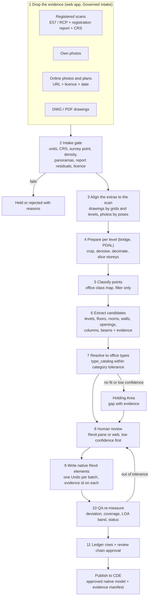

# Scan to 3D model: the complete market and how it works

For the Sentinel founder, 30 September 2026. It covers about 180 tools, grouped into 8 categories.

---

## 0. How to read this

**What it covers.** This report looks at tools that turn an existing building or asset into a 3D model. The input can be laser scans, photos, phone scans, 360 video or drawings. The output can be a point cloud, a mesh, CAD lines, IFC or native Revit elements.

**Evidence.** Researchers built the catalogue from vendor pages, help docs, release notes, price pages, app stores, forums, LinkedIn and YouTube. A second agent then checked every row. Each row links to one source that was opened. I did not open the sources again for this report. When the checkers could not confirm a claim, the row says "(not re-verified)". Claims the checkers rejected are not included.

**Date.** The market was checked on 2026-09-30. Prices are shown only when a source states them, with the currency and the date. Many vendors give prices only on request. For those, the table says "quote".

**The eight pipeline stages** (short codes in the tables)

| Code | Stage | What it means |
|---|---|---|
| Cap | capture | The hardware or app that records the site: laser scanner, SLAM, phone LiDAR, 360 camera, drone |
| Reg | register | Align the scans with each other. Set the coordinates and georeference |
| Cln | clean | Remove noise, moving objects and people. Decimate (thin out) the points |
| Cls | classify | Label each point: wall, floor, pipe, ground, and so on |
| Ext | extract | Fit planes, lines, cylinders and profiles. Detect openings |
| Mod | model | Create elements: native Revit, IFC, CAD or mesh |
| QA | QA | Measure deviation. Report LOA (USIBD). Compare scan with BIM |
| Del | deliver | Share: viewer, CDE, cloud streaming |

**Architecture codes (Arch):** Desktop = a program on a PC. Plug-in = runs inside a host program (Revit, AutoCAD, and so on). Cloud = SaaS in the browser. Mobile = a phone or tablet app. SDK = a library or API for developers. Service = people model it for you. HW = sold with scanner hardware. Server = on-premise server.

**Automation codes (Auto):** M = manual. A = assisted: the human clicks and the tool fits the element. R = the tool detects automatically and a human reviews. F = fully automatic after set-up. S = a service with people behind it, maybe with AI.

**Maturity:** SHIPPING (sold today), BETA, DEMO (shown only in a video or post), RESEARCH (paper or code), DISCONTINUED, UNKNOWN (status unclear).

**Category codes:** A = registration and point-cloud processing. B = photogrammetry, splats, phone and capture platforms. C = scan-to-BIM for buildings. D = MEP, structure and plant. E = verification, progress and QA. F = infrastructure, terrain and city. G = AI-first start-ups, services, open source and research. H = agents and small vendors found on LinkedIn and YouTube. A tool that appears in several categories has **one row**. Its row lists all its categories, for example (A·C·H).

---

## 1. The pipeline in pictures

```mermaid
flowchart LR
  C["1 Capture<br/>scanner, phone, 360, drone"] --> R["2 Register<br/>align, georeference"]
  R --> CL["3 Clean<br/>noise, moving objects, decimate"]
  CL --> CS["4 Classify<br/>label points"]
  CS --> E["5 Extract<br/>planes, lines, cylinders, openings"]
  E --> M["6 Model<br/>Revit / IFC / CAD / mesh"]
  M --> Q["7 QA<br/>deviation, LOA, scan-vs-BIM"]
  Q --> D["8 Deliver<br/>viewer, CDE, cloud"]
  classDef machine fill:#d4edda,stroke:#2e7d32,color:#000
  classDef mixed fill:#fff3cd,stroke:#b8860b,color:#000
  classDef human fill:#f8d7da,stroke:#b71c1c,color:#000
  class R,CL,D machine
  class C,CS,Q mixed
  class E,M human
```

Green means the machine does it today. Yellow means the work is mixed. Red means a human still does most of it.

**Who does each step today**

| Stage | Today | Best examples |
|---|---|---|
| Capture | A human operates the device, which records by itself. SLAM and 360 walks are fast. Phone capture is cheap but less accurate. | Leica RTC/BLK + FIELD 360, Trimble X + Perspective, NavVis, Matterport, Polycam, RoomPlan |
| Register | **Machine.** Targetless and SLAM registration are automatic. A human reads the QA report. | REGISTER 360 PLUS, SCENE, RealWorks, LaserControl + Scantra, Reconstructor, FARO Connect, IVION |
| Clean | **Machine.** Moving objects, reflections, noise, people and number plates are removed automatically. | REGISTER 360, SCENE, RealWorks, Aura, LixelStudio, PDAL |
| Classify | **Machine for survey classes** (ground, vegetation, buildings, wires). **Mixed for building classes.** Walls and floors work well. Doors and columns work poorly. | Terrasolid, TBC, Global Mapper, Pointly, Flai, Cyclone 3DR, aurivus, PTv3 (research) |
| Extract | **Mostly the human.** The user clicks and the tool fits. The only automatic cases are flat floors, straight walls, straight pipes and repeated steel. | FARO As-Built, CloudWorx, Undet, EdgeWise, BricsCAD, Cloud2BIM |
| Model | **The human picks the type.** AI tools give generic IFC or mesh. Services deliver RVT in their own templates. | Revit native, plug-ins, Matterport BIM, Bimify, Twindo |
| QA | The machine computes the deviation. The human decides what it means. | Verity, Cyclone 3DR BIM Inspect, Cintoo, Imerso, Undet Pano QC |
| Deliver | **Machine.** Streaming and sharing are solved. | Cintoo, GeoCloud, IVION, Potree, Cesium, ReCap Viewer |

---

## 2. The catalogue

Each tool has one row. The first line of each cell holds the most important fact. "Src" links to the source that was opened.

### A. Registration and point-cloud processing (including open-source libraries)

| Tool (categories) | Vendor | Stages | Arch | Inputs → outputs | Auto | Elements automated | Revit link | Price (source, date) | Maturity | Src |
|---|---|---|---|---|---|---|---|---|---|---|
| **ReCap Pro 2026/2027** incl. Scan to Mesh (ex-PointFuse), ReCap Viewer (A·C·H) | Autodesk | Reg Cln Cls Ext Mod Del | Desktop + cloud viewer (Forma Data Mgmt) + Revit plug-in | E57 with panoramas, FLS, ZFS, photos → RCP/RCS, segmented mesh, IFC 4.0 (2027) | A/R | Ground points; mesh segments with class templates. No parametric walls | Revit links RCP/RCS natively; the plug-in adds meshes as "Revit families" (not walls or floors) | About USD 370/yr standalone (Matterport blog, 2026); official price not shown | SHIPPING | [src](https://www.autodesk.com/blogs/aec/2026/07/30/whats-new-in-recap-pro-2027/) |
| **Cyclone REGISTER 360 PLUS** (A) | Leica (Hexagon) | Reg Cln Cls QA Del | Desktop | Leica, FLS, ZFS, PTX, E57, LAS → LGSx, E57, RCP, LAS, QA report | R | Moving objects removed | Export RCP/E57, or use CloudWorx | USD 5,100/yr incl. FIELD 360 (reseller, 2026-09-30) | SHIPPING | [src](https://kukerranken.com/product/leica-cyclone-register-360plus/) |
| **Cyclone FIELD 360** (A) | Leica | Cap Reg QA Del | Mobile | Live Leica scans → registered clouds, E57/DXF/IFC | R | none | none | Included with REGISTER 360 PLUS | SHIPPING | [src](https://leica-geosystems.com/products/laser-scanners/software/leica-cyclone/leica-cyclone-field-360) |
| **Cyclone 3DR** incl. Plant edition (Scan to Pipe/Steel) and BIM Inspect (A·D·E) | Leica | Reg Cln Cls Ext Mod QA Del | Desktop; streams from GeoCloud | Clouds, meshes, IFC/RVT, NWD → meshes, IFC/COE pipes, steel, BCF, PDF/CSV | R/A | AI point classes (PLANT, Indoor Construction Site); pipes grown semi-automatically; steel profile picked automatically from a standard; status per IFC component (in / out / no data) | Indirect: IFC and BCF. Revit modelling is done in CloudWorx | quote | SHIPPING | [src](https://rcdocs.leica-geosystems.com/docs/cyclone-3dr-2026-1-0-cyclone-3dr-release-notes.md) |
| **Cyclone ENTERPRISE** (A) | Leica | Del | Server + TruView LIVE | LGSx → streamed projects | M | none | Via CloudWorx. CloudWorx 2026.1 dropped the ENTERPRISE connection | quote | SHIPPING | [src](https://rcdocs.leica-geosystems.com/cyclone-enterprise/latest/cye-cyclone-enterprise-release-notes-2025-0-0) |
| **Hexagon GeoCloud** (Reality Cloud Studio + Drive merged) (A) | Hexagon | Cln Cls Mod QA Del | Cloud + desktop sync | Uploads from Leica field and office tools → shared clouds, auto-mesh, Scan-to-Verify | R | AI classes (not listed) | not documented | quote | SHIPPING | [src](https://geocloud.hexagon.com/resource/article/introducing-hexagon-geocloud-what-changed/) |
| **Trimble RealWorks** (+ Scan Essentials for SketchUp) (A·C·D) | Trimble | Reg Cln Cls Ext Mod QA Del | Desktop + live link to Revit | TZF/TDX, FLS (FARO Premium not supported), E57 → RCP, E57, DWG, IFC, pipes, steel | R (register) / A (fit) | Removes reflections and noise; pipes and fittings assisted; steel (Steelworks) | "Send to Revit" creates native pipes, elbows, tees and reducers in the open Revit session | About USD 5,170–11,425 per seat (Matterport blog, 2026); dealer quote | SHIPPING | [src](https://help.fieldsystems.trimble.com/realworks/12.3.htm) |
| **Trimble Business Center** (A·F) | Trimble | Reg Cln Cls Ext Mod QA Del | Desktop | GNSS, total station, TLS, UAV, mobile → classified LAS, RCP, CAD, TIN, meshes | A/R | Survey classes (ground, vegetation, buildings, wires); mine tunnel lines (2026.10) | Indirect (RCP) | 30-day trial; price not public | SHIPPING | [src](https://help.fieldsystems.trimble.com/tbc/release-notes/2026.10.htm) |
| **Trimble Perspective** (A) | Trimble | Cap Reg QA | Mobile (field tablet) | X-series scans → registered project | R | none | none | quote | SHIPPING | [src](https://geospatial.trimble.com/en/products/software/trimble-perspective) |
| **FARO SCENE** (A) | FARO (AMETEK since 21 Jul 2025) | Reg Cln Mod Del | Desktop | Focus, Blink, Freestyle, SWIFT, E57 → E57, PTS, RCS, meshes | R | Moving-object filter | RCS/E57 export | From about USD 2,000, or bundled with the scanner (Matterport blog, 2026) | SHIPPING | [src](https://knowledge.faro.com/Software/FARO_SCENE/SCENE/Export_Formats_Supported_by_SCENE) |
| **FARO Sphere XG** (A) | FARO | Reg Del | Cloud | Blink, SCENE, Connect → registered clouds, 360 photos | F (Blink) | none | not documented | quote | SHIPPING | [src](https://www.holobuilder.com/content-type/whats-new/sphere-xg-updates-april/) |
| **FARO Connect** (ex-GeoSLAM Connect) (A) | FARO | Reg Cln Del | Desktop | Orbis, ZEB → E57, LAZ | F (SLAM) | none | none | quote | SHIPPING | [src](https://knowledge.faro.com/Software/FARO_Connect/Connect/Release_Notes_for_FARO_Connect) |
| **NavVis IVION** + IVION Processing (A·E) | NavVis | Reg Cln QA Del | Cloud | MLX/VLX data, control points, IFC → E57, LAS, RCS, panoramas, quality reports | F (SLAM) + M (overlay) | Number plates masked | Free IVION Add-In for Revit (side-by-side view, measuring); needs an IVION instance | quote | SHIPPING | [src](https://marketplace.autodesk.com/apps/80d6a178-0f4a-4558-8bcc-076486d9c228) |
| **Emesent Aura** (A) | Emesent | Reg Cln Del | Desktop | Hovermap/GX1 → colourised clouds | F (SLAM), M (merge) | People masking | none | quote | SHIPPING | [src](https://knowledge.emesent.com/emesent-aura-release-notes) |
| **Kaarta Cloud** (A) | Kaarta | Reg Cln Del | Cloud | Stencil/Contour → maps | F | none | none | USD 249/mo (2020; not current) | UNKNOWN (the site is now one page) | [src](https://kaartainc.godaddysites.com/) |
| **XGRIDS LixelStudio** (A) | XGRIDS | Reg Cln Ext Del | Desktop | Lixel scans, GNSS → LAS, E57, RCP, 2D lines | F (SLAM) + M (lines) | Dynamic objects removed | RCP/E57 | quote | SHIPPING | [src](https://www.xgrids.com/intl/lixelstudio) |
| **RIEGL RiSCAN PRO** (A) | RIEGL | Reg Cln Cls Del | Desktop | RIEGL scans + images → RDB, E57, LAS | R | none | none | quote | SHIPPING | [src](http://www.riegl.com/products/software-packages/riscan-pro/) |
| **Topcon Collage Office + Web** (A) | Topcon | Reg Del | Desktop + web | Lidar, UAV, BIM → web projects | A | none | Connector to Autodesk and ClearEdge3D | quote | SHIPPING | [src](https://www.topconpositioning.com/us/en/solutions/technology/infrastructure-software-and-services/collage-office-and-collage-web) |
| **Z+F LaserControl** Scout/Office (A) | Zoller + Fröhlich | Cap Reg Cln Del | Desktop + field app | Z+F scans, HDR/thermal panoramas → many formats | R (overlap, plane-to-plane via Scantra, targets) | none; filters mask points and do not delete them | none | quote | SHIPPING | [src](https://www.zofre.de/en/laser-scanners/laserscanning-software/z-f-lasercontrolr) |
| **Gexcel Reconstructor** (A) | Gexcel | Reg Cln Del | Desktop | TLS, handheld, mobile, airborne → registered clouds | F (targetless "LineUp") | none | none | 1-month licence sold online (no figure shown) | SHIPPING | [src](https://gexcel.it/en/software/reconstructor) |
| **Technet Scantra** (A) | technet | Reg QA | Desktop + database | TLS → registered stations + block-adjustment report | R | Stores **planes** instead of points (vendor example: 19.86 GB of raw scans becomes a 265 MB database) | none | quote | SHIPPING | [src](https://www.technet-gmbh.com/en/products/scantra/) |
| **Pointerra3D** (A·F) | Pointerra | Reg Cls QA Del | Cloud | LiDAR, imagery, CAD/BIM → streamed views | R | not stated | none | quote | SHIPPING | [src](https://www.pointerra.com/product/core/) |
| **Veesus Arena4D** (+ Point Clouds for Revit) (A·C) | Veesus | Cln Ext Del | Desktop + CAD plug-ins | Clouds, splats → drawings, renders | M | none | Viewing only | "One simple licence"; tokens | SHIPPING | [src](https://veesus.com/) |
| **Vercator** (A·C) | Correvate Ltd | Reg Del | Cloud | Unregistered scans → registered clouds | F | none | none | Tokens (historic) | DISCONTINUED (company dissolved 27 Apr 2026) | [src](https://find-and-update.company-information.service.gov.uk/company/10708290) |
| **CloudCompare** (+ RANSAC Shape Detection) (A·D·G·H) | Open source | Reg Cln Cls Ext QA | Desktop + CLI | E57, LAS, PLY → clouds, meshes, C2C/C2M distances, primitives | A | Planes, cylinders, spheres, cones, tori | none | Free (GPL) | SHIPPING (2.13.2; 2.14 beta tagged 28 Sep 2026) | [src](https://github.com/CloudCompare/CloudCompare) |
| **PDAL** (A·F) | Open source | Reg Cln Cls Ext Del | SDK + CLI | LAS/LAZ, E57, COPC → the same formats, rasters | F (scripted) | Ground (SMRF/PMF/CSF), noise, planes, clusters | none | Free (BSD) | SHIPPING (2.10.2, Jun 2026) | [src](https://pdal.io/en/latest/) |
| **Open3D (+ Open3D-ML)** (A) | Open source | Reg Cln Cls Ext Mod | SDK (C++/Python) | Clouds, RGB-D → registered clouds, surfaces | F (scripted) | ML segmentation | none | Free | SHIPPING (0.20.0, 16 Sep 2026) | [src](https://github.com/isl-org/Open3D) |
| **PCL** (A) | Open source | Reg Cln Cls Ext | SDK (C++) | PCD, PLY → fitted models | F (scripted) | none | none | Free | SHIPPING (1.15.1) | [src](https://github.com/PointCloudLibrary/pcl) |
| **Potree** (A) | Open source | Del | Web viewer | LAS/LAZ → octree tiles | F | none | none | Free | SHIPPING (last tag Dec 2023) | [src](https://github.com/potree/potree) |

### B. Photogrammetry, meshes, splats, phone apps and capture platforms

| Tool (categories) | Vendor | Stages | Arch | Inputs → outputs | Auto | Elements automated | Revit link | Price (source, date) | Maturity | Src |
|---|---|---|---|---|---|---|---|---|---|---|
| **RealityScan** (ex-RealityCapture) + Mobile (B) | Epic Games | Reg Cln Mod QA | Desktop (CLI on Linux) + mobile; REST/gRPC | Photos, video, 360, E57, aerial LiDAR, SLAM, LAS, COLMAP → textured mesh, camera poses | F after set-up | none | none | Free under USD 1M revenue; USD 1,250/seat/yr above that (CG Channel, Jun 2026) | SHIPPING | [src](https://www.cgchannel.com/2026/06/epic-games-releases-realityscan-2-2-with-amd-gpu-support/) |
| **Agisoft Metashape** (B) | Agisoft | Reg Cln Cls Mod QA Del | Desktop (Win/Mac/Linux) + Python API + cloud | Images, video, LiDAR → dense/classified clouds, meshes, DSM, ortho | R | Generic point classes (ground, vegetation, buildings) | none (goes through ReCap) | Standard USD 179, Pro USD 3,499, perpetual (store, 2026-09-30) | SHIPPING | [src](https://www.agisoft.com/buy/online-store/) |
| **PIX4Dmatic** (now includes PIX4Dsurvey) (B·F) | Pix4D | Reg Cls Ext Mod QA Del | Desktop | Drone, terrestrial, TLS → LAS, ortho, mesh, DSM, splats, vectors | F + A (vectorise) | Ground/non-ground | none | From USD 125/mo (2026-09-30). PIX4Dsurvey was merged in Jan 2026; licences migrate Sep–Dec 2026 | SHIPPING | [src](https://support.pix4d.com/hc/pix4dmatic-and-pix4dsurvey-unification) |
| **PIX4Dmapper** (B) | Pix4D | Reg Cls Mod QA | Desktop | Drone RGB/thermal/multispectral → ortho, DSM, mesh | F + rayCloud review | Generic classes | none | From USD 333/mo (2026-09-30) | SHIPPING | [src](https://www.pix4d.com/pricing/) |
| **PIX4Dcatch** (B) | Pix4D | Cap Reg QA | Mobile + RTK | iPhone LiDAR + RTK → georeferenced capture; IFC/DXF overlay in AR | A | none | IFC overlay only | Tiers on the pricing page; RTK tier price not confirmed | SHIPPING | [src](https://www.pix4d.com/product/pix4dcatch/) |
| **PIX4Dcloud** (B) | Pix4D | Reg Mod QA Del | Cloud | Photos, catch scans, IFC/DXF → ortho, mesh, splats, comparison | F | none | IFC/DXF overlay | No public standalone price | SHIPPING | [src](https://www.pix4d.com/product/pix4dcloud/) |
| **iTwin Capture Modeler** (ex-ContextCapture) (B·F) | Bentley | Reg Cln Cls Mod QA Del | Free prep desktop + Engine (on-prem) or Cloud Services | Photos, video, LiDAR → reality mesh, cloud, ortho, splats | F after set-up | Defects (cloud AI) | none | Modeler Flex free; Engine USD 4,000 (US page, 2026-09-30); cloud: quote | SHIPPING | [src](https://www.bentley.com/software/itwin-capture-modeler/) |
| **DroneDeploy** Aerial/Ground/Ground Pro + Progress AI (B·E) | DroneDeploy | Cap Reg Cls Mod QA Del | Cloud + apps | Drone, 360 walks, iPhone scans (+RTK) → ortho, 3D, BIM overlay, progress reports | F | Progress by trade (vendor: "95% accurate") | BIM overlay; sync with Autodesk/Procore | Flight & Analysis USD 4,188/yr; Ground plans by quote (2026-09-30) | SHIPPING | [src](https://www.dronedeploy.com/pricing) |
| **Skycatch** (B) | Caterpillar (announced 7 Jul 2026) | Cap Reg Mod Del | Platform (mining) | Spatial capture → mine twin | not described | none | none | quote | SHIPPING | [src](https://rpmglobal.com/caterpillar-expands-mining-technology-capabilities-with-skycatch-acquisition/) |
| **Esri ArcGIS Reality** (Site Scan, Drone2Map, Reality Studio, Reality for Pro) (B·F) | Esri | Cap Reg Mod QA Del | Cloud + desktop + Reality Server (beta) | Drone, aerial, satellite, 360 → true ortho, DSM, mesh, cloud, splats | F; automatic GCP detection (May 2026) | none for BIM | none | not verified | SHIPPING | [src](https://www.esri.com/arcgis-blog/products/arcgis/imagery/whats-new-in-reality-mapping-may-2026) |
| **3DF Zephyr** (B) | 3Dflow | Reg Cln Mod QA | Desktop | Photos, video; Pro reads .fls/.rdbx/.zfs → clouds, meshes, ortho | F + manual edits | none | none | Free (50 photos); Lite EUR 199; Pro EUR 4,200 perpetual or EUR 250/mo, + VAT (2026-09-30) | SHIPPING | [src](https://www.3dflow.net/3df-zephyr-photogrammetry-software/) |
| **Meshroom / AliceVision** (B) | Open source | Reg Cls Mod | Desktop node graph | Photos, E57 → cloud, mesh | F | Prompt-based segmentation plug-in | none | Free | SHIPPING (last stable Aug 2025) | [src](https://github.com/alicevision/Meshroom/releases) |
| **COLMAP** (+ GLOMAP) (B) | ETH / UNC, open source | Reg Mod | SDK + GUI/CLI | Photos (incl. spherical) → poses, sparse/dense cloud | F | none | none | Free (BSD) | SHIPPING | [src](https://github.com/colmap/colmap) |
| **OpenMVS** (B) | Open source | Mod | SDK/CLI | Poses → dense cloud, mesh | F | none | none | Free (AGPL: a problem for hosted services) | SHIPPING | [src](https://github.com/cdcseacave/openMVS) |
| **Polycam** (B) | Polycam | Cap Reg Mod Del | Mobile + cloud + web | iPhone LiDAR, photos, 360, drone → meshes, LAS, DXF floor plans, splats | F | 2D walls, openings, fixtures, room labels (AI floor plan) | LAS via ReCap; DXF underlay; RVT through Transform Engine | Free; Basic USD 150/yr; Business USD 400/yr/user; Enterprise USD 1,200/yr/user, min 3 (2026-09-30) | SHIPPING | [src](https://poly.cam/pricing) |
| **Transform Engine** (B) | Transform Engine | Ext Mod Del | Service | Polycam links, clouds → RVT, DWG, IFC | S (human modellers) | none (hand-modelled) | Delivers RVT | Revit from USD 200 (AEC Mag, Apr 2025) | SHIPPING | [src](https://transformengine.com/scan-to-bim/) |
| **Luma 3D Capture** (B) | Luma AI | Cap Reg Mod Del | Mobile + cloud | Phone video → NeRF, splats | F | none | none | not verified | UNKNOWN (company pivoted to generative video; app frozen since Jan 2026) | [src](https://apps.apple.com/us/app/luma-3d-capture/id1615849914) |
| **Scaniverse** (B) | Niantic Spatial | Cap Reg Mod Del | Mobile (on-device) | Phone camera, LiDAR → splats (SPZ, PLY), meshes | F | none | none | not verified | SHIPPING | [src](https://www.nianticspatial.com/products/capture) |
| **KIRI Engine** (B) | KIRI Innovation | Cap Mod Del | Mobile + web | Photos, LiDAR, video → mesh, 3DGS, splat-to-mesh | F | none | none | not re-verified | SHIPPING | [src](https://www.kiriengine.app/pricing) |
| **Jawset Postshot** (B) | Jawset | Reg Mod Del | Desktop (Windows, NVIDIA) | Images, poses → splats | F | none | none | not re-verified | SHIPPING | [src](https://www.jawset.com/) |
| **nerfstudio + gsplat** (B) | Open source | Mod | SDK | Posed images → splats, mesh | F | none | none | Free (Apache-2.0) | SHIPPING | [src](https://github.com/nerfstudio-project/gsplat) |
| **Matterport** Pro3 + E57 + BIM Files + Revit plug-in (B·C·E·G·H) | Matterport (CoStar since Feb 2025) | Cap Reg Mod Del | HW + mobile + cloud + service | Pro3/Pro2, 360, iPhone → tour, E57, BIM files (RVT/IFC, LOD 200) | F (capture) + S (BIM) | Interior architecture; furniture/MEP as options (reseller) | Free Matterport Revit plug-in imports BIM files and clouds | Pro3 USD 5,995 (AEC Mag); plan from USD 58/mo; BIM priced per space | SHIPPING | [src](https://matterport.com/bim) |
| **iGUIDE** PLANIX + RVT add-on (B) | Planitar | Cap Reg Mod Del | HW + cloud + drafters | LiDAR + 360 → plans, DWG, RVT in about 72 h | S | Walls, stairs, windows, ceilings (drafted) | Delivers native RVT | Priced by floor area (Geo Week, Mar 2024) | SHIPPING | [src](https://www.geoweeknews.com/news/planitar-iguide-rvt-3d-modeling-revit) |
| **Twindo** (ex-Occipital Canvas) (B·C) | Occipital | Cap Ext Mod QA Del | Mobile + web + AI + human modellers | iPhone LiDAR, **uploaded floor plans**, clouds → RVT, SKP, DWG, Archicad | S (AI + humans) | Architectural shell; outlets and vents (testimonial) | Delivers native RVT (client templates not documented) | From USD 0.14/sq ft for 2D and 0.26/sq ft for 3D (Essential members; Canvas support) | SHIPPING | [src](https://support.canvas.io/article/8-what-does-all-of-this-cost) |
| **EveryPoint** (B) | EveryPoint / Stockpile Reports | Cap Reg Mod | Edge AI + SaaS | Phone/drone imagery → stockpile volumes | F | none | none | quote | UNKNOWN (now stockpiles only) | [src](https://everypoint.io/) |
| **Dot3D** Pro/Prime (B) | DotProduct | Cap Reg QA Del | Mobile/tablet | iOS LiDAR, RealSense, RTK → georeferenced clouds | A | none | none | not re-verified | SHIPPING | [src](https://www.dotproduct3d.com/) |
| **SiteScape** (B) | FARO | Cap Reg Del | Mobile + cloud | iPhone LiDAR → clouds, moving to Sphere XG | F | none | none | n/a | DISCONTINUED (website retired 30 Jun 2026; cloud being sunset; the app was still updated in Aug 2026) | [src](https://help.holobuilder.com/en/articles/15701527-sitescape-ai-website-retirement-customer-information) |
| **3D Scanner App** (B) | AI Photo Editor Lab | Cap Mod Del | Mobile | LiDAR, RoomPlan → mesh, LAS, DXF | F | RoomPlan walls, doors, windows | LAS via ReCap | not re-verified | SHIPPING | [src](https://apps.apple.com/us/app/3d-scanner-app/id1419913995) |
| **Apple RoomPlan** (B·G) | Apple | Cap Reg Cls Ext Mod | SDK (iOS, on-device) | LiDAR + camera → parametric JSON/USDZ | F (live) | Walls, floors, doors, windows, openings, 16 object types, confidence per element | none built in | Free SDK | SHIPPING | [src](https://developer.apple.com/documentation/roomplan) |
| **magicplan** (B) | magicplan | Cap Ext Mod Del | Mobile + cloud | LiDAR, camera, laser meters → plans, estimates, DXF, **3D IFC** | A | Rooms, walls, doors, windows, objects | IFC export (Report/PRO plans only) | Project-based plans (not re-verified) | SHIPPING | [src](https://help.magicplan.app/ifc-and-bim) |
| **CubiCasa** (B) | CubiCasa | Cap Ext Mod QA Del | Mobile + cloud AI + human QA | Phone video → 2D plans, CAD | S (AI + QA engineer) | 2D walls, doors, windows, rooms (vendor: 95–97%) | DWG underlay | Per order | SHIPPING | [src](https://www.cubi.casa/) |
| **RoomScan Pro LiDAR** (B) | Locometric | Cap Ext Mod Del | Mobile | LiDAR/RoomPlan → PDF, DXF, IFC, OBJ | F + edits | Walls, doors, windows, ceiling heights | IFC | Subscription | SHIPPING | [src](https://www.locometric.com/) |
| **Hover** (B) | Hover | Cap Ext Mod Del | Mobile + cloud + API | Guided phone photos, **blueprints** → 3D exterior, SKP/DXF/DWG | F (for the user) | Roof facets, siding, windows, doors | DWG/SKP only | not shown | SHIPPING | [src](https://hover.to/architects/) |
| **EagleView One** (B) | EagleView | Cap Ext Mod Del | Cloud + own aerial imagery | Oblique aerial imagery → 3D exterior, reports | F | Exterior walls, windows, doors, roof (vendor: 98.77%) | none | not shown | SHIPPING | [src](https://www.eagleview.com/news-announcements/eagleview-launches-complete-exterior-interactive-remote-first-3d-property-intelligence-in-ultra-high-fidelity-now-in-eagleview-one/) |

### C. Scan-to-BIM and CAD for buildings (native modelling)

| Tool (categories) | Vendor | Stages | Arch | Inputs → outputs | Auto | Elements automated | Revit link | Price (source, date) | Maturity | Src |
|---|---|---|---|---|---|---|---|---|---|---|
| **FARO As-Built for Revit** (+ As-Built Modeler) (C·D) | FARO (AMETEK) | Cln Ext Mod QA | Plug-in (Revit 2024–2027) + standalone Modeler | RCP/RCS → native walls, openings, columns, beams, roofs, pipes, ducts, ground | A (pick a slice, the tool fits) | Nothing fully automatic | Native. You insert doors from your own families. 2026.0 data format change is **one-way** (.NET 10) | quote | SHIPPING | [src](https://knowledge.faro.com/Software/As-Built/As-Built_for_Autodesk_Revit/Release_Notes_for_As-Built_for_Autodesk_Revit) |
| **FARO As-Built for AutoCAD** (Suite, incl. Plant tools) (C·D) | FARO | Ext Mod QA | Plug-in (AutoCAD 2024–2027, incl. Plant 3D and Civil 3D) | Scans → 2D plans/sections, piping, steel | A (Walk the Run, then Apply Constraints to a plant spec) | Pipes constrained to spec; steel | none | GBP 4,820 ex VAT with 1 yr maintenance (Sunbelt UK, 2026-09-30) | SHIPPING | [src](https://www.sunbeltsales.co.uk/faro-as-built-for-autocad) |
| **FARO PointSense / VirtuSurv** (kubit) (C) | FARO (bought kubit in 2015) | Ext Mod | Plug-in | Scans → CAD/Revit geometry | A | Walls via "Fit Wall" | Ancestor of As-Built | n/a | DISCONTINUED | [src](https://aecmag.com/news/news-faro-technologies-acquires-kubit/) |
| **Leica CloudWorx** for Revit/AutoCAD/Navisworks/BricsCAD (A·C·D) | Leica | Cln Cls Ext Mod QA | Plug-ins + free viewer; stream from GeoCloud | LGSx (LGS must be converted first since 2026.1), E57 → native host elements | A; round pipes, ducts and columns get automatic centreline and diameter; AutoCAD "Find Pipes" (2026.1) is automatic on classified clouds | Walls, floors, structural members, doors, windows, equipment (from picks); pipes, ducts, trays, steel | Native Revit fitters for Revit 2024–2027. **The user chooses the family and type.** The duct workflow **creates a new type** when a size does not match. Known issue in 2026.1: the cable-tray fitter misfits size and rotation | Reseller quote; viewer free | SHIPPING | [src](https://rcdocs.leica-geosystems.com/docs/cloudworx-2026-1-0-cloudworx-plugins-release-notes.md) |
| **Undet for Revit** (+ Undet Browser) (C·D·E·H) | Undet | Cln Ext Mod QA | Plug-in (Revit 2025–2027) | RCP, panoramas → walls, columns, floors, ceilings, openings, profiles | A (3 picks) + automatic floor and ceiling | Floors and ceilings automatic | Native. Fit Wall creates "fixed-pitch" types (width rounded to a step). Instance-to-Type makes types named by size ([W]x[H]mm). **Modelling Tolerance parameter on every element**. Pano QC colours tolerance in three levels | EUR 1,200/yr; EUR 2,500/3 yr; monthly about EUR 199–209 (Sep sale EUR 139), ex VAT (undet.com, Sep 2026) | SHIPPING | [src](https://www.undet.com/undet-products/undet-for-revit-point-cloud/) |
| **Undet for SketchUp / AutoCAD** (C) | Undet | Ext Mod QA | Plug-in | Clouds → planes, volumes, corner lines, pipe centrelines | R + A | Planes, room volumes (vendor) | n/a | SketchUp about EUR 500/yr (not re-verified) | SHIPPING | [src](https://www.undet.com/undet-products/sketchup-plugin-for-3d-modeling-from-point-cloud/) |
| **PointCab Origins 4.3 + 4Revit** (A·C·H) | PointCab | Ext Mod Del | Desktop + live link to Revit | Registered clouds, E57 with panoramas → plans, sections, orthos, vectors; Revit elements from picks | A; automatic layout per floor (4.3, Sep 2026) | none fully automatic | 4Revit places walls, doors, windows, openings, columns and levels (last 3 Revit versions). The cloud stays outside Revit | 4Revit about EUR 700 + Origins (not re-verified) | SHIPPING | [src](https://pointcab-software.com/en/newsroom/changelog/) |
| **Revit native point-cloud tools** (C·D) | Autodesk | Mod | Built into Revit | RCP/RCS → elements drawn by hand | M (snapping) | none | Native; you pick the types | Included with Revit | SHIPPING | [src](https://help.autodesk.com/cloudhelp/2022/ENU/Revit-Model/files/GUID-BD499295-84DD-4BDE-B60D-73008AFBC791.htm) |
| **ADB3D PointCloud to Surface Suite** (C) | ADB3D | Mod | Plug-in (Revit) | Selected points → floors, roofs, topography, walls | A | Surfaces from selections | Native; the user picks type and level | About USD 119 (not re-verified) | SHIPPING | [src](https://www.adb3d.com.au/pointcloudtosurfacesuite) |
| **Autodesk Marketplace long tail** (C) | various | Mod QA Del | Plug-ins | Revit clouds → varies | A | Mostly topography; nCircleTech markets an ML plug-in | Native | varies | SHIPPING | [src](https://apps.autodesk.com/RVT/en/List/Search?isAppSearch=True&searchboxstore=RVT&facet=&collection=&sort=&query=point+cloud) |
| **IMAGINiT Scan to BIM** (C·D) | IMAGINiT | Ext Mod QA | Plug-in (Revit 2014–2016) | Clouds → walls, columns, pipes, ducts | R (historic) | Walls, columns, MEP | Was native | Rental (historic) | DISCONTINUED (the old URL now goes to CloudWorx) | [src](https://aecmag.com/news/news-imaginit-releases-scan-to-bim-2016/) |
| **PointFuse** (C·D·G·H) | PointFuse → Autodesk (IP bought in Mar 2024) | Cls Ext Mod | Desktop + Revit plug-in (ended) | Clouds → segmented meshes | F | Mesh surfaces | Plug-in ended 30 Apr 2025 | No longer sold | DISCONTINUED (standalone ended 1 May 2025; now ReCap Scan to Mesh) | [src](https://www.autodesk.com/solutions/pointfuse) |
| **Pointorama** (C) | Pythagoras BV | Cls Ext Mod Del | Cloud | Clouds → 2D/3D floor plans, sections, DXF/IFC | R | Levels, rooms with doors and windows | IFC/DXF only | EUR 49/project (first one free); EUR 490/yr (2 projects/mo); EUR 1,490/yr (8/mo); EUR 325/mo (30/mo) (2026-09-30) | SHIPPING | [src](https://www.pointorama.com/pricing) |
| **BricsCAD BIM Scan2BIM** (C) | Bricsys (Hexagon) | Cls Ext Mod QA | Built into BricsCAD BIM | Clouds with normals → floors, rooms, room solids → **walls, wall openings, outer walls, slabs** | R | Floors, rooms, walls, openings, slabs | none | not captured | SHIPPING | [src](https://help.bricsys.com/en-us/document/bricscad/point-cloud/point-cloud-scan-to-bim-workflow) |
| **ODA Scan-to-BIM SDK** (C·H) | Open Design Alliance | Cls Ext Mod | SDK (C++) + ML service (Docker/Python) | RCP, RCS, LAS, PTS, XYZ, PCD → IFC | R (optional Point Transformer V2 labels, then supervoxels, region growing and RANSAC) | Floors, walls, sloped roofs, openings | none (IFC) | ODA membership; free 60-day trial | BETA | [src](https://www.opendesign.com/products/scan-to-bim) |
| **Archicad + BIMmTool** (C) | Graphisoft / BIMm | Cln Mod QA Del | Host + add-on | Scans → hand-modelled Archicad elements | M | none | n/a | Lite included with some plans | SHIPPING | [src](https://community.graphisoft.com/t5/Modeling/Improved-BIMmTool-for-better-point-cloud-handling/ta-p/631570) |
| **Vectorworks** point clouds + Nomad (C) | Vectorworks | Cap Reg Mod | Built-in + iOS app | Clouds, iOS LiDAR → site loci, hand modelling | M | Terrain loci only | n/a | Part of Vectorworks | SHIPPING | [src](https://www.vectorworks.net/en-US/2026) |
| **Opal AI Scan to BIM** (C) | Opal AI | Cap Ext Mod Del | Service + app + ML | Scans, 360 video, clouds → plans, BIM | R (level of human QA not stated) | Walls, windows, doors (vendor: about 98%) | not specified | From USD 0.04/sq ft | SHIPPING | [src](https://www.opal-ai.com/scan-to-bim) |
| **Nest3D** (C·H) | Nest3D | Ext Mod | Plug-in (AutoCAD, BricsCAD, ZWCAD) | E57, FLS → DWG lines | R (claimed) | Wall lines (claimed) | Unclear; claims to follow the user's DWG templates, layers and blocks | not shown | UNKNOWN (marketing article only) | [src](https://www.nest3d.ai/revit-point-cloud-plugin) |

### D. MEP, structure and industrial plant

| Tool (categories) | Vendor | Stages | Arch | Inputs → outputs | Auto | Elements automated | Revit link | Price (source, date) | Maturity | Src |
|---|---|---|---|---|---|---|---|---|---|---|
| **ClearEdge3D EdgeWise** Lite/Pro (C·D·G·H) | ClearEdge3D (Topcon since 2018) | Cln Ext Mod QA Del | Desktop + export to Revit, Plant 3D, AVEVA E3D (Pro), PCF (Pro) | SLAM/TLS clouds + specs → native Revit family objects, STEP, COE, DXF, Smart Points, Remainder Cloud | **Pro: automatic straight pipes and walls + Pattern Extract.** Lite: fit-to-spec on a selection | Pipes, ducts, conduit, cable trays, walls, steel | Exports "native family objects, element type, geometry and coordinates intact" | Lite USD 1,995/yr (vendor, 2026-05-11); Pro quote | SHIPPING | [src](https://www.clearedge3d.com/blogs/how-edgewise-pro-and-the-omnislam-r8-turned-an-industrial-point-cloud-into-a-native-revit-model-in-14-hours/) |
| **CloudWorx for PDMS** (D) | Leica | Ext Mod QA | Plug-in (AVEVA PDMS) | Clouds → centre points for PDMS spec routing | A | Pipe centre points | none | quote | UNKNOWN (not in the 2026.1 installer list) | [src](https://leica-geosystems.com/en-us/products/laser-scanners/software/leica-cloudworx/leica-cloudworx-pdms) |
| **CloudWorx for Smart 3D** (now Octave Forte 3D) (D) | Leica / Octave | Ext Mod QA | Plug-in | One pick gives centreline + diameter → native catalogue routing | A | Pipes | none | quote | UNKNOWN (only a 2009 datasheet) | [src](https://www.cortexsoftware.com.au/blog/hexagons-software-spin-off-to-octave) |
| **Cyclone MODEL** (D) | Leica | Ext Mod | Desktop | Cyclone DB → piping, steel | A | Legacy fitting | none | n/a | DISCONTINUED (phased out in 2025) | [src](https://rcdocs.leica-geosystems.com/docs/cyclone-3dr-2025-1-0-cyclone-3dr-release-notes.md) |
| **AVEVA Point Cloud Manager** (ex-LFM) (D) | AVEVA | Reg Cls QA Del | Cloud (CONNECT) or on-prem | TB of scans → managed, tagged, streamed clouds | F (cloud) | Industrial object types (AI, not listed); no modelling | none | quote | SHIPPING | [src](https://www.aveva.com/en/products/point-cloud-manager/) |
| **AVEVA E3D Design** laser integration (D) | AVEVA | Mod QA | Desktop plant design | Laser model, EdgeWise Pro geometry → spec-driven piping | M (automation comes from EdgeWise Pro) | none | none | quote | SHIPPING | [src](https://www.aveva.com/en/products/point-cloud-manager/) |
| **Octave Forte 3DWorx** (ex-CADWorx) (D) | Octave (spun off from Hexagon) | Mod | Desktop on DWG | Specs + geometry from other plug-ins → spec-driven piping | M | none | Reads native Revit files (review only) | quote | SHIPPING | [src](https://www.octave.com/learn/resources/blogs/cadworx-is-now-forte-3dworx-see-whats-new-in-v25) |
| **Bentley OpenPlant Intelligent Line Manager** (D) | Bentley | Mod | Desktop (MicroStation) | Line strings from a point-cloud tool + spec → populated piping | A | Pipe components from centrelines | none | quote | SHIPPING | [src](https://docs.bentley.com/LiveContent/web/OpenPlant%20Modeler%20Help-v9/en/ILMgr.html) |
| **Tekla Structures** (D) | Trimble | Mod Del | Desktop | Streamed clouds → hand-modelled steel/concrete | M | none | none (IFC) | quote | SHIPPING | [src](https://support.tekla.com/doc/tekla-structures/2025/rel_modeling) |
| **Scan to BIM pipe add-in** (scantobim.xyz) (D) | Indoor Intelligence | Ext Mod | Plug-in (Revit) | Clouds → Revit pipes | A | Pipes | Native | USD 49/mo (2018 listing) | UNKNOWN | [src](http://revitaddons.blogspot.com/2018/06/scan-to-bim-pipe-extraction.html) |
| **Prevu3D** RealityPlatform + RealityConnect (D·H) | Prevu3D | Cln Cls Ext Mod QA Del | Cloud platform + plug-ins (Revit, Inventor, Omniverse, Siemens) | Clouds, 360 video → segmented meshes in the host | F (meshing) | Industrial assets (segments) | Revit connector loads meshes/clouds "without file conversion" | quote | SHIPPING | [src](https://www.prevu3d.com/solutions/plugins/autodesk-revit/) |
| **CLOI + CAD retrieval** (D) | University of Cambridge | Cls Ext Mod | Research | Industrial clouds → labelled instances, matched CAD models | F | Pipes, elbows, flanges, beams (82% segmentation, 85.2% retrieval, per the researcher) | none | n/a | RESEARCH | [src](http://arxiv.org/abs/2101.01355v1) |
| **Industrial3D** benchmark (D) | Academic | Cls | Dataset | TLS of water plants → per-point MEP classes | F | Best supervised 55.74% mIoU; zero-shot 15.79% | none | n/a | RESEARCH | [src](http://arxiv.org/abs/2603.28660v2) |
| **IRIS-v2** P&ID-to-scan alignment (D) | Academic | Reg Cls QA | Dataset | P&ID + images + clouds → aligned scene | R | none | none | n/a | RESEARCH (the only drawing-plus-scan fusion found in MEP) | [src](http://arxiv.org/abs/2602.15584v1) |

### E. Scan-vs-model verification, progress tracking and as-built QA

| Tool (categories) | Vendor | Stages | Arch | Inputs → outputs | Auto | Elements automated | Revit link | Price (source, date) | Maturity | Src |
|---|---|---|---|---|---|---|---|---|---|---|
| **ClearEdge3D Verity** (C·D·E) | ClearEdge3D | Mod QA Del | Plug-in (Revit, Navisworks) + Collage Web / Power BI | Model + registered cloud → status per element: **in tolerance / out of tolerance / not installed**; as-built family copy; HTML/PDF | A (the user picks scope; computer vision fits) | Any modelled element | Writes results into element properties; makes as-built copies of families (native since 2.0, Aug 2024) | not published | SHIPPING | [src](https://www.clearedge3d.com/products/verity/) |
| **Cintoo** BIM/Twin/360 (A·C·E) | Cintoo | Reg Cls QA Del | Cloud (Azure + AWS), SDK/APIs | E57, RCP, FLS, LGS + RVT/IFC/NWD → streamed mesh, **signed** heat map (red in front, blue behind, green within tolerance), issues | R | AI classes (not listed) | Views Revit models; its own FAQ says it is "not a BIM authoring tool" | GBP 1,347/licence/yr (UK G-Cloud, 2026-09-30) | SHIPPING | [src](https://help.cintoo.com/support/solutions/articles/101000462028-comparison-tools-scans-and-models) |
| **Construction Analysis** (ex-Avvir) (E) | Hexagon Multivista (since 20 Jan 2026) | Mod QA Del | Cloud + scanning service | BIM + scans → deviations; pushes as-built positions back (2018 description) | R | Modelled elements | Write-back "in two clicks" (2018; current state unverified) | quote | SHIPPING | [src](https://www.enr.com/articles/62389-hexagon-rebrands-construction-reality-capture-products-as-hexagon-mulitivista) |
| **Doxel** (E) | Doxel | Cap Cls QA Del | Cloud; Insta360 cameras | 360 video + BIM → installed quantities, % complete | F after onboarding | Installed elements vs BIM | none | Per sq ft; no seat fee | SHIPPING | [src](https://doxel.ai/faqs) |
| **Buildots** (E) | Buildots | Cap Cls QA Del | Cloud + helmet camera | 360 walks + BIM + schedule → element progress, issues in Autodesk Build/BIM 360 | F (+ human checks, per a third party) | Structure, MEP, walls, finishes | none (the ACC app is free) | quote | SHIPPING | [src](https://buildots.com/product/) |
| **OpenSpace** Capture, BIM+, Track (powered by Disperse) (B·E) | OpenSpace (bought Disperse 28 Oct 2025) | Cap Reg Cls QA Del | Cloud + mobile | 360, .rcs clouds, BIM, schedules → split view, overlay, BCF Field Notes, verified progress | M (BIM+) / computer vision + **human verification** (Track) | Progress milestones | BCF only | Track is an add-on; no figures | SHIPPING | [src](https://www.openspace.ai/press-releases/openspace-acquires-disperse/) |
| **Dalux Field Pro** "Compare with 3D" (E) | Dalux | QA Del | Cloud | Pre-aligned clouds (no RCP) → threshold colouring | F (colour), M (threshold) | none | none | Field Pro / InfraField Pro tiers only | SHIPPING | [src](https://support.dalux.com/hc/en-us/articles/4403316523154-Point-clouds) |
| **Navisworks Clash Detective** with clouds (E) | Autodesk | QA Del | Desktop | RCS/RCP + models → clashes | M | none | indirect | Navisworks Manage | SHIPPING | [src](https://www.autodesk.com/support/technical/article/caas/sfdcarticles/sfdcarticles/Navisworks-Clash-Detective-does-not-recognize-point-cloud.html) |
| **FARO BuildIT Construction** (E) | FARO | Reg Ext QA Del | Desktop | Scans + CAD/BIM → surface deviation maps, flatness, plumbness | A (Auto Associate with max distance) | Floors, beams, columns, walls | Imports models; no write-back | quote | SHIPPING | [src](https://knowledge.faro.com/Software/BuildIT/BuildIT_Construction/Verify_Constructed_Object_to_Intended_CAD-BIM_Model_with_BuildIT_Construction) |
| **Trimble FieldLink Inspection** + Access (E) | Trimble | Cap Reg QA Del | Field + desktop + Connect | Scans resected to model coordinates + BIM → heat map, report | A | none per element | via Trimble Connect | Subscription | SHIPPING | [src](https://help.fieldsystems.trimble.com/fieldlink/inspection.htm) |
| **Reconstruct** (E) | Reconstruct | Cap Reg QA Del | Cloud on Autodesk APS | Photos, video, drones, scans + BIM + schedule → 4D progress | A | BIM elements linked to tasks | none | quote | SHIPPING | [src](https://reconstructinc.com/product/progress-monitoring-controls-and-reporting) |
| **Siteaware** (E) | Siteaware | Cap QA Del | Cloud | Scans + design → alerts, as-built PDF per pour | R | Pours, envelope, interiors | none | quote | SHIPPING | [src](https://siteaware.com/) |
| **Evercam** 4D View (E) | Evercam | Cap Reg Del | Cloud + fixed cameras | Camera images + ACC model → BIM overlay over time | M (visual) | none | none | Autodesk app free; cameras by quote | SHIPPING | [src](https://evercam.com/features/4d-view) |
| **Cupix CupixWorks** (E) | Cupix | Cap Reg QA Del | Cloud | 360 video, scans, BIM → deviation report per object | R | BIM objects | none | quote | SHIPPING | [src](https://support.cupix.works/hc/en-us/articles/34897571808411-Deviation-Analysis) |
| **Naska.AI** (ex-Scaled Robotics) (E) | Naska.AI | Cap Reg QA Del | Cloud on APS; ACC | LiDAR/camera + BIM → deviations, missing elements | F | Structure, MEP | none directly | quote | SHIPPING | [src](https://naska.ai/) |
| **Imerso** Site Checker, Clash Finder, **BIM Fixer** (E·G) | Imerso | Reg Cls Mod QA Del | Cloud | Any scanner (E57, LAS, PTX) + RVT/IFC → green/orange/red status, heat maps, % complete; BCF, IFC, PDF, CSV | F (vendor: 5 mm accuracy; results in 1–3 h) | Existing BIM elements; BIM Fixer updates the model to as-built | Reads RVT; many CDE integrations | By active projects + data; no figures | SHIPPING | [src](https://www.imerso.com/product) |
| **CHECKTOBUILD** (E) | CHECKTOBUILD | Reg Mod QA Del | Perpetual on-prem + cloud add-ons + Revit plug-ins + AI agent | Any cloud + IFC/RVT → deviations, FF/FL (ASTM E1155), BCF; **the agent edits native Revit on its own** | F; the agent "decides what to change and executes it" | Columns, doors, ducts; structure, MEP | Plug-ins + agent editing | USD 2,900 perpetual + optional add-ons at USD 300/mo each (2026-09-30) | SHIPPING | [src](https://checktobuild.com/) |
| **Track3D** (E) | Track3D | Cap Cls Del | Cloud | Captures (BIM optional) → progress | F | Small fixtures too | none | quote | SHIPPING (DeviationTrack "coming soon") | [src](https://track3d.ai/blog/progresstrack-overview-datasheet/) |
| **XYZ Reality Atom** (E) | XYZ Reality | Reg QA Del | AR hard hat + ACC | Revit via ACC → located issues | M | none | via ACC | quote | SHIPPING | [src](https://www.xyzreality.com/autodesk) |
| **PolyWorks Inspector** (E) | InnovMetric | Reg Ext QA Del | Desktop | Clouds, CAD → GD&T deviation | A (best fit) | Features | none | quote | SHIPPING | [src](https://www.polyworks.com/en-us/products/polyworks-inspector) |
| **Revizto** (E) | Revizto | QA Del | Desktop + web + mobile | Clouds + BIM → issues | M | none | Plug-in | quote | SHIPPING | [src](https://revizto.com/en/scan-to-bim-process-3d-laser-scanning/) |

### F. Infrastructure, terrain, city and asset

| Tool (categories) | Vendor | Stages | Arch | Inputs → outputs | Auto | Elements automated | Revit link | Price (source, date) | Maturity | Src |
|---|---|---|---|---|---|---|---|---|---|---|
| **iTwin Capture Manage & Extract** (ex-Orbit 3DM) (A·D·F) | Bentley | Reg Cln Cls Ext QA Del | Desktop (RTX GPU) + shared DB + cloud | Mobile/UAS/TLS clouds, images → features, sections, clash with design | M → A → F ("manual, semi-automated and AI tools"; custom models) | Buildings, power lines (page); more classes per the knowledge base (not re-verified) | none | USD 5,000 incl. 1 licence + 2 Keys (US page, 2026-09-30) | SHIPPING | [src](https://www.bentley.com/en/products/itwin-capture-manage-and-extract/) |
| **Bentley bridge/asset inspection stack** (F) | Bentley | Cap Ext Mod QA Del | Drone → cloud mesh → twin → AssetWise | Drone images, IoT → defects, condition | R | Cracks, spalls | none | quote | SHIPPING | [src](https://www.bentley.com/solutions/bridge-monitoring/) |
| **Blyncsy** (F) | Bentley | Cap Cls Ext Del | Data service | Dashcam imagery from over 1.2M vehicles → road asset layers | F | Potholes, cracking, paint, guardrails, signs (vendor: 97–99% vs LiDAR) | none | From USD 8.00/mile (US page, 2026-09-30) | SHIPPING | [src](https://www.bentley.com/software/blyncsy/) |
| **Cesium ion / CesiumJS / 3D Tiles** (F) | Cesium (Bentley since Sep 2024) | Mod Del | Cloud + self-hosted + open runtimes | LAS, RVT, IFC, DWG, CityGML, glTF → 3D Tiles streaming | F (tiling) | none | Ingests RVT/IFC | Free for non-commercial use; USD 149–874/mo (2026-09-30) | SHIPPING ("Reality Modeling" is a tech preview) | [src](https://cesium.com/platform/cesium-ion/pricing/) |
| **Google Photorealistic 3D Tiles** (F) | Google | Del | Streamed API | → textured city mesh | n/a | none | none; **the policies forbid caching, object detection and "derived by hand or machine" overlays** | not checked | SHIPPING | [src](https://developers.google.com/maps/documentation/tile/policies) |
| **ArcGIS Pro 3D Analyst** point-cloud tools (F) | Esri | Cln Cls Ext Mod | Desktop tools (NVIDIA for DL) | LAS + footprints → classified LAS, roof-form buildings | F / DL (PointCNN) | Ground, roofs, trees, noise; buildings have "no details along the vertical profile" | none | quote | SHIPPING | [src](https://doc.esri.com/en/arcgis-pro/latest/tool-reference/3d-analyst/las-building-multipatch.html) |
| **ArcGIS CityEngine** (F) | Esri | Mod Del | Desktop (CGA rules, Python) | Footprints → procedural buildings | F (rules) | Procedural buildings | none | Via ArcGIS Professional USD 2,200/yr or Plus USD 4,200/yr (CG Channel, Jul 2026) | SHIPPING | [src](https://www.cgchannel.com/2026/07/esri-releases-cityengine-2026/) |
| **TopoDOT** (F) | TopoDOT Solutions (ex-Certainty 3D) | Ext Mod QA Del | Plug-in (MicroStation) | LiDAR + images → CAD, breaklines, DTM | A ("experts in the driver's seat") | Road, rail, poles, wires (per the researcher) | none | USD 12,000–28,000 per organisation + USD 19.75–26 per user-day (2026-09-30) | SHIPPING | [src](https://topodot.com/pricing/topodot) |
| **Carlson Point Cloud** (F) | Carlson | Reg Cln Ext Mod Del | CAD-based desktop | Scans → linework, surfaces | R (Advanced: AI extraction) | Curbs, parking lines, building outlines, stripes, powerlines | none | quote | SHIPPING | [src](https://carlsonsw.com/product/carlson-point-clouds) |
| **Virtual Surveyor** (F) | Virtual Surveyor | Ext Mod Del | Desktop, floating licences | Drone DSM, clouds → terrain, CAD | A | none | none | EUR 0–245/mo; EUR 1,400–2,450/yr (2026-09-30) | SHIPPING | [src](https://www.virtual-surveyor.com/pricing) |
| **Terrasolid** suite (A·F) | Terrasolid | Reg Cln Cls Ext Mod Del | Plug-ins (MicroStation/Spatix) + batch | Airborne/mobile LiDAR → classified LAS, vectors, TIN | F (macros, trained routines) | Ground, vegetation, buildings, wires, poles | none | TerraScan EUR 5,700 + 855/yr maintenance, or EUR 1,710/yr subscription (2026-09-30) | SHIPPING | [src](https://terrasolid.com/pricing/) |
| **Global Mapper Pro** (F) | Blue Marble | Reg Cln Cls Ext Mod QA Del | Desktop | Lidar, drone images → classes, vectors, terrain | F (fixed classifier order) | Noise, ground, buildings, vegetation, wires, poles | none | USD 599 / 1,199 / 2,199 per yr (2026-09-30) | SHIPPING | [src](https://www.bluemarblegeo.com/purchase-global-mapper/) |
| **LAStools** (F) | rapidlasso | Cln Cls Ext Mod Del | CLI | LAS/LAZ → classes, DTM/DSM | F (batch) | Ground, buildings, trees | none | EUR 1,500 per tool; EUR 5,000 suite; EUR 15,000 office; yearly (2026-09-30) | SHIPPING | [src](https://rapidlasso.de/pricing/) |
| **LP360** (F) | GeoCue | Cls Ext QA Del | Desktop | Drone/aerial LiDAR → classified clouds | F (AI) | Ground, vegetation, roofs, roof objects, **walls**, vehicles | none | quote | SHIPPING | [src](https://geocue.com/resources/articles/see-whats-next-in-lidar-and-ai-geocue-lp360-at-intergeo-2026/) |
| **GreenValley LiDAR360 / LiDAR360MLS** (+ Revit plug-in, LOD2.2) (F·G·H) | GreenValley | Reg Cln Cls Ext Mod Del | Desktop + Revit plug-in | Mobile/TLS/airborne LiDAR + camera → classes, Gaussians, Revit elements, LOD2.2 buildings | F (DL scene models: road, indoor, park, forest, garage) + one-click walls | Walls (one click), windows (automatic); roofs at city scale | New Revit plug-in (versions not stated) | 7-day trial | SHIPPING | [src](https://www.greenvalleyintl.com/LiDAR360MLS) |
| **Mach9 Digital Surveyor 2** (F·G) | Mach9 | Ext Mod QA Del | Web CAD | LiDAR → engineering CAD | A (**AI suggests while you draw** and learns your patterns) | Curbs, edges, guardrails, barriers | none | not disclosed | SHIPPING (19 Mar 2026) | [src](https://lidarmag.com/2026/03/19/mach9-unveils-digital-surveyor-2-a-new-standard-for-lidar-feature-extraction/) |
| **Cyclomedia Assets** (F) | Cyclomedia | Cap Cls Ext QA Del | Own fleet + ML + hosted data | Street panoramas + LiDAR → asset inventory | F | Poles, signs, markings, trees, manholes (**published: 95% complete at 15 cm**) | none | quote | SHIPPING | [src](https://www.cyclomedia.com/en-us/products/assets) |
| **blackshark.ai** (F) | blackshark.ai | Cls Ext Mod Del | Edge / on-prem / secure cloud | Satellite/aerial → terrain, buildings | F | Buildings, infrastructure | none | quote | SHIPPING | [src](https://www.blackshark.ai/) |
| **Ecopia AI data portal** (F) | Ecopia | Cls Ext Del | Self-serve data portal | Imagery → 75+ vector layers | F | Buildings, land cover, roads (>95%) | none | quote | SHIPPING (8 Apr 2026) | [src](https://www.ecopiatech.com/resources/news/ecopia-launches-self-serve-platform-for-high-precision-geospatial-data-downloads) |
| **Civil 3D + ReCap** point cloud to TIN (F) | Autodesk | Cln Cls Mod Del | Desktop | RCP/RCS → TIN surface | A (ReCap ground class + filters) | Ground | Surfaces shared to Revit Toposolid (per the researcher) | Subscriptions | SHIPPING | [src](https://www.autodesk.com/support/technical/article/caas/sfdcarticles/sfdcarticles/How-to-create-a-Surface-with-Only-Ground-Points-from-Point-Cloud-Data-in-Civil-3D.html) |
| **Revit Toposolid** + Environment for Revit (F) | Autodesk / Arch-Intelligence | Mod | Native + add-in | Sketch, CAD contours, CSV → Toposolid | M | Terrain | Native; **no direct point cloud → Toposolid path** | Environment price not shown | SHIPPING | [src](https://help.autodesk.com/cloudhelp/2026/ENU/Revit-Model/files/GUID-95E3A3A6-BD9F-44B0-8847-E84736E3BB1E.htm) |

### G. AI-first start-ups, services, open source and research

| Tool (categories) | Vendor | Stages | Arch | Inputs → outputs | Auto | Elements automated | Revit link | Price (source, date) | Maturity | Src |
|---|---|---|---|---|---|---|---|---|---|---|
| **aurivus** (C·D·G·H) | aurivus GmbH | Cls Ext Mod QA Del | Cloud (upload, 30–60 min) + Revit plug-in | E57/RCP → .aurivus classified cloud, Revit elements, CAD export | R (detect) + A (model in Revit) | Walls, pipes, beams (homepage); valves, framing, trusses (solution page); windows (own video) | Plug-in; claims to place the matching object from your library (not verified) | Quote only (was 25 EUR per 100 m² in 2021) | SHIPPING (now leads with nuclear and rail) | [src](https://aurivus.com/) |
| **XGRIDS LCC for Revit** (B·G·H) | XGRIDS | Cap Reg Cls Ext Mod QA Del | HW (Lixel) + LCC splat model + Revit 2025+ plug-in, co-developed with Autodesk | LCC splats (LiDAR + camera) → native Revit levels, walls, doors, windows + splat overlay | R ("one-click generation") | Levels, walls, doors, windows | Native plug-in (App Store listing not confirmed) | not stated | SHIPPING (launched May 2025) | [src](https://www.prnewswire.com/news-releases/industry-first-xgrids-debuts-ai-powered-3dgs-scan-to-bim-plugin-for-revit-at-autodesk-devcon-europe-2025-302462020.html) |
| **Pointly** (A·C·G) | Pointly | Cls Ext Del | Cloud + API + on-prem Box (air-gapped) + managed service | LAS/LAZ → classified clouds, vectors | F + labelling tools; custom classifier trained on **your class catalogue** | Geospatial classes | none | EUR 99/490/790 per month; API EUR 0.15–0.20 per million points; Box from EUR 19,000/yr (2026-09-30) | SHIPPING | [src](https://pointly.ai/pricing/) |
| **Flai** (F·G) | Flai | Cls Ext Del | Cloud, on your GPU, or air-gapped; CLI | Aerial/mobile/indoor LiDAR → classes, vectors | F | 29 classes incl. walls, roof objects; indoor model gives walls, floors, ceilings | none | EUR 0.01 per processing unit, min EUR 25, paid on download (2026-09-30) | SHIPPING (indoor/BIM model maturity UNKNOWN) | [src](https://www.flai.ai/pricing-calculator) |
| **Faramoon** (G) | Faramoon | Cln Cls Ext Mod QA Del | Software (.PCD only, integrated by the vendor) + service | Indoor clouds → IFC at LOD 100 (auto), LOD 300–500 by staff | F to LOD 100, then S | Walls, floors, ceilings, doors, windows | IFC only | quote | SHIPPING | [src](https://faramoon.io/) |
| **ScantoBIM.ai** (G) | nCircle Tech | Cln Cls Mod QA Del | Cloud ML + human modellers | E57/LAS → RVT, DWG, IFC | S (ML labels + humans) | Segmentation classes | Delivers RVT | About USD 0.05–0.15/sq ft ML, 0.20–0.50+ manual (nCircle blog) | SHIPPING (site looks stale) | [src](https://scantobim.ai/) |
| **ScanToBIM-CAD** (thescantobim.com) (C·G·H) | independent | Cls Ext Mod Del | Cloud | PLY, E57, LAS, LAZ up to 10 GB → DXF plans per storey, IFC | F (then 20–30 min review) | Walls, doors, windows; orthogonal layouts work best | IFC import only | **USD 29 per scan, paid after delivery** (2026-09-30) | SHIPPING | [src](https://www.thescantobim.com/) |
| **Bimify** (G) | Bimify (backed by Addnode) | Cls Ext Mod QA Del | Service (AI + experts) + web + API | **DWG, DXF, PDF, paper scans, E57, RCP, RVT, IFC** → IFC, RVT, DWG, CSV | S ("AI-produced, expert-verified") | not listed on the homepage | Delivers RVT; use of customer family libraries not confirmed | Fixed price per m²; area audit up to 5,000 m² EUR 999 | SHIPPING | [src](https://bimify.com/) |
| **BIMify AK Tools** (G) | AK Tools (not related to Bimify) | Ext Mod | Plug-in (Revit) | Linked DWG layers → native walls, beams, columns | A (map layers to families) | Walls, beams, columns | Native | Free | SHIPPING | [src](https://marketplace.autodesk.com/apps/5ddb7ca9-13fb-4da8-9b92-d82c2eed0dde) |
| **ACCA usBIM.scan2IFC** (G) | ACCA | Ext Mod Del | Desktop + usBIM cloud | Clouds → IFC | A | n/a | IFC | n/a | DEMO ("available soon") | [src](https://www.accasoftware.com/en/scan-to-bim-software) |
| **Revit 2027 MCP server + Autodesk Assistant** (G) | Autodesk | Mod Del | Built into Revit | LLM agent → Revit tasks | A (tech preview) | none from scans | Native; opens a standard channel for external engines | Included | BETA | [src](https://www.autodesk.com/blogs/aec/2026/04/07/whats-new-in-revit-2027/) |
| **Elara Spatial** (ex-Hosta a.i.) (G) | Elara Spatial | Cap Mod QA Del | Cloud (link, no app) + human review | A few phone photos → room dimensions, damage estimate | R ("human-reviewed, every single estimate") | Room geometry | none | quote | SHIPPING (insurance) | [src](https://hosta.ai/) |
| **ConstrIQ Cloud2BIM-AI** (C·G·H) | ConstrIQ (CTU Prague spin-off) | Cls Ext Mod QA | **Local desktop app** | E57, LAS/LAZ, XYZ → IFC4, OBJ, DXF, STL | R; publishes its own false positives | Walls (incl. curved), slabs, rooms, openings, columns, beams, stairs | IFC only | **EUR 0.01 per m³ exported**; inspection free (2026-09-30) | SHIPPING | [src](https://constriq.tech/pricing) |
| **Cloud2BIM** open source (G·H) | CTU Prague | Cln Cls Ext Mod Del | Python scripts | E57, XYZ → IFC4 | F after tuning | Slabs, walls, rectangular openings, rooms, storeys (up to 25 mm deviation on real buildings) | IFC only | Free (MIT) | RESEARCH | [src](https://github.com/VaclavNezerka/Cloud2BIM) |
| **SpatialLM** (G) | Manycore Research | Cls Ext Mod | PyTorch model | Axis-aligned clouds (even from video) → walls, doors, windows, boxes as code | F | Layout F1 94.3 on **synthetic** data | none | Qwen weights are non-commercial (CC-BY-NC) | RESEARCH | [src](https://github.com/manycore-research/SpatialLM) |
| **SceneScript** (G) | Meta | Cls Ext Mod | Model | Aria images/clouds → structured commands | F | Walls, doors, windows, boxes | none | CC BY-NC (non-commercial) | RESEARCH | [src](https://github.com/facebookresearch/scenescript) |
| **A-Scan2BIM** (G) | Academic (BMVC 2023) | Ext Mod | Revit plug-in (C#) + Python server | Clouds + edit history → next wall operation | A (suggest, accept or correct) | Walls | Native plug-in | No licence file (not reusable) | RESEARCH | [src](https://github.com/weiliansong/A-Scan2BIM) |
| **Pointcept** (PTv3, Sonata) (G) | HKU / Meta | Cls | PyTorch | Clouds → per-point labels | F after training | CV4AEC mIoU: floors 92.5, ceilings 92.7, walls 82.9, columns 38.6, doors 42.9 | none | MIT / Apache-2.0 | RESEARCH | [src](https://github.com/Pointcept/Pointcept) |
| **BIMStruct3D + pystruct3d** (G·H) | DFKI / RPTU (humantech) | Cls Ext Mod QA | Python | LAS, E57 → IFC walls, doors, columns | F | **Element 3D-IoU: walls 31.0%, doors 22.9%, columns 18.8%** | IFC | MIT | RESEARCH | [src](https://github.com/humantecheu/pystruct3d) |
| **LTTM BIM-Net++** (G) | Univ. Padova | Cls Ext Mod | Python | Clouds → semantic + instance labels | F | 43.7 mIoU (heritage) | none | CC BY-SA | RESEARCH | [src](https://github.com/LTTM/Scan-to-BIM) |
| **KU Leuven/FBK toolkit + GEOMAPI** (G) | KU Leuven | Cln Cls Ext Mod Del | Python + RDF; Grasshopper/Dynamo | Clouds + **images for doors** → walls, columns, doors + **RDF provenance per element** | F | Walls, columns, doors | via Dynamo | MIT (CVPR repo) | RESEARCH | [src](https://github.com/Saiga1105/Scan-to-BIM-CVPR-2024) |
| **RoomFormer / FloorSAM** (G) | ETH et al. | Ext Mod | PyTorch | Top-down density images → room polygons | F | Rooms (2D) | none | MIT | RESEARCH | [src](https://github.com/ywyue/RoomFormer) |
| **pointcloud2ifc** (G) | GitHub | Cln Cls Mod Del | Python (Open3D) | PLY/PCD/LAS → box IFC | F | Boxes | IFC | MIT | RESEARCH | [src](https://github.com/rsasaki0109/pointcloud2ifc) |
| **scan_to_bim_pipeline** (G) | GitHub | Cln Cls Ext Mod | JSON pipeline, Docker | Facade clouds → IFC with property sets | F (scripted) | Facade objects | IFC | MIT | RESEARCH | [src](https://github.com/mac999/scan_to_bim_pipeline) |
| **MapAnything / MASt3R-SLAM** (G) | Meta + CMU / Imperial + NAVER | Reg Mod | PyTorch | Photos/video → metric depth, poses, cloud | F | none | none | MapAnything Apache-2.0; MASt3R CC BY-NC-SA | RESEARCH | [src](https://github.com/facebookresearch/map-anything) |
| **IfcOpenShell** (+ PolyFit) (G) | Open source | Mod Del | Library | Geometry → IFC | scripted | n/a | IFC | LGPL-3.0 (PolyFit GPL) | SHIPPING | [src](https://github.com/IfcOpenShell/IfcOpenShell) |
| **BIMScript** (G·H) | Aalborg University | Cls Mod | Research code | Synthetic scans → editable BIM program → Revit/IFC4 | F | Walls with material + condition | Maps to native objects | n/a | RESEARCH | [src](https://www.linkedin.com/posts/naokikawamoto_one-of-the-more-interesting-scan-to-bim-directions-activity-7500341003384647680-0glF) |
| **Backflip AI** (G·H) | Backflip | Mod | Cloud + Fusion add-in | Scans/STL of parts → parametric CAD with feature tree | F | Mechanical parts (adjacent market) | none | not re-verified | SHIPPING | [src](https://www.linkedin.com/feed/update/urn:li:activity:7490442619974520833) |

### H. Agents and small vendors found on LinkedIn and YouTube (2025–2026)

| Tool (categories) | Vendor | Stages | Arch | Inputs → outputs | Auto | Elements automated | Revit link | Price (source, date) | Maturity | Src |
|---|---|---|---|---|---|---|---|---|---|---|
| **CRXAI + Codex → AutoCAD** (the trigger post) (H) | CyberRealityX | Ext Mod | Cloud render AI + local LLM agent driving AutoCAD | ReCap-cleaned drone cloud → elevation image → AI drawing reference → agent draws editable 2D | A (a long human brief, then human review) | Facade linework (2D) | none | CRXAI render plans USD 0/15/39/99 per month (2026-09-30); the workflow is not sold | DEMO | [src](https://www.linkedin.com/posts/mustafa-al-adhami_ai-aec-scantocad-ugcPost-7510429580160274433-wIdR) |
| **Horizun Revit MCP** (H) | Horizun Group | Mod QA | Revit add-in + local MCP server; any LLM client | PDF, **linked DWG (with source fingerprints and provenance)**, linked clouds → 26 native element kinds; scan_deviation with coverage | A: **rehearse → token → apply → re-read** for every write | Levels, grids, walls, floors, doors, windows, roofs, MEP (agent-invoked) | Native, Revit 2023–2027 | Free (Apache-2.0); v2.1.4 released 28 Sep 2026 | SHIPPING | [src](https://github.com/HorizunGroup/horizun-revit-mcp) |
| **Geopogo Claude to Revit** (H) | Geopogo | Mod | Revit plug-in (MCP) | Prompts, photo (experimental), PDF → walls, rooms, floors, windows, doors | A | as listed | Native, Revit 2025–2027 | not stated | BETA | [src](https://geopogo.com/rnd/claude-to-revit) |
| **Harth** (B·H) | Harth | Cap Ext Mod Del | Browser SaaS + LLM agents | **360 video splat → walls, slabs, rooms**; agents model from **photos and plans found online** (Christchurch Town Hall in 45 min, 6 Sep 2026) | R (demo) | Walls, slabs, rooms | Imports from Revit; export back to Revit **not confirmed** | Free trial | DEMO (scan-to-BIM feature) / BETA (workspace) | [src](https://www.youtube.com/watch?v=5adQfMsPQUg) |
| **bimeto** (H) | bimeto (Fraunhofer IPM spin-off) | Cln Cls Ext Mod QA | Cloud (**German servers only**) + Revit plug-in + human in the loop | E57 → BIM/CAD; native Revit via plug-in | R + human tiers ("ohne Blackbox") | Walls, floors, ceilings, windows, doors, beams, columns, stairs (video); LOD 200 automatic, LOD 300 reviewed | Plug-in | not published | SHIPPING | [src](https://www.bimeto.de/) |
| **Qbitec for Revit** (+ 360ForYou) (H) | Qbitec | QA Del | Plug-in (streams tiled clouds into Revit) | E57, ReCap, IVION → clouds + panoramas in Revit views, deviation maps | M + automatic QA maps | none | Native | not re-verified | SHIPPING | [src](https://marketplace.autodesk.com/apps?id=2319340369676972962&appLang=en&os=Win64) |
| **SnapTwin SPACE / CLEAN** (H) | SnapTwin | Cln Cls Ext Mod Del | Cloud (credits) | **Pre-aligned** E57 → IFC Spaces, DXF plans, **segmented E57** (floor, ceiling, wall, stair, beam, column, roof, furniture) | F | Rooms/spaces; point classes | IFC Spaces | **EUR 11 per room**; CLEAN 0.25 credit per room; 50 free credits (2026-09-30) | SHIPPING | [src](https://snaptwin.eu) |
| **BIMIT AI** (H) | Integrated Projects (IPX) | Cls Ext Mod Del | Cloud + in-house modellers | E57/XYZ → floor plans; LOD 300 RVT by the team | F (plans) + S (BIM) | Floor-plan elements | Delivers RVT | not stated | SHIPPING | [src](https://www.integrated-projects.com) |
| **TITAN BIM Pro** (H) | TitanBIM (service firm) | Ext Mod | Plug-in (Revit) | Linked cloud → walls, doors, windows, topo, section boxes | A | as listed | Native | Free | BETA | [src](https://titansbim.com/scan-to-bim-tool/) |
| **ScanToBIMs.com plug-in** (H) | Rvtcad | Ext Mod | Plug-in (Revit) | Linked cloud → pipes, ducts, conduit, fittings, walls | A | as listed | Native | not seen | UNKNOWN | [src](https://www.linkedin.com/posts/scantobimservices_developing-revit-plugin-point-cloud-to-activity-7084863999929966593-atCM) |
| **SHARE PointClouds Studio** (H) | SHARE | Cap Reg Cln Ext | HW (S20) + desktop | Scans + photos → AI plan outline → DWG after manual work | R ("AI first draft, professionals complete") | Wall outlines | none | not verified | BETA | [src](https://www.linkedin.com/posts/share3dcam_step-by-step-workflow-residential-point-activity-7480961508814782464-yP2o) |
| **Tersus MVP S1 + AI agent** (H) | Tersus GNSS | Cap Ext Mod Del | HW + cloud demo | SLAM cloud → editable model, IFC/SKP | F (claimed) | Booth-scale interior | IFC | not stated | DEMO | [src](https://www.linkedin.com/posts/qi-yang-5451b033b_slam-scantobim-bim-activity-7507886474025926656-kicN) |
| **FJD Trion Model + Revit plug-in** (H) | FJ Dynamics | Reg Cln Ext Mod | HW + desktop + Revit plug-in | FJD scans → Revit walls, doors, windows, floors, ceilings in sync | A (levels automatic) | Levels | Plug-in with view sync | not stated | SHIPPING | [src](https://store.fjdtrion.com/blogs/3d-modeling/how-to-convert-handheld-lidar-point-clouds-into-revit-bim-models-faster) |
| **Point Cloud Importer Exporter** (H) | nCircle Tech | Del | Plug-in (Revit) | E57, PLY, LAS, PTS, XYZ → clouds directly in Revit (no ReCap round trip) | M | none | Native | USD 10/mo (2026-09-30) | SHIPPING | [src](https://marketplace.autodesk.com/apps?id=3867895833829590687&appLang=en&os=Win64) |
| **Meta Space** (H) | Scan-BIM | Ext Mod | Plug-in (Revit 2023–2024) | LAS/E57/PLY of **one level** → Revit model of that level | R | Interior architecture | Native | not stated | UNKNOWN | [src](https://www.youtube.com/watch?v=5HEnvo8d6x0) |

### Coverage matrix (tools × stages)

● = the tool covers that stage (the union across all its categories).

| Tool | Cat | Cap | Reg | Cln | Cls | Ext | Mod | QA | Del |
|---|---|---|---|---|---|---|---|---|---|
| ReCap Pro | A·C·H | | ● | ● | ● | ● | ● | | ● |
| Cyclone REGISTER 360 PLUS | A | | ● | ● | ● | | | ● | ● |
| Cyclone FIELD 360 | A | ● | ● | | | | | ● | ● |
| Cyclone 3DR | A·D·E | | ● | ● | ● | ● | ● | ● | ● |
| Cyclone ENTERPRISE | A | | | | | | | | ● |
| Hexagon GeoCloud | A | | | ● | ● | | ● | ● | ● |
| Trimble RealWorks | A·C·D | | ● | ● | ● | ● | ● | ● | ● |
| Trimble Business Center | A·F | | ● | ● | ● | ● | ● | ● | ● |
| Trimble Perspective | A | ● | ● | | | | | ● | |
| FARO SCENE | A | | ● | ● | | | ● | | ● |
| FARO Sphere XG | A | | ● | | | | | | ● |
| FARO Connect | A | | ● | ● | | | | | ● |
| NavVis IVION | A·E | | ● | ● | | | | ● | ● |
| Emesent Aura | A | | ● | ● | | | | | ● |
| Kaarta Cloud | A | | ● | ● | | | | | ● |
| XGRIDS LixelStudio | A | | ● | ● | | ● | | | ● |
| RIEGL RiSCAN PRO | A | | ● | ● | ● | | | | ● |
| Topcon Collage | A | | ● | | | | | | ● |
| Z+F LaserControl | A | ● | ● | ● | | | | | ● |
| Gexcel Reconstructor | A | | ● | ● | | | | | ● |
| Technet Scantra | A | | ● | | | | | ● | |
| Pointerra3D | A·F | | ● | | ● | | | ● | ● |
| Veesus Arena4D | A·C | | | ● | | ● | | | ● |
| Vercator | A·C | | ● | | | | | | ● |
| CloudCompare | A·D·G·H | | ● | ● | ● | ● | | ● | |
| PDAL | A·F | | ● | ● | ● | ● | | | ● |
| Open3D | A | | ● | ● | ● | ● | ● | | |
| PCL | A | | ● | ● | ● | ● | | | |
| Potree | A | | | | | | | | ● |
| RealityScan | B | | ● | ● | | | ● | ● | |
| Agisoft Metashape | B | | ● | ● | ● | | ● | ● | ● |
| PIX4Dmatic | B·F | | ● | | ● | ● | ● | ● | ● |
| PIX4Dmapper | B | | ● | | ● | | ● | ● | |
| PIX4Dcatch | B | ● | ● | | | | | ● | |
| PIX4Dcloud | B | | ● | | | | ● | ● | ● |
| iTwin Capture Modeler | B·F | | ● | ● | ● | | ● | ● | ● |
| DroneDeploy | B·E | ● | ● | | ● | | ● | ● | ● |
| Skycatch | B | ● | ● | | | | ● | | ● |
| Esri ArcGIS Reality | B·F | ● | ● | | | | ● | ● | ● |
| 3DF Zephyr | B | | ● | ● | | | ● | ● | |
| Meshroom | B | | ● | | ● | | ● | | |
| COLMAP | B | | ● | | | | ● | | |
| OpenMVS | B | | | | | | ● | | |
| Polycam | B | ● | ● | | | | ● | | ● |
| Transform Engine | B | | | | | ● | ● | | ● |
| Luma 3D Capture | B | ● | ● | | | | ● | | ● |
| Scaniverse | B | ● | ● | | | | ● | | ● |
| KIRI Engine | B | ● | | | | | ● | | ● |
| Jawset Postshot | B | | ● | | | | ● | | ● |
| nerfstudio + gsplat | B | | | | | | ● | | |
| Matterport | B·C·E·G·H | ● | ● | | | | ● | | ● |
| iGUIDE | B | ● | ● | | | | ● | | ● |
| Twindo | B·C | ● | | | | ● | ● | ● | ● |
| EveryPoint | B | ● | ● | | | | ● | | |
| Dot3D | B | ● | ● | | | | | ● | ● |
| SiteScape | B | ● | ● | | | | | | ● |
| 3D Scanner App | B | ● | | | | | ● | | ● |
| Apple RoomPlan | B·G | ● | ● | | ● | ● | ● | | |
| magicplan | B | ● | | | | ● | ● | | ● |
| CubiCasa | B | ● | | | | ● | ● | ● | ● |
| RoomScan Pro | B | ● | | | | ● | ● | | ● |
| Hover | B | ● | | | | ● | ● | | ● |
| EagleView One | B | ● | | | | ● | ● | | ● |
| FARO As-Built for Revit | C·D | | | ● | | ● | ● | ● | |
| FARO As-Built for AutoCAD | C·D | | | | | ● | ● | ● | |
| FARO PointSense | C | | | | | ● | ● | | |
| Leica CloudWorx | A·C·D | | | ● | ● | ● | ● | ● | |
| Undet for Revit | C·D·E·H | | | ● | | ● | ● | ● | |
| Undet SketchUp/AutoCAD | C | | | | | ● | ● | ● | |
| PointCab + 4Revit | A·C·H | | | | | ● | ● | | ● |
| Revit native | C·D | | | | | | ● | | |
| ADB3D | C | | | | | | ● | | |
| Marketplace long tail | C | | | | | | ● | ● | ● |
| IMAGINiT Scan to BIM | C·D | | | | | ● | ● | ● | |
| PointFuse | C·D·G·H | | | | ● | ● | ● | | |
| Pointorama | C | | | | ● | ● | ● | | ● |
| BricsCAD Scan2BIM | C | | | | ● | ● | ● | ● | |
| ODA Scan-to-BIM SDK | C·H | | | | ● | ● | ● | | |
| Archicad + BIMmTool | C | | | ● | | | ● | ● | ● |
| Vectorworks | C | ● | ● | | | | ● | | |
| Opal AI | C | ● | | | | ● | ● | | ● |
| Nest3D | C·H | | | | | ● | ● | | |
| EdgeWise | C·D·G·H | | | ● | | ● | ● | ● | ● |
| CloudWorx for PDMS | D | | | | | ● | ● | ● | |
| CloudWorx for Smart 3D | D | | | | | ● | ● | ● | |
| Cyclone MODEL | D | | | | | ● | ● | | |
| AVEVA Point Cloud Manager | D | | ● | | ● | | | ● | ● |
| AVEVA E3D | D | | | | | | ● | ● | |
| Octave Forte 3DWorx | D | | | | | | ● | | |
| OpenPlant ILM | D | | | | | | ● | | |
| Tekla Structures | D | | | | | | ● | | ● |
| scantobim.xyz add-in | D | | | | | ● | ● | | |
| Prevu3D | D·H | | | ● | ● | ● | ● | ● | ● |
| CLOI | D | | | | ● | ● | ● | | |
| Industrial3D | D | | | | ● | | | | |
| IRIS-v2 | D | | ● | | ● | | | ● | |
| Verity | C·D·E | | | | | | ● | ● | ● |
| Cintoo | A·C·E | | ● | | ● | | | ● | ● |
| Construction Analysis | E | | | | | | ● | ● | ● |
| Doxel | E | ● | | | ● | | | ● | ● |
| Buildots | E | ● | | | ● | | | ● | ● |
| OpenSpace | B·E | ● | ● | | ● | | | ● | ● |
| Dalux Field Pro | E | | | | | | | ● | ● |
| Navisworks Clash | E | | | | | | | ● | ● |
| FARO BuildIT | E | | ● | | | ● | | ● | ● |
| Trimble FieldLink | E | ● | ● | | | | | ● | ● |
| Reconstruct | E | ● | ● | | | | | ● | ● |
| Siteaware | E | ● | | | | | | ● | ● |
| Evercam | E | ● | ● | | | | | | ● |
| Cupix | E | ● | ● | | | | | ● | ● |
| Naska.AI | E | ● | ● | | | | | ● | ● |
| Imerso | E·G | | ● | | ● | | ● | ● | ● |
| CHECKTOBUILD | E | | ● | | | | ● | ● | ● |
| Track3D | E | ● | | | ● | | | | ● |
| XYZ Reality Atom | E | | ● | | | | | ● | ● |
| PolyWorks Inspector | E | | ● | | | ● | | ● | ● |
| Revizto | E | | | | | | | ● | ● |
| iTwin Manage & Extract | A·D·F | | ● | ● | ● | ● | | ● | ● |
| Bentley inspection stack | F | ● | | | | ● | ● | ● | ● |
| Blyncsy | F | ● | | | ● | ● | | | ● |
| Cesium ion | F | | | | | | ● | | ● |
| Google 3D Tiles | F | | | | | | | | ● |
| ArcGIS 3D Analyst | F | | | ● | ● | ● | ● | | |
| ArcGIS CityEngine | F | | | | | | ● | | ● |
| TopoDOT | F | | | | | ● | ● | ● | ● |
| Carlson Point Cloud | F | | ● | ● | | ● | ● | | ● |
| Virtual Surveyor | F | | | | | ● | ● | | ● |
| Terrasolid | A·F | | ● | ● | ● | ● | ● | | ● |
| Global Mapper Pro | F | | ● | ● | ● | ● | ● | ● | ● |
| LAStools | F | | | ● | ● | ● | ● | | ● |
| LP360 | F | | | | ● | ● | | ● | ● |
| GreenValley LiDAR360 | F·G·H | | ● | ● | ● | ● | ● | | ● |
| Mach9 Digital Surveyor 2 | F·G | | | | | ● | ● | ● | ● |
| Cyclomedia Assets | F | ● | | | ● | ● | | ● | ● |
| blackshark.ai | F | | | | ● | ● | ● | | ● |
| Ecopia | F | | | | ● | ● | | | ● |
| Civil 3D + ReCap | F | | | ● | ● | | ● | | ● |
| Revit Toposolid | F | | | | | | ● | | |
| aurivus | C·D·G·H | | | | ● | ● | ● | ● | ● |
| XGRIDS LCC for Revit | B·G·H | ● | ● | | ● | ● | ● | ● | ● |
| Pointly | A·C·G | | | | ● | ● | | | ● |
| Flai | F·G | | | | ● | ● | | | ● |
| Faramoon | G | | | ● | ● | ● | ● | ● | ● |
| ScantoBIM.ai (nCircle) | G | | | ● | ● | | ● | ● | ● |
| ScanToBIM-CAD | C·G·H | | | | ● | ● | ● | | ● |
| Bimify | G | | | | ● | ● | ● | ● | ● |
| BIMify AK Tools | G | | | | | ● | ● | | |
| ACCA usBIM.scan2IFC | G | | | | | ● | ● | | ● |
| Revit 2027 MCP + Assistant | G | | | | | | ● | | ● |
| Elara Spatial | G | ● | | | | | ● | ● | ● |
| ConstrIQ Cloud2BIM-AI | C·G·H | | | | ● | ● | ● | ● | |
| Cloud2BIM (OSS) | G·H | | | ● | ● | ● | ● | | ● |
| SpatialLM | G | | | | ● | ● | ● | | |
| SceneScript | G | | | | ● | ● | ● | | |
| A-Scan2BIM | G | | | | | ● | ● | | |
| Pointcept | G | | | | ● | | | | |
| BIMStruct3D | G·H | | | | ● | ● | ● | ● | |
| LTTM BIM-Net++ | G | | | | ● | ● | ● | | |
| KU Leuven GEOMAPI | G | | | ● | ● | ● | ● | | ● |
| RoomFormer / FloorSAM | G | | | | | ● | ● | | |
| pointcloud2ifc | G | | | ● | ● | | ● | | ● |
| scan_to_bim_pipeline | G | | | ● | ● | ● | ● | | |
| MapAnything / MASt3R | G | | ● | | | | ● | | |
| IfcOpenShell | G | | | | | | ● | | ● |
| BIMScript | G·H | | | | ● | | ● | | |
| Backflip AI | G·H | | | | | | ● | | |
| CRXAI + Codex | H | | | | | ● | ● | | |
| Horizun Revit MCP | H | | | | | | ● | ● | |
| Geopogo | H | | | | | | ● | | |
| Harth | B·H | ● | | | | ● | ● | | ● |
| bimeto | H | | | ● | ● | ● | ● | ● | |
| Qbitec | H | | | | | | | ● | ● |
| SnapTwin | H | | | ● | ● | ● | ● | | ● |
| BIMIT AI | H | | | | ● | ● | ● | | ● |
| TITAN BIM Pro | H | | | | | ● | ● | | |
| ScanToBIMs.com | H | | | | | ● | ● | | |
| SHARE PointClouds Studio | H | ● | ● | ● | | ● | | | |
| Tersus MVP S1 | H | ● | | | | ● | ● | | ● |
| FJD Trion Model | H | | ● | ● | | ● | ● | | |
| nCircle Importer | H | | | | | | | | ● |
| Meta Space | H | | | | | ● | ● | | |

**What the matrix shows.** The Register, Clean and Deliver columns are crowded. Many tools have "Mod", but that mostly means mesh, IFC or hand modelling. The number of tools that create **native Revit elements with automatic detection** is small: EdgeWise, XGRIDS LCC for Revit, aurivus, bimeto, LiDAR360 plug-in, Meta Space and RealWorks Send to Revit (pipes only). Every one of them needs human review.

**Not checked in this run.** DJI Terra, Propeller, Leica Pegasus Office/HxMap, 12d Model, Vexcel and Nearmap 3D cities, Apple RealityKit Object Capture, Scalypso, Autodesk Point Layout, Trimble SiteVision, Bentley OpenRoads reality-mesh terrain, iTwin Capture WorkSuite (from USD 5,000 per the Matterport blog), and the end-of-life status of Scan2CAD.

---

## 3. Architecture patterns: seven ways these products are built

### P1. Hardware ecosystem: field app → desktop registration → own cloud
- **Examples:** Leica (FIELD 360 → REGISTER 360 PLUS → GeoCloud → CloudWorx), Trimble (Perspective → RealWorks/TBC → Connect), FARO (SCENE → Sphere XG → As-Built), Z+F Scout → Office, RIEGL, Emesent, XGRIDS, NavVis, Matterport, iGUIDE, FJD, SHARE, Tersus.
- **Why it exists:** The software sells the scanner. Registration quality is the vendor's brand.
- **Strengths:** Calibration is tight. You check the registration **before you leave the site**. The QA reports are good.
- **Weaknesses:** Formats lock you in. Trimble cannot read FARO Premium .fls. Vendors merge and rename products often.
- **Complaints:** REGISTER 360 publishing is slow unless Integrity Check is off, and you must set the UCS by hand for a correct RCP export. Aura merges larger than RAM fail. Matterport users report misaligned or doubled rooms, renewal problems and logouts that lose work.

### P2. Fit-in-host plug-in: the human clicks, the tool fits
- **Examples:** FARO As-Built, Leica CloudWorx, Undet, PointCab 4Revit, ADB3D, TITAN BIM Pro, ScanToBIMs.com, FJD, the native Revit tools. Qbitec and the nCircle importer handle the cloud inside Revit.
- **Why it exists:** The element is created inside Revit, with the office's own families. That is the smallest step for a BIM team to trust.
- **Strengths:** The elements are native. The user controls the type. It works for any element class.
- **Weaknesses:** It is slow, one element per click. Heavy clouds make Revit slow, which is why PointCab keeps the cloud outside and Qbitec streams it. Types can multiply: Undet creates "fixed-pitch" types, and CloudWorx creates a new type when a duct size does not match.
- **Complaints:** Hard to learn at first (FARO, Capterra). The 2026.1 cable-tray fitter misfits size and rotation. As-Built 2026.0 has a one-way data format that splits teams on mixed versions. Revit 3D snapping has problems (Autodesk forum). As-Built pipes in Plant 3D do not behave like native pipes.

### P3. Standalone extractor → review → export to the host
- **Examples:** EdgeWise, Cyclone 3DR, RealWorks, ConstrIQ Cloud2BIM-AI, BricsCAD Scan2BIM, ODA SDK, LiDAR360, Prevu3D.
- **Why it exists:** Heavy compute runs outside the host, as a batch, and only the result goes into Revit.
- **Strengths:** Per-element evidence: EdgeWise SmartSheet (coverage, spec compliance, RMSE, length), Smart Points (the points of each element) and Remainder Cloud (what is not yet modelled). Pattern Extract fits each repeat on its own data.
- **Weaknesses:** The handoff often loses office standards: generic IFC, or families from a vendor catalogue. Fittings stay hands-on. The best automation is behind "Pro" editions with hidden prices.
- **Complaints:** It "still requires heavy modelling sessions" (EdgeWise, YouTube). ConstrIQ itself says to plan for expert review at junctions, in clutter and in occluded areas.

### P4. Cloud platform: upload → process or AI → viewer and API
- **Examples:** Streaming and comparison: Cintoo, GeoCloud, IVION, AVEVA Point Cloud Manager, Pointerra, Cesium. AI extraction: aurivus, bimeto, Pointly, Flai, SnapTwin, thescantobim, Pointorama, Imerso.
- **Why it exists:** GPUs sit in the cloud, pricing is per use, and updates are easy. Streaming solves the problem of huge files.
- **Strengths:** Fast start. Transparent per-use prices (EUR 11 per room, USD 29 per scan, EUR 0.15 per million points). Browser access for everyone.
- **Weaknesses:** Data leaves the office. bimeto sells "German servers only" and ConstrIQ sells local processing as answers to this. Uploads are terabytes. The AI is a black box. Output stops at labels or IFC.
- **Complaints:** aurivus: "no email replies" (YouTube comments). bimeto: asks you to confirm a paid order right after upload. The answer the market found is **trial before pay**: ConstrIQ lets you inspect for free and charges on export, and thescantobim gives a free first preview.

### P5. Phone or 360 capture → cloud → plan or room model
- **Examples:** Polycam, magicplan, RoomScan, CubiCasa, RoomPlan apps, Scaniverse, DroneDeploy Ground, OpenSpace, Doxel, Buildots, Cupix.
- **Why it exists:** Capture is cheap, and the markets are large: real estate, insurance and construction progress.
- **Strengths:** Speed, low cost, no specialist needed.
- **Weaknesses:** Centimetre-level accuracy with drift. Complex ceilings and stairs fail. Output is often 2D only.
- **Complaints:** Paywall creep and inaccurate measurements (Polycam, Sep 2026). Gaps at stairs. Crashes and lost captures (RealityScan Mobile, magicplan, CubiCasa). RTK is paywalled (PIX4Dcatch). Ground pricing is opaque (DroneDeploy).

### P6. Service with humans behind the AI
- **Examples:** Matterport BIM Files (LOD 200), iGUIDE RVT (about 72 h), Twindo, Transform Engine, Bimify, nCircle ScantoBIM.ai, Faramoon (the machine goes to LOD 100, humans do the rest), BIMIT, Opal AI, OpenSpace Track (Disperse), Elara (every estimate reviewed by a human).
- **Why it exists:** AI alone is not good enough. People guarantee the result.
- **Strengths:** Native RVT is delivered. The price per area is fixed. Human verification is sold as the trust signal, against "black-box AI" (OpenSpace).
- **Weaknesses:** Models use **vendor templates, not the office's standards**. Turnaround is in days. The office cannot run or inspect the engine.
- **Complaints:** Renewal and billing problems. A focus on residential work. The LOD 200 limit (Matterport says so itself). One vendor says customers "have been lied to in the past" (IPX).

### P7. An LLM agent drives the authoring tool through MCP (new in 2026)
- **Examples:** Horizun Revit MCP, Geopogo Claude to Revit, the Revit 2027 MCP server, Harth agents, CRXAI + Codex driving AutoCAD, the CHECKTOBUILD agent, Tersus.
- **Why it exists:** LLMs can now call the Revit API and follow a plain-language brief.
- **Strengths:** The elements are native. It is flexible and can read PDFs and DWGs.
- **Weaknesses:** Host-aware geometry is weak (joins, hosting, curtain walls). Accuracy is unproven. Autonomous edits are a governance risk. CHECKTOBUILD's agent "decides what to change and executes it", and no approval step is described.
- **Complaints:** "Does it depend on PDF quality... is the model reliable for a budget?" (Horizun post). "Getting clean, host-aware geometry... is where AI-to-Revit still needs a human" (Geopogo post). "Survey control and accuracy checks still carry the weight" (CRXAI post).
- **Best practice seen:** Horizun's verified-write contract (rehearse → token → apply → re-read), plus DWG provenance that separates drawing-driven changes from manual edits.

**Under all seven patterns** sit open-source building blocks: PDAL, Open3D, PCL, CloudCompare, COLMAP, gsplat, IfcOpenShell, Pointcept, Cloud2BIM. None of them writes RCP or Revit.

**Market churn (vendor viability).** FARO → AMETEK (21 Jul 2025). GeoSLAM Connect → FARO Connect. RealityCapture → RealityScan (2025). Matterport → CoStar (Feb 2025). PointFuse → Autodesk (IP bought Mar 2024; standalone ended 1 May 2025). Avvir → Hexagon Multivista (20 Jan 2026). Disperse → OpenSpace (28 Oct 2025). Skycatch → Caterpillar (Jul 2026). Hexagon engineering software → Octave (CADWorx became Forte 3DWorx). AVEVA LFM → Point Cloud Manager. Cyclone MODEL and SURVEY phased out in 2025, Cyclone CORE in 2025.2.0. Canvas → Twindo. Hosta → Elara. SiteScape is being sunset. Luma and EveryPoint pivoted away. Vercator's company was dissolved on 27 Apr 2026. Kaarta's product pages are gone. **Lesson: depend on open formats (E57, LAS/LAZ, COPC, IFC) and on Autodesk RCP, not on a small vendor.**

---

## 4. Automation per element class

| Element | Who automates it | How well | Still manual |
|---|---|---|---|
| Levels / storeys | BricsCAD (floor detection), Cloud2BIM, SnapTwin, Pointorama, ODA, FJD, Cyclone Scan to Steel (levels first) | **Good** on flat slabs | Split levels and mezzanines. Cloud2BIM allows only one height per storey |
| Floors / slabs | BricsCAD, ODA, Cloud2BIM, ConstrIQ, Undet Auto Floor, RoomPlan, Faramoon | **Good** (PTv3 floors 92.5 mIoU) | Thickness when only one side is seen; slopes and steps; the type |
| Ceilings | Undet Auto Ceiling, Flai indoor, SnapTwin point class, Faramoon | **Good** when flat (PTv3 92.7) | Sloped and complex ceilings fail (RoomScan and phone-app complaints); bulkheads |
| Walls | EdgeWise Pro, XGRIDS LCC for Revit, LiDAR360 plug-in, BricsCAD, ODA, Cloud2BIM, ConstrIQ (incl. curved), thescantobim, aurivus, RoomPlan, Harth (demo) | **Fair.** Labelling points is good (PTv3 walls 82.9 mIoU). Rebuilding each wall is weak (BIMStruct3D wall 3D-IoU 31.0%) | **The type.** Joins and host relations. Thickness when one face is not seen. Diagonal walls (thescantobim). Clutter |
| Roofs | ODA (sloped roofs), FARO As-Built (fit), Esri multipatch and LiDAR360 LOD2.2 (city scale), Hover and EagleView (exterior), Flai and LP360 (roof-object classes) | **Fair** for the outside shape | Build-ups, eaves, the roof type |
| Columns | CloudWorx (automatic centreline + diameter for round columns), Undet (3 picks), EdgeWise, ConstrIQ | **Weak** for AI (PTv3 38.6 mIoU; BIMStruct3D 18.8%). Good when fitted by hand | Columns inside walls; rectangular columns; the type |
| Beams / steel | Cyclone 3DR Scan to Steel (automatic profile from a standard), CloudWorx (best guess), EdgeWise Pattern Extract, aurivus (trusses), ConstrIQ | **Good** for exposed steel: the most mature fit to a catalogue | Beams hidden above ceilings; concrete beams; connections. Tekla is still manual |
| Doors | LCC for Revit, RoomPlan, thescantobim, ConstrIQ, Cloud2BIM (rectangular only), ODA, BricsCAD | **Weak** (PTv3 doors 42.9 mIoU; BIMStruct3D 22.9%) | **Closed doors look like walls (ODA).** False openings appear behind furniture. BricsCAD needs doors scanned from several angles. Family, type and swing |
| Windows | LCC for Revit, LiDAR360 (automatic), aurivus (video), RoomPlan, Hover and EagleView (exterior) | **Fair** when the glass or opening is visible | Sill and head heights, mullions, the type. Reflections create noise (RealWorks removes them) |
| Stairs | ConstrIQ (claimed), SnapTwin (point class), aurivus (not verified) | **Weak** | Almost everything. Polycam leaves gaps at stairs, and most tools skip them |
| Rooms / spaces | BricsCAD rooms, SnapTwin IFC Spaces (EUR 11 per room), Pointorama, Cloud2BIM, RoomPlan, RoomFormer (research) | **Good** for closed rooms | Boundaries in open plans; room names |
| Pipes | EdgeWise Pro (automatic straight runs), CloudWorx for AutoCAD Find Pipes, Cyclone 3DR (semi-automatic growth), RealWorks (Send to Revit), FARO (fit, then spec), aurivus (detection) | **Good for straight runs.** EdgeWise case: 889 straights automatic, about 14 h in total | **Fittings everywhere**: 403 elbows, 71 tees and 229 couplings were placed with tools. Systems and connectivity. AI MEP labels reach only 55.74% mIoU (Industrial3D) |
| Ducts, trays, conduit | EdgeWise (fit to spec), CloudWorx (automatic for round ducts; cable-tray fitter), FARO As-Built for Revit | **Fair** (assisted) | Rectangular ducts. Trays (the 2026.1 CloudWorx tray fitter misfits). New types appear when a size does not match |
| Topography | ReCap ground, PDAL (SMRF/CSF), LAStools, TBC, Terrasolid, Global Mapper, Civil 3D TIN | **Good** for labelling ground | **Revit Toposolid has no direct point-cloud path** (only sketch, CAD or CSV). Steep ground is missed (TBC user) |
| Furniture / equipment | RoomPlan (16 categories), SpatialLM and SceneScript (boxes), SnapTwin (furniture points), Matterport (option) | **Boxes only** | Matching to real families. CAD retrieval (CLOI) is research only |
| Exterior shell | Hover (photos + blueprints), EagleView (aerial), CRXAI + Codex (2D elevation demo) | **Fair** for massing and measurements | Native walls; facade detail |

**Still manual everywhere:**
1. Choosing the **office's own type** for each element.
2. Wall joins, hosting and connectivity (walls, openings, MEP systems).
3. Pipe and duct **fittings**.
4. Closed doors, and elements hidden behind ceilings, finishes or furniture.
5. Stairs, and sloped or complex ceilings.
6. **LOA per element as a deliverable.** No tool produces it.

---

## 5. Accuracy, LOA and QA: how the market proves accuracy

**Seven ways the market "proves" accuracy today**

1. **Registration reports.** These cover bundle and block adjustment and link errors (REGISTER 360, Scantra, IVION, Aura check points). They prove the cloud is consistent. They say nothing about the model.
2. **Deviation heat maps.** Cloud-to-model colour maps. Cintoo's map is signed (in front of or behind the model). Dalux uses a user-set threshold. Others: FieldLink, BuildIT, CloudCompare C2C/C2M, GeoCloud Scan-to-Verify. They are good for the eye, but there is no record per element.
3. **Status per element.** Each element gets a verdict. Verity: in tolerance / out of tolerance / not installed, written into the Revit element properties. Cyclone 3DR BIM Inspect: done in tolerance / done out of tolerance / missing or **no data**. Imerso: green / orange / red. Cupix: prioritised objects. The vocabulary has converged.
4. **Evidence of fit per element.** EdgeWise SmartSheet (coverage, spec compliance, RMSE, length), Smart Points (the points behind each element) and Remainder Cloud. Undet's **Modelling Tolerance parameter on every element** and its 3-level Pano QC. Horizun `scan_deviation` with measured coverage.
5. **USIBD LOA.** Only FARO As-Built for Revit uses LOA by name. Since 2019.1 it ships deviation **display styles** "USIBD LOA 30" and "USIBD LOA50". This is visual colouring, not a report per element. The other tools give global numbers only: Imerso 5 mm, Faramoon ±10 mm, XGRIDS 3 cm or "survey-grade", thescantobim 2–3 cm, Matterport ±20 mm at 10 m, iGUIDE 0.5% of distance, Cloud2BIM up to 25 mm.
6. **Published completeness.** Cyclomedia states 95% completeness at 15 cm, and Blyncsy claims 97–99% against LiDAR. This practice is rare in buildings.
7. **Human verification as proof.** OpenSpace Track (Disperse), Elara, Bimify, Faramoon and bimeto sell "a person checked it" as the trust signal.

Floor flatness to ASTM E1155 (FF/FL) also appears in FIELD 360, Cyclone 3DR and CHECKTOBUILD.

**Research numbers that matter**

| Measure | Result |
|---|---|
| Labelling points (PTv3, CV4AEC) | Floors 92.5, ceilings 92.7, walls 82.9, columns 38.6, doors 42.9 mIoU |
| Rebuilding elements (BIMStruct3D, CV4AEC) | Wall 3D-IoU 31.0%, doors 22.9%, columns 18.8% |
| Synthetic data (SpatialLM) | Layout F1 94.3. Real buildings are much harder |
| Industrial MEP (Industrial3D) | 55.74% mIoU at best |

**Lesson:** AI can label big planes. It cannot yet rebuild elements reliably. Human review stays necessary.

**USIBD LOA bands** (general knowledge of the USIBD LOA Specification, not re-opened in this run; values at 95% confidence): LOA10 > 50 mm, LOA20 15–50 mm, LOA30 5–15 mm, LOA40 1–5 mm, LOA50 0–1 mm. The spec separates **measured** accuracy (the points) from **represented** accuracy (the model element).

**What this means for per-element evidence.** No product records all of these fields together:
- element id, type, and the evidence id stored in a Revit parameter (the Verity and Undet pattern)
- a reference to the source points (Smart Points pattern), coverage %, RMSE, signed mean and max deviation
- **represented LOA band** (LOA10–50), computed and not just coloured
- status from one set: `within_tolerance / out_of_tolerance / missing / insufficient_data / inferred`. "inferred" is new: it marks an element placed from a drawing or photo without enough points.
- **evidence grade by source**: laser supports geometry. Photos and 360 video support existence and status only. Drawings supply design intent. Online images are hints unless their licence allows use.
- which sources agree and which disagree; confidence; the reviewer and the decision
- the tolerance per category, taken from the office standards artefact and not typed in by hand

This record maps directly onto a ledger row. **It is Sentinel's natural moat.**

---

## 6. Pricing landscape

| Model | Examples (source date 2026 unless noted) | Who it suits |
|---|---|---|
| Desktop seat subscription | REGISTER 360 PLUS USD 5,100/yr; EdgeWise Lite USD 1,995/yr; Undet EUR 1,200/yr; ReCap about USD 370/yr; PIX4Dmatic from USD 125/mo; PIX4Dmapper from USD 333/mo; Global Mapper USD 599–2,199/yr; RealWorks about USD 5,170–11,425 per seat; TerraScan EUR 1,710/yr; nCircle importer USD 10/mo; CityEngine via ArcGIS USD 2,200–4,200/yr | Firms that scan often |
| Perpetual (+ maintenance) | Metashape USD 179 / 3,499; Zephyr EUR 199 / 4,200; FARO As-Built for AutoCAD GBP 4,820 ex VAT with 1 yr maintenance; TerraScan EUR 5,700 + 855/yr; CHECKTOBUILD USD 2,900 + optional add-ons at USD 300/mo; TopoDOT USD 12,000–28,000 + USD 19.75–26 per user-day | Firms that keep tools for a long time |
| Revenue-gated free | RealityScan free under USD 1M revenue, then USD 1,250/seat/yr; Cesium ion free for non-commercial use, commercial USD 149–874/mo | Start-ups, small firms |
| Per project / room / scan / volume | Pointorama EUR 49 per project (or EUR 490–1,490/yr); SnapTwin EUR 11 per room; thescantobim USD 29 per scan, paid after delivery; ConstrIQ EUR 0.01 per m³ exported; Bimify fixed per m² (audit EUR 999 up to 5,000 m²) | Occasional users. **This is where new entrants win** |
| Per point / data volume | Pointly API EUR 0.15–0.20 per million points, platform EUR 99–790/mo, Box from EUR 19,000/yr; Flai EUR 0.01 per unit, minimum EUR 25 | Classification in bulk |
| Per area service | Twindo USD 0.14/sq ft (2D), 0.26/sq ft (3D); Opal AI from USD 0.04/sq ft; nCircle about USD 0.05–0.15/sq ft ML, 0.20–0.50+ manual; iGUIDE RVT by sq ft; Matterport BIM per space; Doxel per sq ft; Transform Engine RVT from USD 200 (2025) | Owners and firms without modellers |
| Cloud licence / platform | Cintoo GBP 1,347 per licence/yr; DroneDeploy USD 4,188/yr; Polycam USD 150–1,200 per user/yr; Matterport from USD 58/mo; CRXAI USD 0–99/mo | Teams that share data |
| Data as a service | Blyncsy from USD 8.00 per mile | Road owners |
| Hardware bundles | Matterport Pro3 USD 5,995; FIELD 360 included with REGISTER 360 PLUS; XGRIDS, FJD, SHARE and Tersus bundle software with scanners | Buyers of a scanner |
| Free / open source | CloudCompare (GPL), PDAL (BSD), Open3D, PCL, Potree, COLMAP (BSD), OpenMVS (AGPL), gsplat (Apache), Cloud2BIM (MIT), Pointcept (MIT), pystruct3d (MIT), IfcOpenShell (LGPL), Horizun Revit MCP (Apache-2.0), TITAN BIM Pro, BIMify AK Tools, Apple RoomPlan | Builders like Sentinel |
| Quote only | EdgeWise Pro, CloudWorx, Verity, aurivus, bimeto, Buildots, Imerso, Faramoon, most OEM tools | Enterprise sales |

**Lessons:**
- Scanner vendors (OEMs) hide their prices.
- New entrants win with **transparent per-use prices and trial before pay**.
- Services charge per area.
- Open-source licences matter. You cannot use SpatialLM's Qwen weights, SceneScript or MASt3R commercially (non-commercial licences). A-Scan2BIM has no licence at all. OpenMVS is AGPL, which is a problem for a hosted service. GPL (CloudCompare) limits embedding in closed code.

---

## 7. What this means for the founder's idea

### 7.1 The gaps no product fills

1. **Fusion of scans, own photos, online photos and DWG/PDF drawings into one evidence set per element.** Photo-plus-laser fusion is solved in the desktop tools: RealityScan, Metashape, PIX4Dmatic, iTwin, Zephyr. Drawing fusion is almost absent. Only Hover (blueprints), Twindo (plan uploads, human-modelled), Bimify (a closed service), Harth (a demo using online photos and plans) and IRIS-v2 (research, for P&IDs) touch it.
2. **Typing by the office's own governed standard, with a no-fit rule.** Today:
   - the user picks the type (CloudWorx, FARO)
   - the tool creates fixed-pitch or size-named types (Undet)
   - the tool creates a new type when a size does not match (CloudWorx ducts)
   - the output is generic IFC (Pointorama, ConstrIQ, ODA, thescantobim)
   - the output is mesh families (ReCap)
   - services use their own templates (Matterport, iGUIDE, Twindo)
   - aurivus's "matching object from your library" is claimed but not verified

   **No tool refuses to invent a type and parks the element with evidence instead.**
3. **Provenance, confidence and LOA per element on an auditable ledger.** Only pieces exist: EdgeWise SmartSheet, Undet Modelling Tolerance, Verity status in element properties, Horizun DWG provenance, and GEOMAPI RDF links (research).
4. **ISO 19650 governance of the evidence and the model.** Nobody treats the scan package as an information container with intake checks, status, review, approval and publish.
5. **A licence gate for found-online sources.** Google's 3D Tiles policies forbid caching, object detection, and overlays "derived by hand or machine". None of the "use online photos" demos (Harth) shows a licence check.
6. **Revit terrain from scans.** There is no Toposolid path from point clouds.
7. **An honest approval gate for AI edits.** CHECKTOBUILD's agent edits native Revit on its own. Sentinel's review chain is the opposite, and it is a selling point.

### 7.2 What Sentinel already has that fits (from project memory; verify in code)

- **Governed Intake** and the artefact store (`/cde/:key/intake`, `/cde/:key/artefacts/:kind`). This is where the evidence can be dropped and gated.
- **Office standards as artefacts on the project:** `layers@n`, `guideline@n`, `type_catalog@n`, and the office entity.
- **Ghost Builder already turns DWG layers into native Revit elements typed from `type_catalog`.** It reports a **gap** instead of cloning an unrelated type (the fix merged 08e591b). This is exactly the "resolve to office type, or park it" rule the scan engine needs. Photo Massing and naming suggestions (names from model facts) are also relevant.
- **Holding Area (U-1) and the review chain (U-20):** the human gate.
- **The ledger (a global chain) and the governed publish path (phase 5):** evidence per element and the approved container.
- **The Revit add-in with one Undo per Sentinel action (package 1),** the bridge, the That Open web viewer, exact 3D clash, and the Federation Gate.

### 7.3 Build, integrate or partner, stage by stage

| Stage | Decision | Use / accept | Why |
|---|---|---|---|
| Capture | **Integrate** (accept) | Any scanner, SLAM, phone, 360 camera or drone. Publish **capture rules** as an office artefact: point spacing ≤ 1 cm, no shadow areas, doors scanned open from both sides (from BricsCAD's documented preconditions) | Hardware is a crowded field with a lot of churn |
| Register | **Integrate** + build the gate | Accept **structured E57** (with poses and panoramas) or RCP/RCS, already registered in ReCap, REGISTER 360, SCENE, RealWorks, LaserControl, FARO Connect, IVION, Aura or Reconstructor, **plus the registration report and CRS** | Solved everywhere, with QA reports. Build only the intake checks |
| Clean | **Integrate** + thin build | The vendors already remove noise and moving objects. On the office machine, Sentinel runs a PDAL pipeline: crop, outlier removal, voxel decimation, split per level | PDAL is free (BSD), scriptable and current (2.10.2) |
| Classify | **Thin build on open models**, or **buy an API** | Pointcept PTv3 (MIT), or the Pointly/Flai APIs. The office **class map** is a versioned artefact (LAS user classes 64–255) | Use it as a filter, not as the decision. It is good for floors, ceilings and walls, and weak for doors and columns |
| Extract | **Build (core)** | Geometry first, in the proven order: planes → floors/levels → rooms → walls → openings → columns/beams. Learn from BricsCAD, ODA and Cloud2BIM (MIT). Scantra shows that plane primitives are cheap and robust | This is the gap, and it carries the evidence |
| Fuse (photos + drawings + online) | **Build (the differentiator)** | Drawings: reuse the Ghost Builder DWG path; align by grids and levels. Photos: E57 panoramas are already posed; other photos via COLMAP (BSD) or RealityScan; MapAnything (Apache) for metric depth. Online sources only with a licence field | Nobody does it inside a governed flow |
| Model | **Build (core; half exists)** | The Revit add-in resolves each candidate to `type_catalog` within the category tolerance. **Gap, never clone.** One Undo per batch. Levels first | Native elements typed by the office is the unmet need |
| MEP / steel | **Partner at first** | Accept EdgeWise or CloudWorx output, then govern it (type check, evidence import from SmartSheet) | They have 10+ years of lead. Fittings are hands-on everywhere |
| QA | **Build (core)** | Re-measure every element against its points (Open3D/PDAL distances). Set status, coverage and the LOA band. BCF for each failing element (Federation Gate style) | Per-element LOA is unclaimed |
| Deliver | **Integrate** | The existing publish path, CDE and That Open viewer. Potree/COPC or a Cintoo/IVION link for clouds. Cesium 3D Tiles for city context | Streaming is solved |
| Govern | **Build (already exists)** | Governed Intake, artefacts, Holding Area, review chain, ledger, publish | ISO 19650 is Sentinel's home ground |

### 7.4 Recommended architecture and workflow: from "drop the evidence" to "approved native model"

**Where each part runs**

| Part | Runs on | Why |
|---|---|---|
| Drop, intake gate, review, ledger view, publish | Web app + CDE | Already built; shared with the team |
| Prepare, classify, extract, fuse, QA maths | Bridge / engine **on the office machine** (Node calling a Python worker: PDAL, Open3D, Pointcept) | Scans are gigabytes to terabytes. Local processing keeps the data in the office, a selling point (bimeto, ConstrIQ). It also fits the current PC bridge |
| Type resolution, writing elements, re-measure in context | Revit add-in | Native elements; the office families are loaded there |
| Evidence records | Ledger + artefact store | Auditable; one row per element |

**The steps in plain words**

1. **Drop the evidence.** The user uploads the registered scans with the registration report, their own photos, the DWG/PDF drawings, and links to online sources. For each online source they state the licence and the date. Each file becomes an intake item with a hash.
2. **Intake gate.** Sentinel checks the units, CRS/EPSG and survey point, the point density, whether panoramas are present, the report residuals, whether the files are writable (ReCap classification fails on read-only RCS/RCP), and the licence of each source. The result is accept, hold or reject, with reasons.
3. **Align the extras.** Drawings are aligned to the scan by grids and levels. A human confirms two or three point pairs. Photos use the poses already in the E57 panoramas, or COLMAP for other photos. Online images count as "hints" unless their licence allows geometric use.
4. **Prepare per level.** Crop, denoise and decimate. Find the levels from the peaks of floor and ceiling heights. Slice the cloud per storey.
5. **Classify** (optional first pass). Label points with the office class map. Use the labels only to filter the cloud.
6. **Extract candidates.** Planes → floors and ceilings → rooms → walls (axis, thickness, height) → openings (scan gaps + photo cues + drawing symbols) → columns and beams. Stairs go straight to the Holding Area. Each candidate carries its measured parameters, a reference to its points, coverage, RMSE, the sources that agree or disagree, and a confidence value.
7. **Resolve to office types.** Match each candidate against `type_catalog` within the category tolerance from the standards artefact. Name it with the naming suggestions. If nothing fits, write a **gap row in the Holding Area**. Never clone a type.
8. **Human review** in the Revit pane or the web app. Accept or reject per element or per batch. Low-confidence items come first. The Mach9 "suggest while you draw" style fits the remaining gaps.
9. **Write native Revit elements.** Levels first, then walls, floors, openings and rooms. One Undo per batch. Each element carries its evidence id as a parameter.
10. **QA.** Re-measure each element against its points. Set the status (within / out / missing / insufficient_data / inferred) and the LOA band. Produce one BCF topic for each failing element. Out-of-tolerance elements go back to review.
11. **Ledger, approval and publish.** Each element's evidence becomes a ledger row. The review chain approves. Sentinel publishes the container with its status, the model and the evidence manifest.

### 7.5 A sensible build order (smallest useful first)

1. **Shell MVP:** accept registered E57/RCP. Detect levels, floors, ceilings, walls, openings and rooms for **orthogonal interiors**. Type them from `type_catalog` with gaps. Evidence per element and the ledger. Benchmark against Cloud2BIM (MIT, with a public dataset on Zenodo) and thescantobim (USD 29 per scan) on the same scan.
2. **Drawing fusion:** reuse the Ghost Builder DWG path to supply design intent (wall types, door positions). Mark drawing-only elements as `inferred`.
3. **Photo fusion:** door and window cues from posed photos (the KU Leuven approach uses images for doors). Own photos first.
4. **MEP and steel through partners:** import EdgeWise or CloudWorx output and govern it (type check, evidence).
5. **Online sources and splats:** a licence gate first. Splats only as a viewing and evidence layer.

### 7.6 Closest competitors to watch

| Tool | What it has | What it lacks versus Sentinel |
|---|---|---|
| XGRIDS LCC for Revit | Splat + LiDAR → native walls, doors, windows in Revit | Locked to XGRIDS hardware; no office typing; no ledger |
| aurivus | Cloud AI + Revit plug-in; MEP and steel | Quote-only; a black box; library matching not verified |
| bimeto | AI + human tiers; German servers; Revit plug-in | Service-shaped; no office standards or ledger |
| Harth | 360 splat → walls/slabs/rooms; agents use online photos + plans | Demo only; no Revit export confirmed; no licence gate |
| Bimify | Drawings + scans → RVT/IFC (service) | Closed service; customer families not confirmed |
| Horizun Revit MCP | Open agent executor with verified writes and DWG provenance | No extraction engine; no governance of types |
| EdgeWise | Best per-element evidence; MEP automation | No office standards; the handoff is export only |
| Imerso / Verity | Per-element QA; BIM Fixer; write-back | Need an existing design BIM; they do not create the model |
| CHECKTOBUILD | Agent edits native Revit from scan deviations | No approval step. That is Sentinel's contrast |

### 7.7 Risks

- **Element accuracy is still low** (wall 3D-IoU 31% on a real benchmark), so human review is mandatory. Sell it as governance, not as a weakness.
- **Licences:** avoid NC weights (SpatialLM's Qwen weights, SceneScript, MASt3R) in the product. Avoid AGPL (OpenMVS) if Sentinel ever hosts processing. Check the RealityScan EULA before using it in a service.
- **Online content:** Google tiles are for display only. Every online source needs a licence field and a gate.
- **Data size:** terabyte scans. Process locally and upload only results and evidence.
- **Revit performance** with heavy clouds: keep the cloud outside Revit, as PointCab does, or stream it.
- **Scope creep into MEP:** partner first.
