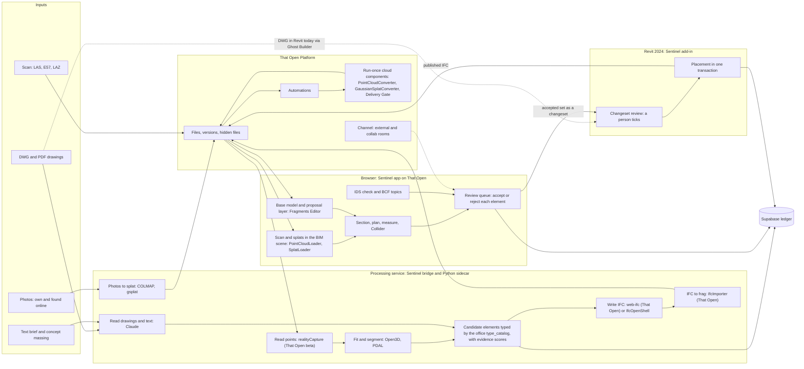

# That Open libraries for Sentinel's modelling and reality-to-model features

Date: 2026-09-30. This is research only. Nothing was changed in the repo. None of the unused capabilities below has been run on real data.

## Short answer

That Open helps a lot, but in specific places.

- **It is strong at:** showing everything together in the browser (model, scan, photos as splats, proposed elements), editing a fragments model with history, sections, plans, measuring, clash, IDS and BCF. On the platform side it gives files, automations, converters and the channel.
- **It already ships three big pieces that Sentinel has installed but does not use.** All three are in the beta packages:
  1. A reality-capture library that reads LAS and E57 and builds Potree tiles.
  2. Point-cloud and splat loaders inside the BIM viewer.
  3. An authoring kernel, `OBC.Modeling`, with 14 element families and 279 agent commands. It is undocumented.
- **It does not do:** read DWG or PDF, understand photos or text, turn points into walls (segmentation, fitting), make a 3D model from photos (photogrammetry), export IFC from fragments, or create native Revit elements.

In one line: **That Open is the evidence viewer, the review desk and the plumbing. It is not the reconstruction engine.**

---

## 0. How to read this

**Status labels**

- **STABLE**: a public npm package. Installed: `@thatopen/fragments` 3.4.7, `@thatopen/ui` 3.4.9, `@thatopen/services` 0.16.1, `web-ifc` 0.0.77.
- **BETA**: a `@thatopen-platform/*-beta` package from the Founding-member registry. Installed: components-beta 3.5.18, components-front-beta 3.5.16, fragments-beta 3.5.9. Sentinel runs these today through aliases in `WebApp/vite.config.js`. Names can change in any new beta release.
- **UNDOC**: there is no docs page, only the `.d.ts` file.
- **Third party**: not That Open.

**"Used today"** means yes, partly or no. It comes from a search (grep) of `WebApp/src` and `WebApp/bridge`.

**Sources.** Paths start at the repo root `C:/Users/yazan/Claude/Projects/Co BIM Assistant/sentinel-project/`. Line numbers point into the installed `.d.ts` files, which are the truth for the APIs. Short names:

| Short | Full path |
|---|---|
| FR | `WebApp/node_modules/@thatopen/fragments/dist/index.d.ts` (stable 3.4.7) |
| FRB | `WebApp/node_modules/@thatopen-platform/fragments-beta/dist/index.d.ts` (beta 3.5.9) |
| CB | `WebApp/node_modules/@thatopen-platform/components-beta/dist/index.d.ts` (beta 3.5.18) |
| RC | `WebApp/node_modules/@thatopen-platform/components-beta/dist/realityCapture/` |
| CFB | `WebApp/node_modules/@thatopen-platform/components-front-beta/dist/index.d.ts` (beta 3.5.16) |
| SV | `WebApp/node_modules/@thatopen/services/` (0.16.1) |
| WI | `WebApp/node_modules/web-ifc/web-ifc-api.d.ts` (0.0.77) |

---

## 1. What Sentinel uses from That Open today

| What Sentinel does | That Open piece (package, status) | Where in Sentinel |
|---|---|---|
| App inside the platform: viewer, model tree, properties, models list | services 0.16.1 `PlatformClient`, `UIManager` elements (`top-viewer`, `top-model-tree`, `top-properties-panel` …): STABLE | `WebApp/src/main.ts:112-128, 398-410` |
| Fragments engine in the browser, with a self-built worker | fragments-beta 3.5.9 `FragmentsModels`; components-beta `FragmentsManager`: BETA | `WebApp/src/main.ts:10-14, 169-174`; `WebApp/vite.config.js` (`getBetaAliases`) |
| IFC to `.frag` on the bridge | fragments 3.4.7 `IfcImporter.process`: STABLE | `WebApp/bridge/ifc-to-frag.mjs:8, 18-22` |
| Reading IFC in Node (elements, psets, quantities, storeys, grids, georeference, GUID audit) | web-ifc 0.0.77 `IfcAPI.OpenModel`, `GetLine`, `properties.getPropertySets`: STABLE | `WebApp/bridge/ifc-extract.mjs:83-123`; `WebApp/bridge/ifc-manifest.mjs:20-154` |
| Element data for QA, IDS, 5D/6D quantities, COBie and levels | `FragmentsModel.getItemsData`, `getItemsOfCategories`, `getBoxes`: STABLE and BETA | `WebApp/src/sentinel-core/adapter/element-properties.ts`, `fragments-quantities.ts`, `fragments-levels.ts`, `fragments-facts.ts` |
| Exact clash (B18) | components-beta `Collider.find`: BETA | `WebApp/src/sentinel-core/adapter/model-clash.ts` |
| Live plans from storeys | `Views.createFromIfcStoreys` + `ClipStyler.createFromView` | `WebApp/src/setups/live-plan.ts:42, 62, 92` |
| Sections, measuring, hide and isolate, highlight, performance | `Clipper`, `ClipStyler` (calls `getSection` for cut edges), `Classifier`, measurements, `Hider`, `Highlighter`, `Hoverer`, `PostproductionRenderer` | `WebApp/src/setups/clipper-tool.ts:254, 317`, `measurement-tool.ts`, `visibility-panel.ts`, `perf-panel.ts` |
| Georeference (partly) | `model.getCoordinationMatrix()`; web-ifc reads `IfcMapConversion.TargetCRS`. Sentinel does not call `getCRS` | `WebApp/src/setups/issue-panel.ts:82`; `WebApp/bridge/ifc-manifest.mjs:148` |
| Platform files, versions, ISO labels on `.frag`, deliveries | services `createFile`, `listVersions`, `getFileVersionMetadata`, `updateFileVersionMetadata`, `downloadFile` | `WebApp/bridge/thatopen-client.mjs`; `WebApp/bridge/platform-state.mjs:55-66`; `WebApp/src/setups/platform-deliveries.ts` |
| Delivery Gate cloud component with automations; each run becomes a ledger row | Cloud runtime, with services 0.3.16 inside the component; the bridge reads runs with `listExecutions` and `getExecution` | `CloudComponents/delivery-gate/src/main.js`; `CloudComponents/delivery-gate/package.json:12`; `WebApp/bridge/platform-gate-ledger.mjs:101, 115` |
| Ask Sentinel from outside the tab (B26) | services `client.channel.external()` (0.15.0+) | `WebApp/src/setups/ask-sentinel.ts:115`; `WebApp/bridge/ask-sentinel.mjs` |
| UI panels | `@thatopen/ui` 3.4.9 (BUI): STABLE | `WebApp/src/main.ts`; `WebApp/src/setups/qa-panel.ts` |
| Tiles for the scan viewer | services `downloadHiddenFile`, called **once per tile** | `WebApp/src/setups/reality-capture/lib/hidden-tiles-plugin.ts:81` |

**Places where Sentinel wrote its own code although That Open has an equivalent:**

- **IDS**: own `WebApp/src/sentinel-core/ids.ts`, matching the C# version. The engine's `IDSSpecifications` is not used. This is by design.
- **BCF**: own `WebApp/bridge/bcf-service.mjs`, with the topics in Supabase. `BCFTopics` is not used.
- **IFC writing**: own `WebApp/src/sentinel-core/ifc-writer.ts`. The web-ifc write API is not used.
- **Web "Modeling studio"**: own three.js boxes in `WebApp/src/setups/model-panel.ts`. It does not use the fragments `Editor`, `GeometryEngine` or `OBC.Modeling`. It saves to localStorage and skips Governed Intake.
- **Reality-capture viewer**: own renderer built on 3d-tiles-renderer 0.4.28 and Spark 0.1.10 (`WebApp/src/setups/reality-capture-viewer.ts`). It is separate from the BIM scene. It opens only from the `files` list, which `main.ts:402-403` keeps out of every layout. Only a `3tz` loader is registered (`main.ts:222-243`).
- **Proposals to Revit**: own changesets. `WebApp/bridge/changesets-logic.mjs` has the vocabulary wall, floor, level, grid and a limit of 200 elements. In Revit, `SentinelAddin/UI/ChangesetReviewWindow.cs` lets a person tick elements. `SentinelAddin/GhostBuilder/ChangesetExecutor.cs` then places the ticked elements in one transaction. That Open has nothing that places native Revit elements.

---

## 2. What That Open offers that Sentinel does not use yet

Columns (a), (b) and (c):

- **(a)** modelling automation, from concept to DD
- **(b)** reality to model
- **(c)** other Sentinel features

### 2.1 Authoring and editing

| Capability | Package, version, status | (a) Concept → DD | (b) Reality to model | (c) Other | Source |
|---|---|---|---|---|---|
| **Fragments Editor**: create, edit and delete elements; list of edit requests; reset; save `.frag` | fragments 3.4.7 `Editor` (`createElements`, `edit`, `deleteElements`, `applyChanges`, `getModelRequests`, `selectRequest`, `reset`, `save`): **STABLE**. `Editor.undo/redo(modelId)` exists only in fragments-beta 3.5.9 | Show a generated option as a separate proposal model. The reviewer accepts or rejects each element | Fitted walls and slabs as a layer you can undo, on top of the scan. The request list records each decision | Could back the web Modeling studio | FR:753, :922, :929; FRB:893, :957, :964 |
| **Parametric geometry** | fragments 3.4.7 `GeometryEngine` (`getWall`, `getExtrusion`, `getSweep`, `getProfile`, `getBooleanOperation`): **STABLE** | Massing blocks become previews of walls, slabs and openings (That Open "BuildingConfigurator" pattern) | Candidate walls drawn from a scan slice | — | FR:2280; https://docs.thatopen.com/Tutorials/Fragments/Fragments/FragmentsModels/BuildingConfigurator |
| **Model without a worker**, with undo, redo and save | fragments 3.4.7 `SingleThreadedFragmentsModel`: **STABLE** | Build a proposal `.frag` on the bridge (not tested in Node) | Same | — | FR:4844, :5103 |
| **Write IFC** | web-ifc 0.0.77 `CreateModel`, `CreateIfcEntity`, `CreateIFCGloballyUniqueId`, `WriteLine`/`WriteRawLineData`, `SaveModel`; `properties.setPropertySets`, `setMaterialsProperties`: **STABLE** (MPL-2.0) | IFC for an accepted option, with an evidence pset on each element | IFC for the as-found model, with source and confidence psets | Can back `ifc-writer.ts` when it needs openings, materials and psets | WI:247, :253, :327, :333, :391; `WebApp/node_modules/web-ifc/helpers/properties.d.ts:39, :63` |
| **Split or extract part of an IFC** | fragments `IfcSplitter.split/extract`: **STABLE**, Node only (it works with file paths) | Deliver one zone or one option | Cut out the reviewed as-found zone | Deliver a subset | FR:2768; FRB:3710 |
| **Authoring kernel `OBC.Modeling`**. 14 families: wall, slab, curtainWall, beam, column, railing, roof, footing, covering, space, ramp, flowSegment, pile, stair. `TypeRegistry` holds the type catalogue. `CommandLog` gives one undo step per action. `ItemMirror` syncs the result into fragments | components-beta 3.5.18: **BETA, UNDOC**. Not in public components 3.4.8 | Typed elements from lines or proposals, typed from the office catalogue | The same families are the target list for fitted elements | Could replace the hand-built Modeling studio | CB:15574, :27852, :3938, :12734 |
| **279 agent-ready commands**, each with its own description. `checkCall` checks all arguments in one pass. `import.drawingSet` returns "gaps", each with a reason | components-beta `Modeling.toolRegistry`, `checkCall`: **BETA, UNDOC** | Turn the commands into Claude tools (for example `run.draw`, `slab.draw`) | An agent places fitted elements through the same commands | Ask Sentinel could create elements, not only answer | CB:27324, :3042 |
| **IFC to editable "recipes"**, with a reason for each part that could not be read | components-beta `Modeling.wallsOf`, `slabsOf`, `levelsOf`, `openingsOf`, `planToRebuildWalls`, `AuthoredMesh`: **BETA, UNDOC** | Turn a consultant or massing IFC into editable elements | Same for an IFC of an existing asset. The list of failures is a confidence signal | — | CB:29282, :19422 |
| **Sketch, constraint solver, snapping** | components-beta `Sketch.bringIn`, `solve`, `SnapPolicy`: **BETA, UNDOC** | Lines traced from a drawing (Sentinel extracts them) are cleaned up and become wall runs and slabs | Lines from a scan slice become wall runs | — | CB:24538, :25471 |
| **Design-rule checks** | components-beta `Modeling.Requirement`, `check` → `Report`, `Finding`: **BETA** | Run office and ISO 19650 rules on an option before review | Same | Contract clauses as rules | CB:21499 |
| **Draw on a plan or on a photo** inside the viewer | components-front-beta `mountDrawingOnPlan`, `mountGpuPhoto`, `mountSaveAndDrawInModel`: **BETA, UNDOC** | Sketch over a plan | Trace over a photo | — | CFB:5057, :5076, :5204 |

### 2.2 Reality capture

| Capability | Package, version, status | (a) | (b) Reality to model | (c) Other | Source |
|---|---|---|---|---|---|
| **Reality-capture library**: LAS and E57 readers, a Potree 2.0 octree builder (plan, build and merge for very large clouds), splat tiling, FQ LOD trees, `.3tz` packing. The same code runs in the browser, in Node or in a cloud component | components-beta 3.5.18 `dist/realityCapture` (`streamLasPoints`, `decodeLasStream`, `hasUsableBounds`, `scanLasBounds`, `openE57`, `buildPotreeOctree`, `planPotreeTiles`, `mergePotreeTiles`, `tileSplatToTiles`, `convertSplatToFqTree`, `write3tzToBuffer`): **BETA**. Import it from `@thatopen-platform/components-beta/dist/realityCapture/index.js`; the main entry does not export it | — | The bridge reads scan points (x, y, z, rgb) as a stream with little memory, for fitting and per-element evidence. It also builds the viewer tiles with no extra tool | — | RC `index.d.ts`, `las.d.ts`, `e57.d.ts`, `tile-potree.d.ts`, `potree-plan.d.ts` |
| **Point clouds in the BIM viewer**: loads detail by distance (Potree 2.0), hidden behind BIM, cut by section planes, pickable, shared anchor, EDL shading | components-front-beta 3.5.16 `PointCloudLoader`, `LoadedPointCloud`, `PointCloudSource.requestManager`. Needs the optional peer `potree-core` ^2.0.15, already in Sentinel's `package.json`: **BETA** | Existing site as context for a new design | The scan and the proposed elements in one scene; one section box cuts both | Replaces the separate scan viewer | CFB:7195, :4052, :7350, :7377; `WebApp/package.json:36` |
| **Gaussian splats in the BIM viewer**: BIM hides splats behind it. `setTransform`/`getTransform` give a placement matrix. `setCollisionProxy` allows picking and measuring. Splats stream by level of detail. Reads `.ply`, `.compressed.ply` and `.fq` | components-front-beta 3.5.16 `SplatLoader`: **BETA** | Photo context around a massing | Photos become a splat aligned to the model. The placement matrix goes on the ledger as alignment evidence | Replaces Spark in the scan viewer | CFB:8429, ~8560, :8633 |
| **Platform converters**: LAS to `.potree` and 3DGS PLY to `.splat`, as cloud components that an automation can start | services 0.16.1 `dist/cloud/LasToPotree` (published as `PointCloudConverter`) and `SplatToFq` (`GaussianSplatConverter`) | — | A `.las` dropped in the project is converted. The new file id and version go on the ledger, like the Delivery Gate | — | SV `dist/cloud/LasToPotree.d.ts:38, 50, 58`; SV `dist/cloud/SplatToFq.d.ts`; SV `docs/cloud/PointCloudConverter.md` |
| **Project georeference**: one CRS per project, and a latitude, longitude, height and rotation for each asset of type point-cloud, splat or ifc | services built-in `ProjectManager`: `crs` from 0.14.0; `assetCoordinates` (the version that added it is not in the changelog). fragments `getCRS()`: **STABLE** | Place a new design on its site | Scan, splats, photos and IFC in one coordinate frame | Replaces the alignment kept in panel app-data today | SV `dist/built-in/index.d.ts:1593-1766`; FR:497, :1562, :1707 |
| **Signed hidden-file URLs in batches** (up to 100 per call) | services `getHiddenFileSignedUrlsBatch` (0.10.0+): **STABLE** | — | Tile transport for both loaders without hitting the rate limit | Fixes the one-call-per-tile pattern in today's viewer | SV `dist/core/client.d.ts:698`; `hidden-tiles-plugin.ts:81` |
| **Streaming very large models** | fragments-beta `IfcImporter.processStreamed`, `writeStreamedFiles`: **BETA** (needs a WebGPU build of three) | — | Very large as-built models | 3D roadmap | FRB:3693, :9188 |

### 2.3 Review, checking and evidence

| Capability | Package, version, status | (a) Concept → DD | (b) Reality to model | (c) Other | Source |
|---|---|---|---|---|---|
| **Deviation or clearance against any mesh** | components-beta `Collider.find(MeshElement[])`, `clashPipeline`: **BETA** | New elements against existing ones | Each generated element against a mesh made from the scan, per GUID | — | CB:3169, :3715, :15306 |
| **Point-to-surface distance per element** | three-mesh-bvh 0.9.9 `MeshBVH.closestPointToPoint`, `distanceToPoint`: third party, MIT. **Already installed** because components-beta depends on it | — | Per-element evidence: points near each face, mean distance and coverage give a confidence score | — | `WebApp/node_modules/three-mesh-bvh/src/index.d.ts` |
| **More model queries** | fragments `getItemsVolume`, `getItemsByQuery`, `getGuidsByLocalIds`, `raycastWithSnapping`, `setTintItems`; direct calls to `getSection`: **STABLE** | Volume of each option | Colour elements by confidence; the model's section outline at a scan-slice height | 5D quantities | FRB:2116, :2153, :2175, :2571; FR:1894 |
| **Section boxes, projections, sheets, DXF out** | components-beta `SectionBoxes` (**BETA only**), `EdgeProjector`, `TechnicalDrawings`, `DxfManager.exporter` (present in the beta; stable not checked) | DD plans and elevations; DXF for consultants | A box around each element under review; a DXF of the fitted plan for a CAD overlay | Sheets | CB:22514, :7778, :26929, :7679 |
| **Engine IDS** | components-beta `IDSSpecifications` | Pass or fail per element, with the failing facet | Same, on the as-found model | A cross-check of Sentinel's own IDS | CB:12079 |
| **BCF topics and viewpoints** | components-beta `BCFTopics`, `Viewpoints`; services `TopicsManager` | A rejected element becomes a BCF topic with a viewpoint | Same, for an evidence question | Export only; Supabase stays the source of truth | CB:1603; SV `dist/built-in/index.d.ts:1805` |
| **Picking, outlines, finders** | `FastModelPicker`, `Outliner`, `ItemsFinder`, `BoundingBoxer`, `Mesher`, `MeasurementUtils` | Review sets by storey or by type | Click a face to attach a photo or a scan crop | — | CB:9042, :12790, :2297; CFB:4629 |
| **One depth buffer for BIM, scans and splats** | components-front-beta `Postproduction.occlusionPasses`, `addOcclusionPass`, `deferredDepthTexture`: **BETA** | — | Scan and model hide each other correctly | — | CFB:7497, :7505, :7515 |
| **Review UI parts** | `@thatopen/ui` 3.4.9 `Table`, `Chart`, `PaperSpace`: **STABLE** | Table that compares options | Review queue; confidence chart | — | `WebApp/node_modules/@thatopen/ui/dist/index.d.ts:2223, :127, :1641` |

### 2.4 Platform

| Capability | Package, version, status | (a) | (b) | (c) | Source |
|---|---|---|---|---|---|
| **Run a short job** in the cloud or on the PC, with progress | services `executeComponent`, `onExecutionProgress`; CLI `run` and local server: **STABLE**. Sentinel only reads runs today | Short conversions | Scan tiling; small deviation jobs | Test components on the PC first | SV `dist/core/client.d.ts:590, :627`; SV `docs/cli/run.md`, `docs/cli/local-server.md` |
| **Evidence packs** in hidden files | services `createHiddenFilesBatch` | Sketches and reference images | Photo crops, scan crops and drawing snippets under one visible item | — | SV `dist/core/client.d.ts:643` |
| **Live room with several users** | services `channel.collab()` / `CollabRoom` (0.15.0+) | Two designers | Two reviewers on the same proposal | — | SV `dist/core/channel.d.ts:91, :117`; SV `docs/ai-quickstart.md` §5b |
| **Flow proposals into Revit**, carrying the source | `revitflow/op@2` (a `.frag` without geometry plus `revitflow_ops.json`, with `flow:source`); That Open's own Revit add-in 1.2.17+; Rhino interop guide | A worked pattern: massing, then a converter, then a proposal, then acceptance in Revit | Carry the source of each element with the proposal | — | SV `docs/flow-plugin-guide.md:120, :199`; SV `docs/rhino-interop-quickstart.md`; SV `docs/revit-collab-quickstart.md` |
| **Commit history with diff colours** | services `GitHistoryManager` (`isProposal`) | Show what a new option adds, changes or removes | Same, for revisions of the as-found model | Revision review | SV `dist/built-in/index.d.ts:1150-1170, :1282` |

---

## 3. What That Open does NOT cover, and what to pair it with

| Missing in That Open | Pair with | Licence | Note |
|---|---|---|---|
| **Reading DWG, DXF or PDF** (`DxfManager` only exports: CB:7679-7691) | DWG: Revit itself, through Sentinel's Ghost Builder (`SentinelAddin/GhostBuilder/*`). PDF text: unpdf, already in the bridge (`WebApp/bridge/doc-text.mjs:16`) | unpdf: not re-checked | Reading vectors from PDF and DWG outside Revit was not part of this research |
| **Understanding text, photos and drawings** | Claude (vision and tools) | — | That Open has no LLM or vision model |
| **LAZ, COPC, PLY, PCD** (`realityCapture` rejects LAZ: RC `las.js`, LASF check) | laz-perf 0.0.7; copc 0.0.9; @loaders.gl/las, /ply, /pcd 4.5.2 | Apache-2.0; MIT; MIT | Decode LAZ first, then call `buildPotreeOctree` |
| **Very large clouds** (the platform converter handles at most 60M points in SIMPLE mode; files move at about 7 MB/s) | PotreeConverter (offline); PDAL 3.5.5 | BSD-2; BSD | The platform doc itself says: convert offline and upload the `.potree` |
| **E57 fields beyond x, y, z, r, g, b** (intensity, scan poses, images) | pye57 0.4.19 | MIT | — |
| **Registration, plane fitting, segmentation, semantic labels** | Open3D 0.20.0; PDAL; Pointcept. Research starters: humantecheu/openbimxd, rsasaki0109/pointcloud2ifc | MIT; BSD; MIT; MIT (early, research grade) | This step produces each element guess and its score (inlier ratio, residual) |
| | CloudCompare | **GPL-2.0+ (flag)** | Use only as a separate tool; never link it |
| **Photos to 3D (photogrammetry, splat training)** | COLMAP; nerfstudio gsplat; brush; Meshroom | BSD-3; Apache-2.0; Apache-2.0; MPL-2.0 | The PLY output goes to `SplatLoader` or `GaussianSplatConverter` |
| | OpenSplat, openMVS | **AGPL-3.0 (flag)** | Avoid |
| | naver/mast3r | **CC BY-NC-SA 4.0 (flag: non-commercial)** | Not allowed in the product |
| | facebookresearch/vggt | **Custom licence (flag)** | Read the licence first |
| **Robust booleans** (openings, voids) | manifold-3d; three-bvh-csg; replicad + opencascade (heavy WASM) | Apache-2.0; MIT; LGPL-2.1 | — |
| **Server-side IFC authoring and checking** | IfcOpenShell 0.9.0 with ifctester and ifcpatch; ifcopenshell-mcp 0.9.0 | LGPLv3+ | Fine as a separate process. **Bonsai is GPL-3.0 (flag)**: use it only as an outside tool |
| **Export from fragments to IFC** | None. Write IFC with web-ifc or IfcOpenShell | — | Keep IFC as the truth and `.frag` as the view |
| **Native Revit elements** | Sentinel's Revit add-in and its changeset path | Own code | That Open's Flow add-in exists, but no one has checked that it works next to Sentinel's |
| **Online photoreal context** | 3d-tiles-renderer (0.4.28 installed) | Not re-checked | The terms for using Google photoreal tiles as evidence were not checked |
| **A public example of both features** | github.com/ibuilder/massing (139 stars, pushed 2026-09-25; stable That Open 3.4.8 + IfcOpenShell) | MIT | Its deviation check measures scan points against mesh **vertices** only (`scan_deviation.py`). Fine for a heatmap, not good enough for per-element evidence |

Sources: https://pypi.org/pypi/ifcopenshell/json, https://pypi.org/pypi/ifcopenshell-mcp/json, https://pypi.org/pypi/open3d/json, https://pypi.org/pypi/pdal/json, https://pypi.org/pypi/laspy/json, https://pypi.org/pypi/pye57/json, https://registry.npmjs.org/laz-perf, https://registry.npmjs.org/copc, https://registry.npmjs.org/@loaders.gl/las, https://github.com/potree/PotreeConverter, https://github.com/colmap/colmap/blob/main/LICENSE.txt, https://github.com/nerfstudio-project/gsplat, https://github.com/ArthurBrussee/brush, https://github.com/alicevision/Meshroom, https://github.com/naver/mast3r/blob/main/LICENSE, https://github.com/facebookresearch/vggt/blob/main/LICENSE.txt, https://github.com/CloudCompare/CloudCompare/blob/master/license.txt, https://registry.npmjs.org/manifold-3d, https://github.com/ibuilder/massing/blob/main/services/api/src/aec_api/scan_deviation.py. The versions of the libraries that are not from That Open were not checked again in this research.

---

## 4. Where That Open fits in the architecture

**Five rules:**

1. **The browser shows and decides.** It does no heavy processing (raw points, fitting, photogrammetry). Its jobs: show the evidence side by side (point cloud, photos as splats, drawings, generated elements), then review, edit, measure, section, check IDS, write BCF and export IFC.
2. **The processing service computes.** Today that is the Sentinel bridge (Node, on the PC, reached through Funnel). Heavy Python tools will join it as a sidecar. This service is not That Open, but it uses That Open libraries: `realityCapture`, `IfcImporter` and web-ifc.
3. **Revit creates native elements, and only the ones a person ticked.** The path already exists: a bridge changeset, then a tick in `ChangesetReviewWindow`, then `ChangesetExecutor` places everything in one transaction and records the element ids per `proposal_guid`.
4. **That Open Platform stores and triggers.** It holds files, versions and hidden files. It runs short, run-once jobs (the converters, the Delivery Gate), starts automations and carries the channel. It cannot host the pipeline, because cloud components run once and stop.
5. **The Supabase ledger records every step:** input hashes, alignment matrices, evidence scores, each accept or reject, and the placed element ids.

| Zone | That Open pieces | Not That Open | Main jobs |
|---|---|---|---|
| **Browser** | fragments (base model and proposal layer through `Editor`), `PointCloudLoader`, `SplatLoader`, `Clipper`, `Views`, `SectionBoxes`, measurements, `Collider`, `IDSSpecifications`, `BCFTopics`, `@thatopen/ui` | Sentinel review logic | Show the evidence side by side; accept or reject; colour by confidence; measure; section |
| **Processing service** | `realityCapture`, `IfcImporter`, web-ifc, `IfcSplitter`; three-mesh-bvh (installed with components-beta) | Open3D, PDAL, COLMAP/gsplat, IfcOpenShell, Claude | Read points; fit elements; make splats; score evidence; write IFC; convert to `.frag` |
| **Revit** | None (That Open's Flow add-in is not used) | Sentinel add-in: Ghost Builder, Photo Massing, changesets | Create native elements from the ticked set, typed by the office `type_catalog` |
| **That Open Platform** | services: files, hidden files, versions, automations, converters, channel, `ProjectManager` CRS | — | Store; convert on upload; run gates; let agents reach the open app |

**IFC export.** web-ifc is WASM, so it can also run in the browser. Nobody has tested it inside the sandboxed platform frame. The bridge already runs web-ifc, so export from the bridge by default.

---

## 5. Concrete uses, feature by feature

### 5.1 Feature 1: modelling automation (concept → DD and later)

1. **Compare a DWG or PDF plan with the generated walls.**
   - Load the generated model as `.frag`.
   - `Views.createFromIfcStoreys` and `ClipStyler` show the cut at each storey. Sentinel already does this in `live-plan.ts`.
   - Draw the traced drawing lines as a thin mesh underlay. The deferred pipeline hides plain `THREE.Line` (see `model-panel.ts:23-25`).
   - `getSection` (FRB:2571) gives the model's cut outline, so you can measure the gap.
   - Status: the pieces are STABLE. Tracing the lines is Sentinel's own work.
2. **Show a massing option as a proposal before anything goes to Revit.**
   - Build walls and slabs with `GeometryEngine.getWall` / `getExtrusion` (FR:2280).
   - Write them into a separate proposal model with `Editor.createElements` (FR:922).
   - The reviewer ticks elements in the browser. The accepted set goes to the existing bridge changeset, then to the Revit tick, then to placement.
   - Status: STABLE.
3. **Generate an IFC with web-ifc and review it in the browser before any Revit write.**
   - On the bridge: `CreateModel`, `CreateIfcEntity`, `CreateIFCGloballyUniqueId`, then `properties.setPropertySets` to add a `Sentinel_Evidence` pset (source, rule, confidence).
   - Then `IfcImporter.process` turns it into `.frag`, which you upload and review.
   - Status: STABLE (WI:247-391).
4. **Run IDS on generated elements with `IDSSpecifications`** (CB:12079). Each element gets pass or fail, with the failing facet, on its review row. Keep Sentinel's own `ids.ts` as the judge; use the engine as a cross-check.
5. **Compare options by quantity.** Use `getItemsVolume` (FRB:2175) together with the existing `fragments-quantities.ts` to compare the 5D and 6D figures of two options.
6. **Produce DD sheets and DXF.** `Views` for plans and elevations, `EdgeProjector` / `TechnicalDrawings` for line drawings, and `DxfManager.exporter` for DXF to consultants (CB:7778, :26929, :7679).
7. **Follow the Rhino-to-Revit pattern for concept massing** (SV `docs/rhino-interop-quickstart.md`).
   - The massing tool publishes a `.frag` of proxies that carry Layer and Type attributes.
   - A converter maps each proxy to an office type (Sentinel's `type_catalog`) and writes one changeset.
   - A person accepts it in Revit.
   - Sentinel already has every part of this except the converter.
8. **Later: agent authoring through `OBC.Modeling`** (BETA, UNDOC).
   - Turn `toolRegistry` command descriptions into Claude tools.
   - Call `checkCall` first.
   - Each call is one undo step in `CommandLog`.
   - Keep it behind a switch until That Open documents it.

### 5.2 Feature 2: reality to model

1. **Take in a scan.**
   - A `.las` uploaded to the project starts an automation, which runs `PointCloudConverter` and produces a `.potree` (SV `dist/cloud/LasToPotree.d.ts`). The ledger records the file id and version.
   - A LAZ file, or one over 60M points, is converted on the bridge instead: `realityCapture` for LAS and E57, PDAL or laz-perf for LAZ. Then upload the `.potree`.
   - Call `hasUsableBounds` / `scanLasBounds` first. A wrong header box gives a broken octree without any error.
2. **See the scan and the model together.**
   - Load the scan with `PointCloudLoader` in the same scene as the model (CFB:7195).
   - Its `requestManager` gets tile URLs through `getHiddenFileSignedUrlsBatch` (100 per call).
   - Then retire the separate viewer and its one-call-per-tile download.
3. **Compare a scan slice with the generated walls.**
   - A `Clipper` plane at one height cuts both the cloud and the model.
   - `getSection` gives the model outline at that height.
   - `Views` plans give the storey context.
4. **Add photos as evidence.**
   - COLMAP or gsplat on the processing side turns the photos into a PLY splat.
   - `SplatLoader` shows it directly (it reads `.ply`), or `GaussianSplatConverter` converts it first.
   - `setTransform` aligns it. Store the matrix on the ledger.
   - `setCollisionProxy` makes it possible to measure on it.
   - Use splats only as visual evidence. Take dimensions from the scan.
5. **Put everything in one coordinate frame.** Set the project CRS and each asset's coordinates in `ProjectManager` (`crs`, `assetCoordinates`). Read the IFC side with `getCRS` / `getCoordinationMatrix`.
6. **Score evidence per element, with no new dependency.**
   - On the bridge, `streamLasPoints` streams the points.
   - three-mesh-bvh `distanceToPoint` measures each point against each element's faces.
   - This gives the inlier count, mean distance and coverage, which make the confidence score.
   - In the browser, colour each element by its score with `Highlighter` / `setTintItems`.
7. **Check deviation against a scan mesh.** `Collider.find` with `MeshElement[]` (CB:3169, :15306) checks each GUID against a mesh made from the scan (for example by Open3D).
8. **Review queue.**
   - A `@thatopen/ui` `Table` lists the elements.
   - A `SectionBoxes` box frames each element.
   - Clicking a face attaches a photo or a scan crop.
   - Accept or reject is one `Editor` request and one ledger row.
   - A reject becomes a BCF topic with a viewpoint.
9. **Evidence packs.** `createHiddenFilesBatch` stores the photo crops, scan crops and drawing snippets for one element under one visible evidence item.
10. **Two reviewers at once.** Use `channel.collab()` (untested; the two-server problem may apply).

### 5.3 Other Sentinel features

- **Scan viewer defect.** Moving to `PointCloudLoader` / `SplatLoader` fixes the per-tile rate-limit pattern. The services 0.10.0 changelog warns against exactly that pattern.
- **Georeference.** Sentinel keeps the reality-capture alignment in panel app-data today. It can move to `ProjectManager`.
- **Revision review.** `GitHistoryManager` colours show what was added, changed or removed.
- **Subset delivery.** `IfcSplitter` can cut one zone out of an IFC.
- **Agents.** Ask Sentinel already uses `channel.external()`. `OBC.Modeling` would let it create elements too.

### 5.4 What That Open's #befreeagain posts show

These are public LinkedIn posts, read on 2026-09-30.

- **Pic on Site** (https://www.linkedin.com/posts/thatopencompany_befreeagain-activity-7500579481238102016-XUjF). Photos are pinned to their exact point in the model through geolocation, with a relief view, on Fragments. This is the "photo located in the model" pattern that feature 2 needs.
- **5D traceability app** (https://www.linkedin.com/posts/befreeagain-ugcPost-7495325689118629888-QKBC). Cost, quantity and progress for each element, queried live in the browser on That Open Engine. It is the same idea as per-element evidence: every number traced back to its source.
- **WebMCP IFC editor** (https://www.linkedin.com/posts/befreeagain-ugcPost-7503588349916581888-0yy4). An AI agent calls the web app's functions directly and corrects a door's fire rating in a real model, using a 35B model. Inside the sandboxed platform, That Open's approved route for this is `channel.external()`. Sentinel already uses it.
- **Clash app made with prompts** (https://www.linkedin.com/posts/befreeagain-share-7504363886876323840-kH60). You declare the pairs to compare, run a matrix, and see the results in 3D, all on That Open Platform. Sentinel already has exact clash (B18).

---

## 6. Risks and limits, and how to handle them

| Risk | What it means | How to handle it |
|---|---|---|
| **Beta APIs** | `OBC.Modeling`, `realityCapture`, `PointCloudLoader`, `SplatLoader`, `Collider`, `SectionBoxes`, `Editor.undo` and streaming are all beta, and some are undocumented. They come from a gated registry and can change in any release | Keep each one behind one adapter file in `WebApp/src/sentinel-core/adapter/` (the pattern Sentinel already uses). Pin exact versions. Run one smoke check after each beta release. Use the stable equivalent where there is one (`selectRequest` instead of `Editor.undo`). Ask That Open before building on `Modeling` |
| **Nothing new was run** | Every unused capability here comes from reading `.d.ts` files, not from running code | Before a plan depends on a capability, run one small test (spike) on aster-tower data |
| **Platform sandbox** | Published apps run at an opaque origin. localStorage can throw errors. The beta inline worker is a stub | Test in the published app, not only locally. Keep the self-built worker and `src/storage-fallback.ts`. Never keep review state in localStorage (the Modeling studio does today) |
| **Cloud components run once** | Parameters can only be strings and numbers. No incoming URL, no secrets, no state. At most 3 automations per project. `executeComponent` is limited to 20 calls per minute | Use components only for short jobs (conversions, gates). Keep the pipeline on the bridge and the sidecar |
| **Transfer speed and rate limits** | The file API moves whole files at about 7 MB/s. Writes are limited to 30 per minute. Signing one URL per tile breaks the limit | Convert big scans offline and upload the `.potree`. Sign URLs and write hidden files in batches (100 per call) |
| **Browser memory** | Each decoded point costs about 38 bytes (`decodeLasStream`, RC `las.d.ts`) | Never load raw points in the browser; stream the octree. Do fitting on the server. Keep the proposal model separate from the base model |
| **Converter limits** | LAS only (LAZ is rejected). At most 60M points in SIMPLE mode. The platform converter does not mention E57. The splat converter drops view-dependent colour (SH) | Decode LAZ with laz-perf or PDAL first. Read E57 with `openE57` on the bridge |
| **No IFC export from fragments** | Edits to a `.frag` cannot be exported as IFC | Keep IFC as the truth. Write IFC first, then convert it to `.frag` for viewing |
| **Splats have no true scale** | The scale is unknown, and `gaussianScale` is one value for all datasets | Put the scale in each dataset's transform. Take dimensions only from the scan |
| **Channel split** | The two channel servers do not share rooms | Keep the "ask both" approach. Test `CollabRoom` before you rely on it |
| **Two Revit add-ins** | No one has checked that That Open's Flow add-in works next to Sentinel's add-in | Keep Sentinel's changeset path. Borrow Flow's ideas (source and provenance in each proposal), not its add-in |
| **Licences** | The beta packages say MIT, but their source is not public. web-ifc is MPL-2.0. IfcOpenShell is LGPL. Several photo tools are AGPL or non-commercial | Ask That Open to confirm the beta licence in writing. Run LGPL tools as separate processes. Do not link AGPL, GPL or non-commercial code |
| **Sources found online** | Photos and drawings from the web have owners and terms of use | Mark web sources on each evidence row, with the URL and date. Check the terms before you store the files (this is not legal advice) |
| **Version drift** | The delivery gate uses services 0.3.16 while the app uses 0.16.1. web-ifc 0.0.78 is out. Spark and 3d-tiles-renderer are older versions | Upgrade in one planned step, then repeat the Delivery Gate drill |

---

## 7. Recommendations: what to adopt first

**1. Put scan and photo evidence inside the BIM viewer.** Do this first: it is cheap and you see the result at once.
- Register `potree` and `splat` loaders on `PointCloudLoader` and `SplatLoader` (components-front-beta 3.5.16, BETA).
- Fetch tiles through `getHiddenFileSignedUrlsBatch`.
- Add a `PointCloudConverter` automation, built like the Delivery Gate.
- Retire the separate Spark and 3d-tiles viewer. Keep 3d-tiles-renderer only for online site context.
- This also fixes today's per-tile rate-limit problem. Every review in feature 2 builds on this viewer.

**2. Add a proposal layer, linked to the existing changesets.**
- The stable fragments `Editor` and `GeometryEngine` show generated elements as a separate model.
- The reviewer accepts or rejects each element, and each decision becomes a ledger row.
- The accepted set becomes a bridge changeset, then goes to the Revit tick and placement.
- Grow the changeset vocabulary (today wall, floor, level, grid) as needed.

**3. Score per-element evidence on the bridge.**
- `realityCapture.streamLasPoints` streams the points; three-mesh-bvh measures distances. Both are already installed.
- Colour elements by confidence in the browser.
- The only new piece is a fitting sidecar (Open3D, MIT).

**4. IFC out, with evidence psets.**
- Keep the own `ifc-writer.ts` while the elements stay simple.
- Move to the web-ifc write API (already installed) when you need openings, materials and psets.
- Choose an IfcOpenShell sidecar (LGPL, separate process) only if server-side authoring and ifctester checks grow.

**5. Low-cost cross-checks and exports.** Engine `IDSSpecifications` as a cross-check, `BCFTopics` export for rejected elements, `getItemsVolume` for comparing options, `DxfManager.exporter` for consultants.

**6. Georeference in `ProjectManager`.** Store `crs` and `assetCoordinates` for the scan, the splats and the IFC.

**Test only, do not adopt yet: `OBC.Modeling`.**
- Run one small spike: load the office `type_catalog` into `TypeRegistry`, draw one wall with `run.draw`, and validate it with `checkCall`.
- Ask That Open first. Do not replace Ghost Builder.

**Do not:**
- Run the pipeline in cloud components.
- Load raw points in the browser.
- Swap Sentinel's Revit path for That Open's Flow add-in.
- Link AGPL, GPL or non-commercial code.

**Questions to ask That Open:**
1. What are the plans for `OBC.Modeling`: docs, stability, an IFC writer?
2. Can you confirm the licence of the beta packages in writing?
3. Will `realityCapture` become a public export?
4. Do `PointCloudLoader` and `SplatLoader` work inside the published platform frame?
5. Can the converters take E57 and LAZ, and keep SH in splats?
6. Which services version added `assetCoordinates`?
7. Is a fix planned for the two channel servers that do not share rooms?
8. Can the Flow Revit add-in run next to a third-party add-in?
