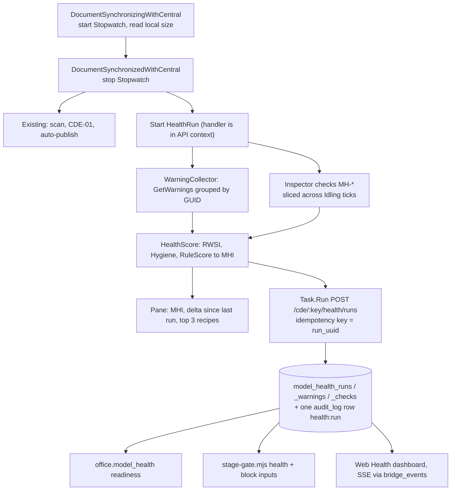
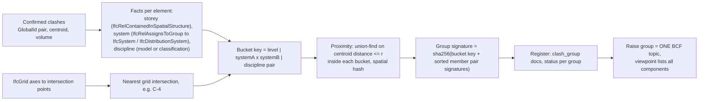
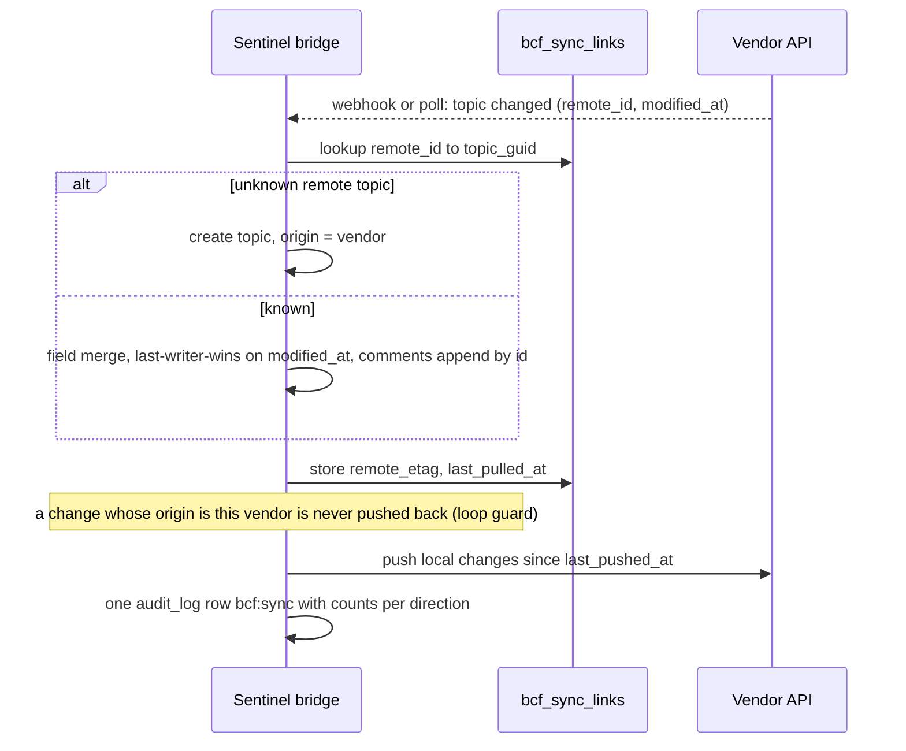
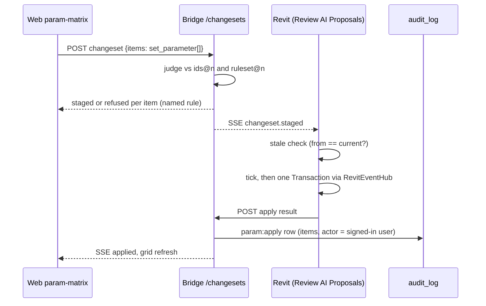
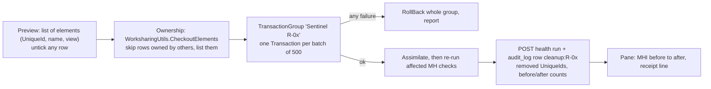
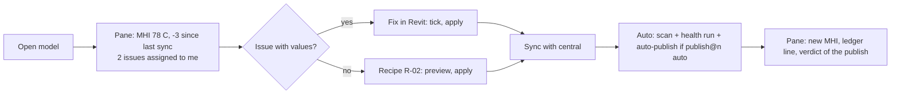
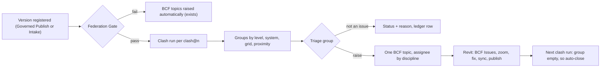
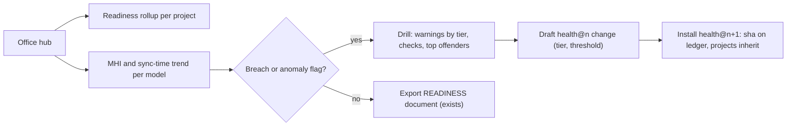
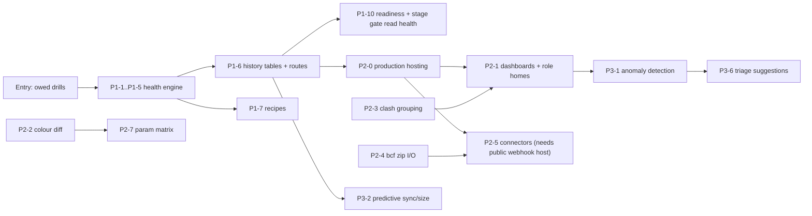

# Sentinel Product Blueprint: BIM Model Auditing, Coordination and Web CDE

## 0. About this document and its status labels

**What this is.** This is the product and technical blueprint for making Sentinel an enterprise-grade BIM auditing, coordination and web-CDE framework. It has five modules:

1. A competitor matrix and gap analysis.
2. The core tool architecture.
3. UX, roles and accessibility.
4. The technical architecture and integrations.
5. A phased roadmap.

Every proposal builds on something Sentinel already has: the hash-chained ledger and receipts, the `cde_transition` state machine, the review chain, the IDS gate, the artefact store, the delivery-gate cloud component, the That Open app, and naming from model facts. Nothing is proposed in parallel to those systems.

**Where the facts come from.**
- **Sentinel's current state** comes only from the capability inventory at repo `master a9d8a49` (web 1.0.40, 2026-09-29). Route, table, file and command names were spot-checked against the repo, read-only.
- **Competitor facts** come only from the research files. Every competitor claim carries a footnote ID in square brackets, such as `[A7]` or `[B10]`. The IDs resolve to URLs in §1.8. A drill reference is written in parentheses, for example "(B13)", and is never a footnote.

**Status labels.** Every Sentinel feature row carries one of these:

| Label | Meaning |
|---|---|
| `LIVE-PROVEN (ref)` | Run live against a real model or bridge. The ref is a drill or run record: SIM-2026-09-22, D2, D3, or B2–B30. |
| `PARTIAL` | Some of it is built or proven. The rest is stated in the same row. |
| `BUILT-NOT-PROVEN` | Code exists, but no live drill has run it. Do not sell it or depend on it until it is drilled. |
| `MISSING` | Not implemented. |
| `TARGET Pn` | Not built. A roadmap target for phase n (§5). |
| `n/f` | Competitor columns only: not found in the research. This is **not** a claim that the product lacks it. |

**How to read it.** §1 says where Sentinel stands. §2–§4 are the build spec: schemas, SQL, routes and diagrams. §5 says when each piece is built and what drill proves it. Any "Sentinel Edge" item that is not yet built appears as a `TARGET`, never as a strength.

---

## 1. Module 1: Competitor feature matrix and gap analysis

### 1.1 Products compared

| Short name | What it is (per research) |
|---|---|
| **ACC / Forma** | Autodesk Forma for Construction, formerly ACC. It was renamed on 24 Mar 2026, with no change to APIs, URLs or licences [A38]. It includes Data Management (formerly Docs), Design Collaboration (formerly BIM Collaborate Pro), Build, Insight / Model Analytics, and the APS APIs. |
| **BIMcollab** | Zoom (desktop checker, licensed separately), the merged platform (formerly Nexus MQA and Twin CDE, merged May 2026) [B3], the WebViewer and the free BCF Managers [B6]. |
| **Revizto** | The 5.x desktop app, the Workspace web admin, and the mobile apps. |
| **Solibri** | Starter, Essential, Advanced, Premium and Security+ tiers (Office became legacy on 13 Apr 2026) [S1][S20], plus CheckPoint [S18] and WebChecker [S9]. |
| **Ideate and Revit add-ins** | Ideate (Graitec), pyRevit and EF-Tools, Autodesk Model Checker, Naviate, DiRoots, Newforma Konekt and Bimbeats. |
| **Trimble · That Open · xeokit** | Trimble Connect, the That Open Engine and Platform (Sentinel's own viewer and cloud host), and xeokit. |

### 1.2 Feature matrix: CDE, governance and standards

| Capability | ACC / Forma | BIMcollab | Revizto | Solibri | Ideate & add-ins | Trimble · That Open · xeokit | **Sentinel today** |
|---|---|---|---|---|---|---|---|
| ISO 19650 container states | Separate WIP, Shared and Published folders; a state changes only when a review copies the file [A1]. Users are asking for a real state machine [A20]. | Shared, Published and Archived stored as metadata; **no WIP** [B1] | Marketing alignment only; no container states documented [R2] | None of its own; relies on the connected CDE [S2] | None of the tools models CDE states [I8] | Trimble: folder permissions plus Releases [T2], and a paid third-party Document Workflow [T1]. That Open Platform: roles and versioning, no ISO states documented [T15]. | **wip→shared→published→archived only through `cde_transition()`, enforced by a trigger. Publishing needs an accepted verdict or a lead's reason.** `LIVE-PROVEN (B9)`. The lead's reason in the browser has not been run live. |
| Naming standard + hold | Per-folder standard with an ISO template [A2]. Holding Area [A3]. Optional fields stay required [A21]. | Naming conventions (Advanced tier) [B3] | n/f | Regex in filters and rules [S22] | ISO naming in one Automation DWG script [I8] | n/f | The `naming@n` container gate names the failing field (B27), and a refused file goes On hold with no bytes stored. `LIVE-PROVEN (B9, B10, B27; B12)`. The web On hold and Dismiss rows have not been run live (B12). |
| Approval / review chain | 1–6 step templates, up to 30 reviewers, copy to a target folder [A4] | Document workflows and issue approval (Advanced) [B3][B4]; approval can be bypassed [B4] | Issue workflow automation only [R5] | n/f | n/f | Third-party Document Workflow, separate licence [T1] | `review@n`: 0–6 steps, 1–5 approvers each; the submitter can never approve; enforced in SQL (`review_decide`). `LIVE-PROVEN (B13)`. A two-step chain completed by a third account is still owed. |
| IDS | n/f | Web authoring; validation in Zoom; partOf, cardinality, regex [B13][B14]. The Revit palette is read-only [B15]. | n/f | Rule #244 for IDS 0.9.6, 0.9.7 and 1.0; web IDS Editor [S12] | DiRoots IDS4Revit, Premium [I14] | Paid Construsoft extension with classification, material and partOf [T6]. That Open component [T14]. | `ids@n` enforced as reject, warn or off at `/propose` and in intake. `LIVE-PROVEN (SIM Act 3, D2, B30)`. **Subset only:** entity and predefinedType applicability, property and attribute requirements. Classification, material and partOf are `MISSING`. |
| Requirements from prose | n/f | n/f | n/f | n/f | n/f | n/f | EIR compiled to IDS and installed. `LIVE-PROVEN (D2)` |
| Standards as versioned artefacts | Standards are per-folder configuration [A2] | Shared rule sets [B8] | Shared search sets [R16] | `.cset` rulesets; central governance is Premium [S10][S11] | Warning rankings are stored per project, and an import overwrites them [I2] | n/f | Eleven kinds, each an immutable `kind@n` with a canonical sha, recorded on the ledger. Lookup goes project → office → none. `LIVE-PROVEN (B3, B5, B6, B7)` |
| Tamper-evident audit | Transmittals record what was sent [A35] | Audit trail; published versions locked [B2] | Project version history and revert [R31] | n/f | n/f | n/f | `audit_log` is hash-chained and append-only, and anyone can check a receipt without an account. `LIVE-PROVEN (B8, B27)`. There is one global chain, and nothing re-checks it at runtime. |
| COBie | n/f | n/f | n/f | COBie extension (26.4) [S9] | BIMLink ships 15 COBie link definitions [I22] | n/f | The bridge measures COBie on the governed IFC. `LIVE-PROVEN (B28, B30)`, with sample data. The Revit exporter drops user property sets. |

### 1.3 Feature matrix: model health and QA

| Capability | ACC / Forma | BIMcollab | Revizto | Solibri | Ideate & add-ins | Trimble · That Open · xeokit | **Sentinel today** |
|---|---|---|---|---|---|---|---|
| Health from Revit's own warnings | Model Analytics: sudden file-size jumps, mixed minor versions, "poor modelling practice" [A11]. Whether it counts warnings is unverified. | n/f | n/f | IFC checker, no Revit add-in [S17] | Explorer ranks warnings high, medium or low [I1]. pyRevit counts total and critical warnings [I10]. Bimbeats counts warnings as telemetry [I16]. | n/f | `MISSING`. The Health Scorecard weights Sentinel's rule violations (block 8, request 4, warn 2, monitor 0.5), not Revit warnings. |
| Warning severity as an office standard | n/f | n/f | n/f | n/f | Rankings per project; export and import by hand [I2] | n/f | `MISSING` → `TARGET P1` |
| CAD imports, unplaced views, unplaced rooms | n/f | n/f | n/f. The closest feature, the "Required Objects" test [R14], checks that required objects are present, not CAD or unplaced items. | Rule 202 Space Validation on IFC [S8] | Explorer: CAD imports, unplaced views, in-place and unused families [I4]. pyRevit: CAD audit, unplaced views [I10][I11]. Naviate Project Cleanup [I13]. | n/f | `MISSING` at project level. Nested CAD inside families is flagged by Heal Loaded Families (`LIVE-PROVEN`, 212/212). |
| Sync-time and file-growth trends | Sync-time trends and file-size jumps; needs Design Collaboration plus Cloud Worksharing [A11][A12] | n/f | n/f | n/f | Ideate Power BI: warnings over time [I9]. Bimbeats: open, sync and wait times, file sizes [I16]. | n/f | `MISSING`. `office.model_health` reads only the latest scan. |
| Nested family complexity | n/f | n/f | n/f | n/f | n/f | n/f | `PARTIAL`: a 150-solid budget and a nested CAD count only |
| Fixes in the authoring tool | Model Analytics has no documented fix [A12] | The Revit IDS palette writes nothing [B15] | Switchback only navigates [R13] | No Revit add-in; Inside is discontinued and never ran in Revit [S17] | Explorer only diagnoses [I3]. StyleManager merges or deletes styles that Purge can't [I6]. | Property sets live in the cloud; the IFC is not edited [T7] | Fix in Revit writes the ticked parameter values in one transaction (42/42). `LIVE-PROVEN (SIM Act 3)`. Heal Families `LIVE-PROVEN`. Naming Manager `PARTIAL` (batch not run). Revit Doctor `BUILT-NOT-PROVEN`. Purge and cleanup `MISSING`. |
| Custom rule authoring | Only naming conformance is built in [A13] | Smart Views and clash rules, desktop Zoom only [B11][B12] | Search sets with AND/OR [R16] | 50+ templates and a Java API; custom rules from Advanced [S10][S11][S13] | pyRevit Python checks [I10]. Model Checker XML; its API was dropped in v10 [I12]. | That Open: specs written in code [T14] | Token-based `ruleset@n` (7 targets, 4 enforcement modes). `LIVE-PROVEN (B5)`. Custom C# or Python code rules: `MISSING`. |
| Browser model check | n/f | Runs shared Smart Views only [B12] | n/f | WebChecker beta, metered by tokens [S9] | n/f | That Open IDS component [T14] | The web QA panel runs the same sentinel-core engine. `BUILT-NOT-PROVEN` (F49). |

### 1.4 Feature matrix: coordination, issues, viewer and data

| Capability | ACC / Forma | BIMcollab | Revizto | Solibri | Ideate & add-ins | Trimble · That Open · xeokit | **Sentinel today** |
|---|---|---|---|---|---|---|---|
| Clash modes | Automatic on upload [A30]. Fixed 0.5 mm tolerance; no clearance; no clashes inside one model [A9]. | Clash, duplicate and clearance rules [B8] | Hard, Tolerance, Clearance, Duplicates [R8] | Discipline Clash Matrix [S6] | Konekt imports Navisworks clashes [I23] | Trimble: server clash and clearance sets [T4]. That Open Platform: incremental clash [T15]. | Web exact clash: box candidates, then confirmation on the actual solids; hard and clearance modes. `LIVE-PROVEN (B18)` for hard mode: 798 box overlaps → 574 real clashes, on one model. Two-model federated clash and clearance mode are `BUILT-NOT-PROVEN`. Revit Clash Manager is `BUILT-NOT-PROVEN`. |
| Alignment check before clash | Misaligned models give no clashes and no warning [A25] | n/f | n/f | n/f | n/f | n/f | **The Federation Gate (FG-01..06) must pass before ⚑ Raise unlocks.** `LIVE-PROVEN (D3, B20/B21)`: a planted pair was refused (D3). PASS has been shown only on aster-tower as a single model; a two-model PASS followed by a federated clash has not been run live. |
| Clash grouping | Up to 10 properties in a hierarchy, plus a clash grid [A10] | Source component + nearest grid + storey + 1 property [B8] | Level, zone, system, room, proximity, search set [R9] | Heat-map matrix [S6] | n/f | Sort by name, distance or importance; unflagging is not saved [T4] | `MISSING` (ranked by overlap volume only) |
| Clash → issue | Mark a clash as an issue [A30]; exclusions set by admins [A31] | Smart Issues auto-close and reopen [B10] | Rule-based issue creation per group [R10] | n/f | n/f | n/f | ⚑ Raise creates a de-duplicated BCF topic. IDS, federation and review failures raise topics automatically. `LIVE-PROVEN (B18/B20, D2, D3, B13)` |
| BCF file versions | Import 2.1 only, ≤100 issues, one file [A7]. Export ≤250 [A8]. | Export in all tiers [B3]; 3.0 import since Feb 2026 [B5] | Import, export and update; version not stated [R30] | 2.0/2.1 XML [S5]; silent 0-topic imports reported [S16] | Konekt 2.0/2.1 only; loses section boxes [I17] | Trimble Topics 2.1/3.0; ToDos import 2.0 and export 1.0 [T3][T25]. That Open 2.1/3.0, client-side [T13]. xeokit: viewpoints only [T20]. | Export: 2.1 from MEP Openings only (`PARTIAL`, never run). **Import `MISSING`.** |
| BCF-API server | None; custom connectors [A28] | Connection API on BCF-API 2.1; credentials only after a demo [B19][B22] | None documented [R30] | Live Connector client [S3] | n/f | Trimble Topics is a BCF-API 2.1/3.0 server [T3][T10] | A BCF-API-3.0-shaped subset at `/bcf/3.0/projects/:pid/topics…`, with no foundation or auth endpoints. It works live internally (`LIVE-PROVEN`, B17/B23) but is not a public endpoint. |
| Cross-vendor issue sync | Issues API: 3-legged tokens only, no pushpins at GA [A16]; webhooks [A17] | One-way BCF-file import from Forma and Trimble [B7] | The ACC link covers documents only [R1]; Navisworks two-way [R28]; third-party OmniSync [R24] | ACC two-way (24.12) [S4] | n/f | n/f | `MISSING` |
| Web issue creation | Web and mobile [A6] | 2D issues on PDFs [B3] | The web cannot create issues [R6] | n/f | n/f | Trimble Topics [T3] | Web raise from the clash register. `LIVE-PROVEN (B18/B20)` |
| 2D markup | Markups on issue thumbnails [A6] | 2D issues on PDFs [B3] | Pins and markups on sheets; 3D sheet overlay [R3][R17] | 3D markup [S14] | n/f | n/f | `MISSING` (sheets are view-only PNGs; markerjs3 is shipped but unused) |
| Browser 3D viewer | Slow for some RVT files [A33] | Streaming WebViewer [B17] | The full app is desktop-only [R6] | CheckPoint and WebChecker [S18][S9] | n/f | Trimble: TrimBIM conversion makes the first user wait [T9]. That Open: a 2 GB IFC becomes an 80 MB `.frag` (vendor claim) [T11]. xeokit XKT [T18]. | That Open fragments viewer with a federation Browser, Properties, Visibility, measure and clip. `LIVE-PROVEN (B19/B20)`: 60 fps, p95 16.8 ms, **one 378-element model only**. WebGPU is blocked upstream. |
| Colour-coded version diff | 3D: green, red, yellow [A5] | The WebViewer compares versions [B17] | Sheet comparison overlay [R18] | Red, blue, purple; matches by type, location and geometry as well as GUID [S7] | n/f | Trimble diff model: **Windows desktop only** [T5] | `PARTIAL`: element diff by GlobalId on quantities only. No colour view, removed elements can't be shown, and property or geometry changes are not detected. |
| Web parameter edit with write-back | AEC Data Model is read-only [A14]; its extensions don't change the Revit file [A15] | Smart Properties are derived [B16] | The Properties API is read-only [R19] | n/f | BIMLink Excel round trip, 8 MB cap [I7][I18]; DiRoots SheetLink [I15] | Trimble cloud property sets; the IFC is not edited [T7]. The That Open Edit API edits `.frag` [T12]. | `MISSING` (the Properties palette is read-only) |
| Unattended automation | Clash runs automatically on upload [A30] | Nightshift through Windows Task Scheduler [B18] | The Scheduler needs an awake machine with the owner logged in [R12] | Autorun at 100 tokens per run [S5] | Ideate Automation needs a machine left on [I19] | That Open Platform automations [T15] | The delivery-gate cloud component runs on every uploaded `.ifc`, and each run lands on the ledger. `LIVE-PROVEN (B14, B24, B25, B30)`. The automations still run 1.0.4 (1.0.5 is published but not wired), and ledger rows depend on the bridge poller on the founder's PC. Auto-publish on sync with `publish@n`: `LIVE-PROVEN (B10)`. |
| Analytics | CSV extracts; Power BI reads the last extract [A18][A19] | Uncertified Power BI `.mez` [B20] | Dashboards, Clash Charts, Power BI [R26][R22] | 600+ result data points [S6] | Ideate Power BI template, sent on email request [I9]; Bimbeats [I16] | n/f | ROI Dashboard from the ledger `LIVE-PROVEN (B11)`. READINESS rollup `LIVE-PROVEN (B2)`. Trend dashboards `MISSING`. |
| AI / agents | n/f | n/f | MCP server; read access described [R21] | Premium AI assistant, beta [S14] | n/f | The Trimble Assistant answers from help docs only [T26] | MCP server `PARTIAL`: changesets and ask_app proven; `sentinel_propose` and the other tools not drilled. AI changesets `LIVE-PROVEN (SIM Act 4)` for grid apply. Copilot `BUILT-NOT-PROVEN`. Anomaly detection `MISSING`. |

### 1.5 UX bottlenecks in existing tools and Sentinel's response

| # | Bottleneck (sourced) | Sentinel response | Status |
|---|---|---|---|
| U1 | ACC states are folders plus copy-on-approve, and approved files stay inside one top-level folder [A1][A20] | A state column moved only by `cde_transition()`, with publishing gated on a verdict | `LIVE-PROVEN (B9)` |
| U2 | ACC naming fields set to optional stay required [A21] | Token-based `naming@n`; a refusal names the failing field | `LIVE-PROVEN (B27)`. Optional-token behaviour is not in the inventory; verify before claiming it. |
| U3 | ACC issues are tied to one sheet version, and pushpins disappear on newer versions [A24][A36] | Topics anchor to IFC GlobalIds, not to a file version. The same wall was isolated on the round trip. | `LIVE-PROVEN (B17)` for a 3D round trip on one version. Survival across a new model version has not been drilled. Sheet anchoring across revisions is `TARGET P2` (§2.2.4). |
| U4 | ACC clash tolerance is fixed with no clearance [A9], and misaligned models silently return no clashes [A25] | Clearance mode, and the Federation Gate before any clash run | Gate `LIVE-PROVEN (D3)`, but PASS shown only on a single model; clearance `BUILT-NOT-PROVEN` (not run live) |
| U5 | ACC BCF import is 2.1 only, 100 issues per file, and unreliable [A7][A27]. Solibri silently imports 0 topics [S16]. | Import 2.1 and 3.0 with a per-topic result report; never silent | `TARGET P2` |
| U6 | Model health is desktop-only, needs premium subscriptions and is read-only [A12] | Health in the Revit pane and on the web, with fix recipes | `TARGET P1` |
| U7 | ACC analytics are extract-based and pause when nobody downloads them [A18] | Trends read live from Postgres | `TARGET P1/P2` |
| U8 | BIMcollab rules can only be authored in desktop Zoom [B12] | Rules are artefacts installed from the web; the same engine runs in Revit and in the browser | Revit `LIVE-PROVEN`; web QA panel `BUILT-NOT-PROVEN` |
| U9 | BIMcollab's Revit IDS palette cannot write values [B15]; Revizto switchback only navigates [R13] | Fix in Revit writes the values from the topic | `LIVE-PROVEN` (42/42) |
| U10 | Nightshift, the Revizto Scheduler and Ideate Automation all need an always-on machine with a user logged in [B18][R12][I19] | A platform cloud component runs the gate on every upload | `LIVE-PROVEN` (automations on 1.0.4). **But Sentinel's own bridge, which turns runs into ledger rows, runs on the founder's PC behind a Tailscale Funnel**, so parity is not real until hosting is done (P2-0). |
| U11 | Solibri Autorun is metered at 100 tokens per run [S5] | Sentinel has no pricing or metering defined yet. Its gate runs on That Open's platform, whose pricing is undisclosed [T15]. | Risk, not an edge |
| U12 | Revizto needs a heavy client (RTX 3060, 32 GB recommended), and its web cannot create issues [R23][R6] | Browser-first issues and viewer | `LIVE-PROVEN` for issues. Heavy-model performance is unmeasured. |
| U13 | Revizto clash tests have one editor at a time (check-out lock) [R11] | Team-wide clash register with a status lifecycle | `LIVE-PROVEN (B18)` with one account; team use not verified |
| U14 | The Solibri UI freezes on large federations [S15] | Viewer measured only at 378 elements | Unknown; `TARGET P2` benchmark |
| U15 | Solibri needs the Revit IFC exporter re-configured [S19] | Governed Publish exports in the contract's schema and runs the delivery gate. IFC Pre-Flight is a separate Validate command and is not part of publish. | Publish `LIVE-PROVEN (B10, SIM)`. Running Pre-Flight inside publish is `TARGET P1`. **The exporter writes no user-defined property sets** (known gap). |
| U16 | Ideate warning rankings are per project, and an import overwrites them [I2] | `health@n` warning weights with office → project lookup | `TARGET P1` |
| U17 | Ideate CAD purge takes many steps [I5]; pyRevit and Model Checker only report [I10][I12] | Cleanup recipes: preview, apply, ledger row | `TARGET P1` |
| U18 | BIMLink has an 8 MB, ~2.12 M-cell cap and breaks on some Excel features [I18][I24] | Parameter changesets, with no spreadsheet round trip | `TARGET P2` |
| U19 | The Trimble diff is Windows-desktop-only [T5]; approval and IDS are paid third-party add-ons [T1][T6] | Web diff; review chain and IDS built in | Diff `TARGET P2`; chain and IDS `LIVE-PROVEN` |
| U20 | web-ifc loads the whole IFC into WASM memory twice, capped at 4 GiB [T16] | The delivery gate already stream-parses STEP; viewing conversion must happen server-side | Gate `LIVE-PROVEN`; streaming conversion `TARGET P2` |

### 1.6 Sentinel Edge

**Proven edges today.** Each one has a live drill behind it.

| Edge | Why it matters vs competitors | Evidence |
|---|---|---|
| E1. A database-enforced ISO 19650 state machine with verdict-gated publishing | ACC uses folders [A1], BIMcollab has no WIP [B1], and Revizto and Solibri have no states [R2][S2] | `LIVE-PROVEN (B9)` |
| E2. One governed chain: Revit → delivery gate → naming → IDS → verdict on the ledger → CDE version, plus Governed Intake for any IFC and a Holding Area | Not found in the research for any compared product | `LIVE-PROVEN (SIM F25, B6, B10, B12, D2, B30)` |
| E3. Web issue → fix written in Revit | Revizto [R13] and BIMcollab [B15] cannot write back; Solibri has no Revit add-in, so it is inferred that it cannot either [S17] | `LIVE-PROVEN` (42/42 doors) |
| E4. A tamper-evident ledger with anonymous receipt checks | Competitors have audit trails [B2], but nothing publicly verifiable was found | `LIVE-PROVEN (B8)` |
| E5. Standards as sha-stamped artefacts, with every judgement naming what judged it | Ideate rankings are per project [I2]; Solibri central governance is Premium [S11] | `LIVE-PROVEN (B5, B6)` |
| E6. Federation Gate before any clash run | ACC silently misses clashes on misaligned models [A25] | `LIVE-PROVEN (D3)` for refusal. PASS shown only on a single model; the two-model path is not yet run live. |
| E7. Per-user Revit attribution on every write | n/f | `LIVE-PROVEN (B15, B16)` |

**The edges suggested in the brief, stated honestly:**

| Suggested edge | Sentinel status | Plan |
|---|---|---|
| Automated warning severity scoring | `MISSING` (nothing calls `doc.GetWarnings()`) | `TARGET P1`: warning index (§2.1.2) |
| Zero-overhead browser IFC viewing | `PARTIAL`. The viewer is proven on one small model, and the outbox watcher converts Revit IFC to `.frag`. WebGPU is blocked upstream, and the private beta engine needs `THATOPEN_NPM_TOKEN`. | `TARGET P2`: pre-converted `.frag` for every governed version, a measured cold-open budget, and a benchmark at ≥100k elements |
| Custom C#/Python rule engines | `MISSING` (declarative token rules only) | `TARGET P1` first-party C# checks; `TARGET P3` signed C# rule packs and Python IFC rules (§2.1.6) |
| Seamless ISO 19650 WIP-to-Shared | **`LIVE-PROVEN (B9, B10)` through the bridge.** This is a current strength. The browser lead-reason path has not been run live, and there is no Revit-side transition UI yet. | P1 surfaces the state and the verdict in the Revit pane at the moment of sync |

### 1.7 Pricing reference (competitor packaging, for positioning only)

| Product | Price points (per research) |
|---|---|
| ACC Design Collaboration | ~USD 945 per user per year new, 900 on renewal (reseller) [A29]. Model Analytics also needs Cloud Worksharing [A12]. APS Automation is a "rated" API: capped free monthly use, then Flex tokens or pay-as-you-go [A37]. |
| BIMcollab | Platform €12.50 / €18.75 / €25 per user per month, billed annually [B3]. Zoom €60–€96 per month on top [B21]. |
| Revizto | Quote only; three plans [R25] |
| Solibri | €99 / €1,428 / €2,109 / €2,772 per year, plus token packs [S23] |
| Ideate | Bundle $1,495 per year standalone; Automation $2,495 per year [I21]. Bimbeats $4,000–$27,500 per year [I16]. |
| Trimble Connect | $349 (Pro) / $499 (Innovate) per user per year [T27]. Innovate is needed for full property sets and the Revit add-in [T22]. |
| That Open Platform | Ongoing pricing undisclosed [T15] |
| Sentinel | Pricing is not defined in the inventory and is out of scope here |

### 1.8 Source list

**ACC / Forma**
- A1 https://www.autodesk.com/autodesk-university/article/ISO-19650-Common-Data-Environment-and-Autodesk-Construction-Cloud
- A2 https://help.autodesk.com/cloudhelp/ENU/Docs-Files/files/File_Naming_Standard.html
- A3 https://aec-business.com/autodesk-construction-cloud-workflows-to-support-iso-19650/
- A4 https://help.autodesk.com/cloudhelp/ENG/Docs-Reviews/files/getting-started-reviews/Reviews_Create_Edit.html
- A5 https://www.manandmachine.co.uk/autodesk-construction-cloud-compare-autodesk-docs-versions/
- A6 https://help.autodesk.com/cloudhelp/ENU/Build-Issues/files/Issues_Create.html
- A7 https://help.autodesk.com/cloudhelp/ENU/Build-Issues/files/Issues_BCF_Import.html
- A8 https://help.autodesk.com/cloudhelp/ENU/Build-Issues/files/Issues_Export.html
- A9 https://help.autodesk.com/cloudhelp/ENU/Coord-Clashes/files/Model_Coord_Clash_FAQs.html
- A10 https://help.autodesk.com/cloudhelp/ENU/Coord-Clashes/files/Model_Coord_Filter_Investigate_Clashes.html
- A11 https://help.autodesk.com/cloudhelp/2027/ENU/Revit-WhatsNew/files/GUID-0B0FA35D-B426-4EAF-94D3-F206F1E1CC7D.htm
- A12 https://help.autodesk.com/cloudhelp/ENU/Docs-Admin/files/hub-administration/library/Library_Model_Analytics.html
- A13 https://aps.autodesk.com/blog/file-naming-standards-api-bim360-docs-and-autodesk-docs
- A14 https://aps.autodesk.com/blog/general-availability-aec-data-model-api-here
- A15 https://aps.autodesk.com/blog/extending-aec-data-model-graphql-api-now-public-beta
- A16 https://aps.autodesk.com/blog/acc-issues-api-general-availability
- A17 https://aps.autodesk.com/blog/webhook-api-acc-issue-released
- A18 https://help.autodesk.com/cloudhelp/ENU/Docs-Insight/files/Data_Connector.html
- A19 https://help.autodesk.com/cloudhelp/ENG/Docs-Insight/files/data-connector/Connect_PowerBi.html
- A20 https://forums.autodesk.com/t5/acc-ideas/implement-a-real-and-functional-iso-19650-workflow-for-file/idi-p/12560053
- A21 https://resources.imaginit.com/support-blog/acc-naming-standard-mandatory-vs-optional-fields
- A22 https://www.capterra.com/p/218046/Autodesk-Construction-Cloud/
- A23 https://www.autodesk.com/support/technical/article/caas/sfdcarticles/sfdcarticles/BIM-360-Docs-is-slow-when-uploading-and-processing-files.html
- A24 https://forums.autodesk.com/t5/bim-360-ideas/issues-in-acc-vs-bim360/idi-p/11146067
- A25 https://resources.imaginit.com/support-blog/clash-not-identified-in-model-coordination
- A26 https://www.arkance.us/blog/so-is-model-coordination-improved-updated
- A27 https://forums.autodesk.com/t5/forma-for-construction-ideas/re-enable-and-stabilize-bcf-import-for-autodesk-issues-support/idi-p/13996984
- A28 https://society.solibri.com/topic/3318/sync-issues-between-solibri-acc
- A29 https://novedge.com/products/buy-bim-collaborate-pro-subscription
- A30 https://help.autodesk.com/cloudhelp/ENG/Coord-About/files/About_Model_Coord.html
- A31 https://help.autodesk.com/cloudhelp/ENU/Coord-Clashes/files/Model_Coord_Clash_Settings.html
- A32 https://www.autodesk.com/support/technical/article/caas/sfdcarticles/sfdcarticles/No-option-to-hide-issues-push-pin-from-3D-models-in-ACC-Autodesk-Construction-Cloud.html
- A33 https://www.autodesk.com/support/technical/article/caas/sfdcarticles/sfdcarticles/Long-loading-times-and-slow-BIM-360-browser-viewer-performance-of-specific-RVT-models.html
- A34 https://aecmag.com/technology/autodesks-granular-data-strategy/
- A35 https://help.autodesk.com/cloudhelp/ENU/Docs-Transmittals/files/Transmittals.html
- A36 https://www.autodesk.com/support/technical/article/caas/sfdcarticles/sfdcarticles/Issue-pushpins-stopped-displaying-on-newer-versions-of-a-published-Revit-file-in-ACC-Docs.html
- A37 https://aps.autodesk.com/blog/aps-business-model-evolution
- A38 https://adsknews.autodesk.com/en/news/autodesk-construction-cloud-is-now-autodesk-forma/

**BIMcollab**
- B1 https://helpcenter.bimcollab.com/en/articles/351149-document-state-workflow
- B2 https://www.bimcollab.com/en/resources/blog/iso-19650-document-control-bimcollab-twin/
- B3 https://www.bimcollab.com/en/plans/bimcollab-platform/
- B4 https://helpcenter.bimcollab.com/en/articles/359075-the-approval-workflow
- B5 https://helpcenter.bimcollab.com/en/articles/326485-release-notes
- B6 https://www.bimcollab.com/en/products/bimcollab-nexus/bcf-managers/
- B7 https://helpcenter.bimcollab.com/en/articles/359001-import-issues-from-autodesk-docs-or-trimble-connect-into-bimcollab
- B8 https://helpcenter.bimcollab.com/en/articles/340832-how-to-perform-a-clash-detection-with-bimcollab
- B9 https://helpcenter.bimcollab.com/en/articles/340826-setting-tolerances-for-clash-detection
- B10 https://helpcenter.bimcollab.com/en/articles/349700-update-smart-issues-based-on-conflict-results
- B11 https://helpcenter.bimcollab.com/en/articles/360469-creating-smart-views-in-bimcollab-zoom
- B12 https://helpcenter.bimcollab.com/en/articles/596086-smart-views-in-the-webviewer
- B13 https://helpcenter.bimcollab.com/en/articles/326911-importing-and-editing-ids-templates-in-bimcollab
- B14 https://helpcenter.bimcollab.com/en/articles/340833-ids-property-validation-in-bimcollab
- B15 https://helpcenter.bimcollab.com/en/articles/344292-model-refinement-with-ids-in-revit
- B16 https://helpcenter.bimcollab.com/en/articles/356370-create-smart-properties
- B17 https://www.geoweeknews.com/news/bimcollab-digital-twin-model-viewer-bim-aec
- B18 https://helpcenter.bimcollab.com/en/articles/356451-configure-a-task-for-bimcollab-zoom-nightshift-in-the-windows-task-scheduler
- B19 https://helpcenter.bimcollab.com/en/articles/327345-bimcollab-developer-sdk
- B20 https://helpcenter.bimcollab.com/en/articles/339656-installation-guide-for-power-bi-connector
- B21 https://www.bimcollab.com/en/plans/bimcollab-modelchecking/
- B22 https://www.kubusinfo.nl/app/uploads/sites/2/2023/05/BIMcollab-Connection-API-Implementation-Guide-1-5.pdf
- B23 https://helpcenter.bimcollab.com/en/articles/351136-multilayered-building-parts-in-conflict-detection
- B24 https://www.bimcollab.com/en/products/bimcollab-zoom/clash-management/

**Revizto**
- R1 https://help.revizto.com/hc/en-us/articles/4415779193871-Managing-CDE-integrations
- R2 https://revizto.com/en/what-is-iso-19650-bim-standards/
- R3 https://revizto.com/product/integrated-issue-management
- R4 https://help.revizto.com/hc/en-us/articles/4409817453711-Updating-issue-location-tags
- R5 https://revizto.com/en/issue-workflow-automation-in-revizto-workspace/
- R6 https://help.revizto.com/hc/en-us/articles/5007130794511-Managing-issues
- R7 https://help.revizto.com/hc/en-us/articles/360001959115-Revizto-issue-tracker-Solibri-BCF-workflow
- R8 https://help.revizto.com/hc/en-us/articles/4413526515215-Clash-test-settings
- R9 https://help.revizto.com/hc/en-us/articles/4407803651087-Clash-automation-Step-2-crafting-a-clash-test
- R10 https://help.revizto.com/hc/en-us/articles/6902123307407-Advanced-clash-automation-examples
- R11 https://help.revizto.com/hc/en-us/articles/4624137659279-Checking-out-and-relinquishing-clash-tests
- R12 https://help.revizto.com/hc/en-us/articles/10932191616143-Revizto-scheduler
- R13 https://help.revizto.com/hc/en-us/articles/360001582156-Revit-plug-in
- R14 https://revizto.com/en/5-16-release-update/
- R15 https://revizto.com/resources/blog/5-17-cio-perspective
- R16 https://help.revizto.com/hc/en-us/articles/4408527077007-Managing-search-sets
- R17 https://help.revizto.com/hc/en-us/articles/15977815882127-3D-Overlays
- R18 https://help.revizto.com/hc/en-us/articles/4415753094415-Comparing-sheets
- R19 https://revizto.com/resources/blog/model-object-properties-api-endpoints
- R20 https://help.revizto.com/hc/en-us/articles/9420673106063-Revizto-API-documentation
- R21 https://revizto.com/resources/newsroom/company-news/revizto-expands-platform-enterprise-ai-integrations
- R22 https://revizto.com/resources/blog/clash-charts-visibility-without-workarounds
- R23 https://help.revizto.com/hc/en-us/articles/360001780496-System-requirements-for-Revizto-application
- R24 https://github.com/over-link/OmniSync
- R25 https://revizto.com/pricing
- R26 https://help.revizto.com/hc/en-us/articles/360002173376-Managing-dashboards
- R27 https://help.revizto.com/hc/en-us/articles/4407083334671-Importing-models-from-files
- R28 https://help.revizto.com/hc/en-us/articles/4414942889359-Syncing-Navisworks-clashes-with-Revizto
- R29 https://www.capterra.com/p/171336/Revizto/reviews/
- R30 https://help.revizto.com/hc/en-us/articles/360001575975-Working-with-BCF-files
- R31 https://help.revizto.com/hc/en-us/articles/360002151816-Viewing-project-versions

**Solibri**
- S1 https://www.solibri.com/solibri-office
- S2 https://www.solibri.com/integrations
- S3 https://www.solibri.com/articles/solibri-9-12-0-release-notes
- S4 https://www.solibri.com/articles/release-highlights-release-24-12-0
- S5 https://www.solibri.com/solutions/autorun
- S6 https://www.solibri.com/articles/release-highlights-release-24-5-0
- S7 https://www.solibri.com/articles/model-comparison-in-smc-v9-8
- S8 https://help.solibri.com/hc/en-us/articles/1500004738222-202-Space-Validation
- S9 https://www.solibri.com/articles/solibri-release-notes-april-2026
- S10 https://help.solibri.com/hc/en-us/articles/1500004624081-Using-the-Ruleset-Manager
- S11 https://www.solibri.com/products/essential
- S12 https://www.solibri.com/articles/solibri-ids-editor-release-notes-july-2026
- S13 https://solibri.github.io/Developer-Platform/9.12.0/RestApiUsage.html
- S14 https://www.solibri.com/articles/solibri-release-notes-june-2026
- S15 https://society.solibri.com/topic/696/non-responsive-ui-and-handling-of-large-models
- S16 https://github.com/LTplus-AG/ifc-lite/issues/6459
- S17 https://www.solibri.com/articles/solibri-inside-discontinuation-announcement
- S18 https://www.aecbytes.com/review/2025/SolibriCheckPoint.html
- S19 https://www.solibri.com/learn/missing-revit-properties
- S20 https://help.solibri.com/hc/en-us/articles/39899281429911-Solibri-Anywhere-Availability-and-Next-Steps
- S21 https://www.solibri.com/articles/understanding-information-takeoff-ito
- S22 https://www.solibri.com/articles/release-highlights-release-25-12-0
- S23 https://store.solibri.com/en

**Ideate and Revit add-ins**
- I1 https://support.ideatesoftware.com/support/help/ideate-explorer/explore-revit-warnings/review-warnings
- I2 https://graitec.com/Help/Ideate_Software/EN/warning-standards.htm
- I3 https://graitec.com/Help/Ideate_Software/EN/calculated-revit-warnings.htm
- I4 https://graitec.com/us/blog/ideate-explorer-vs-revit-project-browser-difference/
- I5 https://ideatesoftware.com/purging-imports-in-revit-models-with-ideate-explorer
- I6 https://support.ideatesoftware.com/support/help/ideate-stylemanager/using-ideate-stylemanager/line-fill-patterns
- I7 https://support.ideatesoftware.com/support/help/ideate-bimlink/using-ideate-bimlink/link-properties/properties-tab/alternate-data-key
- I8 https://graitec.com/Help/Ideate_Software/EN/whats-new-in-Ideate-Automation.htm
- I9 https://ideatesoftware.com/ideate-automation-understand-revit-model-health-using-microsoft-power-bi
- I10 https://raw.githubusercontent.com/pyrevitlabs/pyRevit/develop/extensions/pyRevitTools.extension/checks/modelchecker_check.py
- I11 https://raw.githubusercontent.com/pyrevitlabs/pyRevit/develop/extensions/pyRevitTools.extension/checks/cad_audit_check.py
- I12 https://interoperability.autodesk.com/modelchecker.php
- I13 https://www.naviate.com/naviate-for-revit/naviate-accelerate/features/
- I14 https://docs.ids4revit.diroots.com/docs/Pages/IDS4Revit/IDS4Revit.html
- I15 https://diroots.com/revit-plugins/dirootsone/
- I16 https://www.bimbeats.com/
- I17 https://konekt.help.newforma.com/4408494446221-issues/360008384652-issue-management/360041524052-export-import-issues-as-bcf-files/
- I18 https://graitec.com/Help/Ideate_Software/EN/performance-tips-for-Ideate-BIMLink-for-Revit.htm
- I19 https://graitec.com/us/blog/overnight-revit-automation-run-tasks-after-hours/
- I20 https://github.com/pyrevitlabs/pyRevit/issues/2924
- I21 https://ideatesoftware.com/ideate-bundles-purchase
- I22 https://ideatesoftware.com/the-many-loves-of-cobie-data
- I23 https://konekt.help.newforma.com/360002819171-add-ins/
- I24 https://graitec.com/Help/Ideate_Software/EN/known-issues-with-Ideate-BIMLink-for-Revit.htm
- I25 https://github.com/pyrevitlabs/pyRevit/issues/2594

**Trimble · That Open · xeokit**
- T1 https://support.tekla.com/help/trimble-connect/web/document_workflow_help
- T2 https://help.trimble.com/en/trimble-connect/trimble-connect/connect-for-browser/releases/releases-listing
- T3 https://help.trimble.com/en/trimble-connect/trimble-connect/connect-for-browser/bcf-topics/topics-listing
- T4 https://help.trimble.com/doc/trimble-connect/trimble-connect/connect-for-browsers-3d-viewer/clashes/view-clash-set-results
- T5 https://help.trimble.com/doc/trimble-connect/trimble-connect/connect-for-windows/3d-model-comparison
- T6 https://support.tekla.com/help/trimble-connect/web/ids_validator_help
- T7 https://help.trimble.com/en/trimble-connect/trimble-connect/connect-for-browsers-3d-viewer/use-property-sets-in-3d
- T8 https://help.trimble.com/en/trimble-connect/trimble-connect/connect-for-browsers-3d-viewer/data-table/export-data
- T9 https://help.trimble.com/en/trimble-connect/trimble-connect/connect-for-browsers-3d-viewer/models/load-and-unload-models
- T10 https://developer.trimble.com/docs/connect/
- T11 https://docs.thatopen.com/fragments/getting-started
- T12 https://docs.thatopen.com/Tutorials/Fragments/Fragments/FragmentsModels/EditApi
- T13 https://docs.thatopen.com/Tutorials/Components/Core/BCFTopics
- T14 https://docs.thatopen.com/Tutorials/Components/Core/IDSSpecifications
- T15 https://aecmag.com/features/that-open-company-raises-the-stakes/
- T16 https://github.com/ThatOpen/engine_fragment/issues/310
- T17 https://github.com/ThatOpen/engine_fragment/issues/278
- T18 https://xeokit.io/
- T19 https://xeokit.io/blog/automatically-splitting-large-models-for-better-performance/
- T20 https://xeokit.github.io/xeokit-sdk/docs/class/src/plugins/BCFViewpointsPlugin/BCFViewpointsPlugin.js~BCFViewpointsPlugin.html
- T21 https://www.capterra.com/p/209525/Trimble-Connect/reviews/
- T22 https://community.trimble.com/blogs/lindsay-renkel/2025/05/05/trimble-connect-new-pro-and-innovate-plans-faq
- T23 https://docs.thatopen.com/Tutorials/Fragments/Fragments/IfcImporter/
- T24 https://help.trimble.com/doc/trimble-connect/trimble-connect/connect-for-browsers-3d-viewer/organizer/rule-based-organizer-groups
- T25 https://community.trimble.com/discussion/bcf-topics-vs-todo-lists
- T26 https://help.trimble.com/doc/trimble-connect/trimble-connect/welcome-to-trimble-connect/trimble-connect-assistant
- T27 https://www.trimble.com/en/products/trimble-connect
- T28 https://help.trimble.com/doc/trimble-connect/trimble-connect/trimble-connect-for-revit/upload-models-to-trimble-connect

---

## 2. Module 2: Core feature and tool architecture

### 2.0 System context: current and new components

```mermaid
flowchart LR
  subgraph Revit["SentinelAddin (builds 2021-2027, live on 2024)"]
    RS["RuleEngineHost + SentinelUpdater<br/>LIVE-PROVEN"]
    HS["HealthScorecard v1<br/>LIVE-PROVEN"]
    WC["WarningCollector + Inspector<br/>TARGET P1"]
    RC["Cleanup Recipes<br/>TARGET P1"]
    FX["FixInPlaceService<br/>LIVE-PROVEN"]
    CS["ChangesetExecutor<br/>LIVE-PROVEN grid apply (wall declined)"]
    HUB["RevitEventHub (ExternalEvent queue)"]
  end
  subgraph Bridge["WebApp/bridge :4100 (trust boundary)"]
    CDE["cde-store: /cde/:key/*<br/>LIVE-PROVEN"]
    BCF["bcf-service: /bcf/3.0/*<br/>LIVE-PROVEN subset"]
    HR["health routes<br/>TARGET P1"]
    BZ["bcf zip import/export<br/>TARGET P2"]
    CON["connectors: BIMcollab, ACC<br/>TARGET P2"]
  end
  subgraph Core["sentinel-core (TS, browser + bridge)"]
    RE["rule-engine, ids, naming, clash<br/>LIVE-PROVEN"]
    CG["clash-group<br/>TARGET P2"]
    RD["revision-diff v2<br/>TARGET P2"]
  end
  subgraph Web["That Open app (WebApp/src)"]
    VW["Fragments viewer + panels<br/>LIVE-PROVEN small model"]
    HD["Health dashboard + role homes<br/>TARGET P2"]
    PM["Parameter matrix<br/>TARGET P2"]
    MK["2D markup<br/>TARGET P2"]
  end
  DB[("Supabase Postgres<br/>audit_log chain, cde tables,<br/>model_health_* TARGET P1")]
  CC["delivery-gate cloud component<br/>automations run 1.0.4 LIVE-PROVEN<br/>1.0.5 published, not wired"]
  Revit -->|user JWT via DPAPI session| Bridge
  Web -->|user JWT| Bridge
  Bridge --> DB
  Bridge --- Core
  Web --- Core
  CC -->|platform_gate rows via poller on the bridge host| Bridge
```



### 2.1 Model Health and QA engine

#### 2.1.1 What exists and is reused

| Existing piece | Status | Role in the target design |
|---|---|---|
| `RuleEngineHost` + `SentinelUpdater` + scan on sync (`App.cs OnSynchronized`) → `POST /cde/:key/office/scan` | `LIVE-PROVEN (SIM Act 1-2, B5)` | Stays the rule component (**RuleScore**) of the composite index |
| `HealthScorecard` (C#) / `scorecard.ts`: weights 8 / 4 / 2 / 0.5 by enforcement mode, grade A–F, "Not scored" when there is no ruleset | `LIVE-PROVEN (SIM)` | **Unchanged.** The new index reuses the same weight ladder, so there is one mental model. |
| `FailureInterceptor` (Revit Doctor; `FailuresProcessing` handler plus an `IFailuresPreprocessor`): resolves `GeneralFailures.DuplicateValue`, `InaccurateFailures.InaccurateLine` and `OverlapFailures.DuplicateInstances` | `BUILT-NOT-PROVEN` | Becomes recipe **R-08**. It must start counting what it resolves, because resolved warnings never show up in `GetWarnings()`. |
| `FamilyProcessor` / `FamilySanitizer`: 150-solid budget and nested CAD | `LIVE-PROVEN` (heal) / `BUILT-NOT-PROVEN` (Sanitize .rfa) | Hosts the family complexity metrics, because it already opens each family in the background |
| `IfcPreFlightScanner` (IFC-01/02), a separate Validate command | `LIVE-PROVEN` | Stays; its results feed RuleScore |
| `office-checks.mjs` `office.model_health` (latest scan, ≤25 warn-level violations) | `LIVE-PROVEN (B2)` | Reads the new health run and trend instead of the latest scan only |
| `stage-gate.mjs`: health, compliance and block counts read "not measured" | `LIVE-PROVEN` mechanism | **`model_health_runs` becomes the missing server source for health and block counts.** Compliance still needs its own defined source (P1-10). |

#### 2.1.2 Revit Warning Severity Index (RWSI): `TARGET P1`

**Collection.** `Document.GetWarnings()` returns a list of `FailureMessage`. For each message, read:
- `GetFailureDefinitionId().Guid`
- `GetDescriptionText()`
- `GetFailingElements()` and `GetAdditionalElements()`

Group the messages by definition GUID. The collection is triggered after `DocumentSynchronizedWithCentral`, after `DocumentSaved` and on demand. Event handlers run it directly because they are already in API context; the pane's button goes through `RevitEventHub`.

**Severity catalogue.** Severity lives in a new artefact kind, `health@n` (the twelfth kind, see §2.1.5), under the `warnings:` section, keyed by FailureDefinition GUID.

The base pack is generated once per Revit version by a small Revit command. It calls `Application.GetFailureDefinitionRegistry().ListAllFailureDefinitions()` and emits each definition's GUID, description text and severity. It must run inside Revit: `BuiltInFailures` property getters need the Revit process, so reflecting them from a standalone tool does not work. The bridge cannot call the Revit API, so it stores GUIDs and never resolves names.

A GUID that is missing from the pack is scored as `medium` and listed as **"unranked"**, so it never counts for free.

**Formula.** It reuses the enforcement-ladder weights: critical = 8, high = 4, medium = 2, low = 0.5, ignore = 0.

```
E     = model elements (WhereElementIsNotElementType, excluding views and annotation)
D     = Σ_t ( w_t × n_t ) / max(1, E / 1000)        -- weighted warnings per 1,000 elements
RWSI  = round( 100 × exp( −D / D0 ), 1 )            -- D0 from health@n; initial 20, calibrate on aster-tower + Demo
```

Worked example: 300 medium warnings in a 60,000-element model gives D = 600 / 60 = 10, so RWSI = 100·e^−0.5 ≈ 60.7. The exponential never reaches zero and falls steeply as density rises. D0 is a calibration knob, not a fact; the P1 exit requires recording its calibration on two real models.

**Composite Model Health Index (MHI).**

```
MHI = Σ_c (weight_c × score_c) / Σ_c weight_c   over measured components c ∈ {RuleScore, RWSI, HygieneScore}
defaults: RuleScore 0.40 · RWSI 0.35 · HygieneScore 0.25  (health@n score.weights)
```

If a component is not measured (for example, no ruleset gives "Not scored"), it drops out of both sums. The MHI is then labelled **"partial (2 of 3)"**, following Sentinel's existing rule that "no contract = NOT CHECKED, never a pass".

The grade bands are the same as `scorecard.ts`: A ≥ 95, B ≥ 85, C ≥ 70, D ≥ 50, otherwise F.

#### 2.1.3 Element inspector: the check catalogue (`TARGET P1`)

Every check emits the existing `Violation` wire format (`types.ts`, `schema_version` 1, additive fields only). `rule_id` values use an `MH-` prefix, so `scorecard.ts` domain grouping works unchanged.

| ID | Check | Revit API approach | Default mode | Fix recipe |
|---|---|---|---|---|
| MH-CAD-01 | CAD **imported** rather than linked | `FilteredElementCollector.OfClass(typeof(ImportInstance))`, `IsLinked == false` | request | R-01 |
| MH-CAD-02 | CAD (import or link) placed in a model view as view-specific | `ImportInstance.ViewSpecific` + `OwnerViewId` | warn | R-01 |
| MH-CAD-03 | Import-derived line patterns and styles (leftovers from exploded CAD) | `LinePatternElement` names starting `IMPORT-`; `GraphicsStyle` of import subcategories | warn | R-05 |
| MH-CAD-04 | Exploded-line density (heuristic) | Count `CurveElement` detail and model curves per view; flag views above `threshold`, weighted up when they use MH-CAD-03 styles | warn | none (a human decision) |
| MH-VW-01 | Views not on sheets | Non-template printable views not referenced by any `Viewport.ViewId` or `ScheduleSheetInstance.ScheduleId`, minus the working-view exclusions in `health@n` | monitor | R-03 |
| MH-VW-02 | Unused view templates | Templates not referenced by any view's `ViewTemplateId` and not set as any `ViewFamilyType.DefaultTemplateId` | warn | R-04 |
| MH-VW-03 | Duplicate views ("Copy of", " Copy 1") | Name regex from `health@n` | monitor | R-03 |
| MH-RM-01 | Unplaced rooms | `Room.Location == null` | request | R-02 |
| MH-RM-02 | Not enclosed or redundant rooms | `Location != null && Area == 0`, split by the matching warning GUID | request | none (needs geometry work) |
| MH-SP-01/02 | Same as RM-01/02 for MEP `Space` | `SpatialElement` subclasses | request | R-02 |
| MH-FAM-01 | In-place families | `Family.IsInPlace` | warn | none |
| MH-FAM-02 | Nesting depth greater than n | Recursive `EditFamily` inside the `FamilyProcessor` background pass; cached by family UniqueId + version | warn | none |
| MH-FAM-03 | Family weight | Solids (existing budget), nested CAD (existing), `FamilyManager.Parameters` count, formula count, type count, saved size | warn | none |
| MH-GRP-01 | Model group instances and unused groups | `Group` / `GroupType` | monitor | R-06 |
| MH-LNK-01 | Links and datums not pinned | `Element.Pinned` on `RevitLinkInstance`, `Level`, `Grid` | request | R-07 |
| MH-PRG-01 | Purgeable element count | `Document.GetUnusedElements(ISet<ElementId>)`. It was added to the Revit API in 2024, so it is absent on the 2021–2023 (net48) builds; pyRevit crashed calling it where it did not exist [I25]. Report "not measured" there, and verify per build target. | monitor | R-06 |

The ISO 19650 and LOIN checks already exist and are only re-surfaced:

| Area | Mechanism | Status |
|---|---|---|
| Container naming | `naming@n` gate + CDE-01 sync guard | `LIVE-PROVEN` / CDE-01 `BUILT-NOT-PROVEN` |
| Workset naming | `ruleset@n` WS-* rules | `LIVE-PROVEN (B5)` |
| Container status | `container_versions.state` + `suitability` (nullable text with no DB default; the bridge registers new versions as `S0`). A `cde.suitability` BEP check exists in `check-registry.mjs`; its live status is not in the inventory. | state `LIVE-PROVEN`; suitability check unverified |
| LOIN (EN 17412-1) | Expressed as one `ids@n` specification set per information-delivery milestone. The stage gate reads the milestone's IDS verdicts. There is no separate LOIN engine: IDS is the vehicle, which matches the research on BIMcollab [B13]. | `TARGET P2`; needs the classification, material and partOf facets (P2-9) |

#### 2.1.4 Health data flow



#### 2.1.5 `health@n` artefact schema (sample)

```yaml
# kind: health  — installed via PUT /cde/:key/artefacts/health ; immutable health@n, canonical sha on the ledger
schema_version: 1
title: "Aster Office Model Health"
score:
  weights: { rules: 0.40, warnings: 0.35, hygiene: 0.25 }
  d0: 20                      # RWSI calibration; record calibration models in `notes`
  notes: "Calibrated 2026-10 on aster-tower v2 and Demo"
warnings:
  default_tier: medium        # unknown GUIDs: scored medium AND listed as 'unranked'
  tiers: { critical: 8, high: 4, medium: 2, low: 0.5, ignore: 0 }
  catalogue:                  # GUIDs emitted by the in-Revit catalogue command per Revit version
    - guid: "<GUID of BuiltInFailures.OverlapFailures.WallsOverlap>"
      name: "OverlapFailures.WallsOverlap"
      tier: high
    - guid: "<GUID of BuiltInFailures.RoomFailures.RoomNotEnclosed>"
      name: "RoomFailures.RoomNotEnclosed"
      tier: high
    - guid: "<GUID of BuiltInFailures.GeneralFailures.DuplicateValue>"
      name: "GeneralFailures.DuplicateValue"
      tier: low
      recipe: R-08
checks:
  - id: MH-CAD-01
    mode: request
    message_en: "{count} CAD file(s) imported instead of linked"
    message_ar: "..."           # the ruleset wire format already carries message_ar
  - id: MH-VW-01
    mode: monitor
    exclusions: ["^WIP_", "^zz_"]   # office working-view prefixes, regex list (same as Rule.exclusions)
  - id: MH-CAD-04
    mode: warn
    threshold: 500               # detail curves per view
  - id: MH-FAM-02
    mode: warn
    threshold: 3                 # nesting depth
recipes:
  enabled: [R-01, R-02, R-03, R-04, R-05, R-07, R-08]
  require_role: { R-01: lead, R-03: lead }   # destructive on shared content → lead
```

A lead installs it. The lookup order is project → office → none, the same as for every other artefact. The C# parser and the TS parser are held to identical output by a new harness, `tools/health-check`, in the same style as the existing `tools/*-check` parity harnesses.

#### 2.1.6 Custom code rules (the brief's "C#/Python rule engines")

| Layer | Design | Phase |
|---|---|---|
| Declarative rules | Stay the default: `ruleset@n` tokens, IDS, `health@n` thresholds. No code runs. | Exists / P1 |
| First-party C# checks | The MH-* catalogue ships inside the add-in, versioned with it | P1 |
| Office C# rule packs | Assemblies implementing `IHealthCheck { string Id; IEnumerable<Violation> Run(Document) }`. They are distributed as `rulecode@n`, whose manifest carries the assembly sha-256 and a signing thumbprint. The add-in loads a pack only if its sha matches the installed artefact. Packs run on the API thread. Managed code there cannot be pre-empted (Thread.Abort is unsupported on .NET Core and unsafe in Revit), so `budget_ms` is **measured**: a pack that overruns is reported and disabled for later runs. net48 cannot unload an assembly, so replacing a pack needs a Revit restart there; net8 and net10 use a collectible `AssemblyLoadContext`. | P3 |
| Python rules over IFC | Run off-Revit on the governed IFC with IfcOpenShell in an isolated worker (no network, CPU and memory caps). Output is the same `Violation` JSON. The bridge never runs Python in-process. | P3 |

```json
{
  "kind": "rulecode",
  "schema_version": 1,
  "runtime": "revit-dotnet",
  "entry": "Aster.Rules.HealthPack, Aster.Rules",
  "sha256": "<64-hex of the .dll>",
  "signer_thumbprint": "<cert thumbprint>",
  "checks": ["AST-01", "AST-02"],
  "budget_ms": 1500
}
```

### 2.2 Clash and issue hub

#### 2.2.1 What exists

| Piece | Status |
|---|---|
| Sweep-and-prune candidates → Collider solid confirmation, hard and clearance modes, touching pairs listed last (`clash.ts`, `clash-confirm.ts`, `adapter/model-clash.ts`) | `LIVE-PROVEN (B18)` for hard mode on one model. Federated two-model clash and clearance mode not run live. |
| Register in `bridge_docs` store `clash`, keyed by GlobalId pair signature, bridge-only writes (0034) | `LIVE-PROVEN` |
| ⚑ Raise → BCF topic, locked until the Federation Gate passes | `LIVE-PROVEN (B20/B21)` |
| BCF topics at `/bcf/3.0/projects/:pid/topics[/:guid[/comments|viewpoints]]`, the `bcf_topics` table, SSE, the Revit BCF Issues window, Fix in Revit | `LIVE-PROVEN (SIM Act 3, B17, B23)` |
| Revit Clash Manager (Soft/Medium/Hard by volume) and `ViewGenerator` grouping by HostId | `BUILT-NOT-PROVEN` |

#### 2.2.2 Clash grouping engine (`sentinel-core/clash-group.ts`, `TARGET P2`)

This is pure TypeScript, so it runs in the browser and on the bridge like the rest of sentinel-core.



Rules:
- **Level.** Use the storey of the lower element. If there is none, fall back to matching the z-range against storey elevations.
- **Grid.** Use the 2D distance from the centroid to grid intersections. If the model has no `IfcGrid`, the label is `—` (FG-04 already reports missing grids).
- **System.** Use the IFC4 system entities (`IfcSystem`, `IfcDistributionSystem`). If an element has no system, use its IFC class.
- **Proximity radius.** `r` comes from `clash@n` (initially 1.0 m).
- **Lifecycle.** A group closes itself when all of its member pairs are gone on the next run, and reopens if any come back. This is the Smart Issues behaviour [B10], but it runs server-side and needs no desktop licence.
- **Re-grouping.** A group signature changes when its membership changes. The register keeps a `supersedes` link, so a topic moves forward rather than being duplicated.

Sample `clash@n` artefact (new kind, `TARGET P2`):

```yaml
schema_version: 1
tests:
  - id: ST-vs-MEP
    a: { ifc: [IfcBeam, IfcColumn, IfcSlab, IfcWall] }
    b: { ifc: [IfcDuctSegment, IfcPipeSegment, IfcCableCarrierSegment] }
    mode: hard
    tolerance_mm: 10            # penetration depth below this is ignored (ACC is fixed at 0.5 mm [A9])
  - id: MEP-clearance
    a: { ifc: [IfcDuctSegment] }
    b: { ifc: [IfcPipeSegment] }
    mode: clearance
    clearance_mm: 50
exclude:
  - { ifc: IfcFastener }        # like ACC's admin object exclusions [A31]
  - { property: "Pset_ElementCommon.Status", equals: "Existing" }
grouping:
  order: [level, system_pair, grid]
  proximity_m: 1.0
raise:
  default_assignee_by_discipline: { MEP: "mep-lead@…", ST: "st-lead@…" }
```

#### 2.2.3 BCF interoperability

**Import and export of BCF-XML zip files (`TARGET P2`).** A new bridge module, `bcf-zip.mjs`, uses a shared XML reader and writer in `sentinel-core/bcf-xml.ts`.

| Aspect | Design |
|---|---|
| Versions and files | **2.1:** read `bcf.version`, optional `project.bcfp` and `extensions.xsd`, and per topic `markup.bcf`, `.bcfv` and snapshots. **3.0:** also read `extensions.xml` (required) and `documents.xml`. Write either version on request. A 3.0 export writes `extensions.xml` declaring every TopicStatus and TopicType value used, so receivers can validate them. Accept both the `.bcf` extension (used by 2.1 and 3.0) and `.bcfzip` (older tools). |
| Size | Streamed. There is no 100 or 250 issue cap by design (compare [A7][A8]); request-size limits come from the existing `request-limits.mjs`. |
| Identity | The topic GUID is preserved. If the GUID exists in `bcf_topics`, the topic is merged: new comments are appended by GUID, and changed fields are recorded in the topic's `history[]`. |
| Anchoring | Each component `IfcGuid` is resolved against the project's manifests. A topic with no resolvable components is imported and flagged `unanchored`, never dropped. |
| Report | The response lists every topic as created, merged, unanchored or rejected (with a reason). A 0-topic import is an error, never silent (compare [S16]). |
| Ledger | One `bcf:import` or `bcf:export` row with the zip sha-256 and counts. These are bridge-only row types. |
| Revit side | The existing C# `BcfExporter` (MEP Openings) stays, but P2 routes it through the bridge export so there is one writer. |

**Connectors (`TARGET P2`).** There are two implementations behind one small interface (`pull(since)`, `push(topic)`, `mapStatus()`). A third is added only when a customer needs it.

| Vendor | API facts (research) | Sentinel design |
|---|---|---|
| BIMcollab | The Connection API is based on BCF-API 2.1 (`bc_2.1`), with OAuth2 scopes `openid offline_access bcf`. **A client ID is issued only after the app has been demonstrated to BIMcollab** [B19][B22]. BCF 3.0 import into the platform since Feb 2026 [B5]. | Apply for credentials at the start of P2; this is the critical path. Fallback while waiting: BCF 3.0 zip export → BIMcollab import. |
| ACC / Forma | Issues API: 3-legged tokens only, pushpin issues not supported at GA, and types and custom-attribute definitions can't be configured [A16]. Webhooks `issue.created-1.0` / `issue.updated-1.0` fire from UI and API; three other events fire from the UI only [A17]. BCF import is 2.1 only, 100 issues per file, one model [A7]. | A per-user Autodesk OAuth token, stored encrypted server-side (§4.3). A webhook receiver at `POST /hooks/acc` checks the signature. The Sentinel topic GUID goes into a custom attribute; **a project admin must create that attribute definition in the ACC UI first**, because the API cannot, and the connector refuses to start without it. Placement is not synced unless and until the API supports it (unverified in the research). |
| Trimble Connect | Topics is a BCF-API 2.1/3.0 server [T3][T10] | Deferred: the generic BCF-API client covers it once BIMcollab is done |
| Revizto | REST with OAuth 2.0; issue write access is only inferred from a third-party repo [R20][R24] | Not planned until write access is documented |

Sync semantics:



Status mapping is configured per connector, for example Sentinel `Open / In Progress / Resolved / Closed` ↔ BIMcollab `Active / Resolved / Closed` [B4]. When a status has no match, the topic takes the nearest match, and a comment records the vendor's original status, so no information is lost (compare the losses in [B7][I17]).

#### 2.2.4 2D and 3D markup (`TARGET P2`)

- **Library.** `@markerjs/markerjs3` is already imported in `main.ts` and handed to the platform's library registry, but no Sentinel panel uses it. Build on it; add no new dependency.
- **Surfaces.**
  - The Sheets and Views lightbox (PNG from `SheetExporter` / `ViewExporter`).
  - The 3D viewer snapshot.
  - Imported PDFs, which the MIDP sheet flow (`sheet-midp.ts`) already carries from Publish Sheets. Publish Sheets is `PARTIAL`: the Revit Publish Sheets and Publish Views runs are still owed (B27).
- **Storage.** Each markup is stored in the topic's `data.markups[]` as `{surface: sheet|view|viewpoint, sheet_number, revision, markerjs_state, snapshot_png_ref}`. The burned-in PNG becomes the BCF viewpoint snapshot, so the markup survives a BCF export.
- **Anchoring across revisions.** Markups anchor to the **sheet number**, not the sheet file. On a new revision the markup is shown with the label "raised on P02", and the user can re-align or confirm it. This answers the ACC complaint about issues tied to one sheet version [A24].
- **Sheet-on-model overlay (`TARGET P2`).** Show a Revit plan-view PNG over the matching ▦ Plans storey cut (`LIVE-PROVEN`, B27), aligned by the view's crop box and scale. `ViewExporter` must export the crop box and scale with the PNG; whether it does today is not in the inventory, so verify it first.
- **Accessibility.** Colour is never the only signal for a markup. Every markup has a text label and appears in a list.

### 2.3 CDE web viewer and data

#### 2.3.1 Colour-coded model diff (`TARGET P2`)

**Current state (`PARTIAL`).** `revision-diff.ts` diffs by GlobalId on quantities (`element_snapshots`: count, length, area, volume, weight), proven in B28. The Cost and Carbon panels can isolate added or resized elements.

**Extension.** These additive columns are computed on the bridge at intake and propose time, where `ifc-extract.mjs` already reads the IFC:

```sql
alter table public.element_snapshots
  add column if not exists props_hash   text,   -- sha256 of canonical JSON of all psets/attributes (reuse the canonical-sha discipline)
  add column if not exists geom_hash    text,   -- sha256 of quantised representation (vertex/index buffers, 0.1 mm grid)
  add column if not exists placement    jsonb;  -- world-space bbox min/max for 'moved' detection
```

| Class | Rule | Colour (colour-blind safe) + glyph |
|---|---|---|
| added | GUID only in `to` | blue #0072B2 + "+" |
| removed | GUID only in `from`; rendered from the **previous version's fragments**, ghosted | vermillion #D55E00 + "−" |
| geometry changed | `geom_hash` differs | orange #E69F00 + "◇" |
| moved | `placement` differs, `geom_hash` equal | sky #56B4E9 + "→" |
| properties changed | only `props_hash` differs | purple #CC79A7 + "≡" |
| unchanged | all equal | ghosted grey |

- **Rendering.** Both versions are loaded (the federation Browser already handles several models) and coloured through the existing Visibility panel's colour and ghost functions. A legend with counts per class doubles as a filter.
- **Property detail.** Clicking an element opens a property-level diff, computed on demand by comparing the two canonical JSONs.
- **GUID caveat.** Matching is by IFC GlobalId, which depends on stable Revit export GUIDs. For foreign IFCs, an optional fallback matches on type + location + geometry, the approach Solibri uses [S7]. Its output is labelled "matched heuristically".

#### 2.3.2 Web parameter matrix with push-back to Revit (`TARGET P2`)

The design reuses two proven paths: governed changesets (`LIVE-PROVEN`, SIM Act 4, grid apply) and Fix in Revit (`LIVE-PROVEN`). There is no spreadsheet round trip (compare the BIMLink limits [I18][I24]) and no cloud-only property layer (compare [A15][T7]).

1. **Web panel `param-matrix.ts`.** A grid of the loaded model's elements by parameters, filtered by category and type. Values come from the Properties data, readable since 1.0.40. That fix has not been drilled, and the P2 exit depends on it.
2. **Edit.** Each changed cell becomes a `set_parameter` item in a changeset. `changesets-logic.mjs` `VOCABULARY` goes from `["wall","floor","level","grid"]` to also include `"set_parameter"`.
3. **Judge.** The referee checks each proposed value against the installed `ids@n` (pattern, value, cardinality) and the `ruleset@n` parameter rules before staging. A value that would fail IDS is refused on the web and never reaches Revit.
4. **Review in Revit.** The existing **Review AI Proposals** window (`ChangesetReviewWindow`) shows the items. The modeller ticks them and applies them in one transaction through the `FixInPlaceService` path.
5. **Stale guard.** Each item carries `from`. If the current Revit value differs, the row shows as **stale** and cannot be ticked.
6. **Governed parameters.** Parameters listed as governed go through **Change Requests** instead (`RequestManager`, `BUILT-NOT-PROVEN`; its approve and reject run is owed before P2 relies on it).
7. **Ledger.** Each apply writes one `param:apply` row. This closes the known gap that "changesets write no ledger row".

```json
{
  "kind": "set_parameter",
  "guid": "2O2Fr$t4X7Zf8NOew3FLOH",
  "parameter": "Pset_DoorCommon.FireRating",
  "revit_parameter": "Fire Rating",
  "from": "",
  "to": "EI30",
  "reason": "RFI-001 answer",
  "judged": { "ids": "ids@3 · project · 9f1c…", "result": "pass" }
}
```



---

## 3. Module 3: UX, UI and accessibility

### 3.1 Principles

1. **The next step is always on screen.** The Next strip (`LIVE-PROVEN`, B4) is the pattern. Every role home opens on "what is waiting for me", not on a menu.
2. **Preview before any write.** Every recipe, import and push-back shows exactly what will change and supports a dry run.
3. **Every write names its judge and its ledger row.** Keep the existing line style: `ledger #id · receipt <16 hex>…`, or "not recorded".
4. **No blank screens.** "Not measured", "Not scored" and "NOT CHECKED" are explicit states, never zeros.
5. **Same engine everywhere.** One click in the web or in Revit produces the same verdict.

### 3.2 Click budgets (targets)

| Task | Role | Target | Competitor friction (sourced) |
|---|---|---|---|
| See my model's health | Modeller | 0 clicks: the pane shows it on open and after sync | Model Analytics is opened from Forma, not the Revit ribbon [A11] |
| Apply a cleanup recipe | Modeller / lead | 3 (Recipe → Preview → Apply) | Ideate CAD purge: many manual steps [I5] |
| Raise a clash group as an issue | Coordinator | 2 (group → Raise) | Revizto clash tests are locked by check-out [R11] |
| Fix an issue's parameters in Revit | Modeller | 3 (issue → Fix in Revit → tick and apply) | Revizto switchback only navigates [R13] |
| Approve a review step | Lead | 2 | n/f |
| Import a BCF zip | Coordinator | 2 (drop → confirm report) | ACC: 100-issue cap [A7] |
| Hide issue pins in 3D | Anyone | 1 toggle | ACC: no hide option [A32] |

### 3.3 Role-based views

The **existing** roles and the `my-role.ts` fail-closed behaviour are reused. Role homes are built from existing panels; no new permission model is introduced.

| Persona | Sentinel role | Home (web) | Revit pane | Primary actions |
|---|---|---|---|---|
| BIM manager (office) | owner / lead on the office project (0029) | Office hub: readiness per project (`LIVE-PROVEN`), MHI trend per model (P2), anomaly flags (P3), standards in force | n/a | Install `health@n` / `clash@n`, install packs, Run gate, set `review@n` |
| Project lead / coordinator | lead | "My reviews", On hold, clash groups needing triage, Federation Gate state, BCF sync health (P2) | Clash Register, Next strip | Triage groups, raise issues, approve or reject reviews, dismiss holds with a reason |
| Modeller | contributor | My issues, my model's MHI and recipes, staged parameter changesets | MHI + delta, top 3 recipes, my issues, Doctor log | Fix in Revit, apply recipes (non-destructive), review changesets |
| Client / FM | viewer | Owner/FM tab (exists, read-only), COBie completeness | n/a | Read, verify receipts |

The current status is `PARTIAL`: controls are gated by role, and the Owner tab, My reviews and Run gate exist. The per-role homes are `TARGET P2`, and the Revit pane role block is `TARGET P1`.

### 3.4 One-click cleanup recipes (`TARGET P1`)

| ID | Recipe | Removes / changes | Safety |
|---|---|---|---|
| R-01 | Remove imported CAD from model views | `ImportInstance` where `!IsLinked`, or view-specific in model views (by selection) | lead; lists owner views first |
| R-02 | Delete unplaced rooms and spaces | `Room`/`Space` with `Location == null` | contributor; no geometry impact |
| R-03 | Delete views not on sheets | The MH-VW-01 set minus exclusions. Never deletes: the active view or the project's starting view; views that have dependent views (deleting a primary view deletes its dependents); views referenced by section, elevation or callout markers shown in other views (deleting them removes those markers) | lead |
| R-04 | Purge unused view templates | The MH-VW-02 set (already excludes templates set as a view type's default template) | lead |
| R-05 | Purge import line patterns and styles | `IMPORT-*` line patterns not used by any line style, object style or import subcategory | lead |
| R-06 | Purge unused families, types and groups | The `GetUnusedElements` result (Revit 2024+ builds only) | lead |
| R-07 | Pin links, levels and grids | Sets `Pinned = true` | contributor |
| R-08 | Resolve Doctor-safe warnings | The existing three `FailureInterceptor` types, now counted | contributor |

**Run contract (every recipe):**



Recipes are started from a ribbon or pane command through `RevitEventHub`, never from Idling, and never run on sync automatically. Revit's own Undo still works, because the recipe is one assimilated group.

### 3.5 Workflow maps

**Modeller, before sync:**



**Coordinator, from a new version to a resolved clash:**



**BIM manager, weekly review:**



### 3.6 Accessibility (target: WCAG 2.2 AA for the web, with the same intent for the WPF pane)

| Requirement | Implementation |
|---|---|
| Colour is never the only signal | The diff, clash and health states each carry a glyph + label (the §2.3.1 palette is based on Okabe-Ito) |
| Keyboard | All panels reachable by Tab, with a visible focus ring. Esc closes the lightbox and the markup editor. Arrow keys move through grids (param-matrix, clash groups). |
| Screen readers | Grids use `role="grid"` with row and column headers. Live regions announce ledger results and SSE updates politely. |
| Contrast | Colour tokens checked at 4.5:1 for text and 3:1 for UI glyphs, in light and dark themes |
| Right-to-left languages | `message_ar` already exists in the rule wire format. Web panels need `dir="rtl"` support when the locale is Arabic (`TARGET P2`). |
| Revit pane | WPF `AutomationProperties.Name` on every control; respects Windows text scaling |
| Motion | Honour `prefers-reduced-motion` in the camera fly-to |

---

## 4. Module 4: Technical architecture and integrations

### 4.1 Revit add-in layer

#### 4.1.1 Events and responsibilities

| Event / hook | Current use | Addition |
|---|---|---|
| `DocumentOpened` | Registered (`OnDocumentOpened`) | Baseline health run, cached for the pane delta |
| `DocumentSynchronizingWithCentral` | **Not subscribed** | Start a Stopwatch; read the local file size (`TARGET P1`) |
| `DocumentSynchronizedWithCentral` | Scan, CDE-01, auto-publish (`OnSynchronized`) | Stop the Stopwatch **before** Sentinel's own work, so that work is not timed; start the health run |
| `DocumentSaved` | Auto-publish on save (`OnSaved`) | Light health run (warnings only) for non-workshared models |
| `FailuresProcessing` (`FailureInterceptor`) | Doctor resolves 3 types | Increment per-GUID resolved counters, posted with the next run |
| `IUpdater` (`SentinelUpdater`) | Live rule re-check on change | Unchanged |
| `UIControlledApplication.Idling` | None | Runs inspector checks in slices of ≤ 50 ms per tick until done, then unsubscribes. While slices are pending, call `IdlingEventArgs.SetRaiseWithoutDelay()`; otherwise Idling is raised only intermittently and a large pass takes minutes. No transactions in Idling (a Sentinel policy). |

**Central size.** For a file-based central, read `new FileInfo(ModelPathUtils.ConvertModelPathToUserVisiblePath(doc.GetWorksharingCentralModelPath())).Length`. For cloud models (`ModelPath.CloudPath`) and Revit Server models (`ModelPath.ServerPath`), record `null` with the reason "not measurable from the add-in". Never record 0.

#### 4.1.2 Thread safety (enforced rules)

1. Code that runs **outside** a Revit API context (the WPF pane, `Task.Run` continuations, timers) reaches the API only through **`RevitEventHub.Enqueue(Action<UIApplication>)`**, the existing single `ExternalEvent` queue. No other `ExternalEvent` instances are created. Handlers of Revit events (`DocumentSynchronizedWithCentral`, `DocumentSaved`, `Idling`, `IUpdater.Execute`, `FailuresProcessing`) are already in API context. They call the API directly, within the limits below.
2. HTTP calls run on `Task.Run`. Results come back to the API thread through `Enqueue`, never by touching `Document` from the task.
3. `Document` and `Element` references are never held across queue items; element identity travels as `UniqueId` or IFC GUID.
4. Idling does read-only work, in time slices. Writes go only through queued transactions.
5. `FailuresProcessing` may change failures only through `FailuresAccessor`. Opening a transaction there is forbidden.
6. The WPF pane updates through its Dispatcher from queue results. It never calls the API.

#### 4.1.3 "Headless" extraction: what is possible

| Option | Reality | Decision |
|---|---|---|
| In-session background (Idling slices) | Works whenever a user has the model open | **P1 default** |
| Batch on a workstation: scheduled Revit + `Application.OpenDocumentFile` with `DetachFromCentralOption.DetachAndPreserveWorksets` | Needs a running, signed-in Revit. This is the same always-on-machine constraint competitors have [R12][I19][B18]. | P2, optional, for nightly office sweeps |
| Autodesk Design Automation for Revit | A "rated" APS API: capped free monthly use, then Flex tokens or pay-as-you-go [A37] | Not planned. Revisit if enterprise customers ask. |
| IFC-side checks on the bridge or the cloud component | The IFC-derived checks can run headless today (gate, IDS, naming, federation) | Extend with IFC-computable MH checks (rooms and spaces as IfcSpace, element counts) in P2 |

#### 4.1.4 Health run payload (Revit → bridge)

```json
{
  "run_uuid": "3c1f2a0e-5b7d-4c1a-9e1b-7f2d9a6c4b10",
  "model_key": "AST-ARC-ZZ-XX-M3-A-0001",
  "revit_version": "2024.2",
  "trigger": "sync",
  "at": "2026-10-12T14:03:22Z",
  "sync": { "event_uuid": "8a0d6e52-1c4b-4f7e-a2d9-5b3c7e9f1a20", "duration_ms": 48210, "central_size_bytes": 412883968, "local_size_bytes": 398112768, "cloud": false },
  "elements": 61840,
  "warnings": [
    { "guid": "…", "count": 212, "elements": 388, "tier": "high" },
    { "guid": "…", "count": 17, "elements": 34, "tier": "unranked" }
  ],
  "doctor_resolved": [ { "guid": "…", "count": 9 } ],
  "rule_violations_by_mode": { "block": 0, "request": 6, "warn": 31, "monitor": 12 },
  "checks": [
    { "id": "MH-CAD-01", "result": "fail", "value": 3, "threshold": 0, "sample": ["UniqueId…"] },
    { "id": "MH-PRG-01", "result": "not_measured", "reason": "GetUnusedElements unavailable before the Revit 2024 API" }
  ],
  "scores": { "rules": 81.5, "warnings": 60.7, "hygiene": 88.0, "mhi": 75.8, "partial": false, "grade": "C" },
  "artefacts": { "health": "health@2 · office · 1a2b…", "ruleset": "ruleset@4 · project · 9c8d…" }
}
```

### 4.2 Web and data layer

#### 4.2.1 SQL schema for historical trends (proposed migration `0037_model_health_history.sql`)

```sql
-- 0037: model health history — measurements written ONLY by the bridge (service key); members read.
create table if not exists public.model_health_runs (
  id            bigint generated always as identity primary key,
  run_uuid      uuid not null unique,                      -- client idempotency key (Revit retries); also audit_log.entity_id
  project_id    uuid not null references public.projects(id) on delete cascade,
  model_key     text not null,                             -- container ISO name of the central, else doc title
  revit_version text,
  trigger       text not null check (trigger in ('sync','save','open','manual','batch','cleanup')),
  at            timestamptz not null,
  element_count int,
  warning_total int,
  block_violations int,                                    -- block-mode rule violations in this run (stage-gate input)
  rule_score    numeric(5,1),                              -- null = not scored
  rwsi          numeric(5,1),
  hygiene_score numeric(5,1),
  mhi           numeric(5,1),
  mhi_partial   boolean not null default false,
  grade         text,
  artefacts     jsonb not null default '{}'::jsonb,        -- health/ruleset ref · source · sha used
  actor         text,                                      -- signed-in user (DPAPI session) or 'revit' machine path
  ledger_id     bigint references public.audit_log(id),
  created_at    timestamptz not null default now()
);
create index if not exists idx_mhr_project_model_at on public.model_health_runs (project_id, model_key, at desc);

create table if not exists public.model_health_warnings (
  run_id        bigint not null references public.model_health_runs(id) on delete cascade,
  failure_guid  uuid not null,
  tier          text not null,                             -- critical|high|medium|low|ignore|unranked
  weight        numeric not null,
  count         int not null,
  element_count int,
  resolved_by_doctor int not null default 0,
  primary key (run_id, failure_guid)
);

create table if not exists public.model_health_checks (
  run_id     bigint not null references public.model_health_runs(id) on delete cascade,
  check_id   text not null,                                -- MH-CAD-01 …
  result     text not null check (result in ('pass','fail','not_measured')),
  value      numeric,
  threshold  numeric,
  reason     text,
  sample     jsonb not null default '[]'::jsonb,           -- ≤ 50 UniqueIds for drill-down
  primary key (run_id, check_id)
);

create table if not exists public.model_sync_events (
  id                 bigint generated always as identity primary key,
  event_uuid         uuid not null unique,                 -- client idempotency key (Revit retries)
  project_id         uuid not null references public.projects(id) on delete cascade,
  model_key          text not null,
  actor              text,
  started_at         timestamptz not null,
  duration_ms        int not null check (duration_ms >= 0),
  central_size_bytes bigint,                               -- null for cloud / Revit Server models (not measurable)
  local_size_bytes   bigint,
  revit_version      text,
  run_id             bigint references public.model_health_runs(id) on delete set null
);
create index if not exists idx_mse_project_model_at on public.model_sync_events (project_id, model_key, started_at desc);

create table if not exists public.clash_runs (
  id          bigint generated always as identity primary key,
  project_id  uuid not null references public.projects(id) on delete cascade,
  at          timestamptz not null default now(),
  versions    jsonb not null,                              -- container_version ids federated
  federation  text not null check (federation in ('pass','fail','not_checkable')),
  candidates  int, confirmed int, touching int, groups int,
  by_status   jsonb not null default '{}'::jsonb,
  artefact    text                                          -- clash@n · source · sha
);

create table if not exists public.bcf_sync_links (
  topic_guid     text not null references public.bcf_topics(guid) on delete cascade,
  vendor         text not null check (vendor in ('bimcollab','acc')),
  remote_id      text not null,
  remote_etag    text,
  last_pulled_at timestamptz,
  last_pushed_at timestamptz,
  primary key (vendor, remote_id),
  unique (topic_guid, vendor)
);

-- Trend views (daily buckets); materialize only if measured slow.
-- security_invoker (PG15+) makes the caller's RLS apply; without it a view runs as its owner and bypasses RLS.
create or replace view public.v_model_health_daily with (security_invoker = true) as
select project_id, model_key, date_trunc('day', at) as day,
       avg(mhi) as mhi, avg(rwsi) as rwsi, max(warning_total) as warnings_max,
       max(element_count) as elements_max
from public.model_health_runs group by 1,2,3;

create or replace view public.v_model_sync_daily with (security_invoker = true) as
select project_id, model_key, date_trunc('day', started_at) as day,
       percentile_cont(0.5)  within group (order by duration_ms) as sync_p50_ms,
       percentile_cont(0.95) within group (order by duration_ms) as sync_p95_ms,
       max(central_size_bytes) as central_size_max
from public.model_sync_events group by 1,2,3;

-- RLS: same pattern as 0034 (bridge-only writes). The service key bypasses RLS; members only read.
alter table public.model_health_runs     enable row level security;
alter table public.model_health_warnings enable row level security;
alter table public.model_health_checks   enable row level security;
alter table public.model_sync_events     enable row level security;
alter table public.clash_runs            enable row level security;
alter table public.bcf_sync_links        enable row level security;
drop policy if exists mhr_read on public.model_health_runs;
create policy mhr_read on public.model_health_runs  for select using (public.is_member(project_id));
drop policy if exists mse_read on public.model_sync_events;
create policy mse_read on public.model_sync_events  for select using (public.is_member(project_id));
drop policy if exists cr_read on public.clash_runs;
create policy cr_read  on public.clash_runs         for select using (public.is_member(project_id));
drop policy if exists mhw_read on public.model_health_warnings;
create policy mhw_read on public.model_health_warnings for select
  using (exists (select 1 from public.model_health_runs r where r.id = run_id and public.is_member(r.project_id)));
drop policy if exists mhc_read on public.model_health_checks;
create policy mhc_read on public.model_health_checks for select
  using (exists (select 1 from public.model_health_runs r where r.id = run_id and public.is_member(r.project_id)));
-- bcf_sync_links: no member policy (bridge-internal).
```

Notes:
- Each health run also writes **one** `audit_log` row: `entity_type 'model_health'`, `action 'health:run'`, and `entity_id = run_uuid`, because `audit_log.entity_id` is a uuid. Its hash comes from the existing chain trigger. `health:run`, `cleanup:*`, `bcf:*` and `param:apply` join the bridge-only row types that the open audit route refuses.
- Growth metrics (elements, central size, warnings) come straight from these tables. Retention is a founder decision; storage is small (one run per sync).
- The two views are `security_invoker`, so a signed-in caller sees only the projects that `is_member()` allows. The service-key bridge sees everything, as it does today.

#### 4.2.2 API surface (new routes, in the existing `/cde/:key/…` style)

| Method and path | Caller | Role | Notes |
|---|---|---|---|
| `POST /cde/:key/health/runs` | Revit | contributor+ (user JWT) or machine token | Idempotent on `run_uuid`: `insert … on conflict (run_uuid) do nothing`. A first insert returns 201 `{run_id, ledger_id, hash}`; a repeat returns 200 with the existing run. |
| `GET /cde/:key/health/runs?model=&since=&limit=&offset=` | Web, MCP | member | Same pagination as `GET /cde/:key/audit` |
| `GET /cde/:key/health/trend?model=&metric=mhi\|rwsi\|warnings\|sync_p50\|sync_p95\|central_size&bucket=day\|week` | Web | member | Reads the views |
| `POST /cde/:key/sync-events` | Revit | contributor+ | Batch, idempotent on `event_uuid`; posted with the health run |
| `GET /cde/:key/clash/groups` · `POST /cde/:key/clash/groups/:gid/raise` · `PUT /cde/:key/clash/groups/:gid` | Web, Revit Register | member / contributor+ | Stored in `bridge_docs` store `clash_group` |
| `POST /cde/:key/bcf/import` (application/zip) | Web | contributor+ | Returns a per-topic report |
| `GET /cde/:key/bcf/export?version=2.1\|3.0&topics=…` | Web, Revit | member | Streams the `.bcf` zip |
| `PUT /cde/:key/connectors/:vendor` · `POST /cde/:key/connectors/:vendor/sync` | Web | lead | Secrets are never returned (§4.3) |
| `POST /hooks/acc` | Autodesk | none (signature) | Outside `/cde` and the JWT; signature verification against the hook secret is required |
| `GET /cde/:key/diff?from=&to=` | Web | member | Classes per §2.3.1, paginated by class |
| `POST /changesets` (existing family) + `set_parameter` | Web | contributor+ | Judged before staging |
| `GET /foundation/versions` etc. (BCF-API 3.0 foundation) | Third-party BCF clients | OAuth | `TARGET P2` late: turns the BCF-shaped subset into a public openCDE endpoint (ROADMAP lane 1 "next") |

Cross-cutting rules for these routes:
- The user JWT is forwarded to the database, as it is today.
- Existing modules are reused: `request-limits.mjs` for body limits, `cors-origin.mjs` for CORS, `bridge-auth.mjs` for the machine path.
- Errors keep the `{message}` shape.
- SSE events (`health.run`, `clash.groups`, `changeset.*`) fan out through `bridge_events`. **Per-project SSE filtering must land before any multi-tenant rollout** (known gap).

API considerations for integrations:
- **Versioning.** New routes are additive. Payloads carry `schema_version`, and fields are only ever added (the same discipline as the `Violation` wire format).
- **Vendor rate limits.** Neither vendor's limits are in the research, so no numbers are assumed. On 429 or 5xx, back off exponentially and honour `Retry-After`. Each connector keeps a cursor (`last_pulled_at` / `last_pushed_at`) so that a failed sync resumes instead of restarting.
- **Tokens.** ACC 3-legged tokens are refreshed server-side with the stored refresh token. A failed refresh marks the connector "needs sign-in" and stops pushing. It never falls back to a shared or machine token.
- **Webhooks.** Answer 2xx immediately, process from a queue, and de-duplicate by the vendor's event id, so retries are harmless.

### 4.3 Open standards and security

#### 4.3.1 Standards coverage

| Standard | Today | Target |
|---|---|---|
| ISO 19650 states | `container_state` enum wip/shared/published/archived; `cde_transition()` | P1: state and verdict shown in the Revit pane at sync |
| ISO 19650 suitability / status codes | `container_versions.suitability` is nullable text with no DB default; the bridge registers new versions as `S0` and revisions as `P01`. `projects.status_scheme` defaults to `'uk-na'`. | P2: `cde_transition()` checks that the version's suitability is allowed for the target state under the project's scheme (table below). Validate against the project's own EIR/BEP binding, not hard-coded. |
| BCF | BCF-API-3.0-shaped topics; 2.1 zip export from MEP Openings only | P2: zip 2.1/3.0 import and export; connectors; foundation endpoints |
| IFC | Delivery gate by `contract@n` schema; IFC Pre-Flight (a separate command); the exporter writes no user-defined property sets | P1: property-set mapping file in the export, so that COBie and IDS properties that exist **as Revit parameters** survive Revit publish. The B30 COBie sample data lives on the bridge side and must first be entered as Revit parameters. |
| IDS | 1.0 subset (entity/predefinedType; property/attribute) | P2: classification, material and partOf facets; a conformance run against the buildingSMART IDS test cases |
| COBie | Measured by the bridge on the governed IFC; CSV export | Depends on the IFC property-set fix above |
| LOIN | Via IDS per milestone | P2 (§2.1.3) |

**Status codes for scheme `uk-na`.** These codes come from the UK National Annex to BS EN ISO 19650-2. ISO 19650-1/2 define the four states but not these codes, so other schemes must be configurable.

| ISO 19650 state | Code | Meaning | Revision prefix |
|---|---|---|---|
| WIP | S0 | Initial status | P (preliminary) |
| Shared (non-contractual) | S1 | Suitable for coordination | P |
| Shared | S2 | Suitable for information | P |
| Shared | S3 | Suitable for review and comment | P |
| Shared | S4 | Suitable for stage approval | P |
| Shared | S5 | Withdrawn in the National Annex; never assign it | — |
| Shared | S6 | Suitable for PIM authorization | P |
| Shared | S7 | Suitable for AIM authorization | P |
| Published (contractual) | A1…An | Authorized and accepted | C (contractual) |
| Published (contractual) | B1…Bn | Partially authorized and accepted (with comments) | C |
| Published (AIM) | CR | As-constructed record | C |
| Archived | — | No new code; the version keeps its last code, and the state records the archiving | unchanged |

#### 4.3.2 Role permission matrix (new actions on the existing four roles)

| Action | owner | lead | contributor | viewer |
|---|---|---|---|---|
| Read health, trends, diff, clash groups | ✓ | ✓ | ✓ | ✓ |
| Post health runs / sync events (Revit) | ✓ | ✓ | ✓ | ✗ |
| Install `health@n`, `clash@n`, `rulecode@n` | ✓ | ✓ | ✗ | ✗ |
| Non-destructive recipes (R-02, R-07, R-08) | ✓ | ✓ | ✓ | ✗ |
| Destructive recipes (R-01, R-03–R-06) | ✓ | ✓ | ✗ | ✗ |
| Raise clash group / import BCF | ✓ | ✓ | ✓ | ✗ |
| Mark a clash group "not an issue" | ✓ | ✓ | ✗ | ✗ |
| Configure connectors | ✓ | ✓ | ✗ | ✗ |
| Stage `set_parameter` changesets | ✓ | ✓ | ✓ | ✗ |
| Apply changesets in Revit | ✓ | ✓ | ✓ | ✗ |

Applying changesets in Revit requires the Revit user to hold contributor or higher on the bound project. In Revit, role checks use the signed-in user's session (`UserSession`, `LIVE-PROVEN`). Recipes are refused when the user is signed out; the shared token is no longer an identity.

#### 4.3.3 Security requirements for enterprise

| # | Requirement | Current | Action |
|---|---|---|---|
| S1 | Production hosting for the bridge | The founder's PC behind a Tailscale Funnel; a restart broke the relay (B22), and a closed session stopped the bridge (B26) | **P2-0, a blocker for any enterprise claim** |
| S2 | Ledger integrity check at runtime | One global chain; nothing recomputes it | A nightly `verify_chain` job that recomputes the hashes and writes a `ledger_checkpoint` row (latest id + hash), exposed through `/receipt`. The global chain stays; this is not a re-architecture. |
| S3 | Connector secrets | n/a | Stored encrypted at rest server-side (Supabase Vault or an equivalent KMS). Never in artefacts (artefacts are sha'd and on the ledger), never returned by the API. |
| S4 | Webhook authenticity | n/a | Signature verification + a replay window; an unauthenticated route that echoes no data |
| S5 | SSE isolation | Not restricted per project | Filter by membership before the P2 multi-user rollout |
| S6 | Code rules | n/a | Signed packs only, sha pinned by the artefact; Python in an isolated worker (§2.1.6) |
| S7 | Account security | Leaked-password protection off (free plan); sign-up closed (0033) | Decision owed (plan tier); keep sign-up closed |
| S8 | Supply chain | The viewer depends on That Open's private beta engine (`THATOPEN_NPM_TOKEN`) | Pin versions; keep the self-built fragments worker; track upstream issues [T16][T17] |
| S9 | Trend views | n/a | `security_invoker` views only (§4.2.1); a probe in the style of the 0034 probe proves a member of another project reads 0 rows |

---

## 5. Module 5: Phased roadmap

### 5.0 Entry criteria (from the inventory's owed list)

These are prerequisites. They build nothing new, but Phase 1 depends on the surfaces they prove.

| Owed item | Why Phase 1 needs it |
|---|---|
| Revit Doctor live drill + counting | R-08 is built on it |
| Naming Manager batch rename (B16) | Recipes reuse its batch-with-ledger pattern |
| Sanitize .rfa and Clash Manager live runs | Family complexity (MH-FAM-*) extends the same processor |
| Change Requests approve/reject | The governed-parameter path for P2-7 |
| Founder: move the platform automations to delivery-gate 1.0.5 and publish the web card fix | Health and gate labels must come from one gate version |



### 5.1 Phase 1: MVP core auditing and the Revit ribbon

**Goal.** Close the classic model-health gap (§1.3) inside Revit, with scores, trends captured from day one, and one-click fixes recorded on the ledger.

| ID | Deliverable | Builds on | Exit evidence |
|---|---|---|---|
| P1-1 | `health@n` artefact kind (the twelfth) + C#/TS parsers + `tools/health-check` parity | `artefact-store.mjs` (`KINDS`), `ArtefactCache.cs` | Harness at 100 % parity; install shows `health@1 · office · sha` |
| P1-2 | Warning catalogue command (runs inside Revit via `FailureDefinitionRegistry`, per Revit version) + base pack | `Application.GetFailureDefinitionRegistry()` | Pack for 2024 installed on the Demo office |
| P1-3 | `WarningCollector` + RWSI + MHI (`HealthScorecard` v1 untouched) | `HealthScorecard.cs`, `scorecard.ts` weights and grade bands | **Warning total equals Revit's Review Warnings count** on aster-tower and Demo |
| P1-4 | Inspector checks MH-CAD/VW/RM/SP/FAM/GRP/LNK/PRG | `RuleEngineHost`, `FamilyProcessor` | Each check has a planted-fault fixture that is detected (drill in the D2/D3 style) |
| P1-5 | Pane block: MHI, delta, top 3 recipes, role-aware | `SentinelPanel.xaml`, Next strip | Pane seen on aster-tower after sync |
| P1-6 | Migration 0037 + `/health/runs`, `/sync-events`, `/health/trend` + ledger row `health:run` | `cde-store.mjs audit()`, `bridge_events` | The receipt of a health run verifies via `POST /receipt/:key/verify`; a cross-project read of the views returns 0 rows |
| P1-7 | Recipes R-01..R-08 with preview, checkout, TransactionGroup and `cleanup:*` rows | `RevitEventHub`, Naming Manager batch pattern | Dry-run list == applied set; Undo restores; MHI delta recorded |
| P1-8 | Ribbon: **Validate ▸ Model Health** pulldown (Health Check · Warnings · Cleanup Recipes) | `App.cs BuildRibbon` Validate panel | Commands appear on the 2024–2026 builds |
| P1-9 | Ledger rows for fixes that write none today: auto-fix, fix-in-place Apply, Doctor | `LedgerResult.cs` | The ROI Dashboard counts them (no "not counted" lines for these) |
| P1-10 | `office.model_health` reads MHI + a 30-day trend. `stage-gate.mjs` reads `health` = latest MHI and `blockViolations` = the run's block-mode count. `compliance` gets a defined source (for example the newest IDS verdict pass rate), or that gate row stays "not measured". Record the decision to map the gate's `health` metric (thresholds 80/85/90, set for the Health Scorecard %) to MHI. | `office-checks.mjs`, `stage-gate.mjs`, `gates.ts` | The design gate on aster-tower turns from "not checkable" to pass or hold, with every input named |
| P1-11 | IFC export property-set mapping, so COBie and IDS properties held as Revit parameters survive Governed Publish; run IFC Pre-Flight inside Governed Publish | `Publisher.cs`, `PsetMap.cs`, `IfcPreFlightScanner` | The COBie fields are entered as Revit parameters on aster-tower, then a re-publish keeps 168/168 COBie (B30 regression) |

**Phase 1 exit drill (B-series).** On aster-tower and Demo:
1. A health run on sync.
2. Warning parity with Revit.
3. Planted faults detected.
4. R-02 and R-04 applied and undone.
5. Ledger rows chain-linked (0 breaks, as in B27).
6. The stage gate reads health and block counts.
7. Second-account attribution on a recipe row.

**Performance budget (target, to be measured).** The health run adds ≤ 2 s of blocking time after sync on a 60k-element model; inspector work runs in Idling slices of ≤ 50 ms.

### 5.2 Phase 2: cloud sync and the web CDE viewer

**Goal.** Make the web the coordination surface: dashboards, diff, clash groups, BCF interop, markup and parameter push-back, all on production hosting.

| ID | Deliverable | Builds on | Exit evidence |
|---|---|---|---|
| **P2-0** | **Bridge on production hosting** (not the founder's PC); per-project SSE; `verify_chain` job | `bridge/*`, `bridge_events` | A 7-day uptime run; the relay survives a restart; a chain checkpoint is published |
| P2-1 | Health dashboard + role homes (BIM manager, coordinator, modeller) | `projects-hub-panel.ts`, `my-role.ts`, trend views | Each persona completes its §3.2 tasks within budget in a recorded session |
| P2-2 | Colour-coded model diff (props/geom/placement hashes; removed elements shown ghosted) | `revision-diff.ts`, `element_snapshots`, Visibility panel | Planted add/remove/move/property changes classified correctly on two aster-tower revisions |
| P2-3 | Clash grouping + `clash@n` + group auto-close and reopen; a two-model federated clash and a clearance run done live | `clash.ts`, register, Federation Gate | Federated architectural + structural run; groups stable across a re-run |
| P2-4 | BCF 2.1/3.0 zip import and export (`.bcf` and `.bcfzip`) with a per-topic report | `bcf-service.mjs`, `bcf_topics` | Round trip with BIMcollab (3.0 import [B5]) and ACC (2.1 import [A7]) files; 0 silent drops |
| P2-5 | BIMcollab connector (BCF-API 2.1), then the ACC Issues connector + webhooks | P2-4, `bcf_sync_links` | A status change round trip in both directions with no loops; `bcf:sync` rows |
| P2-6 | 2D markup on sheets, views and viewpoints (markerjs3), anchored across revisions; sheet-on-model overlay on ▦ Plans | `sheets-panel.ts`, `views-panel.ts`, `live-plan.ts`; needs the **Publish Sheets/Views live runs (owed, B27)** | A markup on P01 appears labelled on P02; an overlaid plan PNG lines up with the storey cut |
| P2-7 | Parameter matrix → `set_parameter` changesets → Revit review | `changesets-logic.mjs`, `ChangesetReviewWindow`, `FixInPlaceService` | 50 door FireRating edits: all judged, 1 stale detected, 49 applied, one `param:apply` row |
| P2-8 | BCF-API 3.0 foundation endpoints (public openCDE) | `/bcf/3.0/*` | A third-party BCF-API client lists topics using OAuth |
| P2-9 | IDS facets: classification, material, partOf | `ids.ts`, `ids-parse.ts` | buildingSMART IDS test-case pass rate recorded |
| P2-10 | Large-model viewer benchmark; `.frag` pre-converted for every governed version; a cold-open budget | Outbox watcher, `perf-panel.ts` | Numbers published for ≥100k elements (not only 378). WebGPU remains blocked upstream and is out of scope until unblocked. |
| P2-11 | Owed drills: web QA panel, web On hold/Dismiss, Tender/Carbon buttons, encrypted CDE | Existing panels | Rows move from `BUILT-NOT-PROVEN` to `LIVE-PROVEN` |

**Phase 2 dependencies to raise now:**
- Apply for BIMcollab API credentials, which are only issued after a demo [B19].
- ACC 3-legged OAuth app registration [A16], and an ACC project admin to create the custom attribute for the Sentinel topic GUID.
- A That Open answer on WebGPU and the engine issues [T16][T17].

### 5.3 Phase 3: AI-assisted rules and predictive auditing

**Goal.** Use the history captured since P1 to warn before models degrade, and help people author rules. AI only proposes; the deterministic gates judge and a person installs.

| ID | Deliverable | Method | Guardrail |
|---|---|---|---|
| P3-1 | Anomaly flags on health history | EWMA + robust z-score (median/MAD) per model and metric: warning jumps, element-count jumps, central-size jumps, sync p95. **Statistics first; ML only if these miss real events.** | Flags are advisory; each one links to the runs that triggered it |
| P3-2 | Predictive sync time and size | Per-model regression of sync p95 on central size and elements; forecast the date a `health@n` threshold is crossed | Forecasts are shown with their fit error; no forecast from fewer than 20 runs |
| P3-3 | Rule drafting from prose | Extend Compile-to-IDS (EIR → IDS, `LIVE-PROVEN D2`) to draft `health@n` / `clash@n` changes from office documents, through `ai-gateway.mjs` (local Ollama by default; cloud opt-in) | Output is a **draft artefact**. A lead reviews a diff and installs it; the ledger row names the model and the prompt sha. |
| P3-4 | Custom code rules: signed C# packs and Python IFC rules as `rulecode@n` | §2.1.6 | Sha-pinned, signed, sandboxed (Python) or measured and disabled on overrun (C#) |
| P3-5 | Copilot proven + health-aware answers; MCP tools `sentinel_health` and `sentinel_clash_groups` | `copilot-panel.ts`, `mcp-server.mjs` | Answers cite run ids; the Copilot drill is run (currently `BUILT-NOT-PROVEN`) |
| P3-6 | Clash triage suggestions | Learn from register history which group patterns are marked "not an issue" (per project, per test) | Suggestion only; never auto-closes. The accept rate is measured and shown. |

**Phase 3 exit.**
- An anomaly planted in replayed history is flagged.
- A drafted `health@n` change is installed by a lead, with a ledger row naming the model and the prompt sha.
- A signed C# pack is refused when its sha does not match.
- P3-6's suggestion precision is published per project.

### 5.4 Risks and decisions owed

| Risk / decision | Impact | Owner |
|---|---|---|
| Bridge hosting (S1) | Blocks P2 and any enterprise claim | Founder |
| That Open private-beta dependency and undisclosed platform pricing [T15] | Viewer and cloud component cost and control | Founder |
| BIMcollab and ACC API access terms [B19][A16][A34] | Connector timing; ACC lock-in terms | Founder |
| Only one account uses the system in practice (a second only in B13) | Team-scale behaviour is unverified | Run a multi-user pilot in P2 |
| RWSI calibration (D0, tiers) | The score is only meaningful once calibrated | P1 drill on 2+ real models |
| `GetUnusedElements` exists only from the Revit 2024 API | R-06 / MH-PRG-01 unavailable on the 2021–2023 builds | Verify per build target in P1 |
| Mapping the stage gate's `health` metric to MHI, and the source of `compliance` | Gate semantics change | Founder decision in P1-10 |
| Health data retention period | Storage vs trend depth | Founder decision (H-series) |