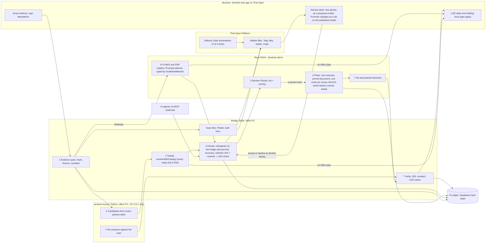
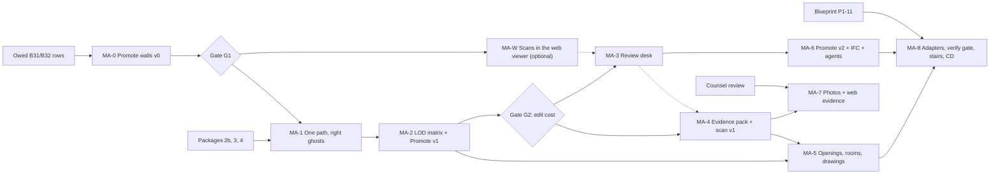

# Sentinel Model Automation: from any evidence to a governed DD model

Design for the founder. Date: 2026-09-30. Status: **proposal, not approved. Revision 2.** This revision fixes the critic's findings: 3 critical, 14 important, 7 minor and 11 missing items. Every fix was checked against the code. This design is read-only: nothing in the repo was changed.

**Sources (short names used below)**
- **[MKT]** `docs/research/2026-09-30-modelling-automation-market.md` (298 tools; on master, 6fb4941)
- **[R2M]** `docs/research/2026-09-30-reality-to-model.md` (on master, 6fb4941)
- **[S3D]** `docs/research/2026-09-30-scan-to-3d-catalogue.md` (on master, 6fb4941)
- **[TO]** `docs/research/2026-09-30-thatopen-libraries-for-modelling.md`
- **[AUD]** `docs/strategy/2026-09-30-revit-addin-audit.md` (§3.4 and the ids GHB-\*, MAS-\*, DAT-\*, ANV-\*, AI-\*, XC-\*, BOS-\*)
- **[SPEC]** `docs/superpowers/specs/2026-09-30-revit-addin-safe-honest-design.md` (packages 1–4)
- **[BP]** `docs/strategy/2026-09-29-sentinel-blueprint.md` §5
- **[SIM]** `docs/testing/SIMULATION_ROOM_RUN_2026-09-22.md` (drill rows)

**Labels for Sentinel facts**
- **BUILT**: in the code and run. "(live)" means it was run live in Revit or on the web.
- **PARTIAL**: in the code, but limited or not proven live.
- **MISSING**: not in the code.
- **TARGET**: proposed in this design.

Market facts come from the reports. I did not re-open their sources.

**Checked in code today (2026-09-30), on top of the reports**
- **Changesets.** The vocabulary is `wall, floor, level, grid`, with at most 200 elements (`WebApp/bridge/changesets-logic.mjs:9-10`). The bridge makes each element's `proposal_guid` itself and keeps only `kind`, `validate` and `place` (`changesets-logic.mjs:56-66`). Rows `changeset_proposed`, `changeset_applied` and `changeset_withdrawn` exist (`changesets-store.mjs`).
- **The changeset executor.** One Transaction per changeset. It rolls back on any failure and checks the commit (`ChangesetExecutor.cs:79`). Two problems:
  - an element with no type name gets the model's first wall or floor type (`:58`, `:67`);
  - walls get an unconnected height; with no top elevation, the top is base + 3000 mm (`:106`).
- **Typing is an exact catalogue match.** A near miss becomes a gap with the list of available types. The code says it does this so "a human picks", not the builder "snapping to a size" (`GuidelineMatcher.cs:132-133`; `guideline.ts:221`).
- **The bridge does no typing today.** It defines `resolveWithCatalog` (`sentinel-core.mjs:833`), but nothing in the bridge calls it. Only the TS tests call it.
- **The BDS pilot guideline.** It has 18 type rules, and all 18 are keyed on a DWG layer (`when.layer`). The matcher already accepts a rule with no layer and with `params` conditions (`guideline.ts:176-203`). The guideline also holds `views` and `viewNaming`. It has no rules for worksets, phases or design options.
- **The BDS type catalogue.** 1,434 types. Each row has only category, family, type, system, width, height and params. The params present: Assembly Code (164 types), Type Mark (155), Keynote (32), Fire Rating (7). There is no Function, no IsExternal and no thermal value.
- **Placeholder mode.** When no office type fits, Ghost placement can put a wall on a default type with the note "Retype before issue" (`ElementPlacementFactory.cs:218-226`). Photo Massing turns it on (`Commands.Massing.cs:77`, "LOD 100: default types, declared").
- **Artefacts and roles.** There are 11 artefact kinds (`artefact-store.mjs:12`). The roles are owner, lead, contributor and viewer (`artefact-store.mjs:69`, `requireMinRole`).
- **Project stages.** `tender, design, coord, constr, hand, oper` (`cde-store.mjs:130`). The stage gate is keyed on them.
- **Intake and IFC.** Governed Intake accepts `.ifc` files only (`intake-logic.mjs:13`). `ifc-extract.mjs` reads identity, psets and quantities. It reads no geometry.
- **Holding Area.** One timeline per container name. A `hold:gate|naming|ids` row opens it; a registration or a dismissal closes it (`holding-logic.mjs:1-12`).
- **Revit report route.** Only `naming` and `family_heal`. At most 20 writes per user per minute (60 in all), and 256 KB per row (`cde-store.mjs:1044-1058`). The changeset store has no such budget.
- **That Open in the web build.** When `.thatopen` says beta (it does), the build maps the stable package names to the beta packages (`vite.config.js:8-19`). `fragments-beta` 3.5.9 is installed. Only the bridge uses the stable fragments 3.4.7 (`ifc-to-frag.mjs`).
- **Revit add-in.** No DirectContext3D, no `DocumentChanged` subscription, no `ChangeTypeId` call. `SentinelUndo.Run(doc, name, body)` exists (`Engine/SentinelUndo.cs:11`). Extensible Storage is used (`Engine/SettingsManager.cs`, `Workflow/RequestStore.cs`). PdfPig is a dependency (`Sentinel.csproj:49`). The product has no Python code.
- **Database.** The last migration is 0036 (`WebApp/db/migrations/0036_platform_gate_run.sql`).
- **Founder PC.** Revit 2023, 2024, 2025, 2026 and 2027 are installed. The Sentinel add-in is registered for all five (2023–2027). The Revit 2024 add-ins folder also loads the community `mcp-servers-for-revit` and `revit_mcp_plugin`, which have `send_code_to_revit`. No ReCap was found under `C:/Program Files/Autodesk`. During this revision Revit was not running (only `RevitAccelerator.exe`); the critic saw it running earlier. The drill protocol checks each time.
- **Live finding from B31/B32** ([SIM], cda0b8c). In the workshared aster model, Revit empties the Undo list on view renames, also for a manual rename. "One Undo" cannot be promised for view actions. In sessions 2 and 3, Revit stopped taking mouse and keyboard input.

---

## Founder decisions (2026-09-30)

- **D1 order: Option C, "Foundations, then both"** (founder's choice).
- **D8 test data: the BDS template** (`Documents/BDS_Template_yazan.hKNTHU.rvt`, the office template the BDS catalogue came from) — MA-0 builds its concept model on a scratch copy of it.
- Every other decision (D2–D7, D9–D20) runs on this document's **recommended default** until the founder says otherwise: working name "Sentinel Build"; build the CPU geometry-first pipeline, partner for MEP; bridge-PC CPU by default; no web search for a building's DWG/PDF, counsel before MA-7; the licence policy in §6.10; "LOD 200 as found, never survey or permit grade"; That Open beta behind adapters with pinned versions; exact typing (no snapping); drills on Revit 2024 first.

## 0. The answer in one page

**What we build: one engine for every input.** Working name: **Sentinel Build** (the name is decision D2).
- **Any evidence goes in:** DWG, PDF, your own photos, licence-clean web photos, laser scans, concept models (Forma, Snaptrude, Hypar, TestFit, IFC, Revit masses) and proposals from AI agents. A text brief comes in only through an AI agent (section 4.6).
- **Each input becomes ghosts.** A ghost is one proposed element. It carries its evidence, its office type, its confidence, its LOD step and its reason.
- **The office standard types every ghost**, using `guideline@n`, `type_catalog@n` and `naming@n`.
  - Today the match must be exact. A near size becomes a named gap, not a guess (BUILT for DWG walls and floors).
  - Snapping to the nearest catalogue size would change that policy. It is your decision (D16). The default stays "exact".
  - When no office type fits, the ghost becomes a **named gap** in the Holding Area. Sentinel Build never invents a type.
- **A person ticks the ghosts.** Revit then places native elements in the right model, as one Undo per storey.
- **Sentinel checks what it placed.** It re-measures each element against its evidence, checks it against the IDS, the contract, the LOD matrix and your BLOCK rules, and writes a ledger receipt for every element.
- **The same engine promotes any model**, ours or anyone's, from concept to SD, DD and CD. It follows the office's **LOD matrix**.

**Ghost Builder, or something better? Something better, built from Ghost Builder.**
- **We keep Ghost Builder's back half** (wall pairing, the type engine, type provisioning, placement). It becomes the shared back half of the engine [R2M §6.1, §6.10]. We fix its known bugs first (section 2.4).
- **Its DWG reader becomes one of six input readers.** Photo Massing becomes the photo reader.
- **The word "ghost" becomes the name for every proposed element**, in Revit and on the web.
- **Ghost Builder does not simply grow into one bigger Revit command**, for two reasons:
  - The new work runs in four places: the web, the bridge, a local Python service and Revit.
  - Promote works on models that already exist, not on drawings.
- **We do not build a new detection engine to fight EdgeWise or aurivus.** Detection stays modest and honest. Our value is governance [R2M §6.1, §6.11].

**Why it wins**
- Many tools now make a concept fast and cheap. Almost none turn it into the office's own DD model with proof [MKT §2.10, §5].
- Five gaps are open (section 1.2).
- Sentinel already owns half of each gap:
  - typing from governed artefacts, with named gaps;
  - the IDS gate;
  - the human tick;
  - one Undo per action;
  - the hash-chained, multi-user ledger;
  - the web CDE on That Open [MKT §1.3; S3D §7.2].

**In one line.** Any tool can make a concept. Sentinel Build turns any evidence, or any concept, into your office's DD model. It is typed by your standard, checked before it lands, ticked by a person, and has a receipt for every element (adapted from [MKT §6.1]).

**What this design does not do, and why**
- **It does not search the internet for a building's DWGs or PDFs.** The research found this is not lawful as a default [R2M §4.1, §4.3]. Instead, Sentinel helps you **ask the owner**: a document request to the owner, the architect or the municipality, with a permission letter. The files then come in through Governed Intake (section 4.1).
- **"Any other asset" means buildings with planar elements in version 1.** Plant and MEP come in through EdgeWise and are re-typed. Roads, bridges and other infrastructure are out of scope [R2M §6.11]. This is decision D15.

**Names in the product (TARGET)**
- **In Revit**, a panel "Build" with four commands:
  - **Datum from Drawings**: kept; it is the first step of both modes.
  - **Build from Evidence**
  - **Promote to Stage**
  - **Review Ghosts**
- **On the web:** Evidence, Ghosts (the review desk) and LOD state.
- These replace the "Model from Drawings ▸ 1 · 2 · 2b · 3" pulldown step by step.

**First steps**
1. **MA-0 Promote walls v0** (2–3 weeks, one drill). Retype and attach generic walls in one concept model, on the existing changeset path. We measure the result, then you decide (gate G1). This is the first proof the market report asks for: "prove C5 Promote on walls only, on one real concept model" [MKT §7].
2. **MA-W (optional, 1–2 weeks):** your scans shown inside the web BIM viewer, for looking only [TO §7 #1].
3. **MA-1 Foundations.** One placement path, hosted doors and windows, walls from level to level, a provenance stamp and a ledger row on every modelling write.
4. **MA-2** the LOD matrix and Promote v1, then gate G2. Then **MA-3** the review desk and **MA-4** the first scan slice.

The whole plan (MA-0 to MA-8) is about 45–60 weeks of focused work for one builder. That is an estimate, not a measurement. Section 7 has the details.

---

## 1. What the market does and does not do

### 1.1 What the market already does well (we do not fight here)

| Area | State of the market | Source |
|---|---|---|
| DWG/PDF to LOD 200 | Crowded and cheap: WiseBIM $49/month, AmpliFY free, Nexar Plan £50/month, BIMify (AK Tools) free. Real accuracy is 60–85%, and every tool needs a human | [MKT §2.10 #2, §4.2] |
| LLM connected to Revit | Commodity: Horizun (123 tools, Apache-2.0, free), BIMwright (227 tools), mcp-servers-for-revit. Autodesk's own MCP server creates no walls, floors, rooms or levels | [MKT §2.8, §2.10 #1] |
| Photo to native model (agentic) | The September 2026 wave (Veras 5.2, Geopogo, HMK). The output is mostly massing or schematic. Approval steps are advice, not code | [MKT §2.2, §2.8, §2.10 #3] |
| Concept platforms | Forma, Hypar, Finch, Arcol and TestFit all stop at generic LOD 200. Finch's docs tell users to swap types by hand | [MKT §2.5, §2.10 #4] |
| Scan detection and MEP fitting | EdgeWise, aurivus and CloudWorx lead. Pipes, ducts and steel fitted to catalogues are mature | [R2M §2.2; S3D §4] |
| Viewing and streaming reality data | Solved (Cintoo, IVION, Potree) | [S3D §1] |

### 1.2 The five gaps nobody fills

1. **Office types, or a named gap.**
   - Today's tools use the user's pick, the vendor's types, size-named types (Undet `[Width]x[Height]mm`) or generic IFC.
   - No tool refuses to invent a type and parks the element with its evidence instead [S3D §7.1 #2; R2M §2.2].
2. **LOD progression as governed data.**
   - The "generic → office type" step is the heart of concept → DD.
   - Only Monta (BETA) and SWAPP (enterprise) attack it.
   - No product treats LOD as data per element.
   - Practitioners say "the 200 to 300 jump is where most issues start" [MKT §2.10 #5, §3.4 #9, §5 step 9].
3. **Fusion per element.** No shipping product combines scan, own photos, internet photos and DWG/PDF into native Revit elements typed to the office [R2M §2.3; S3D §7.1 #1].
4. **Provenance, confidence and accuracy per element, on an audit ledger.**
   - Only pieces exist: EdgeWise SmartSheet, Undet's tolerance parameter, Verity status, Horizun DWG stamps.
   - No tool delivers LOA per element.
   - No vendor publishes edit cost (how much people change afterwards) [S3D §5, §7.1 #3; MKT §4.2].
5. **A legal and ISO 19650 gate for the evidence.**
   - Nobody treats the scan package as an information container.
   - No "use online photos" demo shows a licence check [S3D §7.1 #4, #5; R2M §4].

Two smaller gaps also matter:
- An honest approval gate for AI edits (CHECKTOBUILD's agent edits on its own) [S3D §7.1 #7].
- Revit terrain from scans (there is no Toposolid path from a point cloud) [S3D §7.1 #6].

### 1.3 Closest competitors

| Tool | Close to us on | Lacks compared with Sentinel | Source |
|---|---|---|---|
| Monta AI | Promote: 1,200+ generic walls became DD types. It shows an assignment plan and flags ambiguity | BETA and sales-led. No multi-user ledger shown | [MKT §2.6] |
| SWAPP (Frank) | SD → CD in Revit. "Frank proposes, you approve" | Enterprise only | [MKT §2.6] |
| Horizun Revit MCP | Verified writes, ISO 19650 containers, IDS from LOIN, DWG provenance. Free, Apache-2.0 | Runs on one machine in one agent session. No multi-user identity, no hash-chained web ledger, no governance of types | [MKT §2.10 #6; S3D §7.6] |
| EdgeWise | The best per-element evidence; MEP | No office standards; the hand-off is export only | [S3D §7.6] |
| XGRIDS LCC for Revit | Splats plus LiDAR become native walls and doors | Locked to its own hardware. No office typing, no ledger | [S3D §7.6] |
| Veras 5.2 / Geopogo | Agentic photo to native model | Approvals are advice only; types must be loaded first | [MKT §2.2, §2.8] |

---

## 2. The engine: one pipeline for every input

### 2.1 Seven rules
1. **One path for every input:** evidence → candidates → typing → ghosts → review → place → verify → ledger.
2. **Geometry comes from measuring code, never from a language or vision model.** The measuring code reads scan points, drawing vectors or model geometry. AI may only choose from closed lists (brick, render, glass; internal or external) [R2M §1, §6.7].
   - An AI agent may propose a ghost. Its source is then "agent (claimed)": the bridge stores provenance as claimed and never verified (`agent-provenance.mjs`).
   - An agent ghost is never pre-ticked, and it is checked like any other.
3. **The bridge sets the trust fields, never the caller.** Pre-tick, accuracy status, confidence and "claimed" are computed by the bridge. A measured value counts only when it comes from a survey job the bridge ran itself (section 6.3).
4. **Office types, or a named gap.** The match is exact unless the office turns on snapping (D16). A new type or size is made only after a lead approves it (D13).
5. **Nothing lands without a person's tick.** Each storey is one Undo, in the pinned document. Exception: Revit may empty the Undo list after view actions (B31 finding). There the ledger row is the record, and the review window says so.
6. **Never an unmeasured pass.** Each element gets exactly one status:
   - from the market vocabulary [S3D §5]: `within_tolerance`, `out_of_tolerance`, `missing`, `insufficient_data` or `inferred`;
   - or `not_measured`, when there is no evidence to measure against. This one is Sentinel's addition.
   - MA-4d: a scan ghost's `within_tolerance` before placement is judged on its fit (each face's inlier points against its own line) and on `face_dev_mm` (how far the scanned faces' ends sit from the ghost's faces): `accuracy.basis: "fit"`; `verify:measured` (MA-4e) judges the placed element (`basis: "deviation"`). MA-4e BUILT: `verify:measured` judges each placed wall of a survey changeset as filed — the changeset's own geometry, which the executor places exactly, back in the scan's frame — against the job's own cloud: `within_tolerance` when p95 ≤ 20 mm (D7) with at least a quarter of its faces seen, else `out_of_tolerance`, `insufficient_data`, `missing` (no point within 400 mm) or `not_measured` (a level, a floor or ceiling, an Undo in Revit) — `basis: "deviation"`, `reference: "as filed"`. The ghost's pre-placement `accuracy` (basis fit) and its pre-tick are unchanged. MA-4f LANDED 2026-10-09 (drill MA4f-1: job-0003's created level opened ticked, its IDS-rejected walls and GR-FFL's unchecked walls unticked): Revit opens such a create ticked — `ChangesetTrust.PreTick`: claimed false, the bridge's pretick, `within_tolerance`, not rejected by the office IDS — so Revit ticks what the web desk calls pre-ticked, less what the IDS rejected; every claimed create still opens unticked; a person still clicks Apply.
7. **Every step writes a ledger row.** Binaries stay in the office; hashes and manifests go to the ledger [R2M §5.5].

### 2.2 The pipeline, and where each stage runs



### 2.3 Stage by stage

| Stage | What it does | Runs on | Today | Reuses |
|---|---|---|---|---|
| 1 Evidence | Drop files, sign attestations, hash each item, record licence and permission, confirm registration. Binaries stay on the office disk or NAS | Browser (drop, attest) and bridge (hash, manifest, rows) | MISSING for anything that is not IFC (Intake takes `.ifc` only). Ghost reads one local folder (`GhostEvidence.cs`): PARTIAL | Governed Intake, artefact store, ledger |
| 2 Candidates | One reader per input, geometry first. Output: measured candidates without types | DWG: Revit (Ghost reader). Vector PDF: PdfPig (.NET). Scans (later photos): sentinel-survey (Python). IFC: bridge. Existing models (Promote): Revit. Agents: MCP → bridge | DWG: BUILT for review; placement PARTIAL. IFC geometry: MISSING (`ifc-extract.mjs` reads no geometry). Everything else: MISSING | `WallPairing.cs`, `LayerMapper.cs`, `DatumFromDrawing.cs` |
| 3 Typing | Each candidate is resolved against `guideline@n` + `type_catalog@n` and named by `naming@n`. Exact match, or a gap row | Revit (`GuidelineMatcher`, C#) for DWG, PDF and Promote. Bridge (`resolveWithCatalog`, TS) for the survey, IFC and agent readers. Same rules, with conformance tests | **Exact match: BUILT in Revit, for DWG walls and floors, keyed on DWG layers.** Bridge typing: MISSING (no caller). Rules without a layer: the matcher accepts them, but no office rule is written that way yet. Snap within a tolerance: TARGET, a policy change (D16) | `guideline.ts:221`, `GuidelineMatcher.cs`, `NamingProposer.cs`, `GhostTypeCreator.cs` |
| 4 Ghosts | A changeset v2 (section 6.3). The bridge sets the trust fields. Every ghost is checked against the IDS, the contract and the LOD matrix before review. Ghosts that would break a BLOCK rule are marked | Bridge | BUILT: create for 8 kinds (wall, floor, level, grid; roof, ceiling, door, window since the MA-1 placement slice), retype for 6 (Promote v1), attach for walls (MA-0). v2, trust rules and BLOCK marks: TARGET | `changesets-logic.mjs`, IDS adjudication |
| 5 Review | A web review desk (That Open), and the Revit list with a ghost overlay. One state machine for both (section 6.6) | Browser and Revit | Revit tick list: BUILT (live). Overlay, web desk and shared states: MISSING | `ChangesetReviewWindow`, `GhostReviewWindow` |
| 6 Place | One executor. All changesets of one storey run in one call, as one Undo. Pinned document. BLOCK check before commit. A provenance stamp on each element | Revit | **One transaction per changeset, all-or-nothing, commit checked: BUILT (live).** Empty type name falls back to the first type: a bug, fixed in MA-0. Hosted doors and windows (the one wall under the point, else refused), flat footprint roofs and ceilings, Mark and Structural: BUILT (MA-1 placement slice; live: B35-0, owed). Per storey: LANDED in MA-2d (merge 2026-10-03), drill MA2d: P-1, A-1, U-1, S-1, AST-1 passed live on Revit 2024, G2 measured; owed: Revit 2026/2027, a second account's approval, the signed-out actor, W-1, a real concept model for G2 (one review window, one ExternalEvent, one TransactionGroup, one Undo). Level to level: MISSING. DocPin and `SentinelUndo`: BUILT (package 1, 4638d25; B31 partly passed live) | `ChangesetExecutor.cs`, `ElementPlacementFactory.cs` (after its fixes), provisioners, `DocPin.cs`, `SentinelUndo.cs` |
| 7 Verify | Re-read what was placed. Measure against the evidence that made it (see below). Check the IDS, the contract and the LOD matrix. Apply the Federation Gate at publish | Revit (re-read), service (deviation), bridge (IDS, LOD), platform (Delivery Gate) | IDS gate and Federation Gate: BUILT. Deviation: LANDED for the walls of a placed survey changeset, as filed (MA-4e, drill MA4e: `POST /cde/:key/verify`, `verify:measured`). Re-read: LANDED 2026-10-09 for the walls a survey changeset places (MA-4f, drill MA4f-1 on ma4c-drill: #2236 three walls re-read, #2237 measured `revit (claimed)`: `AppliedEntry.mesh` read after the commit, the add-in's claim; the bridge keeps its sha and two faces from a signed-in person's report, bounded by the filed wall, and verify measures by them — `reference: "revit (claimed)"`, the row `claimed: true`; a wall moved after Apply is not seen). LOD state: MISSING | Typed reads (package 2, merged 7271431), `ids.ts`, Federation Gate |
| 8 Ledger | A row for each step. Each changeset row carries its per-element entries | Supabase, through the bridge | Changeset rows: BUILT. Rows for the modelling commands: MISSING (XC-5) | `cde-store.mjs audit()` |

**What stage 7 measures against.** Each element is measured against the evidence that made it:
- a scan: 3D deviation;
- a drawing: 2D distance to the face lines;
- a photo: existence only, so geometry stays `not_measured`;
- an agent or a concept model with no evidence: `not_measured`.

### 2.4 Two placement paths become one, in a safe order
- **Today there are two paths:**
  - Ghost Builder places through `ElementPlacementFactory`, in one transaction with a failure handler.
  - AI proposals place through `ChangesetExecutor`.
- **Today the AI path is the honest one.** It fails the whole changeset on any error and checks the commit.
- **Ghost's path has known bugs** [AUD §3.4.5]:
  - family symbols are cached by name, and a missing symbol falls back to the first family of the category;
  - the failure handler erases warnings and deletes every failing element, not only this build's;
  - "Placed" is counted before the commit.
- **The order in MA-1:**
  1. Fix Ghost first: GHB-5, remove the symbol fallback, limit the failure handler to this build's elements.
  2. Only then move Ghost's typed creators under `ChangesetExecutor`. Ghost's reader files its ghosts as a changeset (source `dwg`).
  3. The executor's contract stays: all or nothing, and the commit is checked.
- **Result:** one ledger row format, one provenance stamp and one undo watcher. We delete a path instead of adding a third.
- **Drill row:** a merged-path changeset with one planted failing element leaves no elements and erases no warnings.

### 2.5 Where the office standard comes in

The founder asked for the model to be "tied to office's rule set or standards, revit model template guideline". This is where each part of that enters the engine.

| Artefact or rule | Used for | Today |
|---|---|---|
| `guideline@n` (Office Modelling Guideline) | Which type for which function, thickness and location; view set-up and view naming | BUILT. Rules without a layer since MA-2a (plan `docs/superpowers/plans/2026-10-03-ma2a-layer-free-rules-harvest-bridge-typing.md`): a rule may key on `Function`, `Location` (Exterior/Interior, from the storey's outer boundary) and `Material` in `when.params`; Promote, Ghost Builder and the bridge pass them; `demo/bds-pilot/bds-dd-layerfree-guideline.json` is the DRAFT DD file. The pilot's office guideline (`bds-guideline.json`) still keys every rule on a layer: a lead writes the layer-free ones |
| `type_catalog@n` (harvested from the office template by Build Office System; Aster: 1,239 types; BDS: 1,434) | The list of allowed types | BUILT. Since MA-2a a row keeps the type's `Function` (its enum name), `Material` (its Material parameter, else its build-up's layers), the type parameters the matrix will ask for (Fire Rating, Assembly Code, Type Mark, Keynote, Structural Material) and its `bic` (BuiltInCategory, BOS-5: the category is the English key its id names, the display name in `category_local`); a lead installs it from Revit's review window (BOS-3: Install catalogue on office). A type_catalog@1 from before reads as it did |
| `naming@n` | Names for levels, views and new-size proposals | BUILT |
| `layers@n` | CAD layers to categories | BUILT |
| `ruleset@n` | Scan Now rules. A BLOCK rule stops the sync | BUILT (BLOCK at sync: package 2, merged 7271431). Ghost batches are checked against it before commit (TARGET, MA-1) |
| `ids@n` and the contract | Required properties, checked before review | BUILT |
| `lod_matrix@n` | Stage targets for each element class, mapped to the project stages | BUILT: v0 (Promote v1: DD only, rows by Revit category); MA-2b: `stage_map` (D18's default when absent), `type_snap_mm` per row (0 = exact, D16), one TS reader (`sentinel-core/lod-matrix.ts`) and its C# twin pinned by `WebApp/bridge/fixtures/lod-matrix/cases.json`; lod numbers and stages other than DD: TARGET |
| `capture_rules@n` | How to scan (point spacing of 1 cm or less, no shadow areas, doors open) [S3D §7.3] | TARGET |
| Worksets, phase, design options for placed elements | Each placed element goes to the workset the guideline names for its category, in the view's phase. Never into a design option unless the person picks one | MISSING. TARGET: a `placement` block in `guideline@n` (MA-1) |
| Start from the office template | Build from Evidence runs only in a model whose types match the installed catalogue. Otherwise it says "this model was not made from the office template" | MISSING. TARGET (MA-1). The engine never loads an unknown family |
| View templates and browser organisation | Plans per story with the office templates (ANV-1..3), then sheets and tags for CD (ANV-4, ANV-5) | PARTIAL (the Annotate command creates views; [AUD] ANV-1..5). TARGET: ANV-1..2 in MA-2, ANV-3..5 in MA-8 |

**Two behaviour changes need your decision**
- **New sizes.** Today `GhostTypeCreator` makes a new size of an office type at placement time. In the engine this becomes a Holding Area row, "new size of office type X", and a lead approves it [R2M §6.7] (D13).
- **Snapping.** Today a 212 mm wall does not match a 200 mm type; it becomes a gap. Snapping to the nearest size within a tolerance is a new policy (D16). If you turn it on, the tolerance lives in `lod_matrix@n` (`type_snap_mm`, default 0). A snapped type is never pre-ticked when the snap is bigger than the measurement noise.

---

## 3. Promote: concept → SD → DD → CD

### 3.1 What it is
- **Promote is the second half of the same engine.**
- **Input:** any Revit model. Examples:
  - walls placed in **placeholder mode** by Ghost Builder or Photo Massing (they already say "Retype before issue"; `ElementPlacementFactory.cs:218-226`). This is the natural first input;
  - Sentinel's own "Build from Evidence" output;
  - a Forma Building Design export (generic families);
  - a Hypar load (HyparDoor placeholders);
  - a Finch or Snaptrude model;
  - a concept the office modelled by hand [MKT §2.5].
- **Output:** ghosts with an operation (`retype`, `attach`, `rehost`, `set_parameter`, `create`). They go through the same review, placement, verification and ledger.
- **The rule for each element comes from the office's `lod_matrix@n`** (example in section 6.5).

### 3.2 LOD state for each element (DD: BUILT in MA-2b — at DD, below, blocked or not measured; the other stages, LOD numbers, joins and openings: TARGET)
- **An element's LOD state** is the highest stage whose rules it passes. The rules for the other stages give the reasons.
- **The stages map to the project stages** Sentinel already has (`tender, design, coord, constr, hand, oper`). The mapping is a field in the matrix (section 6.5). Suggested default: concept, SD and DD → `design`; CD → `coord` (D18).
- **Example rules at DD:**
  - an office type from the catalogue;
  - a top constrained to the next story level;
  - clean joins (TARGET);
  - hosted openings (BUILT for doors and windows: their host; for walls TARGET);
  - the required properties filled (package 2's typed reads).
  - MA-2b reads a wall at DD on its type and top, a door or window on its type and host, and the properties through the DD IDS; a joins or openings rule in the matrix is refused today (plan MA-2b, S7).
- **The pane, the Next strip and the web show a line such as** "Level 3: 212 walls at LOD 200, 38 at 300, 14 blocked (reasons)" [MKT §6.3 C4]. BUILT (MA-2b) as the project-wide line "DD → design: 38 of 264 at DD (14%) · 212 below · 14 blocked · 0 not measured"; the per-level lines with reasons are in Promote's header and on the `lod_state` row (plan MA-2b, S2).
- **In the stage gate (blueprint P1-10),** LOD state becomes a named input of the `design` → `coord` gate: "share of elements at the DD row's LOD". Until it exists, that gate row reads "LOD state: not measured".

### 3.3 The operations, in order

| # | Operation | Revit API (from the reports) | From | Phase |
|---|---|---|---|---|
| 1 | Datum right: story levels flagged and pinned, one plan per story. View actions may empty Revit's Undo list (B31), so they run in their own batch. MA-2e: pinned and planned in Annotate (LANDED in MA-2e (merge 2026-10-04), drill MA2e: V-1, V-1R, U-1, V-2, V-3 passed live on Revit 2024; owed: Revit 2025-2027, the signed-out actor, a view that throws in its SubTransaction, an owned or out-of-date datum, a non-story level, pinning in a workshared copy); the flag is read, never set (DAT-2) | `ViewPlan.Create`, `Element.Pinned` | DAT-3, ANV-1, ANV-2 | MA-2 |
| 2 | Retype: generic → office type, by function, measured thickness, location and material. Rules without a layer and the Function in the catalogue harvest landed in MA-2a; location is read from the storey's own walls (`WallLocation`: one side open = outside, both enclosed = inside, else unknown — a reason to a person) | `Element.ChangeTypeId` | C5 [MKT §6.3] | MA-0 (walls), MA-2a (location, material) |
| 3 | Wall tops and bases to levels | `WALL_HEIGHT_TYPE`, `WALL_TOP_OFFSET`, `WALL_BASE_OFFSET` | GHB-2 | MA-0 (walls), MA-2 |
| 4 | Required properties through `set_parameter`. The value comes from the catalogue type, a cited spec clause or a person, never a guess. On the pilot data most DD properties have no source yet, so they go to a person. BUILT (MA-2c): a DD type the plan lands elements on whose matrix property is empty on the TYPE gets one `set_parameter` type edit when the catalogue row of exactly that type (`params`, by display name) or a whole-class clause of the installed `ids@n` (one exact value; a minimum is not one) gives it — the bridge checks both sources, refuses a filled value and writes its own record and the `validate` its referee judges; never pre-ticked (a type edit reaches every element on the type, and the review row says how many, counted in Revit). Otherwise the property goes to a person — no source, sources that disagree, no parameter Sentinel can write — and Promote counts it. A person types their own value in Revit; the web grid that files one is [BP] P2-7 | `FixInPlaceService.OnType` / `WriteOnType` (the same PsetMap table as Fix in Revit; stale guard, read-back) | [BP] P2-7 | MA-2 |
| 5 | Wall joins | `WallUtils.AllowWallJoinAtEnd` | GHB-6 | MA-5 |
| 6 | Openings: rehost unhosted doors and windows. Swap placeholder families (for example HyparDoor) for office families of the same size; otherwise a gap | `NewFamilyInstance` with a host | GHB-1 | MA-5 |
| 7 | Rooms from closed wall loops, named from the programme or the drawing text | `NewRoom` | C7 | MA-5 |
| 8 | Massing to shell: mass faces become typed walls, floors and roofs on each level. Spike: does `FaceWall` work on a DirectShape mass? | `FaceWall.Create`, `NewFootPrintRoof` | C6, MAS-2 | MA-6 |
| 9 | Curtain walls from a facade rule in the guideline | `Wall.Create` with a curtain type | C6 | MA-6 |
| 10 | Stairs and cores from rules (riser and tread tables, egress widths, stair types from the catalogue) | `StairsRun.CreateStraightRun` in a `StairsEditScope` | C8 | MA-8 |

### 3.4 One Promote run
1. **Read.** The add-in reads the facts of the model. They are pinned to the document.
2. **LOD state now.** Counts per level and class, with reasons. BUILT (MA-2b).
3. **Plan.** One ghost per change, each with its rule, source and reason. The plan is shown before anything runs. This is Monta's "assignment plan" pattern [MKT §2.6].
4. **Exceptions.** Anything ambiguous goes to the exception list and the Holding Area. It is never guessed. Example: when every concept wall has the same generic type, its Function tells nothing; since MA-2a the planner reads inside or outside from the storey's own walls (the outer boundary) and types by a Location rule — and a wall whose location cannot be read (both sides open, a curved wall, too few walls) goes to a person with that reason.
5. **Check.** An IDS for the target stage is made from the matrix and checked before commit. This is a new small function, `matrixToIds` (size S). It reuses `STANDARD_PSETS` and the IDS output shape from `ids-compile.mjs`. (`compileIds` itself reads prose, so it is not reused.) BUILT (MA-2b) for DD.
6. **BLOCK check.** Ghosts that would break a BLOCK rule of `ruleset@n` are marked. The review window says "this batch will block your sync: N elements".
7. **Review.** Pre-tick rules (the bridge computes them):
   - Only single-answer operations are pre-ticked: exactly one catalogue type, no conflict, no hosted element moved.
   - A ghost that breaks a BLOCK rule is never pre-ticked, unless the `set_parameter` rows that fix it are in the same batch.
   - The location line comes from the matrix.
   - The overlay shows the faces that will move.
8. **Place.** All changesets of one storey run in **one ExternalEvent call, inside `SentinelUndo.Run`**. This gives one Undo entry per storey. Each changeset still holds at most 200 elements and gets its own ledger row. If any changeset of the storey fails, the whole storey rolls back. Before commit, the add-in runs the BLOCK rules on the new state, and the person may go back. Revit warnings are counted and shown, never erased ([BP] P1-3, GHB-5). LANDED in MA-2d (merge 2026-10-03), drill MA2d: P-1, A-1, U-1, S-1, AST-1 passed live on Revit 2024, G2 measured; owed: Revit 2026/2027, a second account's approval, the signed-out actor, W-1, a real concept model for G2 (spec amendment S1: the storey runs in `ChangesetPlacementEvent.RunChecked`'s own TransactionGroup, which follows `SentinelUndo.Run`'s contract — kept only when Assimilate commits, rolled back on every other path).
9. **Re-read.** Type, level, host and properties are compared with the plan. A mismatch becomes a row.
10. **LOD state after**, plus a ledger row. An Undo of the storey posts `changeset_reverted` rows (AI-3). BUILT (MA-2b) for each applied Promote storey (MA-2d, spec amendment S5: one row naming every changeset id the bridge took as applied); an Undo after it makes that row "not measured" until Promote runs again.

Example: the Level 3 line above has 264 walls. That is two changesets (200 + 64), two ledger rows, and one Undo entry.

### 3.5 What Promote does not do (the honest ceiling)
- **It does not design.** It makes no fire strategy and no structural scheme. The market has no architecture → structure generator outside China [MKT §2.7].
- **It does not invent types or values.**
- **"LOD 300" in Sentinel means only that the matrix rules pass.** It is not a design approval.
- **On a concept model with no evidence, geometry is `not_measured`.**
- **Its output is only as good as your standards data.** With today's BDS catalogue, most DD properties (for example thermal values) have no source. Promote will list them for a person. It will not claim an IDS gain it cannot give.

### 3.6 Why Promote comes early
- **It is the least-served step.** It is deterministic, so the AI risk is low, and it reuses what exists [MKT §7 Option A].
- **It is also the "governed re-typer" for anyone's output.** [R2M §7] calls that "the cheapest proof that governance is the product".
- **The market report says to start small:** "prove C5 Promote on walls only, on one real concept model" [MKT §7]. That is MA-0.

---

## 4. Inputs, one by one

### 4.1 DWG and PDF drawings

**Today**
- **Datum from Drawings: BUILT (live).** SIM 3.9 gave 11 grids and 14 levels (`Commands.Datum.cs`, `GhostBuilder/DatumFromDrawing.cs`, `DatumBuilder.cs`). Limits:
  - the layer words are hard-coded;
  - the lowest line becomes ±0.00;
  - only orthogonal grids are read;
  - it is all or nothing [AUD §3.4.4].
- **Ghost Builder (DWG): PARTIAL** (`Commands.GhostBuilder.cs`, `WallPairing.cs`, `GhostWallPairer.cs`, `LayerMapper.cs`, `GuidelineMatcher.cs`, `ElementPlacementFactory.cs`).
  - Review and layer mapping are proven live.
  - Placement last ran live on 2026-07-26.
  - Doors and windows are placed unhosted and have never been placed live.
  - Walls are 10 ft high.
  - "Placed" is counted before commit.
  - It writes no ledger row [AUD §3.4.5].
- **PDF:** read as text only (`GhostEvidence.cs`). Vector PDF: MISSING.
- **Revision update:** MISSING.

**Target**
- **Ghost fixes:** GHB-1..6.
- **Datum fixes:** DAT-1..5.
- **Vector PDF reader (C9):** PDF paths become lines; scale is read from a dimension or scale bar; the title block is cropped; each element gets a confidence [MKT §6.3].
- **Drawing alignment to a scan:** a 2-point similarity fit, confirmed by a person [R2M §3.1].
- **Revision update (C13):**
  - compare revision A with revision B;
  - protect manual edits, using the provenance stamp;
  - never delete automatically [MKT §6.3].
- **DXF outside Revit:** ezdxf (MIT) can also read DXF in the service. DWG stays in Revit, because LibreDWG is GPL [R2M §5.2, §5.3].
- **Drawings "found for the building": ask the owner (TARGET, MA-4, size S).** Sentinel does not search the web for drawings [R2M §4.1, §4.3]. Instead:
  - it drafts a document request to the owner, the architect or the municipality, with a permission letter;
  - you send it yourself;
  - the files come back through Governed Intake, with the permission as an attestation on the evidence pack.

**Reuse.** The layer tiers and `layers@n`, `WallPairing`, and the type engine.

**Buy or partner**
- **Raster and scanned plans (C10):** go through a partner API (WiseBIM, AmpliFY), or do not offer them.
- **Open models only with commercial licences.** CubiCasa5k is CC BY-NC [MKT §6.3; R2M §5.3].
- **Before C13,** read Horizun's DWG-to-BIM contract (Apache-2.0) [MKT §6.3].

### 4.2 Photos (your own)

**Today: Photo Massing is PARTIAL** (`Commands.Massing.cs`, `MassingPlanner.cs`, `MassingVisionReader.cs`, `LocalVisionReader.cs`, llava via Ollama).
- It builds a rectangle from four numbers, on placeholder types.
- F46: four photos of a 38-storey tower gave 23 storeys and a 2 m footprint.
- It creates no levels, places openings unhosted and writes no ledger row [AUD §3.4.6; MKT §1.1].

**Target**
- **Short term:**
  - MAS-1..4: one storey per story level, a Mass DirectShape first, a footprint pick, one build per click.
  - C14: multi-view, one known dimension, and every field marked observed or inferred.
- **Long term:**
  - posed photos, starting with E57 panoramas;
  - own photos through COLMAP + TEASER++ + Open3D ICP, or the `map-anything-apache` weights;
  - Grounding DINO + SAM 2 to confirm openings;
  - Qwen3-VL (local, through Ollama) for closed-list attributes;
  - faces and number plates blurred on ingest [R2M §3.8, §7 P4].
- **Photos never create an element alone.** They confirm a ghost or choose between catalogue types [R2M §6.6].
- **Splats on the web.** Photos can appear as splats in the BIM viewer (SplatLoader). They are for looking only; dimensions come from scans [TO §5.2].
  - The splats are made by **gsplat (Apache-2.0)** [S3D §6]. The common Inria 3DGS trainer is banned (non-commercial).
  - Training runs on the office PC's RTX 4060, or on a cloud GPU only when a client opts in (D4).
  - The converter drops some colour detail (SH), and splats have no true scale [TO §6].
  - Each `build:run` receipt lists gsplat and its licence.

**Reuse.** The `LocalVisionReader` pattern and Ollama.

**Buy.** Nothing is needed. Photo geometry is about twice as bad as laser: 0.120 m RMSE against 0.070 m [R2M §3.8].

### 4.3 Scans (point clouds)

**Today**
- **In Revit: MISSING.**
- **On the web: PARTIAL, viewing only.** A separate reality-capture viewer (`reality-capture-viewer.ts`):
  - loads only `3tz`;
  - makes one signed call per tile (`hidden-tiles-plugin.ts:81`);
  - is reachable only from the files list [TO §1].
- **ReCap is not installed on the founder PC.**

**Target: sentinel-survey (section 6.9)**
- **v0.1 (MA-4c) is numpy and the Python standard library only, reading plain LAS 1.2–1.4** (nothing downloaded; Open3D dropped, MA-4a decision 5). laspy and pye57 (E57, LAZ, the CRS) come with MA-4g's download OK; PDAL, COPC, TEASER++, COLMAP and the detection models wait for a packaging spike in MA-7. MA-4g LANDED 2026-10-10 (drill MA4g on ma4c-drill: ev-0004 LAZ #2242 and ev-0005 E57 #2244 admitted, job-0004 #2245 read LAS, a plain-LAS .laz, a LAZ with its CRS and a two-scan E57, proposed #2251) — BUILT (plan `docs/superpowers/plans/2026-10-09-ma4g-e57-laz.md`): sentinel-survey 0.2.0 picks the reader from the bytes — a LAZ with laspy 2.7.0 and lazrs 0.8.2 (the same points as its LAS), an E57 with pye57 0.4.19 (every scan through its pose; cartesian points; its XML checked with struct before Xerces-C parses it) — each library imported only inside its read, so a plain LAS stays numpy-only and a PC without the wheels refuses a LAZ or an E57 in words. The four wheels are installed offline into a private folder (`%APPDATA%\Sentinel\survey-lib`, pip --target; the shared user site untouched) from `survey/requirements-ma4g.txt` (pinned by sha256; a wheel at another version is refused in words). The CRS (WKT or GeoTIFF keys in the VLRs and EVLRs; an E57's coordinateMetadata) is read with struct and recorded per input on the receipt by EPSG code, unit and sha256 (never its name: the file's free text), never applied; a CRS in degrees or not in metres is refused; one job reads one declared CRS. The computed frame is MA-4g-3.
- Storeys come from a height histogram.
- Walls come from density slices. The face segments use the shape `WallPairing` already takes.
- Floors and ceilings.
- Openings from wall-plane occupancy (MA-5).
- BUILT in MA-4c: storeys, walls (faces in a mid-storey slice, paired by WallPairing's rule ported to Python — a wall candidate is the paired centreline and thickness, its faces in `geometry.faces`; MA-4c spec amendment S3 settles :449 against :459, Cloud2BIM's start, end and thickness), floors and ceilings (oriented rectangles), as untyped candidates in the contract's keys, the scan's own frame.
- Deviation per element at 5, 10 and 20 cm [R2M §6.4] — MA-4e (`POST /measure`), not v0.1. BUILT in MA-4e for walls: p95, the signed mean, coverage and the shares within 50 / 100 / 200 mm of the job's own cloud (numpy).
- **In Revit:** a decimated overlay drawn with DirectContext3D. An RCP is linked only when the user has ReCap [R2M §5.1, §8.6]. MA-4f LANDED 2026-10-09 (drill MA4f-2 on ma4c-drill: 4502 of 11 362 points as cyan crosses on job-0003's GR-FFL ghosts, in 3D and in the plan, staying over the walls after Apply #2238): sentinel-survey `POST /cloud` re-reads the job's own cloud from its row, cut to a changeset's walls' height less 300 mm at the floor and ceiling, one point per 100 mm cube (doubled until at most 5 000); the bridge moves it into the model's frame (`GET /changesets/:key/:id/scan`, a signed-in contributor, no row); **Show the scan** in Review AI Proposals draws it as cyan crosses (DirectContext3D: 3D, plans, sections) until unticked or closed. Nothing enters the model.
- **On the web: one tiling path.** The bridge builds Potree tiles with `realityCapture` (behind an adapter) and uploads them to hidden files in batches. The viewer is `PointCloudLoader` [TO §7.1].
  - We do **not** use the `PointCloudConverter` automation, although [TO §7 #1] suggests it. A project can have at most 3 automations, and the Delivery Gate already uses 2 [TO §6]. The last slot stays free.

**Reuse**
- Cloud2BIM describes walls with the same start, end and thickness shape as `WallPairing` [R2M §6.1].
- `resolveWithCatalog`, once the bridge calls it (MA-4).
- three-mesh-bvh and `realityCapture.streamLasPoints` for evidence scores. Both are already installed [TO §5.2 #6].

**Buy or partner**
- **MEP and steel:** import EdgeWise output and re-type it (Lite costs $1,995/year) [MKT §2.3; R2M §3.6].
- **Detection:** aurivus is optional.
- **Benchmarks:** Cloud2BIM (MIT) and thescantobim (USD 29 per scan) [S3D §7.5].
- **Registration:** accept registered E57 or RCP with its registration report. Do not build registration [S3D §7.3].

**Honest ceiling**
- Wall 3D-IoU is 31% on a real benchmark.
- Closed doors look like walls.
- Stairs are mostly manual [R2M §3.3–3.7; S3D §4].
- **Default promise:** LOD 200 as found. Never survey grade or permit grade [R2M §3.9].

**"Any other asset" (D15)**
- Version 1 covers buildings with planar elements.
- Plant and MEP come in through EdgeWise and are re-typed.
- Infrastructure is out of scope [R2M §6.11].
- Terrain to Toposolid is a later spike (MA-8).

### 4.4 Web evidence

**Today: MISSING.**

**Target (after counsel)**
- **GREEN, fetched automatically:** OSM, Overture and Microsoft footprints; Copernicus; Mapillary (after a person accepts its commercial terms once); KartaView; Panoramax.
- **AMBER, admitted photo by photo by a person:** Wikimedia Commons; Flickr photos with a commercial CC licence; Openverse (discovery only); web leads from Claude web search on allowed domains.
- **RED, blocked:** Google Maps, Street View, Earth and 3D Tiles; Apple Maps; Azure/Bing imagery; permit and planning drawings (unless the owner uploads them with permission) [R2M §4.2].
- **No web search for a building's drawings** [R2M §4.1]. Use "ask the owner" (section 4.1).
- **Rules for every item:**
  - an owner attestation before any search;
  - a licence record for each item and a snapshot of the terms;
  - a `delete_by` job;
  - a NOTICE file for each model;
  - a robots and TDM opt-out check;
  - imagery is never embedded in the RVT or the IFC [R2M §4.5, §4.6].

**Role.** Context only, flagged "assumed". Footprints seed the outline where the scan has no coverage [R2M §6.6].

**Note.** No mainstream image search API is open to new customers: Google's custom search is closed, Bing was retired, and Brave allows only transient storage [R2M §4.1].

**Buy.** Nothing. Claude web search costs USD 10 per 1,000 searches [R2M §4.1].

### 4.5 Concept and massing models

**Today: MISSING.**
- There is no import of Forma, Snaptrude or Hypar.
- Photo Massing's box is the only massing.
- Review AI Proposals takes JSON only.

**Target**
- **Revit models with generic types** (a Forma Building Design export, Hypar, Finch, Snaptrude, TestFit, or a hand-made concept) are promoted directly in Revit.
- **Revit masses, and MAS-2 DirectShape masses,** go through massing to shell (C6), with `FaceWall.Create` and a spike on DirectShape masses.
- **IFC concepts: MISSING, and more work than it looks.**
  - `ifc-extract.mjs` reads properties, not geometry.
  - An IFC element cannot be re-typed in place in Revit. Opening an IFC in Revit reportedly gives DirectShapes [R2M §5.1, UNKNOWN]. So an IFC must be **re-created natively** from its geometry.
  - New work item: an **IFC geometry reader** on the bridge (size M, MA-6). It reads wall axis and thickness from `IfcWallStandardCase` and its material layer set, and slab outlines. Anything else becomes a gap. Its output is `create` ghosts.
  - That Open's `OBC.Modeling` recipe readers (`wallsOf`, `slabsOf`) are a spike only [TO §2.1].
- **Re-imports:** Hypar reloads overwrite earlier loads, and Forma is one-way [MKT §2.5, §5 step 15]. Sentinel's provenance stamp protects manual edits when a model is imported again.

**Buy or partner.** None; formats only. A Forma Building Design test export needs the founder's licence (D8).

### 4.6 AI agents and text briefs

**Today**
- **`sentinel_propose_changeset` is BUILT (live 2026-08-07; passed in SIM):**
  - `wall`, `floor`, `level` and `grid`, at most 200 per changeset;
  - IDS adjudication;
  - ledger rows `changeset_proposed`, `changeset_applied` and `changeset_withdrawn`.
- **Provenance is claimed, never verified** (`agent-provenance.mjs`).
- **There is no preview,** and an Undo leaves the record saying "applied" (AI-3) [AUD §3.1.8].

**Target**
- **Vocabulary v2:** hosted door and window, opening, room, ceiling, column, beam, roof, curtain wall, stair by type.
- **New operations:** `retype`, `set_parameter`, `attach`, `rehost`.
- **Large batches** are split per storey.
- **The trust boundary (critical).** `POST /changesets` is the public path for agents. So:
  - the bridge computes pre-tick, accuracy status, confidence and "claimed";
  - if a caller sends them, the bridge ignores them and says so in the reply;
  - measured values count only when they name a survey job the bridge ran, and they match that job's stored result;
  - a test proves it: an agent that posts `pretick: true` and `within_tolerance` gets a ghost that is not pre-ticked and is `not_measured`.
- **Verified writes** [MKT §6.3 C3; §4.1 on Horizun]:
  1. check before commit (IDS, contract, LOD, BLOCK);
  2. apply;
  3. re-read;
  4. report.
- **New read tools:** `sentinel_lod_state` and `sentinel_build_status`.
- **Agents in the web app** reach it through `channel.external()`; Ask Sentinel already does this [TO §5.3].
- **`OBC.Modeling`'s `toolRegistry` (279 commands)** becomes agent tools only after a spike and That Open's answer [TO §7].
- **Text and briefs** ([MKT §2.4]): no separate reader. A brief enters only through an agent. The agent reads the brief and proposes ghosts. They are "agent (claimed)", never pre-ticked, and typed by the office rules like any other ghost.

**Never.** A `send_code` tool, autonomous writes, or code generated at run time. [MKT §4.1] notes that Sentinel does not do this, "which is good".

**Watch Horizun (free).** Sentinel's edge is multi-user identity, the web CDE, LOD state and approvals across people [MKT §6.3].

---

## 5. Where That Open fits

**The rule [TO §4]:**
- The browser shows and decides.
- The processing service computes.
- Revit creates the native elements a person ticked.
- The platform stores files and triggers jobs.
- The ledger records every step.

**A correction.** The web build maps the stable package names to the beta packages (`vite.config.js:8-19`). So every browser piece below runs as **BETA in Sentinel's build**, even when [TO] calls it stable. Only the bridge uses stable fragments 3.4.7. Each piece sits behind its own adapter file, with a pinned version.

| Piece | Status in Sentinel | Used for | Phase |
|---|---|---|---|
| **Browser:** `PointCloudLoader` (needs `potree-core`, already in `package.json`) | BETA | The scan in the BIM scene, cut by the same section as the model | MA-W or MA-3 |
| `SplatLoader` | BETA | Photo splats as visual evidence; the placement matrix goes on the ledger | MA-7 |
| Fragments `Editor` + `GeometryEngine` | BETA in the web build (fragments-beta 3.5.9); STABLE 3.4.7 only on the bridge | The proposal layer: new ghosts as a separate model; accept or decline each one | MA-3 |
| `Clipper`, `Views`, `getSection`, `ClipStyler` | BETA in the web build (already used) | Storey cuts: drawing vs ghost vs scan slice | MA-3 |
| `Collider.find` against a scan mesh | BETA (used for clash today) | A deviation cross-check | MA-8 |
| `IDSSpecifications` | BETA | A cross-check only. Sentinel's `ids.ts` stays the judge | MA-3 |
| `BCFTopics` | BETA | A declined ghost becomes a BCF export; Supabase stays the truth | MA-5 |
| `@thatopen/ui` `Table` | STABLE | The review queue | MA-3 |
| **Bridge:** `realityCapture` (`openE57`, `streamLasPoints`, `buildPotreeOctree`) | BETA (import it from its own `dist/realityCapture` entry) | Read points; build the viewer tiles (the one tiling path) | MA-W or MA-4 |
| Own `ifc-writer.ts`, then web-ifc write (`CreateModel`, `setPropertySets`) | Own code; web-ifc STABLE (MPL-2.0) | IFC of the new ghosts, with a `Sentinel_Evidence` pset on each. Keep the own writer while elements stay simple [TO §7 #4] | MA-3 |
| `IfcImporter` | STABLE (bridge, already used) | IFC to `.frag` | MA-3 |
| **Platform:** hidden files (`createHiddenFilesBatch`), `getHiddenFileSignedUrlsBatch` (100 per call) | STABLE | Evidence crops and tiles. This also fixes the one-call-per-tile pattern | MA-W or MA-3 |
| `PointCloudConverter` automation | **Not used** | At most 3 automations per project, and the Delivery Gate uses 2 [TO §6]. Tiles are built on the bridge | — |
| `ProjectManager` `crs` and `assetCoordinates` | STABLE | One coordinate frame for scan, splats and IFC | MA-4 |
| `GitHistoryManager` | STABLE | Colours showing what a revision adds, changes or removes | MA-5 |
| **Spike only:** `OBC.Modeling` (14 families, `TypeRegistry`, `CommandLog`, `toolRegistry` with 279 commands, `checkCall`, `wallsOf`/`slabsOf`) | BETA, UNDOC | Ask That Open first. It does not replace the Revit path | spike in MA-6 |

**Stays in Revit**
- native element creation;
- DWG reading (Revit's own import);
- type provisioning;
- hosting, joins, rooms, roofs and stairs;
- the ghost overlay (DirectContext3D);
- the final tick;
- the re-read after placement.

**Do not** [TO §6, §7]
- Run the pipeline in cloud components. They run once, allow 20 calls a minute, and a project has at most 3 automations.
- Load raw points in the browser (about 38 bytes per point).
- Use That Open's Flow add-in instead of Sentinel's path.
- Use a beta piece without its own adapter file and a pinned version.

**Retire**
- The web "Modeling studio" (`model-panel.ts`: three.js boxes, saved to localStorage, skips Governed Intake).
- The separate scan viewer, once the loaders work [TO §1].

**Questions for That Open that block phases** (from [TO §7], plus one of ours)
- #2: the beta licence, in writing.
- #4: do the loaders work in the published frame? (Blocks MA-W.)
- #5: can the converters take E57 and LAZ, and keep SH in splats?
- #1: what are the plans for `OBC.Modeling`?
- **Ours:** is the fragments `Editor` API the same in fragments-beta 3.5.9 as in stable 3.4.7? We also test this ourselves in a one-hour spike at the start of MA-3.

---

## 6. Architecture and data model

### 6.1 Components and where they run

| Component | Runs on | New or existing |
|---|---|---|
| Web app: review desk, evidence drop, attestations, LOD state | Browser, inside the That Open platform frame | Existing app; new panels |
| Bridge (Node) | Office PC today (reached through Funnel) | Existing; new routes |
| sentinel-survey (Python) | Office PC; listens on 127.0.0.1 only; CPU first | New |
| Vector PDF reader (PdfPig) | Revit add-in, or a small .NET worker next to the bridge (decided in the MA-5 plan) | New code on an existing dependency |
| Revit add-in | Drills on Revit 2024. The add-in is registered for 2023–2027 on the founder PC | Existing; new operations, overlay, stamp, watcher |
| That Open Platform | Cloud | Existing; storage, Delivery Gate automations |
| Ledger | Supabase | Existing; new row kinds |
| Local models | Ollama on the office PC (qwen2.5 and llava today; Qwen3-VL later) | Existing |

**Hosting note.**
- [BP] P2-0 moves the bridge off the founder PC.
- Scans and evidence must stay in the office.
- After P2-0, sentinel-survey and evidence hashing run as an **office worker** that pulls jobs from the hosted bridge (D11).

### 6.2 Evidence pack manifest (TARGET)

An immutable, versioned manifest, stored as an `evidence_pack` artefact. The binaries stay at `storage_root`. The full field list for each item is in [R2M §4.5, §6.3].

It is not the audit pack (`GET /cde/:key/audit-pack`), which is the Kitemark export.

```json
{
  "kind": "evidence_pack",
  "pack_id": "evp-0001",
  "project": "aster-tower",
  "asset": { "name": "Aster Tower", "type": "building", "jurisdiction": "JO", "crs": "EPSG:<code>" },
  "storage_root": "//office-nas/sentinel/evidence/aster-tower",
  "attestations": [
    { "id": "att-0001", "code": "a", "by": "user:<email>", "role": "lead", "at": "2026-10-02T09:00Z" },
    { "id": "att-0002", "code": "b", "by": "user:<email>", "role": "lead", "at": "2026-10-02T09:01Z" }
  ],
  "items": [
    { "id": "ev-0001", "kind": "scan", "format": "e57", "sha256": "<64 hex>", "path": "scans/L00-L03.e57",
      "provider": "own", "licence": "owner-supplied", "attestation_id": "att-0001",
      "allowed_uses": { "view_reference": true, "geometry_extraction": true, "texture_embed": false, "redistribute": false, "ml_training": false },
      "registration": { "method": "registered in source, report attached", "report_sha256": "<64 hex>", "rmse_mm": 4, "confirmed_by": "user:<email>" } },
    { "id": "ev-0003", "kind": "drawing", "format": "pdf", "sha256": "<64 hex>", "path": "drawings/A-101.pdf", "pages": [1],
      "provider": "owner", "request_id": "req-0002", "attestation_id": "att-0002",
      "registration": { "method": "2-point similarity", "rmse_mm": 11, "confirmed_by": "user:<email>" } },
    { "id": "ev-0007", "kind": "photo", "format": "jpg", "sha256": "<64 hex>", "path": "web/commons-0007.jpg",
      "provider": "wikimedia-commons", "source_url": "https://commons.wikimedia.org/wiki/File:<name>",
      "retrieved_at": "2026-10-02T09:14Z", "terms_version_date": "2026-10-02", "licence": "CC-BY-SA-4.0",
      "attribution_text": "Photo: <author>, CC BY-SA 4.0", "freedom_of_panorama": false,
      "faces_plates_blurred": true, "delete_by": null, "role": "context", "admitted_by": "user:<email>" }
  ]
}
```

**Rules for the manifest**
- The pack refuses an item whose sha256 has changed.
- `texture_embed` and `redistribute` are always false, by policy [R2M §6.3].
- `request_id` links a drawing to its "ask the owner" request (BUILT in MA-4b: a drawing names (a) and (b) in `attestation_ids`; no registration — drawing alignment by 2 points is MA-5).
- MA-4a items carry `attestation_ids` (the codes their kind needs: a scan (a) and (c), a photo (a), (c) and (d)) in place of one `attestation_id`; `licence` is stamped `owner-supplied` for own items (a body's is not read); `rmse_mm` comes from a registered scan's report (MA-4g reads E57; its report's rmse is MA-4g-3's; sentinel-survey does not register — §4.3 "Do not build registration"). MA-4g reads E57 and the CRS; the report's rmse is typed and shown with the computed frame (MA-4g-3).

### 6.3 Ghost (proposal) contract v2 (TARGET)

**Backward compatible.** Contract 1 has no `op`, so `op` defaults to `create`. The existing required fields stay (`name`, `kind`, `place`, `validate.identity.Class`). For ops other than `create`, `place` becomes optional.

**Field changes** (the changeset parity is `PLACE_KEPT`, `changesets-logic.mjs`, name for name with the add-in's `PlaceDto`, and the shared fixtures `WebApp/bridge/fixtures/changeset-ops/*.json` that vitest and `tools/promote-check` both read — `contract-parity.test.mjs` pins the delivery gate):
- New place fields: `BaseLevel`, `TopLevel` (v1 has `LevelName`, `BaseElevation`, `TopElevation`; they stay).
- New fields: `op`, `target`, `cid`, `measured`, `evidence`, `reason`, `source.job_id`.
- Without these entries the bridge would drop the new fields silently, because it keeps only `kind`, `validate` and `place` today.

**What a reader or agent posts** (`POST /changesets/:key`):

```json
{
  "name": "Aster L02 walls from scan",
  "contract": 2,
  "source": { "reader": "sentinel-survey 0.1", "job_id": "job-0042" },
  "elements": [
    {
      "op": "create",
      "kind": "wall",
      "cid": "scan-L02-wall-88",
      "place": { "LocationCurve": { "start": [0, 0, 0], "end": [8420, 0, 0] }, "BaseLevel": "L02", "TopLevel": "L03" },
      "measured": { "thickness_mm": 203, "height_mm": 3050 },
      "evidence": ["ev-0001#slice-L02", "ev-0003#p1-r12", "ev-0007#crop-3"],
      "reason": "scan wall L02 #88",
      "validate": { "identity": { "Class": "IfcWall" } }
    },
    {
      "op": "retype",
      "kind": "wall",
      "target": { "unique_id": "<Revit UniqueId>" },
      "reason": "lod_matrix DD row IfcWall/internal needs an office type",
      "validate": { "identity": { "Class": "IfcWall" } }
    }
  ]
}
```

**What the bridge adds, never taken from the body:**

```json
{
  "proposal_guid": "<made by the bridge>",
  "typing": { "type": "EXT-200-Brick", "source": "catalog", "rule": "guideline@7 wall.external.masonry",
              "match": "snapped", "delta_mm": 3, "snap_limit_mm": 15,
              "guideline_sha": "<sha>", "catalog_sha": "<sha>" },
  "lod": { "stage": "DD", "project_stage": "design", "from": null, "to": 200, "matrix_sha": "<sha>" },
  "won": { "geometry": "scan", "exists": "scan", "type": "catalog", "material": "photo" },
  "accuracy": { "from_job": "job-0042", "fit_rmse_mm": 4, "p95_mm": 14, "share_within_50mm": 0.98, "target_mm": 20, "status": "within_tolerance" },
  "confidence": { "geometry": 0.92, "type": 0.80, "basis": "scan-backed, rule-typed" },
  "block_check": { "breaks": [] },
  "conflicts": [],
  "claimed": false,
  "pretick": true
}
```

The type names above are examples only. **Read the typing example carefully:**
- Under today's rule (exact match), a 203 mm wall does not match a 200 mm type. It becomes a gap.
- Only if you turn on snapping (D16) with a 15 mm limit does it snap to 200 mm.
- It may be pre-ticked only because the 3 mm snap is within the 4 mm fit noise. A 12 mm snap would not be pre-ticked.

**Trust rules (the bridge enforces them)**
- `pretick`, `accuracy`, `confidence`, `typing`, `claimed` and `proposal_guid` in a posted body are ignored. The reply lists them as "ignored: set by the bridge".
- `measured` counts only when `source.job_id` names a survey job the bridge ran, and the values match that job's stored result. Otherwise the bridge drops them, sets `accuracy.status: not_measured`, and marks the source "claimed".
- The reader's own id travels as `cid` and in `evidence`. The bridge keeps making `proposal_guid`.
- MA-4d spec amendment S1 (trust): `measured` counts only on a changeset the bridge builds itself from a survey job it trusts — `POST /cde/:key/build/jobs/:id/propose`: the job's own `build:run` row by MA-4c decision 11's predicate, `result.json` re-hashed against it, every scan it read still the admitted bytes; the elements are the job's candidates (trimmed, then moved by the lead's frame), so a trusted measurement cannot travel with other geometry. A body that names `source.job_id` backs nothing (listed: "a job named in a body backs nothing — …"); an agent's post is never measured. A third-party reader's job-backed post (bound to the candidates by cid) is later.

**Operations**

| `op` | What it does |
|---|---|
| `create` | A new element |
| `retype` | Change to an office type from the catalogue |
| `attach` | Set the base and top levels |
| `rehost` | Put an opening into its host wall |
| `set_parameter` | Write a value from a cited source (shared with [BP] P2-7) |
| `create_room` | A room from a closed loop |

**Pre-tick rule.** The bridge pre-ticks a ghost only when all of these hold [R2M §6.8]:
1. Its geometry is backed by evidence and within tolerance, or it is a single-answer Promote operation.
2. Its type comes from the catalogue by rule. If the type was snapped, the snap is within the measurement noise.
3. It has no conflict.
4. It breaks no BLOCK rule, or the `set_parameter` rows that fix it are in the same batch.

Agent ghosts and drawing-only ghosts are never pre-ticked.

MA-4d (LANDED 2026-10-09, drill MA4d on ma4c-drill: proposed #2205/#2207, type gaps #2208, planner #2209, applied in Revit 2024 #2210, Undo/Redo #2211/#2212, refiled per candidate #2217): the bridge's half for scan creates — within D7's 20 mm on the fit and the faces (`face_dev_mm`), the storey's level height checked (matched to a published level, or created), every size the type decides measured (a wall's thickness; never a floor's or ceiling's). Conflicts and BLOCK stay Revit's at Apply. Deployed add-ins open every create unticked whatever the bridge says (`ChangesetTrust.PreTick`); the web desk shows the pre-tick.

### 6.4 Provenance for each element

**In Revit: an Extensible Storage entity `Sentinel.Provenance.v1`** (TARGET; stamped by the executor, AI-3):

| Field | Example |
|---|---|
| `proposal_guid`, `changeset_id`, `ledger_row` | 8c1e…, uuid, 1203 |
| `unique_id_at_placement` | The element's UniqueId when Sentinel placed it |
| `source` | scan · dwg · pdf · photo · web · concept · agent · promote |
| `evidence` | ev-0001#slice-L02; ev-0003#p1-r12 (ids plus a sha prefix) |
| `rule` and the standards shas | guideline@7 wall.external.masonry; guideline, catalogue and matrix sha |
| `approver`, `placed_at` | The signed-in e-mail (package 4), ISO time |
| `lod_now`, `lod_target` | 200, 300 (DD) |
| `accuracy_status`, `p95_mm` | within_tolerance, 14 |

**Shared parameters.** Three read-only shared parameters make the stamp visible to schedules, filters and view colours: `Sentinel_Source`, `Sentinel_LOD` and `Sentinel_Status`. They are bound by the office pack (D12).

**In IFC.** A `Sentinel_Evidence` pset carries the same three values plus `proposal_guid` and `ledger_row`.
- For the web review IFC of ghosts (MA-3), the bridge writes the pset itself.
- For IFC published from Revit, it goes through `PsetMap`, so it needs [BP] P1-11.

**Copies.** Copy and paste may carry the stamp to the copy. A stamp whose `unique_id_at_placement` does not match its element is read as "copied, not placed by Sentinel". The original keeps a matching stamp. The MA-1 drill checks this.

**The undo watcher (AI-3).** It listens to `DocumentChanged`. It posts `changeset_reverted` rows only when the operation is an Undo or Redo, and `GetTransactionNames()` names a Sentinel transaction. Deletions from Reload Latest or from other users' syncs are ignored.

### 6.5 LOD matrix artefact (TARGET example — the BUILT shape, MA-2b, is rows by Revit category `{category, DD: {type, top | host, type_snap_mm, properties}}` with `stage_map`, `status` and no LOD numbers; `stages`, `ids_compile`, the other stages, DD `joins`, `openings`, `location_line`, `tolerance_mm` and the IfcSpace row are refused today: plan MA-2b, S1 and S7)

```json
{
  "kind": "lod_matrix",
  "standard_key": "AST-LOD-001",
  "semver": "1.0.0",
  "stages": ["concept", "SD", "DD", "CD"],
  "stage_map": { "concept": "design", "SD": "design", "DD": "design", "CD": "coord" },
  "rows": [
    { "class": "IfcWall", "function": "external",
      "concept": { "lod": 100, "allow": ["mass", "generic"] },
      "SD": { "lod": 200, "type": "generic_ok", "top": "unconnected_ok" },
      "DD": { "lod": 300, "type": "office_catalog", "type_snap_mm": 0, "top": "next_story_level", "joins": "clean",
              "openings": "hosted", "location_line": "Finish Face: Exterior", "tolerance_mm": 20,
              "properties": ["Pset_WallCommon.FireRating", "Pset_WallCommon.IsExternal", "Pset_WallCommon.ThermalTransmittance"] },
      "CD": { "lod": 350, "properties": ["Pset_WallCommon.AcousticRating"] } },
    { "class": "IfcDoor",
      "DD": { "lod": 300, "type": "office_catalog", "host": "wall", "properties": ["Pset_DoorCommon.FireRating"] } },
    { "class": "IfcSpace",
      "DD": { "lod": 300, "bounded": true, "name_from": ["programme", "drawing_text"], "properties": ["Name", "Number"] } }
  ],
  "ids_compile": true
}
```

**How the matrix is used and made**
- `stage_map` ties each design stage to Sentinel's project stages (`tender, design, coord, constr, hand, oper`). There is one stage list for the gate, not two (D18).
- `type_snap_mm: 0` keeps today's exact-match rule. A higher value is your decision (D16).
- Openings are hosted from DD, both for walls and for doors, so the example is consistent.
- The DD and CD properties become an IDS for each stage through the new `matrixToIds` function (size S).
- With today's BDS catalogue, `IsExternal` and `ThermalTransmittance` have no source. Promote lists them for a person.
- A lead installs the matrix.
- Later, a draft can be made from the BEP or EIR. This follows the [BP] P3-3 pattern: an AI draft, then a lead reviews the diff and installs it.
- dotBEP is a useful model for the format [MKT §6.3 C4].

### 6.6 Ledger rows and review states

| Action | When | Key fields | Status |
|---|---|---|---|
| `changeset_proposed`, `changeset_applied`, `changeset_withdrawn` | Ghosts filed; placed; withdrawn | Name, counts, actor (claimed for agents) | BUILT |
| IDS adjudication verdicts | Before review | Verdict per element | BUILT |
| `hold:gate`, `hold:naming`, `hold:ids`, `hold:dismissed` | Container refusals | Container name, reason | BUILT |
| `evidence:admitted`, `evidence:refused`, `evidence:expired` | For each item | sha256, kind, provider, licence, allowed uses, attestation, reason | LANDED 2026-10-08 (drill MA4a/MA4b on ma4a-drill: admitted #2165, #2167, #2169, #2175, #2181 (a drawing), #2184, readmitted #2173; refused #2171 (changed since admitted, Re-check), #2182 (not a PDF); evidence:expired waits for MA-7) |
| `attestation:signed` | For each attestation | Code a–e, text sha, actor, role | LANDED 2026-10-08 (#2159 (a), #2161 (c), #2163 (d), #2177 (b) on ma4a-drill; {pack_id, id, code, text_sha256, actor, role}; (a) is R:248's wording) |
| `evidence:requested` | An "ask the owner" letter is drafted | Recipient kind, request id, actor | LANDED 2026-10-08 (#2179 on ma4a-drill; {pack_id, request_id, recipient_kind, documents: n, letter_sha256, actor}; the recipient's name stays in the pack, off the ledger) |
| `build:run` | For each reader or planner run | Reader and version, tool and weight licences, parameters, minutes, model calls, tokens, candidates, gaps | LANDED 2026-10-08 (drill MA4c on ma4c-drill: #2200 job-0001 and #2201 job-0002, both done, `claimed: false`, the result sha256 equal to the file's; a forged open-route row stored as `build:run`, `claimed: true`, #2188) for sentinel-survey jobs: written by the bridge only — entity_type `build`, action `build:run <job-id> · sentinel-survey <version> · <status>` (the open route can write only exactly `build:run`, claimed), new_value {job_id, reader, version, status, pack_id, pack_version, items [{id, sha256}] (sent), read [id] (what the result was measured from), refused, tools [{name, version, licence}], params, seed, started, finished, minutes, cpu_s, points_in, points_used, model_calls 0, tokens 0, candidates {level, wall, floor, ceiling}, gaps null (typing is MA-4d), result_sha256, claimed false}; one per run that starts (done, failed, refused). A job's row is accepted (MA-4d) only by its id on the job record, its action prefix `build:run <job-id> · sentinel-survey `, claimed false and a matching result_sha256 — never an open-route `build:run` row. The add-in's receipts (MA-1a item 8) stay claimed. The controller turns BUILT into LANDED with the drill's rows. MA-4d: the planner's run is its own row, `build:run <job-id> · survey-planner 0.1.0 · proposed` (claimed false; the survey row, frame, storeys, changesets, gaps, the standards' labels and shas, model_calls 0). |
| `hold:type_gap` | One row per **gap group** per run | Category, measured size band, key params, element count, nearest catalogue types, evidence ids | BUILT (MA-2c) as one row per Promote **run** holding all its groups: entity_type `type_gap`, action `type_gap:run · N group(s), M element(s)` (`hold:` actions are Sentinel's own rows and never come through the Revit report route), claimed; each group {category, the type wanted or the size, key params, count, labels, nearest} named by the bridge; a lead's dismissal is `hold:type_gap_dismissed <group>`. No size band (the snap is 0, D16); no evidence ids yet (MA-4). MA-4d BUILT for survey jobs: a bridge-written row per proposal, action `type_gap:run <job-id> · survey-planner · N group(s), M element(s)`, claimed false, with the job {id, ledger_id, result_sha256} and each group's evidence ids; groups are exact sizes (no band while the snap is 0); a survey gap and a Promote gap that want the same type are one group. |
| `changeset_reviewed` | Web desk decisions | For each ghost: accepted or declined, reason, reviewer, role | LANDED in MA-3a (merge 2026-10-04), drill MA3a: D-1, D-5, D-2, D-3, D-4 passed; D-4's two-account half and Revit 2025-2027 passed live 2026-10-04 (session MA3a-live); migration 0037 applied 2026-10-04 (probe 3 of 3): ONE row per desk post (one changeset, all or none — spec amendment S3), entity_type `changeset`, new value {review_rev, reviewer, role, decisions: [{proposal_guid, name, from, to, reason}]}; the decisions are also on the changeset doc (S1) |
| `changeset_reopened` | A lead re-opens a web decline | guid, reason, lead | LANDED in MA-3a (merge 2026-10-04), drill MA3a: D-1, D-5, D-2, D-3, D-4 passed; D-4's two-account half and Revit 2025-2027 passed live 2026-10-04 (session MA3a-live); migration 0037 applied 2026-10-04 (probe 3 of 3): new value {review_rev, lead, role, proposal_guid, name, declined_by, declined_reason, reason} |
| `changeset_applied` (extended) | After placement | For each ghost: guid → UniqueId, approver; surviving count; Revit warnings; BLOCK result | PARTLY BUILT (MA-4d; LANDED 2026-10-09 as #2210 on ma4c-drill): a survey changeset's row names its job, the evidence shas and, per ghost placed, its Revit UniqueId, reader id and evidence; the approver, warnings and BLOCK result stay TARGET. MA-4f (LANDED 2026-10-09 as #2236): a survey wall's entry carries `reread {mesh_sha256, faces}` (or `{mesh_sha256, why}`: the machine credential's report, not a mesh, not one plane a side, or outside the filed wall's bounds — measured as filed) — Revit's re-read at Apply, the add-in's claim; the mesh is not kept, and a mesh the bridge cannot read or will not use never refuses the result. |
| `changeset_reverted` | An Undo or Redo of a Sentinel transaction is seen | guids | TARGET (AI-3) |
| `verify:measured` | After placement | Status, p95, coverage for each element | LANDED 2026-10-09 (drill MA4e on ma4c-drill: #2224 GR-FFL 3 within tolerance at p95 3 mm, the replay refused with no row; #2225 and, after an Undo #2226 and a Redo #2227 in Revit, #2228 for L01: 3 within, the level not measured). BUILT (MA-4e): entity_type `changeset`, entity_id the changeset, action `verify:measured <job-id> · sentinel-survey <version> · <done|failed|refused>` (with the counts when done), one per run that starts (a press on the same inputs as the newest done row is a 409, no row); new_value {changeset, applied_row, reverted_row, placed_by {reported_by, reported_role} (who filed Revit's report — the placed list is the add-in's), faces_sha256, status, job {id, ledger_id, result_sha256, version} (a measure by another sentinel-survey version than the job's is failed), evidence [{id, sha256}], reader, version, tools, params, seed, tolerances_mm, target_mm 20, min_coverage 0.25, measure {band_mm, edge_mm, cell_mm}, reference "as filed", frame, storey, sign, started, finished, cpu_s, points_in, points_used, counts, elements [{proposal_guid, revit_unique_id, cid, kind, status, basis "deviation", points, p95_mm, mean_signed_mm, coverage, share_within, reason?}], model_calls 0, tokens 0, claimed false}; written by the bridge only (the open audit route refuses `verify:`); the desk reads the newest by entity_id. Walls only; floors, ceilings and levels `not_measured` (MA-4h). MA-4f: `reference` is `"revit (claimed)"` when every measured wall was re-read by Revit at Apply, `"as filed"` when none, `"mixed"` between; `claimed` is true unless it is `"as filed"`, and the action line then says `· revit (claimed)` or `· mixed: revit (claimed) and as filed`; each element names its reference (and its mesh's sha); a replay must match the reference too. |
| `lod:state` | After Promote and on sync | Counts per level × class × LOD; matrix sha | BUILT (MA-2b): entity_type `lod_state`, action `lod:state now · …` (every Promote run with a matrix, the read-only one too) or `lod:state after · …` (an applied Promote changeset); the bridge marks it claimed; counts per level × class (at DD, below, blocked, not measured, with reasons), the matrix label and its sha256 (`matrix_sha256`): the journey line and the gate read the newest row only while that matrix is in force. Not on sync |
| Datum, Ghost, Massing, Annotate, Apply Standard, auto-fix, fix-in-place and Doctor reports | Each command | Counts, actor | TARGET (XC-5 subset + P1-9) |

- MA-4d: every `changeset_` row (proposed, applied, withdrawn, reverted, reviewed, reopened) is the bridge's — the open audit route refuses the prefix, since drill MA4 and the desk read these rows as fact (the MA-3a C5 precedent, widened).
- MA-4e: every `verify:` row is the bridge's too — the open audit route refuses the prefix (the desk reads the newest `verify:measured` row by entity_id as fact).

**Type gaps in the Holding Area.** Today the Holding Area follows container names. Element gaps have no container name, and one Promote run could open hundreds. So:
- Gaps are grouped per run by category, measured size band and key parameters (for example "Walls, external, 212–215 mm, 38 elements"). BUILT (MA-2c): grouped by category and the type the DD rule wants (else, with no rule to name one, the size no catalogue type is named at) — the snap is 0, so the size is exact and the type name carries it ("Walls: "BDS_EXT_ARC_CMU_125 mm" is not in the catalogue — 2 element(s) (Function Exterior)").
- A group closes when a newly installed `type_catalog@n` has a match, or when a lead dismisses it with a reason. BUILT (MA-2c): the type catalogue in force (project → office) holding the wanted type by name in the category, or a type of the category named at the size; a run that no longer reports a group does not close it; a dismissal holds while later runs report nothing beyond what it saw, and one that reports more elements, or a label it did not list, opens it again and says so.
- They show in their own section of the Holding Area, derived from the ledger like the rest.
- Size: M, in MA-2.

**Review states, one per ghost** (in `changesets-logic.mjs`, with tests; LANDED in MA-3a (merge 2026-10-04), drill MA3a: D-1, D-5, D-2, D-3, D-4 passed; D-4's two-account half and Revit 2025-2027 passed live 2026-10-04 (session MA3a-live); migration 0037 applied 2026-10-04 (probe 3 of 3) — `reviewNext`, `applyDecisions`, `reopenDecline`, `resultConflicts`: a ghost's `review` and the doc's `review_rev` on the changeset doc, every write swapping on `review_rev`; the machine credential never reviews; a result that applies a decline Revit had seen is refused, one declined after Revit's re-check is recorded as `applied_over_late_decline` and said, one applied by a result with no `review_rev` as `applied_over_decline_unchecked`; a decline binds its changeset only — a Promote re-run proposes the ghost again, undecided (carrying it forward is MA-3b); `ticked` is not stored in MA-3a — spec amendment S4)
1. `proposed`
2. On the web: `accepted` or `declined` (a decline needs a reason). A web decline **binds**: Revit shows the ghost unticked with the reason, and refuses the tick. A web accept is advice: the ghost still needs the Revit tick.
3. Only a lead may re-open a decline (`changeset_reopened`).
4. In Revit: `ticked`, then `applied`, or `reverted` after an Undo.

The existing web review chain (`review-logic.mjs`) is for shared model versions. It is not reused here.

**Volume and budgets**
- At most 200 elements per changeset row, so a 5,000-element promotion writes about 25 changeset rows and 25 result posts. The changeset store has no write budget, so this is fine.
- The XC-5 command reports go through the Revit report route (20 per user per minute, 256 KB per row). A Promote run posts **one** summary report, not one per changeset. If a report grows past 256 KB, it is split per storey. (MA-2d, spec amendment S5: read as one `lod_state` row per storey applied, naming its changeset ids; the per-changeset `changeset_applied` rows are the ledger's record, not reports.)

### 6.7 New artefact kinds
- **Today there are 11:** ids, ruleset, naming, contract, guideline, layers, type_catalog, publish, roi, review, carbon_factors.
- **[BP] P1-1 adds `health`.**
- **This design adds three:**
  - **`lod_matrix`**: office or project scope.
  - **`evidence_pack`**: project scope; the manifest only.
  - **`capture_rules`**: office scope [S3D §7.3].
- **`guideline@n` gains a `placement` block** (worksets, phase, design options). This is a field, not a new kind.
- **`class_map`** (LAS classes 64–255) waits until learned classification is used.

### 6.8 New bridge routes and MCP tools (TARGET)

**New bridge routes**
- `POST /cde/:key/evidence` → a new pack. `GET /cde/:key/evidence/:pack`.
- `POST /cde/:key/evidence/:pack/items` `{path | upload, kind, provider, licence, …}` → writes `evidence:admitted`, or `evidence:refused` with reasons.
- `POST /cde/:key/evidence/:pack/attest` `{code}`.
- MA-4a spec amendment S1: one pack per project (`evp-0001`, a lead makes it), on a project that belongs to an office — an office row is a 400 (§6.7: project scope); items {path, kind, provider?, registration?} name a file already in the project's evidence folder (no upload: D11), admitted by a signed-in contributor (the machine credential is a 403); `:pack` must be the pack in force. MA-4a spec amendment S2: a refused item is held in the Holding Area at stage `evidence` (named `evidence:<path>`, a name no CDE file may take), read from its own `evidence:refused` row, until the same path is admitted or a lead dismisses it.
- `POST /cde/:key/evidence/requests` → drafts an "ask the owner" letter. It sends nothing. MA-4b spec amendment S3: `POST /cde/:key/evidence/:pack/requests` {recipient_kind: owner | architect | municipality, recipient?, documents[1-20], purpose?} — per pack like every evidence route (the requests and their letters live in the pack, at most 50), a signed-in lead (the machine credential is a 403); a drawing (pdf, dwg, dxf, png, jpg) is admitted on `…/items` {path, kind: "drawing", request_id} after (a) and (b), its `provider` the request's recipient and its `licence` `holder-permission`, stamped by the bridge.
- `POST /cde/:key/build/jobs` `{pack, readers[], params}` → job id. `GET /cde/:key/build/jobs/:id` → status, progress, candidates, gaps.
- MA-4c spec amendment S1: `POST /cde/:key/build/jobs` {pack, readers?: ["sentinel-survey"], params?: {voxel_mm, storey_min_mm}} → 202 {job} — a signed-in contributor of an office project (the machine credential is a 403: the run names a person, and no agent may start one), one job at a time per bridge (409), budgeted (6 per user, 12 in all, a minute); the bridge picks every admitted scan of the pack in force and lists in `refused` what v0.1 cannot read (flagged, not surveyable, no geometry_extraction, not .las); `voxel_mm` is 5–50 (a wall face needs a point at least every 50 mm); `snap_mm` is not a survey parameter (catalogue snapping is the bridge's D16 policy) and any other body key (`seed`, `items`, `started_by`) is refused in words; `GET /cde/:key/build/jobs` → the newest 20 (any member); `GET …/:id` → {job, candidates, derived, receipt}; `gaps` come with typing (MA-4d).
- MA-4d spec amendment S2: `POST /cde/:key/build/jobs/:id/propose` {frame: {dx_mm, dy_mm, dz_mm, rotation_deg}, levels?: {storey cid: Revit level name}} → 201 — a signed-in lead (the machine credential and a contributor are 403s); the bridge builds one changeset per storey (`Survey <job-id> · <level>`, source `sentinel-survey <version>`, `claimed: false`, the job in its own `job` field), its gaps into one `type_gap` row, then one planner `build:run` row; per candidate — what the job's row already filed (proposed or placed, not rejected in Revit) is not proposed again, its storeys keep their levels; refused when nothing new is left, with a frame other than the job's, or while another job's changeset is proposed; another job's placed changesets on the same scan bytes are named, not refused; one proposal at a time per project; budgeted (6 per user, 12 in all, a minute).
- `POST /cde/:key/promote/plan` `{stage, scope}` → a changeset id. The add-in makes the plan and posts it here.
- `POST /cde/:key/lod-state` (the add-in's snapshot). `GET /cde/:key/lod-state`.
- `POST /changesets/:key/:id/review` `{decisions[]}` (the web desk; follows the review states). BUILT (MA-3a): `{decisions: [{proposal_guid, decision: accept | decline, reason}]}`, a signed-in contributor or above; the machine credential is a 403 ("sign in").
- `POST /changesets/:key/:id/reopen` `{guid, reason}` (lead only). BUILT (MA-3a) as `{proposal_guid, reason}` (spec amendment S2), a signed-in lead or owner.
- `POST /changesets/:key/:id/reverted` `{guids}`.
- `POST /cde/:key/verify` `{changeset, results[]}`. MA-4e spec amendment S1: BUILT as `{changeset}` only → 200 — a signed-in contributor (the machine credential is a 403); the bridge picks the elements Revit placed (less an Undo in Revit), their geometry as filed, the job's own scan, params and seed; any other key is a 400 in words. `results[]` (Revit's re-read of what it placed) is MA-4f's — posted by the add-in, it would be the client's claim. Synchronous, bounded by the survey's 10 min; a 202 and a record when Kladno's measure outlasts a request (MA-4h). MA-4f: still `{changeset}` only — Revit's re-read rides on Revit's result (`AppliedEntry.mesh`), not on this body; verify measures by it when present.
- `GET /changesets/:key/:id/scan` → `{changeset, job, ledger_id, version, cell_mm, z_mm, of, points}` (MA-4f; a view: a signed-in contributor, the machine credential a 403 — a run on the one survey slot; each scan's `view_reference` must be true; no row).
- `POST /cde/:key/holding/type-gaps/:group/dismiss` `{reason}` (lead only). BUILT (MA-2c; the machine credential passes, as on the existing dismissal).

**Existing routes, extended**
- `POST /changesets/:key` accepts contract 2, with the trust rules of section 6.3.
- `POST /changesets/:key/:id/result` gains `placed[]`, `warnings` and the BLOCK result.
- `GET /cde/:key/holding` returns the type-gap groups next to the container holds. BUILT (MA-2c): `type_gaps {open, closed, catalog}`.
- `PUT /cde/:key/artefacts/:kind` takes the new kinds — except `evidence_pack`, refused (400): only the evidence routes write it (MA-4a spec amendment S1).
- The Revit report route allows the XC-5 report types.

**MCP**
- `sentinel_propose_changeset` takes contract 2, with the same trust rules.
- New read tools: `sentinel_lod_state` and `sentinel_build_status` — `sentinel_build_status` BUILT in MA-4c (read-only).
- No write tool beyond proposing.

### 6.9 The Python service contract: `sentinel-survey` (TARGET)

**Process**
- The bridge starts and stops it.
- It listens on 127.0.0.1 only and is never exposed through Funnel.
- It has no internet access. Web evidence is fetched by the bridge, after the licence gate.

**Endpoints**
- `GET /health` → `{version, tools: [{name, version, licence}]}`
- `POST /jobs` `{job_id, items: [{id, kind, path, sha256}], params: {voxel_mm, storey_min_mm, snap_mm, tolerances_mm: [50, 100, 200]}, seed}`
- `GET /jobs/:id` → `{status: queued | running | done | failed | refused, stage, pct, refused: [{id, reason}]}`
- `GET /jobs/:id/result` → `{candidates, derived: [{id, path, sha256}], receipt: {tools, params, seed, started, finished, cpu_s, points_in, points_used}}` MA-4g: `receipt.units` became `inputs: [{id, format (by the bytes), points, crs: {source, epsg, unit, sha256} | null, units, scans?: [{points, posed}]}]`, on every route's receipt (/jobs, /measure, /cloud); version 0.2.0 — a measure of a job read by 0.1.0 fails in words (run the survey again), its proposal and overlay are unchanged.
- `POST /measure` `{points, elements: [{guid, mesh}]}` → for each element `{status, p95_mm, mean_signed_mm, coverage, share_within: {"50", "100", "200"}}` MA-4e spec amendment S2: BUILT as `{job_id, items: [{id, kind, path, sha256}], params: {voxel_mm, storey_min_mm, tolerances_mm}, seed, elements: [{guid, faces: [[p0, p1, p3], …]}]}` → 202, polled and read as a job: the items, params and seed are the job's own (its row's), so the cloud is the one its candidates came from — no point crosses a route (the body is capped at 1 MB); each face a rectangle in the scan's frame, (p1 − p0) × (p3 − p0) out of the element (a mesh waits for openings, MA-5, and roofs, MA-6). A point counts for the nearest face of any element sent, over the face's interior (200 mm in from every edge) and within 400 mm (twice the largest tolerance); share_within is over those points; coverage the share of 200 mm interior cells holding a point it owns (within 400 mm); + is the scan outside the element. Spec amendment S3: the result is numbers only, `{guid, points, p95_mm, mean_signed_mm, share_within, coverage}` — the status is the bridge's (rule 3): a result carrying any other key is refused as not the contract's shape, never merged. One process per measure, on the bridge's one survey slot.
- MA-4f: `POST /cloud` `{job_id, items, params, seed, cloud: {cell_mm, z_mm: [low, high], max_points}}` → 202, polled and read as a job → `{points: [[x, y, z] whole mm, the scan's frame], derived: [], receipt: {…, cloud: {cell_mm, z_mm, of, points}}}` — the job's own items, params and seed; numbers only, no file; the version stays 0.1.0 (a new route; the read is unchanged).

**Candidate shape (no type):** `{cid, kind, geometry, measured, evidence[], fit: {inliers, rmse_mm, coverage}}`.

**Rules**
- It re-hashes every input and refuses a changed sha.
- It writes only in its own job folder.
- The same input, parameters and seed give the same candidates.
- It does no typing: the bridge types with `resolveWithCatalog`.
- It writes nothing to the ledger: the bridge writes.
- It never talks to Revit.
- The bridge keeps each job's result. That stored result is what makes a ghost's `measured` values count (section 6.3).
- MA-4c spec amendment S2: the bridge starts one service process per job and stops it after (`survey-service.mjs`, `SENTINEL_PYTHON`, spawned `-E -B` without a shell and with an allow-listed environment); the service binds 127.0.0.1 on a port it picks (one JSON line on stdout), answers only that start's token, exits when its stdin closes (the bridge gone, a hard kill too), and writes no file: its result comes back over HTTP and the bridge keeps it as `<SENTINEL_JOBS_ROOT or %APPDATA%/Sentinel/jobs>/<key>/<job-id>/result.json`, its sha256 on the build:run row. Params are {voxel_mm, storey_min_mm, tolerances_mm} (no `snap_mm`); the seed is the bridge's. MA-4c spec amendment S3: a candidate's geometry uses the contract's keys and millimetres in the scan's own frame (no CRS, no transform; the service measures in a local frame and gives the scan's back) — a wall {LocationCurve (z = base), BaseElevation, TopElevation, storey, faces}, a level {BaseElevation}, a floor {LocationLoop, storey}, a ceiling {Boundary, Offset (its height above its level), storey}. The service re-hashes every input before and after the read, refuses a file over 300 million points, and fails a job whose scans span more than 300 m in plan (one building).

**Building blocks** [R2M §5.2]
- **v0.1 (MA-4c): numpy only** (BSD-3-Clause, with 0BSD, MIT, Zlib and CC0-1.0 parts) on CPython (PSF-2.0). From MA-4g, four pip wheels (`survey/requirements-ma4g.txt`): laspy 2.7.0 (BSD-2-Clause), lazrs 0.8.2 (MIT; its laz crate Apache-2.0, the rest MIT or Apache-2.0 by its SBOM), pye57 0.4.19 (MIT; libE57Format compiled in, BSL-1.0, and Xerces-C++ 3.2.3 beside it, Apache-2.0 — the wheel ships neither licence text), pyquaternion 0.9.9 (MIT); every receipt lists the wheels installed on the PC (`tools`), not only those its job used. pyproj is not taken: no reprojection. Open3D dropped (MA-4a decision 5).
- **Later, behind a packaging spike (MA-7):** PDAL (BSD) and COPC, OpenCV (Apache-2.0), COLMAP (BSD), TEASER++ (MIT; Windows support to verify), Grounding DINO and SAM 2 (Apache-2.0; they need PyTorch and a GPU), gsplat (Apache-2.0).
- ezdxf (MIT) for DXF, when needed.

### 6.10 Licence policy
- **Allowed in shipped code:** MIT, BSD, Apache-2.0, BSL-1.0, MPL-2.0 (web-ifc is already used). MA-4c adds 0BSD, Zlib and CC0-1.0 (parts of numpy) and PSF-2.0 (CPython) — all permissive; accepted by the founder on 2026-10-08.
- **LGPL:** only as a separate process (IfcOpenShell).
- **Not allowed** [R2M §5.3; TO §3]:
  - **GPL and AGPL:** CloudCompare, LibreDWG, OpenMVS, OpenDroneMap, PyMuPDF, Ultralytics YOLO, Bonsai.
  - **Non-commercial weights or code:** DUSt3R, MASt3R, Inria 3DGS, CubiCasa5k, Sonata, SceneScript, SpatialLM, and anything trained on ScanNet.
  - **Code with no licence:** A-Scan2BIM.
- **Read these licences first:** VGGT (the commercial checkpoint only) and That Open's beta packages (ask That Open in writing).
- **Enforcement:**
  - Every `build:run` receipt lists the licence of each tool and each set of weights.
  - A `tools/licence-check` (TARGET, size S) fails CI on a banned licence.

### 6.11 Storage and roles (TARGET)

**Where the new data lives**
- **Evidence binaries:** the office disk or NAS (`storage_root`). Never Supabase. Only tiles and crops that may be viewed go to platform hidden files.
- **Evidence pack manifests:** the artefact store (versioned, hashed), like the other artefacts.
- **Build jobs:** the bridge's job folder (`SENTINEL_JOBS_ROOT`, default `%APPDATA%/Sentinel/jobs/<key>/<job-id>/`: job.json, result.json), kept after the run — MA-4d checks a changeset's `measured` against it. Their receipts go on the ledger (`build:run`, with the result's sha256).
- **LOD state, type gaps and review decisions:** ledger rows. The views are derived from the ledger, as the Holding Area is today. MA-3a (spec amendment S1): a web review decision is also kept on the changeset doc (each ghost's `review`, the doc's `review_rev`), as `status` is — the add-in reads the doc, and the bridge judges a result against it in the same swap; the `changeset_reviewed` and `changeset_reopened` rows are the record (reserved on the open audit route). Migration 0037 (written; applied on the founder's "apply") leaves the `changeset` store no signed-in writer — the bridge writes it with the service key after its own role check, so a member cannot re-open a decline by writing the doc outside Sentinel.
- **So MA-0 to MA-4 need no new database table.** If one is needed later, it is migration 0038 or higher (0037 is MA-3a's changeset floor, no table), with the same row-level security pattern as the existing tables.

**Who may do what** (using the existing roles; the suggested defaults are part of D17)

| Action | Least role |
|---|---|
| Add an evidence item from your own sources | contributor |
| Start a survey job | contributor, signed in (by name); the machine credential is a 403 (MA-4c) |
| Turn a survey job into proposals (state its frame and levels) | lead, signed in (by name); the machine credential is a 403 (MA-4d) |
| Measure a placed survey changeset against its scan | contributor, signed in (by name); the machine credential is a 403 (MA-4e) |
| See a survey changeset's scan in Revit (a sentinel-survey run) | contributor, signed in (by name); the machine credential is a 403 (MA-4f) |
| Sign attestations (a)–(e); (a) is "I am the owner, or authorised by the owner, of this asset." (R:248) | lead, signed in (by name); the machine credential never signs (MA-4a) |
| Admit an AMBER web photo | lead |
| Accept or decline a ghost on the web | contributor |
| Re-open a web decline | lead |
| Tick and place in Revit | contributor (signed in) |
| Dismiss a type-gap group; approve a new size; install `lod_matrix` | lead |
| See everything | viewer |

---

## 7. Phased roadmap

**One size key for this design:** S = up to 1 week; M = 1–2 weeks; L = 3–6 weeks; XL = 6–10 weeks. Audit ids keep their own sizes in brackets (audit S is under 1 day, M is 1–3 days, L is more than 3 days) [AUD]. [MKT §6.3] sizes are not used here. All sizes are estimates of focused build time for one builder, not measurements.

### 7.0 Phase 0: in flight, and the owed drills

| Package | State | Why the engine needs it |
|---|---|---|
| 1: right model, one undo | BUILT, merged 4638d25. B31 partly passed live (B31-1, B31-2; session 4: B31-3 for BCF Issues and Change Requests, and B31-7); B31-3 for Review AI Proposals and Apply Standard, B31-4, -5, -6, -8 owed | Placement goes into the pinned document, as one Undo |
| 2: right answers | BUILT, merged 7271431. B32 partly passed live (B32-2, -4, -7); B32-1, -3, -5, -6 owed | Typed parameter reads for the LOD checks. BLOCK at sync |
| 2b: delivery gate coverage per class | Next | Per-class coverage for Verify |
| 3: publish that exports everything | Next (B33) | Whole-model export and a clean document, used by Verify through IFC |
| 4: a person's name on every write | Next (B34) | The approver's name in provenance and in ledger rows |

**Owed drills before new drills**

| Owed drill | Source | When, in this plan |
|---|---|---|
| B31-3 (Review AI Proposals, Apply Standard), B31-4, -5, -6, -8, B32-1, -3, -5, -6 (B31-3 BCF Issues and Change Requests and B31-7 passed in session 4) | [SIM] cda0b8c | Before MA-0 (MA-0 uses DocPin, `SentinelUndo` and typed reads). Undo rows must use non-view actions |
| Doctor live drill + counting | [BP] §5.0 | With the MA-1 drill (MA-1 adds Doctor ledger rows) |
| Change Requests approve/reject | [BP] §5.0 (one approve passed in B32-4) | Before MA-2 (it is the governed path that `set_parameter` shares with P2-7) |
| Naming Manager batch rename (B16), Sanitize .rfa and Clash Manager live runs | [BP] §5.0 | Before blueprint P1, as the blueprint says. They do not block MA phases |
| Platform automations on delivery-gate 1.0.5 | [BP] §5.0 | Done (B30, 2026-09-29) |
| Revit-session list: item 5 Publish Sheets run, B14, H5, H3 | memory "2026-09-29 owed" | Unchanged; they do not block MA phases |

**When each MA phase can start**
- **MA-0:** after the owed B31/B32 rows. It needs no package 3 or 4. Without package 4, rows read "unsigned — <Windows user>".
- **MA-1:** after package 4 (recommended), or right after gate G1 if you want modelling sooner.

### 7.1 How Claude runs the drills

**Authority.** On 2026-09-30 the founder said: "open and close revit when needed on ur own". This covers starting and closing Revit. It does not cover the founder's unsaved work, passwords or licences.

1. **Check first.** See whether Revit is running. If it is, read which documents are open (a screenshot of the title bar and the window list). If any document is not a scratch copy, ask the founder before closing. Never answer "Don't save" for a model that is not a scratch copy.
2. **Close Revit.** The build refuses to deploy over a running Revit (`demo/ghost-sample/README.md`).
3. **Build and start services.**
   - `dotnet build SentinelAddin/Sentinel.csproj -p:RevitVersion=2024`
   - Start the bridge (`tools/bridge-start.cmd`) and Ollama.
4. **Record the sha256 of the pilot originals**, then copy the test model to a scratch folder. Never open the pilot originals.
5. **Start** `C:/Program Files/Autodesk/Revit 2024/Revit.exe` with the copy. Drive Revit with computer-use, with Revit granted.
6. **Sign-in.** The founder signs in to Sentinel once. Later drills reuse the stored session (package 4, SI-1). Claude never types a password. The Autodesk licence sign-in is always the founder's.
7. **Run the rows** through the Sentinel ribbon and pane.
8. **Check the results.**
   - Read the pane and the Doctor log.
   - Read the ledger with `GET /cde/:key/audit` or `sentinel_audit`.
   - Read element facts with read-only queries only. **Never call `send_code_to_revit` or any write tool of the community Revit MCP.** It runs code in one automatic transaction with no preview [MKT §2.8].
9. **If Revit stops taking input** (as in B31 sessions 2 and 3): stop, record it, and ask. Do not end the Revit process while a non-scratch document is open.
10. **Close Revit without saving** the scratch copy.
11. **Check that the pilot originals still have the same sha256.** This is a checked step, with its own row.
12. **Record the rows** in `docs/testing/SIMULATION_ROOM_RUN_2026-09-22.md`, numbered after B34. Undo rows use non-view actions.

**Web rows** run in Chrome on the published app, not only on the local one. Revit 2025–2027 are installed, so a later row can repeat a passed drill on 2026 or 2027 (D14).

### 7.2 The phases

**MA-0: Promote walls v0 (first proof).**
- **Size:** M (2–3 weeks), one drill. **Depends on:** the owed B31/B32 rows.
- **Delivers:**
  - Two new ops on the existing changeset path: `retype` (`Element.ChangeTypeId`, only to a type already in the document) and `attach` (top and base to story levels).
  - The executor refuses an element with an empty type name: it becomes a gap. This also fixes the first-type fallback for every changeset.
  - One DD rule file for walls: a JSON file in the repo, not an artefact yet. It keys on the wall type's Function and thickness, with exact match only, and uses the existing `params` conditions of the matcher.
  - A planner in the add-in. It reads the walls of the pinned document, proposes `retype` and `attach` ghosts, and files them as one changeset per storey (at most 200). Ambiguous walls go to an exception list in the review window.
  - A minimal stamp: `proposal_guid`, changeset id and `unique_id_at_placement`.
  - Undo watcher v0: a `changeset_reverted` row when a Sentinel transaction is undone.
- **Test model:** a scratch copy of the office template the BDS catalogue came from, with a hand-made concept (about 40 generic walls on 2 levels). If no such template is on the PC, you name the model (D8). A Forma export is welcome if you have one.
- **Drill MA0 (Revit 2024)** records:
  - walls retyped, walls sent to a person (with reasons), and zero types created;
  - LOD-300 rule passes before and after (office type + attached top);
  - the IDS pass rate before and after, reported as it is (it may not change);
  - the edit count: ghosts the reviewer unticked or changed;
  - the time per storey;
  - Ctrl+Z on one storey: one Undo removes it, and one `changeset_reverted` row lists the guids;
  - a sync after the batch: whether a BLOCK rule stops it (measured only; the fix is in MA-1).
- **Gate G1 (your decision).** You see these numbers. You choose: continue to MA-1, change the plan, or stop.

**MA-W (optional): Scans in the web viewer, for looking only.**
- **Size:** M (1–2 weeks). **Depends on:** That Open question #4, answered or tested in the published frame. It can run any time after MA-0.
- **Delivers** [TO §7 #1]:
  - `PointCloudLoader` in the BIM viewer, behind an adapter.
  - Potree tiles built on the bridge with `realityCapture`, uploaded as hidden files.
  - Batch-signed tile URLs (100 per call).
  - The separate scan viewer retired.
- **No measurement claims.** It shows the scan next to the model. It does not score anything.
- **Drill MAW:** a small LAS file loads in the published BIM viewer, with a section cut through both the model and the scan. The number of signed-URL calls is recorded.

**MA-1: One path, right ghosts (foundations).**
- **Size:** L (5–7 weeks), in two parts with two drills. **Depends on:** MA-0 and gate G1; package 4 for names.
- **Delivers (1a), in this order:**
  1. GHB-5 [audit M]: an honest "Placed" count, a type drop-down, warnings counted and not erased ([BP] P1-3's rule). Remove the symbol fallback. Limit the failure handler to this build's elements.
  2. Then one executor: Ghost Builder files changesets, and `ChangesetExecutor` uses the typed creators. The executor keeps all-or-nothing and the commit check.
  3. Walls from level to level in the executor (GHB-2 logic [audit S]), for every source.
  4. The full provenance stamp on every element placed by Datum, Ghost, Massing and changesets.
  5. The BLOCK check before commit: "this batch will block your sync: N elements". The person may go back.
  6. The `placement` block of `guideline@n`: workset, phase, no design option. And the office-template check.
  7. XC-5 subset + [BP] P1-9 [audit M]: new report types on the bridge, and a report call in Datum, Ghost, Massing, Annotate, Apply Standard, auto-fix, fix-in-place and Doctor. The rest of XC-5 (change requests, clash views, BCF export, IFC Pre-Flight, Sanitize, MEP voids, project binding) stays in the audit backlog.
  8. `build:run` receipts (C12). Contract 2 fields, with the trust rules and their test.
- **Delivers (1b):**
  - GHB-1 [audit M]: hosted doors and windows (`door` and `window` join the vocabulary) — its changeset half landed early (MA-1 placement slice, 2026-09-30: door, window, roof and ceiling creates; `Mark`, `Structural`); the DWG door-block reader and drill MA1b stay here.
  - MAS-4.
- **Drill MA1a (Revit 2024):**
  - Blank project from the office template; `demo/ghost-sample`.
  - Place walls, then Ctrl+Z: one `changeset_reverted` row lists their guids.
  - A merged-path changeset with one planted failing element leaves no elements and erases no warnings.
  - An element with no type name is refused and listed as a gap.
  - Pick any wall: its stamp shows the source file sha, layer, rule, approver and ledger row.
  - A copy-pasted wall reads as "copied".
  - A batch that leaves a BLOCK property empty shows the warning; after placing it, a sync is stopped as predicted.
  - `GET /audit` lists one row per action, with the signed-in actor, within the report budget.
  - An agent post with `pretick: true` and `within_tolerance` gives a ghost that is not pre-ticked and is `not_measured`.
  - The Doctor drill runs here too.
- **Drill MA1b (Revit 2024):**
  - `make-sample.py` gets 10 door blocks at known angles. Result: 10 hosted doors that cut their walls, rotation within 1°.
  - An import in the Level 3 plan gives Base L3 and Top L4.
  - A planted duplicate: Revit refused both doors with an error ("not cutting anything") and rolled the build back — so the planner names the second block at one point as a duplicate and does not file it (F4 B, drill B1-10, 2026-10-03); nothing is erased.

**MA-2: LOD matrix + Promote v1 (walls, floors, ceilings).**
- **Landed early (2026-09-30):** the `lod_matrix` kind (v0, DD only) arrived with Promote v1 — floors, roofs, ceilings, doors
  and windows — ahead of MA-1 (plan `docs/superpowers/plans/2026-09-30-promote-v1-whole-elements.md`). What stays here:
  `stage_map`, `type_snap_mm`, `tools/lod-check`, the outer-boundary location, the wider harvest and the LOD state reader.
- **Size:** L (5–6 weeks). **Depends on:** MA-1; the Change Requests drill.
- **Delivers:**
  - The `lod_matrix` kind, with `stage_map` and `type_snap_mm`, C# and TS parsers, and a `tools/lod-check` parity check. LANDED in MA-2b (2026-10-03): `parseLodMatrix` (sentinel-core, bundled, the bridge's install check) and `LodMatrix.FromBody` read one shared cases file; the parity check is a section of `tools/promote-check` (the project that compiles `LodMatrix`), not a new project. `type_snap_mm` is read and validated (0 to 50 mm, never above 0 on doors and windows); nothing snaps yet — the snap is a later slice, built once the founder sets a value (D16; plan F1 B).
  - **Rules without a layer.** LANDED in MA-2a (2026-10-03): Promote, Ghost Builder and the bridge pass Function, Location (from the outer boundary: `WallLocation`) and Material as params; the DRAFT layer-free DD file is `demo/bds-pilot/bds-dd-layerfree-guideline.json`; the C#/TS parity fixture is `WebApp/src/sentinel-core/fixtures/guideline-layerfree-cases.json`. A lead still writes the office guideline's own layer-free rules.
  - **A wider catalogue harvest.** LANDED in MA-2a: Function (enum name), Material, the matrix's type parameters, `bic` (BOS-5), Install catalogue on office from the review window (BOS-3).
  - The LOD state reader, plus a line in the pane, the Next strip and the web (C4). LANDED in MA-2b: read in Revit from Promote's own facts (`LodState`), one `lod_state` ledger row per run and per applied Promote changeset; the pane and the web strip print the newest row's line from the journey; the stage gate reads its share.
  - A Promote plan with `retype`, `attach` and `set_parameter`. LANDED in MA-2c (2026-10-03, plan `docs/superpowers/plans/2026-10-03-ma2c-set-parameter-gaps-undo-plans.md`): `PropertyPlanner` files a `set_parameter` type edit for an empty DD property when the catalogue row of exactly that type or a whole-class `ids@n` clause gives one value (the bridge checks the source: `changesets-typing.makeCiter`), else sends it to a person with the count; the executor writes it after the retypes (stale guard, read-back); each value written rides on the `changeset_applied` row. Never pre-ticked.
  - Type-gap groups in the Holding Area, with their close rule (size M). LANDED in MA-2c: one `type_gap` row per Promote run, the Holding Area's "Type gaps (n)" section, closed by a lead's dismissal or a catalogue holding the type.
  - `matrixToIds` (S): a stage IDS checked before commit. LANDED in MA-2b: `ids-compile.mjs matrixToIds`, served as `GET /cde/:key/artefacts/lod_matrix/ids` (derived, never installed as `ids@n`); Revit judges a Promote changeset's applied elements with it inside the changeset's group, before the BLOCK check — a failure is said with its rule and the person may go back; a property Revit cannot read is "not checked", never passed.
  - One Undo per storey: all changesets of a storey in one ExternalEvent inside `SentinelUndo.Run`, then the LOD state after. LANDED in MA-2d (merge 2026-10-03), drill MA2d: P-1, A-1, U-1, S-1, AST-1 passed live on Revit 2024, G2 measured; owed: Revit 2026/2027, a second account's approval, the signed-out actor, W-1, a real concept model for G2 (2026-10-03, plan `docs/superpowers/plans/2026-10-03-ma2d-storey-undo-plans.md`): a Promote storey's changesets (`StoreyBatch`, read from the name Promote writes) are reviewed in one window and applied in one TransactionGroup named as the storey's Undo entry (`ChangesetPlacementEvent.RunChecked`, kept by `Assimilate`, rolled back by `SentinelUndo.RollBack` — `SentinelUndo.Run`'s contract, spec amendment S1); the DD IDS is judged on the whole storey, the BLOCK check runs once, any failure rolls the storey back and declines every changeset; each changeset keeps its ledger row; one LOD state after per storey. Every `ChangesetClient` request now runs off Revit's API thread (`Send`).
  - DAT-3, ANV-1, ANV-2: plans for each story with the office templates, datums pinned. They run as their own batch, because Revit may empty the Undo list after view actions. Moved to MA-2e (MA-2d plan, founder decision F7). LANDED in MA-2e (merge 2026-10-04), drill MA2e: V-1, V-1R, U-1, V-2, V-3 passed live on Revit 2024; owed: Revit 2025-2027, the signed-out actor, a view that throws in its SubTransaction, an owned or out-of-date datum, a non-story level, pinning in a workshared copy (plan `docs/superpowers/plans/2026-10-03-ma2e-storey-plans-datums.md`): Annotate's one preview lists levels × the guideline's plan and ceiling plan entries (story levels × the first of each pre-ticked) and the unpinned levels and grids (story levels and grids pre-ticked); names come from the View rule's tokens on the guideline's view entry (`tokens`, `{level}` verbatim) or the fixed `WIP_` name, judged by Scan Now's rule before anything is created and refused with the reason; one `SentinelUndo` group, a `SubTransaction` per view; the views and `Pinned` read back after the group, kept or not (MH-LNK-01's substitute, every level and grid; links not checked); the preview and the result say B31's words in every model, and the `annotate` row names the views and datums, so it is the record when Revit empties its Undo list; with the ruleset not loaded yet Annotate refuses.
- **Overlaps:** [BP] P2-7 (the same `set_parameter` operation, built once); C4, C5.
- **Drill MA2 (Revit 2024):**
  - The MA-0 test model, with the BDS pilot standards and the new layer-free rules.
  - Promote to DD. Record the LOD counts before and after.
  - Every retyped wall's type is in `type_catalog@n`. Zero types are created.
  - Record how many DD properties had **no source** and went to a person. Report the IDS pass rate as it is; do not claim a gain the data cannot give.
  - Gap groups are listed with reasons. A lead dismisses one; installing a catalogue with a matching type closes another.
  - One Undo removes one storey (two changesets, two ledger rows).
  - A second account approves one batch, and the ledger names it.
  - A plan-only run on aster-tower reports "no guideline@n — not checkable". Aster has no guideline on purpose; that is the honest answer.
- **Gate G2 (your decision).** Edit cost on two models (the MA-0 model and one more). You decide whether MA-3 and MA-4 go ahead as planned. **DECIDED 2026-10-04: continue — MA-3, then MA-4** (the founder's "go MA-3", on drill MA2d's numbers: 0 rows unticked per storey on the MA-0 seed and the crowded B35 copy, against G1's 25; SIMULATION_ROOM_RUN session MA2d).

**MA-3: Review desk (Revit overlay + web proposal layer).**
- **Size:** L (4–5 weeks). **Depends on:** MA-1 (MA-2 gives it content).
- **Delivers in Revit:**
  - AI-4/GHB-4: the ghost overlay with DirectContext3D.
  - Rows grouped by storey and kind; zoom to row; accept a storey in one batch; a reason for each decline (AI-5). LANDED in MA-3b (merge 2026-10-04), drill MA3b: R-1, R-2, R-2b, R-3, R-4 passed; owed: R-5, C8 live, the report's own hold: a picker of every pending changeset (age, source, verdict counts, the web's declines; a Promote storey as one entry), the rows grouped by what they do (the web desk's words) with Tick group / Untick group, Decline all needs a reason, and each report names its ledger row. A reason per declined ghost and zoom to row: LANDED in MA-3b2 (merge 2026-10-04), drill MA3b2: Z-1 (wall), Z-2, Z-3, Z-4 passed; owed: Show on a create, F-MA3b2-1 — each group of the review window has one reason box, recorded for that group's unticked rows as the result's `reasons {proposal_guid: text}` (the bridge validates each as one line, stores it beside `declined_on_web` and on the `changeset_applied` row; the window says how many the bridge kept); each row has Show (select and zoom to a retype's or attach's element; zoom the active view to where a create would be placed); a bridge that does not answer is said in plain words (`the bridge did not answer within 8 s`). Revit's reasons on the web desk: LANDED in MA-3b2b (merge 2026-10-04), drill MA3b2b: R-1, R-2, W-1 passed; R-0 reproduced the fault on master's build, cause unread — the desk's "Recently decided in Revit" lists the newest 10 changesets Revit reported (applied, partially applied, declined) with who, when, the note, the ledger row (and an Undo in Revit after the report) and each ghost not applied with Revit's reason and the web's, as text; a closed window's result reaches a dialog (queued before the Doctor line, which no longer runs on the caller's thread; no DocPin, so no swallowed refusal; the hub's raise moved to Revit's thread — a precaution, not shown to be the cause); a Decline all whose reply was lost is taken on Retry report, not called refused. A decline carried forward: LANDED in MA-3b3 (merge 2026-10-04), drill MA3b3: B-1, R-1, R-2, W-1, R-3 passed; owed: a second account, a web-origin carry live — the bridge stamps it at filing (founder decision A): a ghost that proposes the same change (the element, the op, and the type, the levels or the parameter and value it sets) as one declined before on the project — a web decline still standing, or a row rejected in Revit with a reason for it that a signed-in member reported (the bridge stores the reporter's role with a result, `result.reported_role`; the machine credential's reason is never a decline) — is filed already declined, with the decline's words, who made it and the changeset it came from (`review.carried_from`); the newest decision stands, by when it was made (applied since, or re-opened by a lead: not carried); a rejection with no reason of its own, a reason no signed-in member reported and a create are not carried, and that is counted on the changeset (`carry`), on the filing's `changeset_proposed` row and in Revit's window; a result that applies a carried ghost is refused, with or without a `review_rev`; Revit and the web desk show it unticked and locked with its origin, and a lead re-opens it on the desk while its changeset is still proposed; the store's list reads in pages. The Revit "ticked" lock (MA-3a F2 C) is not built: the gap it closes is recorded and said since MA-3a, and the report cannot be lost since MA-3b.
  - AI-2: the report is sent off the UI thread. LANDED in MA-3b (merge 2026-10-04), drill MA3b: R-1, R-2, R-2b, R-3, R-4 passed; owed: R-5, C8 live, the report's own hold: the re-check, the role, the standards and every report run on a pool thread, and the window stays open until the report lands (Retry report); a result Revit applied is kept on this PC (`%AppData%\Sentinel\unreported` — founder decision F1, not Extensible Storage) before its report is sent, its changeset is not opened for review again until the bridge takes it, and it is sent again only after the model's stamps confirm its elements (at the next Review AI Proposals, or by Retry report) — and by itself when its model opens: LANDED in MA-3b4 (merge 2026-10-05), drill MA3b4: R-1, R-2 passed; owed: R-3, the open-time guard live — `DocumentOpened` checks the model's stamps and sends this model's waiting results off Revit's thread, said in the pane's Doctor log (a dialog only when a person must act); never while a review window is open or a report is in flight (said), never while nobody is signed in (said — review C1), never for a linked or family model. Ghost Builder writes the same record before its report and no longer waits for it (its modal Retry is gone; a rolled-back build's declines are reported off the thread, and one the bridge does not take is withdrawn). Promote's own waits (its reads and its filing): LANDED in MA-3b5 (merge 2026-10-05), drill MA3b5: P-1 and P-2 (the open hop) passed; owed: P-2 (the plan hop live), Revit 2025–2027 — Promote reads on a pool thread, plans and asks back on Revit's thread in the model it started from (DocPin), files on a pool thread (after the first filing the bridge did not answer, the rest are not sent) and opens the review by itself through a second DocPin hop; it shares the review's guard, so a second Promote or Review AI Proposals during its wait is refused in words that name it. Its dialog counting carried declines is MA-3b6.
- **Delivers on the web:**
  - A one-hour spike first: the fragments `Editor` API in fragments-beta 3.5.9.
  - **New ghosts (`create`):** the bridge writes an IFC of them with a `Sentinel_Evidence` pset (own `ifc-writer.ts` first), turns it into `.frag`, and stores it in hidden files. The `Editor` shows it as a proposal model.
  - **Promote ghosts (`retype`, `attach`, `rehost`, `set_parameter`):** they have no new geometry. The desk shows them as a list and highlights the elements by IFC GlobalId in the newest published model version. It warns: "model version X; Revit may be newer".
  - The review states of section 6.6, in `changesets-logic.mjs`, with tests. LANDED in MA-3a (merge 2026-10-04), drill MA3a: D-1, D-5, D-2, D-3, D-4 passed; D-4's two-account half and Revit 2025-2027 passed live 2026-10-04 (session MA3a-live); migration 0037 applied 2026-10-04 (probe 3 of 3): the web review desk (BIM tools ▸ Review) lists, accepts, declines and re-opens; Revit's review obeys a decline.
  - `PointCloudLoader` and `SplatLoader` join the BIM viewer (if MA-W did not already do it).
  - The Modeling studio is retired. BUILT (MA-3a): `model-panel.ts` deleted, the review desk takes its tab; sketches in a browser's local storage are no longer shown; `ifc-writer.ts` is kept for the proposal model.
- **Drill MA3:**
  - MA-2's plan shows as ghosts in Revit. The Undo list is unchanged, and closing the window removes the graphics.
  - The same plan shows on the published web app as a list with highlights and the version warning.
  - Decline 3 on the web: Revit shows them unticked with the web's reason and refuses the tick. A lead re-opens one; it can then be ticked.
  - A `create` changeset shows as a proposal model on the web.

**MA-4: Evidence pack + scan v1 (levels, walls, floors).**
- **Size:** L (4–5 weeks). **Depends on:** MA-1 and MA-2 (MA-3 for the web rows).
- **Delivers:**
  - `evidence_pack` with attestations and `evidence:*` rows. Intake accepts evidence kinds.
    - Met in MA-4a by `POST /cde/:key/evidence/:pack/items` (the IFC intake route, `POST /cde/:key/intake`, stays IFC-only; evidence is never uploaded, D11).
  - "Ask the owner": a drafted request letter and `evidence:requested` rows (S).
  - Bridge typing: LANDED EARLY in MA-2a (full contract 2) — an element posted without `place.TypeName` carries `facts {thickness_mm?, params?}` and the bridge calls `resolveWithCatalog` on the project's guideline@n and type_catalog@n, fills the type and records `typing`, or answers 400 naming what is missing; `measured` stays ignored until a survey job backs it (item 8); the shared fixture is `WebApp/bridge/fixtures/changeset-ops/contract2-typed-body.json`. The body at :687-712 is answered 201 with `facts` in place of `measured` and 200 mm (its 203 mm is a gap under the exact rule, :734).
  - sentinel-survey v0.1, pip wheels only: storeys, wall slices in the `WallPairing` shape, floors and ceilings, and deviation per element at 5, 10 and 20 cm.
    - Met in MA-4c for storeys, walls, floors and ceilings (numpy, plain LAS); deviation moved to MA-4e (`POST /measure`); E57 and LAZ to MA-4g — LANDED in MA-4g (sentinel-survey 0.2.0; drill MA4g, job-0004 #2245).
    - MA-4e: deviation per placed wall (p95, the signed mean, coverage, the shares within 5, 10 and 20 cm) — `verify:measured`; floors, ceilings and levels wait for MA-4h.
  - Gaps go to the Holding Area as groups.
    - Met in MA-4d (LANDED 2026-10-09: #2208 on ma4c-drill): one bridge-written `type_gap` row per proposal, with the job id and evidence ids; each gap also rides on its storey's changeset as "sent to a person".
  - A decimated scan overlay in Revit — LANDED in MA-4f (Show the scan; drill MA4f-2).
  - The scan in the web desk (tiles built on the bridge, if MA-W did not already do it).
- **Overlaps:** [R2M §7] P1–P2.
- **Drill MA4:**
  - **Data:** the public Cloud2BIM Kladno scan (after its licence check and your OK to download), or one scan used with the owner's permission.
  - Install sentinel-survey on the office PC. Record the steps and the time.
  - Measure wall F1 at 5, 10 and 20 cm against a hand-built reference, and the level error in mm.
    - MA-4h (Kladno), as the MA-4c and MA-4d plans assign it: F1 is detection against a hand-built reference — not MA-4e's per-element shares within 5, 10 and 20 cm; the computed level error likewise. Drill MA4e read the level error by hand (R-1): level error GR-FFL: 0 mm; Scan L01: 0 mm (created at the scan's height) — #2223, the walls' Location Line Wall Centerline and type Width = `measured.thickness_mm` (300 / 200 / 300).
  - Every wall has a catalogue type or is in a gap group. Zero types are created.
  - Each wall's ledger row lists its evidence sha and its job id.
    - Met in MA-4d (LANDED 2026-10-09: #2205, #2207, #2210 on ma4c-drill) by `changeset_proposed` (job, evidence shas, each element's reader id and evidence) and `changeset_applied` (the same per ghost placed).
  - The run time on the founder PC is recorded.
  - In Revit 2024: storey L0 is placed as one Undo, and Ctrl+Z writes the reverted rows.

**MA-5: Openings, rooms and drawings.**
- **Size:** XL (7–9 weeks; it may split into 5a scan openings and PDF, 5b rooms and revisions). **Depends on:** MA-2 and MA-4.
- **Delivers:**
  - Openings from wall-plane occupancy, as hosted catalogue doors and windows chosen by size (or a gap).
  - The vector PDF reader (PdfPig).
  - Drawing alignment by 2 points, confirmed by a person.
  - Drawing-only ghosts are `inferred` and never pre-ticked. Conflicts become review rows.
  - A difference between drawing and scan becomes a BCF topic.
  - Rooms from closed loops, named from the drawing text (C7).
  - Promote gains `rehost` and placeholder swaps (GHB-1 logic).
  - GHB-3, GHB-6, DAT-1, DAT-2, DAT-4, DAT-5.
  - DWG revision update (C13).
- **Drill MA5:**
  - A door closed during the scan is proposed from the drawing, flagged `inferred`, and accepted by a person.
  - The opening count is compared with a hand count.
  - A planted drawing-vs-scan difference gives exactly one BCF topic.
  - Rooms are placed and named, and the IDS room checks pass.
  - Revision B of the sample DWG updates its walls, keeps the 5 hand-edited ones, and flags 2 deletions for a person.

**MA-6: Promote v2 (massing to shell, facades, IFC concepts) + agents.**
- **Size:** L (5–6 weeks). **Depends on:** MA-2 and MA-3.
- **Delivers:**
  - C6: masses (Revit masses, MAS-2 DirectShape masses, Forma, Hypar or Snaptrude models) become typed walls, floors and roofs on each level, with `FaceWall.Create`. A spike first: does `FaceWall` work on a DirectShape mass?
  - The IFC geometry reader (M): IFC concepts become `create` ghosts, re-created natively.
  - Curtain walls from a facade rule.
  - The complete vocabulary v2.
  - Verified agent writes.
  - MAS-1, MAS-3 and C14 (Photo Massing v2).
  - A spike on `OBC.Modeling`, if That Open answers.
- **Drill MA6:**
  - Claude, acting as an MCP agent, builds a two-storey house from a short text brief, through Sentinel tools only. Every element passes the IDS gate, none is pre-ticked, and one Undo per storey removes it.
  - A mass becomes a level-bound, typed shell in one reviewed changeset.
  - A small IFC concept (walls and slabs) is re-created natively; anything else is listed as a gap.
  - The F46 tower photos with one known dimension give 38 ± 4 storeys.

**MA-7: Photos + web evidence (after counsel).**
- **Size:** XL (7–9 weeks; it may split into 7a photos, 7b web). **Depends on:** MA-4 and MA-5; a counsel review; you approve the source lists.
- **Delivers:**
  - A packaging spike for PDAL/COPC, COLMAP, TEASER++ and the detection models. It records the install cost on the office PC.
  - The photo path of section 4.2, including gsplat for splats.
  - The web path of section 4.4.
  - Splats appear in the web desk, with their placement matrix on the ledger.
- **Drill MA7:**
  - 20 own photos are registered, and a person confirms the RMSE.
  - A wall that is ambiguous by thickness alone is typed from its photographed material.
  - A vision model's attempt to set a dimension is rejected by the schema.
  - The stored copies are blurred.
  - A Street View screenshot is refused at intake (attestation d).
  - 5 Commons photos are admitted with their licence fields.
  - The NOTICE file lists every credit.
  - The `build:run` receipt lists gsplat and its licence.

**MA-8: Adapters, verify gate, stairs, edit cost, CD documentation.**
- **Size:** XL (8–10 weeks; it may split into 8a adapters, verify gate and edit cost, and 8b stairs and CD documentation). **Depends on:** MA-2, MA-4, MA-5, MA-6; [BP] P1-11.
- **Delivers:**
  - Promote as the re-typer for third-party output. Third-party IFC (ScanToBIM-CAD, Pointorama, ODA, Cloud2BIM) is **re-created natively from its IFC geometry, typed by the office**, reusing the MA-6 reader. Third-party RVT (EdgeWise, aurivus, Matterport) is re-typed in place.
  - EdgeWise MEP import with a type check.
  - A Federation Gate tolerance rule. The contract gets a tolerance field.
  - An LOA band for each element (read the USIBD spec first).
  - The edit-cost scoreboard (C11), published for each run.
  - Stairs and cores (C8). Stairs start as flagged manual rows with a scan slice.
  - CD documentation from the matrix CD column: ANV-3 (templates from the office template), ANV-4 (sheets), ANV-5 (tags).
  - A recipe registry with approval by two people (C15).
  - A spike: terrain from the scan's ground points as a Toposolid.
- **Drill MA8:**
  - A USD 29 ScanToBIM-CAD IFC of the MA-4 scan is re-created natively with no generic types left, and compared with Sentinel's own result.
  - The Federation Gate fails an element placed 60 mm off, and passes it after correction.
  - Edit cost is published for 3 runs.
  - One level gets its sheets and tags, and MH-VW-01 reports 0.

**Calendar total (estimate, not a measurement)**

| Phase | Weeks |
|---|---|
| MA-0 | 2–3 |
| MA-W (optional) | 1–2 |
| MA-1 | 5–7 |
| MA-2 | 5–6 |
| MA-3 | 4–5 |
| MA-4 | 4–5 |
| MA-5 | 7–9 |
| MA-6 | 5–6 |
| MA-7 | 7–9 |
| MA-8 | 8–10 |
| **Total MA-0..MA-8** | **about 47–60 weeks** (11–14 months), plus 1–2 for MA-W |

This comes after phase 0. Drills, fixes after review, and waiting for counsel or That Open are included only roughly. After MA-0, the real time replaces this estimate.



### 7.3 How this fits the blueprint (explicit re-order)

| Blueprint or audit item | Where it lands | Note |
|---|---|---|
| XC-5 + P1-9 (ledger rows) | MA-1 | Only the modelling subset of XC-5 plus P1-9's auto-fix, fix-in-place and Doctor. The rest of XC-5 stays in the audit backlog |
| P1-3 (count warnings, don't erase) | MA-1 via GHB-5 | Ghost's failure handler stops erasing warnings |
| P1-7 recipe contract (TransactionGroup) | Already done as `SentinelUndo` (package 1) | Build and Promote use it; one ExternalEvent per storey |
| P2-7 `set_parameter` changesets | MA-2 | One executor operation serves both. The Change Requests drill comes first |
| P1-10 stage gate inputs | After MA-2 | `lod:state` becomes a named input of the `design` → `coord` gate. Until then that row reads "not measured". The founder decides this within P1-10. BUILT EARLY (MA-2b): `GATE_DEFS.design` reads the share at DD from the newest `lod_state` row (bar 90 %, the founder's — plan F5); "LOD state: not measured" until a row exists, while the newest row's matrix is not the one in force, and while a class the matrix asks for was not counted |
| P1-11 IFC pset mapping | Before MA-8 | Provenance psets must survive publish from Revit. MA-3's review IFC does not need it (the bridge writes that pset itself) |
| P2-2 colour diff | Reused in MA-5 revisions | — |
| P3-3 rule drafting from prose | Later: draft a `lod_matrix` from the BEP/EIR | Output is a draft; a lead installs it |
| §5.0 entry drills | See section 7.0 | Change Requests before MA-2; Doctor with MA-1; the rest before P1 |
| P1-1..P1-8 health engine | **Moved after MA-2 (recommended)** | See the plain cost below. The founder may keep it first (D1) |
| P2-0 production hosting | **Moves later too** | See below. After P2-0, scans still stay in the office (office worker, D11) |

**The plain cost of the re-order.** In the blueprint, P1-10 (stage gate) and P2-0 (hosting) both come after P1-6 (history tables). So if the health engine moves after MA-2, **P1-10 and P2-0 move later by about MA-0 + MA-1 + MA-2: roughly 12–16 weeks.** Hosting is what an enterprise pilot needs [BP §5.4]. If an enterprise pilot is close, choose the other order: MA-0 first (it is small), then P1-1..P1-6, then MA-1. All other items in P1–P3 keep their order.

---

## 8. Options

**All three options start with MA-0 and gate G1** (2–3 weeks). It is the cheapest real proof, and it tells us the real speed. They also all need MA-1 before anything reaches production, because nothing is trustworthy without one placement path, hosted openings, a provenance stamp and ledger rows.

**A. "Promote first."**
- **Order:** MA-0 → G1 → MA-1 → MA-2 → G2 → MA-6 → MA-3 → MA-5 → MA-4 → MA-7 → MA-8.
- **For:**
  - It is the least-served step on the market.
  - It is deterministic, so the AI risk is low.
  - It reuses the most code.
  - Every competitor's output becomes Sentinel's input [MKT §7].
- **Against:**
  - The scan vision waits about five phases.
  - The demo is less flashy.
  - It depends on good catalogue data, and today's pilot data is thin.
  - Monta may ship first [MKT §7].

**B. "Reality first."**
- **Order:** MA-0 → G1 → MA-W → MA-1 (with evidence pack v0) → MA-4 → MA-3 → MA-5 → MA-7 → MA-2 → MA-6 → MA-8.
- **For:**
  - It is the founder's newest ask.
  - It fills the unique fusion gap.
  - It gives a strong demo.
- **Against:**
  - Detection accuracy is low (wall 3D-IoU 31%), so the value shows only with review.
  - It needs a real scan with permission.
  - It has the most new code: the Python service and its packaging.
  - Bridge typing needs the layer-free rules that MA-2 would bring, so part of MA-2 moves forward anyway.
  - Legal work is needed before the web part.
  - Concept → DD waits.

**C. "Foundations then both" (recommended).**
- **Order:** MA-0 → G1 → MA-W (optional) → MA-1 → MA-2 → G2 → MA-3 → MA-4 → MA-5 → MA-6 → MA-7 → MA-8.
- **For:**
  - Every phase strengthens the shared back half.
  - The first proof that governance is the product (MA-0) comes first, in weeks.
  - MA-W lets you see your scans in the web viewer early, at low cost.
  - The first scan slice comes on a finished review desk.
  - Two stop-and-decide gates keep the spend honest.
- **Against:**
  - Real scan-to-model comes later than in B.
  - Two fronts must be kept in mind.
  - Blueprint P1-10 and P2-0 hosting move later by about 12–16 weeks.

---

## 9. Decisions only the founder can make

| # | Decision | Suggested default |
|---|---|---|
| D1 | The sequence (A, B or C), the blueprint re-order (health engine P1-1..P1-8 after MA-2, which moves P1-10 and P2-0 later by about 12–16 weeks), and the owed drills order (section 7.0) | C; health engine after MA-2, unless an enterprise pilot needs hosting soon |
| D2 | The name: "Sentinel Build", with Build from Evidence, Promote to Stage and Review Ghosts | As proposed |
| D3 | Build or buy detection | Build the CPU, geometry-first pipeline for planar buildings. Partner for MEP and steel (EdgeWise). aurivus optional. Raster plans through a partner, or not at all [R2M §8.1] |
| D4 | Compute | The bridge PC's CPU ($0). The RTX 4060 for gsplat and optional models. Cloud GPU (about USD 0.74/h, RunPod) only when a client opts in [R2M §8.2] |
| D5 | Internet sources and counsel | Approve the GREEN, AMBER and RED lists. Counsel reviews before MA-7, especially for Jordan (no freedom of panorama; plans are protected). Decide whether Claude web search is on, its allowed domains and a monthly cap. No web search for drawings; "ask the owner" instead [R2M §4.4, §8.3] |
| D6 | Licences | The allow-list in section 6.10. `map-anything-apache` only, unless you read and accept VGGT's commercial licence. Ask That Open for the beta licence in writing |
| D7 | The accuracy promise | "LOD 200 as found; never survey or permit grade." Pre-tick tolerance 20 mm. LOA band wording only after reading the USIBD spec [R2M §3.9, §8.5] |
| D8 | Test data | For MA-0: the office template the BDS catalogue came from (please name it). One real scan with the owner's permission (E57 with panoramas), its drawings and photos. OK to check and download the public Kladno scan. A Forma or Hypar export from your licence. One messy real PDF set |
| D9 | That Open beta dependency | Accept the BETA loaders and the beta-aliased browser pieces behind adapters with pinned versions. `OBC.Modeling` as a spike only. Send the questions in section 5 |
| D10 | Pricing model | Per seat, per project, per m² or per element. The market shows that per-use prices and trial before pay win for new entrants [S3D §6], and Horizun is free [MKT §2.8]. No price is proposed here |
| D11 | Evidence storage and hosting | The office disk or NAS, named for each office. After P2-0 hosting, an office worker runs the survey |
| D12 | Provenance shared parameters | May the office pack bind 3 read-only Sentinel parameters into office models? |
| D13 | New sizes of office types | May a lead approve "new size of type X" from the Holding Area, or must the catalogue be edited first? |
| D14 | Revit versions in the drills | 2024 for every drill, plus one 2026 or 2027 row once a phase passes |
| D15 | "Any other asset" | Version 1: buildings with planar elements. Plant and MEP through EdgeWise, re-typed. Infrastructure out of scope [R2M §6.11] |
| D16 | Snap to the nearest catalogue size (a change of today's "exact or gap" policy) | Keep exact (`type_snap_mm: 0`). If you allow snapping, set a limit per class, and a snapped type is pre-ticked only within the measurement noise |
| D17 | Web review and roles | A web decline binds the Revit tick; only a lead re-opens it; a web accept is advice. Roles as in section 6.11 |
| D18 | Stage mapping | concept, SD, DD → `design`; CD → `coord`. `lod:state` feeds the `design` → `coord` gate in P1-10 |
| D19 | Ghost batches and BLOCK at sync | Warn before review and check before commit. Never pre-tick a ghost that breaks a BLOCK rule, unless its fixing `set_parameter` rows are in the same batch. The person may still place it knowingly |
| D20 | MA-W, the early web scan view | Yes, right after gate G1, if That Open question #4 is answered or the test passes |

---

## 10. Risks

| Risk | Effect | How we handle it |
|---|---|---|
| Element accuracy is low (wall 3D-IoU 31%, doors 22.9%) | Many ghosts need a person | Review is mandatory. Sell governance. Publish edit cost [S3D §5, §7.7] |
| Thin standards data | Every BDS rule keys on a DWG layer; the catalogue has no Function and few properties. Promote would give mostly defaults or gaps | Layer-free rules and a wider harvest in MA-2. Drills report "no source → a person" counts. No claimed IDS gain. Gaps, never guesses |
| Fake measurements from outside | An agent posts "within tolerance" and "pre-tick" | The bridge sets all trust fields; measured values only from its own jobs; a test proves it |
| Silent wrong types in the AI path | An empty type name takes the first type | Fixed in MA-0: refused as a gap |
| Merging the two placement paths | Ghost's bugs reach the honest AI path | Fix Ghost first (GHB-5, fallback, failure handler), keep the executor's contract, drill a planted failure |
| BLOCK at sync | A batch the user placed stops the user's next sync | Warn before review, check before commit, never pre-tick a BLOCK breaker (D19) |
| Undo is not always one step | Revit empties the Undo list after view actions (B31) | View actions run as their own batch; the review window says so; the ledger is the record |
| Two review surfaces | The web and Revit disagree | One state machine: a web decline binds; a lead re-opens (D17) |
| Side effects of a retype | A new wall type moves faces and can break joins, hosted elements and dimensions | Location line from the matrix. The overlay previews the moved faces. Warnings are counted. One Undo per storey |
| That Open beta churn and licence | Loaders, the aliased browser pieces or the reality library change or break | One adapter per piece, pinned versions, a smoke check after each release, the licence in writing [TO §6] |
| Automation slots | A third automation would use the last of 3 slots | Tiles built on the bridge; no converter automation |
| Legal risk of web evidence | Claims over photos or drawings | Counsel before MA-7. The RED list. Attestations. No web search for drawings; "ask the owner". A NOTICE file per model [R2M §4] |
| Licence leakage | A GPL, AGPL or non-commercial part ends up in the product | The allow-list, licences in the run receipts, `tools/licence-check`, gsplat instead of Inria 3DGS |
| Installing the Python service on Windows | PDAL usually needs conda; TEASER++ Windows support is unverified; detection models need PyTorch and a GPU | v0.1 uses pip wheels only. The rest waits for a packaging spike in MA-7. The install time is a drill row |
| IFC inputs | IFC cannot be re-typed in place in Revit | An IFC geometry reader re-creates elements natively (MA-6); anything else becomes a gap |
| Revit performance with clouds | Revit slows down or freezes | The cloud never goes into Revit; only a decimated overlay [R2M §5.1] |
| The drill environment | Revit stopped taking input in B31; the founder's own work may be open | The protocol in section 7.1: check open documents, ask, never "Don't save" a non-scratch model, hash-check the pilot files |
| Competitors move fast (Monta, Horizun free, Veras, Autodesk's AU 2026 scan direction) | We lose the lead on features | Build the governance moat, not detection. The open contract imports any extractor [R2M §2.2] |
| Scope creep into MEP and infrastructure | Phases grow without end | Partner for MEP. Version 1 is planar buildings only (D15) |
| Approvals are tested with one person | Multi-user behaviour is unproven (a second account was used only in B13) | A two-account row in MA-2 and MA-3 |
| Hosting conflicts with P2-0 | Scans would leave the office; hosting also moves later | The office worker model (D11); the re-order cost is stated (D1) |
| Time and credits: about a year for one builder | Months with little new value | MA-0 first, in weeks. Gates G1 and G2. Build directly (founder credit rule). Subagents only for isolated parts. Claude runs the drills |
| Revit versions | All live runs are on 2024, while the market is on 2025–2027 [MKT §1.2] | Add a 2026 or 2027 row per phase (D14) |
| Over-trust in a finished-looking model | Liability | Status labels on every element. The "LOD 200 as found" promise. "LOD 300" means the matrix passes, not a design approval |
